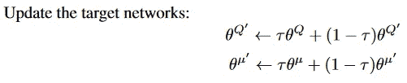
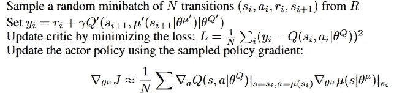
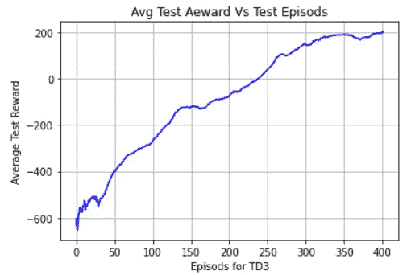
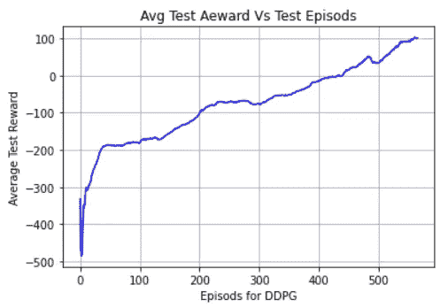

# 采用 TensorFlow 2.x 的深度确定性和双延迟深度确定性策略梯度

> 原文：<https://towardsdatascience.com/deep-deterministic-and-twin-delayed-deep-deterministic-policy-gradient-with-tensorflow-2-x-43517b0e0185?source=collection_archive---------23----------------------->

## DDPG 和 TD3 的 TensorFlow 2.x 实施

摄影爱好在 [Unsplash](https://unsplash.com/s/photos/robot?utm_source=unsplash&utm_medium=referral&utm_content=creditCopyText) 上

在本文中，我们将使用 TensorFlow 2.x 实现深度确定性策略梯度和双延迟深度确定性策略梯度方法。我们不会深入研究理论，只会涵盖基本内容。在你继续学习之前，建议你先熟悉一下 DQN 和双 DQN。对于这篇文章，我将菲尔博士的 Td3 PyTorch 代码转换为 TensorFlow，对于 DDPG，我采用了他的目标网络更新方法。请参考他的 youtube 频道[这里](https://www.youtube.com/channel/UC58v9cLitc8VaCjrcKyAbrw)(编码 RL 的最佳 youtube 频道)。

# DDPG:

DDPG 用于有连续活动空间的环境。DDPG 结合了 DQN 和演员评论家的方法。让我们试着用代码来理解。

## 网络:

1.  我们的批评家网络将状态和行为作为输入，这些输入被连接在一起。
2.  批评家网络输出特定状态下的行动值。
3.  我们正在使用一个连续的环境，这就是我们使用 tanh 激活(输出值 b/w -1 和 1)的原因，输出是动作的长度，即在“LunarLanderContinuous-v2”中，一个动作被表示为一个数组[-1 1]，所以这里的长度是 2。

## 代理类别和操作选择:

1.  在 DDPG，我们有演员和评论家的目标网络，就像在 DQN 我们有目标网络一样。
2.  请注意，我们已经编译了目标网络，因为我们不想在将权重从主网络复制到目标网络时出错。
3.  我们还使用了重放缓冲区来存储体验。
4.  对于动作选择，首先，我们将状态转换为张量，然后将其传递给 actor-network。
5.  为了训练，我们在动作中添加了噪音，为了测试，我们不会添加任何噪音。
6.  我们将剪切最大和最小动作值的动作 b/w 范围。

## 更新目标网络:

1.  更新 ddpg 和 td3 中的目标网络使用软更新，即我们每次都会稍微更新权重。
2.  网络可以按照研究报告中的解释进行更新。

图片经由[https://arxiv.org/pdf/1509.02971.pdf](https://arxiv.org/pdf/1509.02971.pdf)

## 训练功能:

图片来自[https://arxiv.org/pdf/1509.02971.pdf](https://arxiv.org/pdf/1509.02971.pdf)

1.  首先，我们从重放缓冲区中抽取经验样本，并将它们转换成张量。
2.  评论家损失的目标值是通过使用行动者的目标网络预测下一个状态的行动来计算的，然后使用这些行动，我们使用评论家的目标网络来获得下一个状态的值。
3.  然后，我们应用贝尔曼方程计算目标值(target _ values = rewards+selfγ* target _ next _ state _ values * done)。请注意，在训练时，此处的“完成”存储为(1-完成)。
4.  我们的预测值是从缓冲样本中提取状态和动作的主评价网络的输出。
5.  然后根据目标值和预测值的 MSE 计算临界损失。
6.  参与者损失被计算为批评家主要值的负值，输入作为主要参与者预测的行动。
7.  然后，我们用 0.005 的 tau 更新我们的目标网络。

## 训练循环:

1.  我们的训练循环很简单，即它在每个行动步骤中相互作用并储存经验和学习。

# TD3PG:

TD3 受到双 DQN 的启发，解决了评论家值被高估的问题，与 DDPG 相比有以下变化。

1.  除了他们的目标网络之外，使用两个主要的评论家网络。
2.  延迟演员网络的更新。
3.  动作噪音调节。

我们将只讨论 DDPG 代码的不同之处。

## 代理类别:

1.  在代理课程中，我们有两个主要的评论家网络和他们各自的目标网络。
2.  在动作选择中，我们在一些步骤之后停止向动作添加噪声。

## 训练功能:

1.  td3 列车功能与 DDPG 列车功能只有 3 处不同。
2.  首先，通过添加噪声，然后在最大和最小动作的范围内裁剪动作，来自演员的目标网络的动作被规则化。
3.  第二，下一状态值和当前状态值都是目标评论家和两个主要评论家网络。并且对于下一个状态值和当前状态值都考虑最少两个网络。
4.  第三，在每 2 步之后训练演员网络。

所以，这都是关于实现上的差异。现在让我们看看训练结果。

## DDPG vs TD3PG:

这两个图显示了在过去 100 集内，两种算法在“LunarLanderContinuous-v2”中达到平均分数 200 所拍摄的集。

由作者制作并通过 matplotlib 生成的图像

正如你所看到的，TD3 算法在 400 集的最后 100 集中得到了平均 200 英镑的奖励。而 DDPG 在 560 集之后只得了 100 分。

由作者制作并通过 matplotlib 生成的图像

# 实施时需要注意的事项:

在编写 RL 代码时，要记住以下几点。

1.  神经元的数量、隐藏层数、学习速率对学习有巨大的影响。
2.  张量和 NumPy 数组的形状应该是正确的。很多时候，实现是正确的，代码也是有效的，但是代理没有学到任何东西，只是因为张量的形状不正确，并且当对这些张量进行运算时，会给出错误的结果。

你可以在这里找到这篇文章的完整代码和[这里](https://github.com/abhisheksuran/Reinforcement_Learning/blob/master/td3withtau.ipynb)。敬请关注即将发布的文章，我们将在 TensorFlow 2 中实现更多 RL 算法和深度学习算法。

所以，本文到此结束。谢谢你的阅读，希望你喜欢并且能够理解我想要解释的内容。希望你阅读我即将发表的文章。哈里奥姆…🙏

# 参考资料:

 [## 具有深度强化学习的连续控制

### 我们将深度 Q 学习成功背后的思想应用于持续行动领域。我们提出一个…

arxiv.org](https://arxiv.org/abs/1509.02971)  [## TD3:学习用人工智能跑步

### 学习构建强化学习中最强大和最先进的算法之一，TD3

towardsdatascience.com](/td3-learning-to-run-with-ai-40dfc512f93)  [## 菲尔的机器学习

### 你好。在 Neuralnet.ai，我们涵盖了各种主题的人工智能教程，从强化…

www.youtube.com](https://www.youtube.com/channel/UC58v9cLitc8VaCjrcKyAbrw)