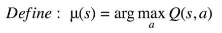
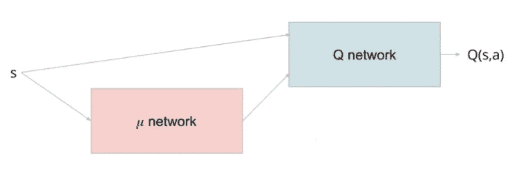
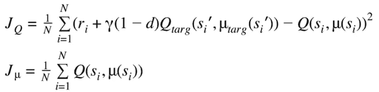
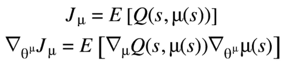
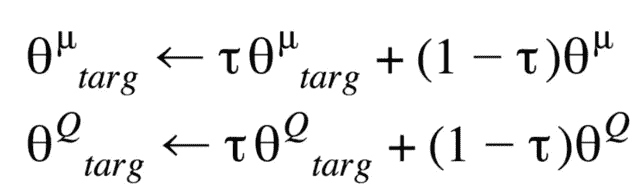
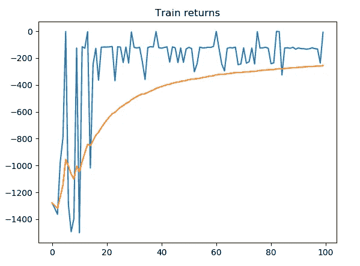

# 深度确定性政策梯度(DDPG):理论与实施

> 原文：<https://towardsdatascience.com/deep-deterministic-policy-gradient-ddpg-theory-and-implementation-747a3010e82f?source=collection_archive---------8----------------------->

深度确定性策略梯度(DDPG)是一种结合了 Q 学习和策略梯度的强化学习技术。DDPG 作为一个演员兼评论家的技术包括两种模式:演员和评论家。执行元是一个策略网络，它将状态作为输入，输出精确的动作(连续的)，而不是动作的概率分布。批评家是一个 Q 值网络，它将状态和行为作为输入，输出 Q 值。 **DDPG 是一个“关”——政策法**。DDPG 用于连续动作设置，而 DDPG 的“确定性”是指演员直接计算动作，而不是动作的概率分布。DDPG 被用在连续的动作场景中，是对普通演员兼评论家的改进。

有很多实现 DDPG 在线的库，但是它们有很大的开销，对于初学者来说不容易理解。我决定编写一个简单的 TF2 实现，涵盖 DDPG 方法的重要部分。

让我们深入研究这项技术的理论。

# 理论

在 DQN，通过对所有动作的 Q 值取 argmax 来采取最优动作。在 DDPG，演员是一个政策网络，正是这样做的。它直接输出动作(动作可以是连续的)，绕过 argmax。

政策网络

**车型**

该策略是确定性的，因为它直接输出动作。为了促进探索，一些高斯噪声被添加到由策略确定的动作中。为了计算一个状态的 Q 值，执行器输出被馈入 Q 网络以计算 Q 值。这仅在计算 TD 误差期间进行，我们将在后面描述。

演员和评论家被拴在一起

为了稳定学习，我们为评论家和演员创建了目标网络。这些目标网络将基于主网络进行“软”更新。我们稍后将讨论这些更新。

**损失函数**

现在我们已经描述了模型架构，我们继续展示如何训练模型，或者更确切地说，两个模型的损失函数是什么。评论家(Q)和演员(mu)的损失函数是，

演员和评论家的损失

我们先分析**行动者(政策网)损失**。损耗就是这些状态的 Q 值之和。为了计算 Q 值，我们使用评论家网络并传递由演员网络计算的动作。我们希望**最大化**这个结果，因为我们希望获得最大的收益/Q 值。

**临界损失**是一个简单的 TD 误差，我们使用**目标网络来计算下一个状态**的 Q 值。我们需要**最小化**这个损失。为了向后传播误差，我们需要 Q 函数的导数。对于临界损失，Q 值的导数是直接的，因为μ被视为常数，然而，对于因子损失，μ函数包含在 Q 值内。为此，我们将使用链式法则，

演员损失链规则

我们现在有所有的损失和衍生品。

**目标更新**

为了在训练期间增加稳定性，我们包括目标评论家和演员网络，以在 TD 误差计算中计算下一状态的 Q 值。与主/当前网络相比，目标网络是延迟网络。基于主网络定期更新目标的权重。在 DQN，目标定期复制主网络权重，这被称为“**硬更新”**。在 DDPG，我们执行**“软更新”**，其中只有一小部分主要权重以下列方式转移，

目标网络更新 rle

τ是通常被选择为接近 1(例如 0.999)的参数。

有了这个理论，我们现在可以看看它的实现。

# 履行

**型号**

现在我们到了模型创建阶段。在这个实现中，我们将使用一个简单的健身房环境( **Pendulum-v0** )。我们的演员和评论家网络将只由密集的层组成。我们提醒读者，行动者是以国家为输入的政策网络，其输出是行动。批评家将状态和动作作为输入，并输出状态-动作对的 Q 值。**在评论家网络的最初 DDPG 论文中，动作在中间层进入网络，而不是从开始进入网络**。这样做只是为了提高性能/稳定性，我们不会诉诸这种伎俩。对我们来说，行动和状态输入将从一开始就进入批评网络。我们编写一个函数来生成演员和评论家，

模型生成器功能

函数 ANN2 使用 input_shape 和 layer_size 参数生成评论家和演员网络。两个网络的隐藏层都有**【relu】**激活。演员的输出层将是一个**【tanh】**，(映射连续动作-1 到 1)，评论家的输出层将是“无”作为其 Q 值。演员网络的输出可以通过一个因子来缩放，以使动作对应于环境动作范围。

**模型初始化**

我们初始化 4 个网络:主要演员和评论家以及目标演员和评论家，

模型初始化

**重放缓冲器**

与其他深度强化学习技术一样，DDPG 依赖于使用重放缓冲区来实现稳定性。重放缓冲区需要保持新旧体验的平衡。

简单的重放缓冲实现

**训练**

现在我们直接使用上面定义的损失函数来训练我们的网络。为了在 TF2 计算损耗和梯度，需要在 TF 中进行计算。GradientTape()块。TF2 建议对不同的网络使用不同的梯度带。我们训练的实施看起来像这样，

训练循环

让我们快速浏览一下这段代码。我们首先从重放缓冲区中取样。对于参与者，我们首先计算状态(X)上的动作，然后使用 critic 使用计算的动作和状态(X)来计算 Q 值。在反向传播过程中，critic 保持不变，因为我们只区分 wrt 因素变量。损失中的负号是存在的，因为在优化中我们希望最大化这个损失。
对于临界误差，我们使用目标网络来计算用于 TD 误差计算的 Q 目标。使用主评价网络计算当前状态(X) Q 值。在这个过程中，行动者保持不变。

**车型更新**

目标模型需要基于主模型进行更新。我们使用前面描述的等式更新它们，

这就完成了我们对 DDPG 方法的实施。

**结果**

我们在钟摆 v0 环境下运行 DDPG 100 集，得到如下回报。

培训回报

完整的代码实现可以在[这里](https://github.com/sol0invictus/RL_Codes/tree/master/DDPG/v1)找到。

**参考文献**

1.  [深度强化学习的连续控制。](https://arxiv.org/abs/1509.02971)
2.  DDPG 实现: [Github](https://github.com/sol0invictus/RL_Codes/tree/master/DDPG/v1)
3.  [打开艾 DDPG](https://spinningup.openai.com/en/latest/algorithms/ddpg.html)