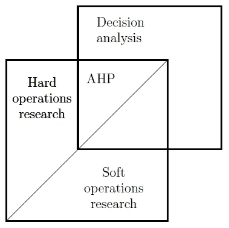
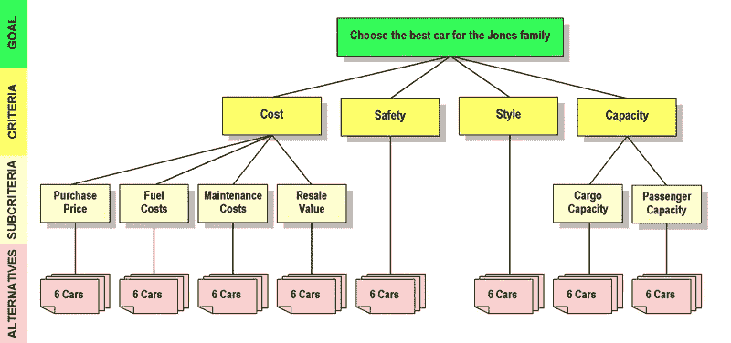
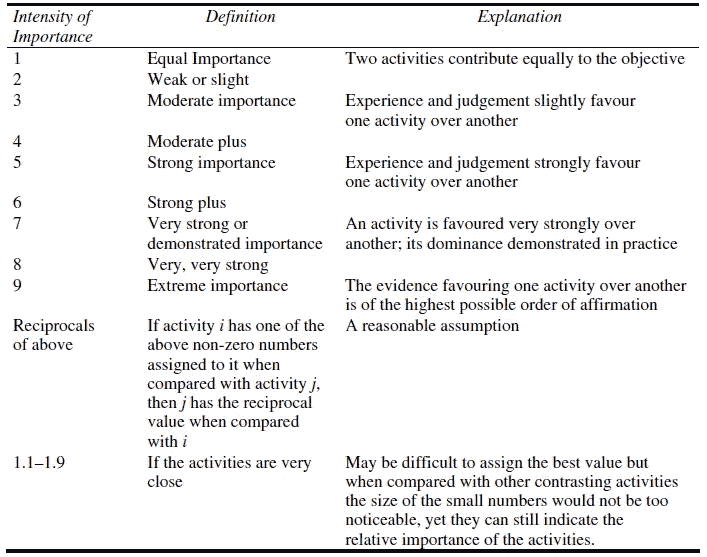
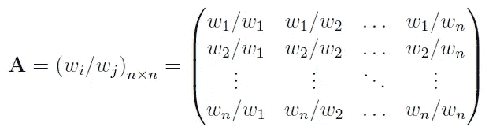
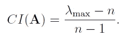
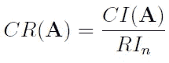
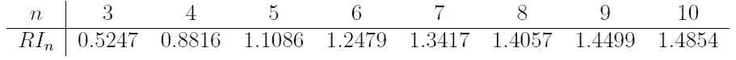
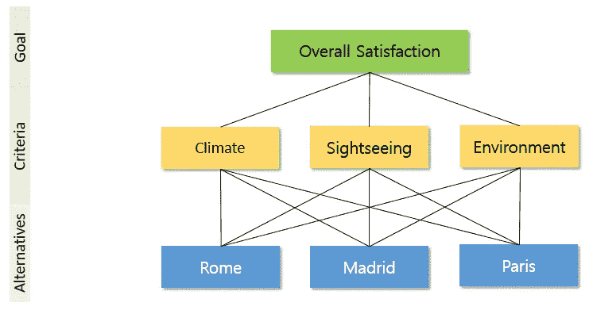
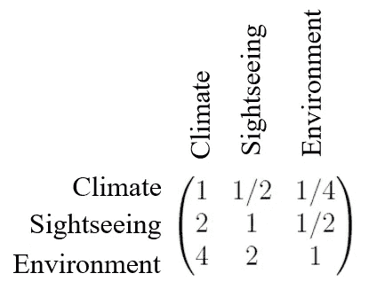
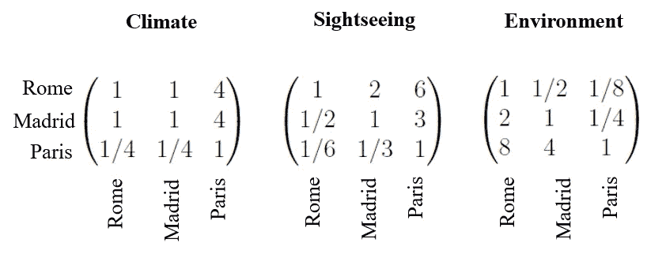

# 使用 Python 深入研究层次分析法

> 原文：<https://towardsdatascience.com/deep-dive-into-analytical-hierarchy-process-using-python-140385fabaa1?source=collection_archive---------6----------------------->


Clem Onojeghuo 在 [Unsplash](https://unsplash.com?utm_source=medium&utm_medium=referral) 拍摄的照片

## 对这种多标准决策方法的高度概述，以及一个使用案例。

# 前言

在一生中，一个人会做出许多决定，从几乎没有影响的最微不足道的决定，到会改变一生的决定。几乎总是，这些情况涉及 X 个选项和 Y 个判断标准。


[来源](https://commons.wikimedia.org/wiki/File:Career_Change_Cartoon_With_Four_Icon_Options.svg)

## 示例 A

想象你在超市，你想买早餐麦片。你站在一排排的麦片前，不确定该买哪一种。你在找什么？

1.  ***价格*** *:麦片不能太贵*
2.  ***口味*** *:可能是里面有巧克力的东西？*
3.  ***营养*** *:混合水果或燕麦的东西。*

这些是您浏览产品时想到的一些标准。比方说，你拿起水果圈，磨砂片和幸运符。你在脑海中运行每一个标准，并将它们相互比较。然后你做了一个决定，把磨砂薄片放进你的购物车。

## 示例 B

你正在加纳一个小村庄的市政厅主持一个会议。作为水利项目代表团的负责人，您被分配到在村子里安装一系列水泵的任务。在你面前的是各种各样的利益相关者——村里的长者、地质学家和工程师。

在这次会议中，你将选择安装水泵的地点，并列出一系列标准—

1.  ***地下水位:*** *该地点必须有相当高的地下水位；*
2.  ***人口*** *:附近必须有最小数量的人居住才能使装置有用；*
3.  ***费用*** *:运行材料和物资的费用必须在项目资金之内。*

你与村里的长者、地质学家和工程师交谈，拟定了 15 个可能修建水泵的地点。经过多次讨论和权衡意见后，你将范围缩小到 5 个在选择标准列表中排名靠前的地方。

尽管这两个例子在影响范围和应用领域上有很大的不同，但问题是非常相似的——在面对多种、通常是相互冲突的标准时做出决定。

在这篇文章中，我将对**层次分析法**提供一个高层次的解释，这是解决这种**多准则决策**问题的一种可能的技术。在这个过程中，我还将向您展示如何用 Python 从头开始实现这项技术。

# 介绍

层次分析法是托马斯·萨蒂教授在 20 世纪 70 年代提出的一种多准则决策方法。

> 这是一种通过在数学框架内量化主观信念来帮助决策者做出明智决策的方法。

AHP 是关于不同数量的相对测量，是决策分析和运筹学领域的交叉点。



图 1—布鲁内利 2015 年[1]

AHP 在许多领域都很流行，从供应链到可持续系统、环境管理、投资组合选择等等。它之所以受欢迎，是因为它非常直观，允许决策者以透明的方式整理他们的主观信念。

# 该过程

层次分析法，本质上就是给不同的选项分配不同的权重，并对其进行汇总的过程。然而，美妙之处在于得出这些权重的方式，以及主观信念的量化。

让我向你们简单介绍一下 AHP 的高度直观的过程—

*   **第一步:**定义流程的最终目标。在上面分享的例子中，目标分别是购买早餐麦片和选择合适的安装点；
*   第二步:列出你手头上实现目标的各种选择。这些选项被称为*‘备选方案’*。
*   **第三步**:列出你评估上述选择的不同标准。这些可能涉及标准的子级别，并且完全取决于您想要的详细程度，尤其是当选项彼此非常相似时。
*   **第 4 步**:从第 1 步到第 3 步建立层次结构。如果你熟悉图论，那么你可以想象这是一个有向无环图。每个节点之间的连接暗示了它们在评估中的考虑。



图 2——评估层级的示例[2]

*   **步骤 5** :每一个标准和子标准的成对比较，以确定它们的权重。
*   **步骤 6** :将每个备选方案与每个子标准进行成对比较，以确定其权重。
*   **步骤 7** :对每个备选方案的所有这些权重(加权算术和)进行总体求和，并根据这个加权和对它们进行排序。
*   **第八步**:计算一致性比率。这是与临界值表相比，主观评估一致性的度量。如果发现不一致，请返回步骤 5。

所以从这些步骤中，你可以看到这个过程是如何得到它的名字的，以及为什么它在应用方面如此受欢迎。现在，让我们来看看这个过程的核心——主观信念的量化。

# 评估

AHP 的关键词是**成对** **比较**。我们都知道一次比较三个以上的选项有多难。为了消除这一困难，Saaty 教授建议对备选方案/标准进行成对比较。这种比较/评估是通过指定代表不同重要程度的强度来完成的，这是他用语言学定义的[3]。



对于每个标准/子标准/目标[1]，被评估/评定的备选方案被编译成一个 **n** x **n** 成对比较矩阵 **A** 。



这里， **wi** 和 **wj** 是上表中重要的权重或强度。您可以立即看到评估矩阵是对称的，这使得计算更加容易。

一旦创建了评估矩阵，下一步就是将其转换成向量。该向量对矩阵中存在的信息进行编码，并被称为**优先级向量**。

有几种方法可以计算这个优先级向量。一种方法是获得 Perron-Frobenius 特征向量[4]，或者简单地获得矩阵的**归一化特征向量**。另一种方法是计算相应行上的元素的几何平均值**除以归一化项，使得优先级向量的分量最终加起来为 1 [1]。这种方法是归一化特征向量方法的一种近似。**

评估的最后一步是为每个子标准生成的优先级向量的加权算术和，并对它们进行排序以对备选方案进行排序。

## 一致性比率

层次分析法的基本假设是决策者是理性的。这基本上意味着决策者被假定为每次对相同的问题都应用相同的主观信念。然而，在现实中，情况可能并非如此。Saaty 教授通过提出一致性指数 CI 来解决这种不确定性



其中**λ_ max**是成对比较矩阵的最大特征值，并且 **n** 是备选方案的数量。

为了缩放不同大小的矩阵，开发了一致性比率 CR



其中， **RI_n** 是从足够大的一组大小为 n 的随机生成矩阵中获得的 CI 的平均估计值。Saaty 教授给出了 **RI_n** 的查找表，



**如何使用 CR？** —根据 Saaty 教授的说法，在实践中，应该接受 CR ≤ 0.1 的矩阵，拒绝大于 0.1 的值。CR = 0.1 的值基本上意味着这些判断有 **10%的不一致性，就好像它们是随机给出的一样**。通过选择较低的 CR，可以尝试减少这种不一致性，唯一的方法是返回并重新评估主观权重。

*唷，这有很多理论，所以让我们继续用 Python 实现一个简单的用例*

# 用 Python 实现层次分析法

据我所知，目前只有一个开发良好的 python 库用于 AHP — [pyAHP，](https://github.com/pyAHP/pyAHP)但是让我们使用前面描述的过程从头开始编写代码。这里，我将使用[1]中的一个典型用例来说明这个过程。*(说实话，在 Excel 中实现相当容易！)*

> 代码可以在我的 [GitHub](https://github.com/ani-rudra-chan/AHP-Python-Project.git) 仓库中找到

## **问题定义**

假设你想去欧洲度假，你计划去几个有趣的城市。你心中有几个城市——马德里、汉堡和巴黎，但你的预算只允许你去其中的一个。为了帮助您获得最大的回报，您决定使用 AHP 来帮助您缩小合适城市的范围。

## 目标、标准和备选方案

总体目标显然是你个人的满意度。备选方案是{罗马、马德里、巴黎}，让我们想象您选择以下标准来评估每个城市—{气候、观光、环境}。让我们建立等级制度-



图 3——用例的层次结构(图片由作者提供)

## 导入库

好了，让我们从导入两个库开始评估过程

```
import numpy as np
import pandas as pd
```

## 创建成对比较矩阵

我们利用了比较矩阵的对称性质，只接受上三角矩阵的输入。

```
# Number of options
n = 3# Creating default matrix of ones
A = np.ones([n,n])# Running a for loop to take input from user and populate the upper triangular elements
for i in range(0,n):
    for j in range(0,n):
         if i<j:
             aij = input('How important is option{} over option{} ?: '.format(i,j))
             A[i,j] = float(aij) #Upper triangular elements
             A[j,i] = 1/float(aij) #Lower triangular elements
```

请记住，我们的标准集是{气候、观光、环境}，因此选项 0 是气候，选项 1 是观光，选项 2 是环境。我们运行这段代码来为标准权重生成成对比较矩阵。

```
How important is option0 over option1 ?: 0.5
How important is option0 over option2 ?: 0.25
How important is option1 over option2 ?: 0.5
```

这可以解释为—

气候比观光机会重要两倍，比城市环境重要四倍。观光机会的重要性是城市环境的两倍



一旦生成矩阵，我们通过归一化最大特征值的特征向量来计算优先级向量。该特征向量中的元素是标准的权重。

```
e = np.linalg.eig(A)[1][:,0]
p = e/e.sum()>>> array([0.14285714, 0.28571429, 0.57142857])
```

这两段代码被组合成一个函数

```
def pairwise_matrix(n):A = np.ones([n,n])
    for i in range(0,n):
        for j in range(0,n):
            if i<j:
                aij = input('How important is option{} over option{} ?: '.format(i,j))
                A[i,j] = float(aij)
                A[j,i] = 1/float(aij)#Computing the priority vector 
    eig_val = np.linalg.eig(A)[0].max()
    eig_vec = np.linalg.eig(A)[1][:,0]
    p = eig_vec/eig_vec.sum()
    return p, eig_val
```

我们称这个函数为生成成对比较矩阵和优先级向量，用于根据每个标准评估每个备选方案。记得我们的备选方案集是—{罗马、马德里、巴黎}。



每个矩阵的优先级向量是—

```
pr_c = pairwise_matrix(3)[0]  #All Criteria
pr_c0 = pairwise_matrix(3)[0] #Criteria 0: Climate
pr_c1 = pairwise_matrix(3)[0] #Criteria 1: Sightseeing
pr_c2 = pairwise_matrix(3)[0] #Criteria 2: Environment#Priority Vector for Criteria 0 pr_c0
>>> array([0.44444444, 0.44444444, 0.11111111])#Priority Vector for Criteria 1 pr_c1
>>> array([0.6, 0.3, 0.1])#Priority Vector for Criteria 2pr_c2
>>> array([0.09090909, 0.18181818, 0.72727273])
```

我们还计算了每个比较矩阵的一致性比率。对于 n= 3，RI_n 应为 0.5247。所有矩阵的最大特征值是 3。因此，根据之前的公式，每个矩阵的 CR 将为 0，即< 0.1 and hence acceptable.

The final step is to get their weighted arithmetic sum to yield the rank vector

```
r = pr_c0*pr_c[0] + pr_c1*pr_c[1] + pr_c2*pr_c[2]
print(r)>>> [0.28686869 0.25310245 0.46002886]
```

The weighted arithmetic sum for **巴黎**比罗马或马德里高得多，因此它被指定为 rank1，其次是罗马和马德里。

*这就对了！在 AHP 的帮助下，你成功地将自己的主观分析量化，决定飞往* ***巴黎*** *！*

# 结论

AHP 的主要缺陷是当由不同的一组人评估时，备选方案的排序颠倒了。另一个问题是将其纳入运筹学的哲学基础。

话虽如此，层次分析法仍然是一种流行的 MCDM 方法，并且相对容易实现和解释。除了 python 之外，还有一些商业软件，比如 SuperDecisions，可以帮助您创建层次结构并执行成对评估。

有更多的 MCDM 方法来弥补层次分析法的不足，并且在数学基础方面更先进。一些想到的是 PROMETHEE，托普西斯等。

# 参考

[1]布鲁内利，马特奥。2015.层次分析法简介。斯普林格在运筹学中的作用。第 83 页。978–3–319–12502–2(电子版)。

[2][https://en . Wikipedia . org/wiki/Analytic _ hierarchy _ process _ % E2 % 80% 93 _ car _ example](https://en.wikipedia.org/wiki/Analytic_hierarchy_process_%E2%80%93_car_example)

[3] T.L .萨蒂，用层次分析法进行决策。里面的《服务科学》2008 年第 1 卷第 1 期

[4][https://en . Wikipedia . org/wiki/Perron % E2 % 80% 93 Frobenius _ theorem](https://en.wikipedia.org/wiki/Perron%E2%80%93Frobenius_theorem)

*我希望这篇文章对你有所帮助，并感谢你的反馈！*

再见！