# 深入探究自组织地图的竞争学习

> 原文：<https://towardsdatascience.com/deep-dive-into-competitive-learning-of-self-organizing-maps-b9728c57e862?source=collection_archive---------44----------------------->

## 互联网上无监督人工神经网络中自组织映射(SOMs)竞争学习背后的最佳解释！

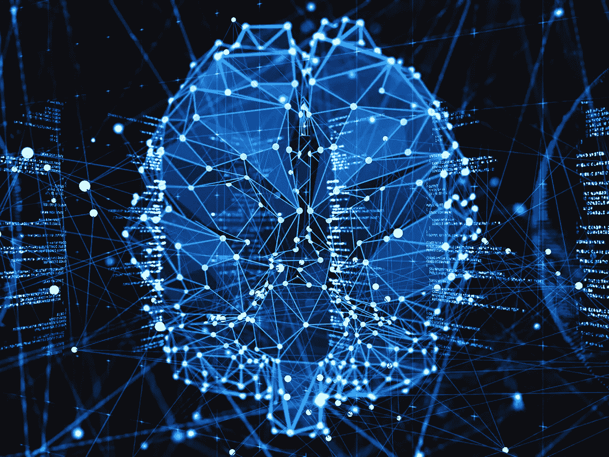

[无监督人工神经网络](https://spectrum.ieee.org/image/MzI2Nzk1NA.jpeg)

自组织映射是最流行的无监督学习人工神经网络之一，其中系统没有关于输入数据的特征或特性以及输出数据的类别标签的先验知识。网络根据样本输入模式之间的相似性来学习形成样本输入模式的类别/聚类。集群中的模式具有相似的特征。关于什么特征对于分类是重要的，以及有多少类，没有先验知识。网络本身会针对不同类别的输入进行调整，正如其名称所示，它们会自我组织。加权层中的节点数量对应于不同类别的数量。它基于竞争学习。

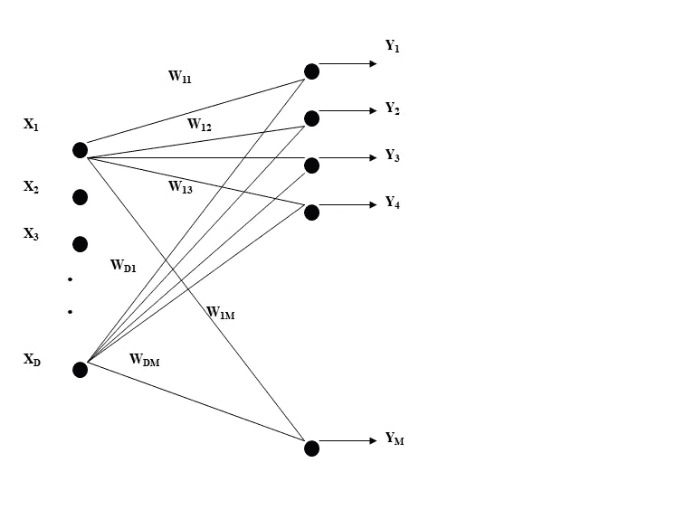

自组织地图网络结构

# 什么是竞争学习？

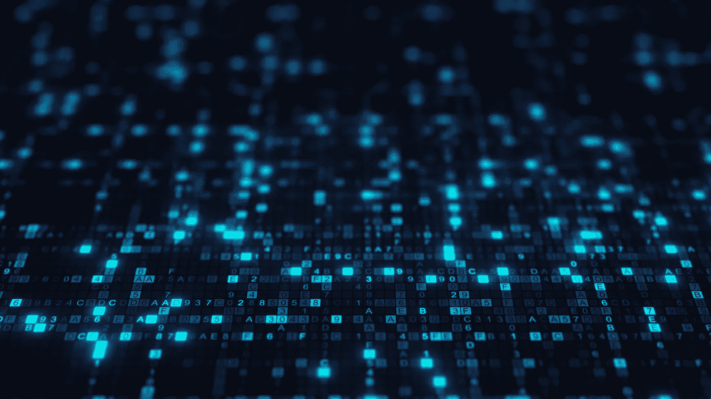

[竞技学习](https://miro.medium.com/max/3200/1*XHC14aQJPMYn0YPkV3-9MQ.jpeg)

在竞争学习中，与权重相关联的节点相互竞争以赢得输入模式(向量)。对于每个不同的输入模式，具有最高响应的节点被确定并被宣布为获胜者。仅训练与获胜节点相关联的权重，以使它们更类似于输入模式(向量)。所有其他节点的权重不变。赢家通吃，输家一无所有。所以它叫做赢家通吃算法(输家什么也得不到)。

> 节点的强度=加权和

**为输出节点 1**

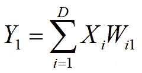

**Y1 = X1W11+ X2W21 + X3W31 +..……+ XDWD1**

每个节点与具有 D 个元素的权重向量相关联

输入向量*X*—【X1，X2，X3……】。，XD]
Y1 的权重向量——【W11，W21，W31，…。，WD1]

# 训练算法

*   估计类别数(输出节点数)
*   随机设置权重并归一化
*   应用标准化的输入向量 X
*   计算每个节点的强度(即加权和)
*   确定具有最高响应的节点 ***i***
*   宣布节点 ***i*** 为‘获胜者’(***I***具有与 X 最相似的权重)
*   训练节点 ***i*** 的权重，使它们更加类似于 X

# 培训过程

[训练人工神经网络](https://www.wisecp.com/images/wisecphomeslidebg.jpg)

## 培训期间:

*   获胜者的权重向量变得更加等于当前输入向量
*   换句话说，当前的输入向量被传递给胜利者

## 培训后:

*   获胜者携带它赢得的输入(获胜节点的权重向量现在保留它已被训练的输入模式)
*   任何类似于先前的连续输入选择该节点作为获胜者

大多数神经网络专家不知道训练过程背后的理论。据说在训练期间，获胜者的权重向量变得更等于当前输入向量。但是大多数人缺乏关于使权重向量等于输入向量的理论的知识。所以在这里我想用神经竞争的基础数学来解释这个理论。

# 标量和向量

## 数量

*   标量只有大小，如长度、面积、体积、速度、质量、密度、压力、温度

## 矢量

*   向量既有大小又有方向，例如位移、方向、速度、加速度、动量、力、重量

# 输入向量和权重向量的归一化

*   为了便于训练，输入向量和权重向量都被归一化为一个单位长度
*   标准化过程解释如下

考虑矢量

x =[X1 X2 X3……XD]

**X 的范数=**

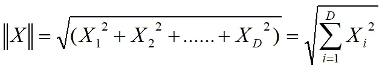

**正常化**

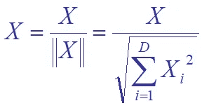

*   矢量的范数被称为矢量的“强度”,即它的大小
*   归一化向量的范数是 1(单位向量)
*   即如果 *X* 是矢量

例如 X = [0.2，0.1，1.4，0.2]；

标准化的

X = [0.1397 0.0698 0.9778 0.1397]

归一化的范数

x = 0((0.1397)2+(0.0698)2+0.9778)2+0.1397)2)= 1

# 正常化

标准化向量的元素介于 0 和 1 之间。当输入特征来自不同的尺度时，例如[1.2 0.001 10.6]，归一化使它们达到统一的标准。当权重向量也被归一化时，训练过程变得简单。当所有输入模式被归一化为单位长度时，它们可以被表示为单位球体中的不同半径(不同方向)。

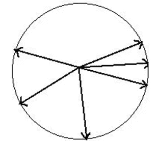

标准化为单位长度的输入模式，单位长度由单位球体中的半径表示

下图显示了单位球体中的归一化权重向量和该现有球体中表示的输入向量。

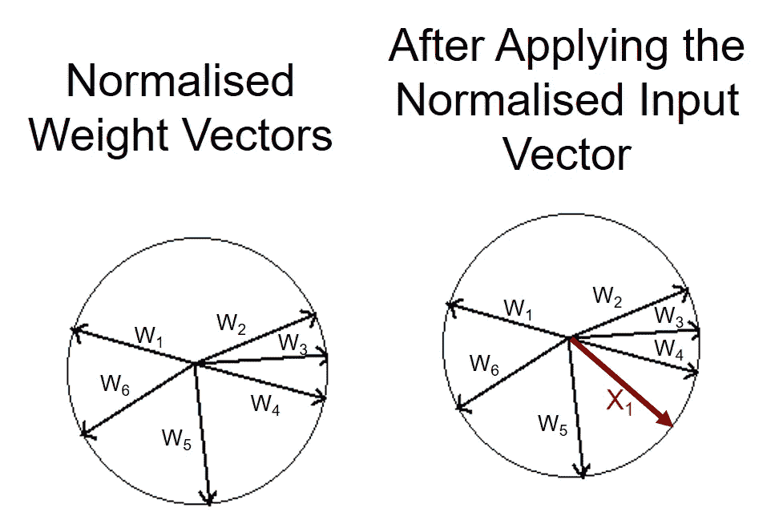

单位球中表示输入向量和权重向量

这里每个向量的长度= 1。

# 正常化前后

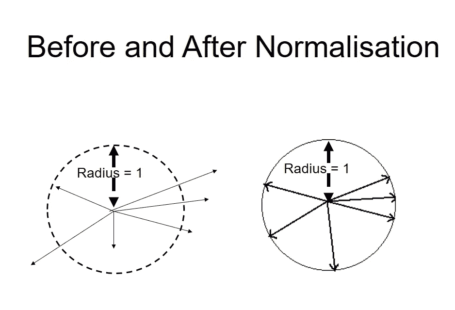

正常化前后

网络对训练集进行编码所需的是权重向量与该集中存在的任何聚类对齐。每个集群至少由一个节点表示。那么当一个向量被呈现给网络时，就会有一个节点，或者一组节点，对输入做出最大的响应。

# 两个向量的相似性

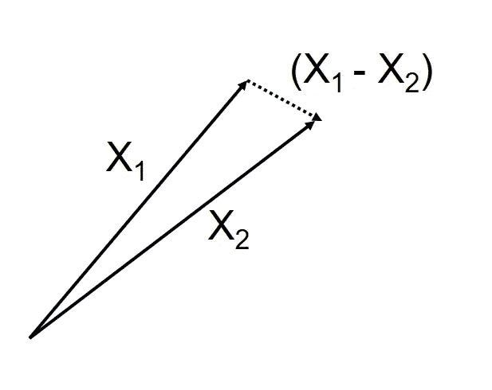

两个向量的相似性

*   如果 X1 = [x1，x2，x3，x4]且 Y1 = [y1，y2，y3，y4]，则 X1 = Y1

惟一可能是

x1 = y1

x2 = y2

x3 = y3

x4 = y4

X1 和 Y1 被称为是“相同的”。

*   考虑向量 X 和 Y

点积 X.Y = |X||Y|。Cos q

|X|-向量长度

q——两个向量之间的夹角

如果|X| = 1 且|Y| = 1

X.Y = Cos q 和 0 <= Cos q <= 1

If q -> 0(那么 Cosq -> 1)

两个单位矢量**重合**

也就是说，两个向量(X 和 Y)的**等于**

**即 X 与 Y 重合**

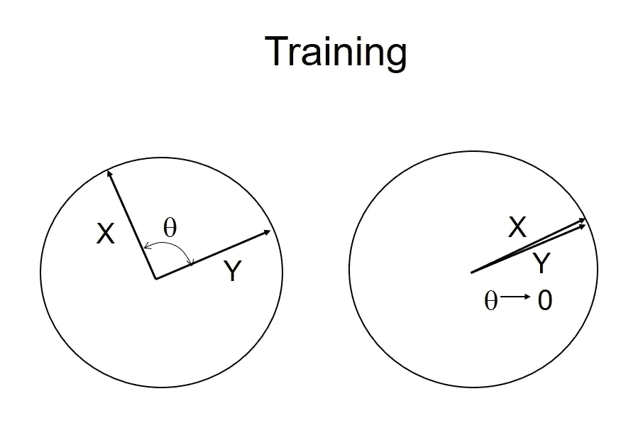

训练两个向量使其相等的过程

X.Y = |X|。| Y | Cos*q*= 1.1 . Cos*q
当* q - > 0 矢量 X =矢量 Y

所以我们改变两个向量之间的角度 q，以使两个归一化向量相等。

# som 的培训

因此，在训练过程中，我们为给定的输入模式找到一个具有最高响应值的获胜节点。然后，使获胜者的权重向量更等于当前输入向量。根据上面的数学解释，我们在训练期间所做的是调整归一化输入向量和获胜节点的归一化权重向量之间的角度，直到这两个向量彼此一致。换句话说，直到两个矢量相等。

训练使得特定节点的权重类似于所施加的输入。换句话说，输入向量以其权重的形式被“转移”到获胜节点。当应用相似的输入向量时，相同获胜者的加权和将是最高的。

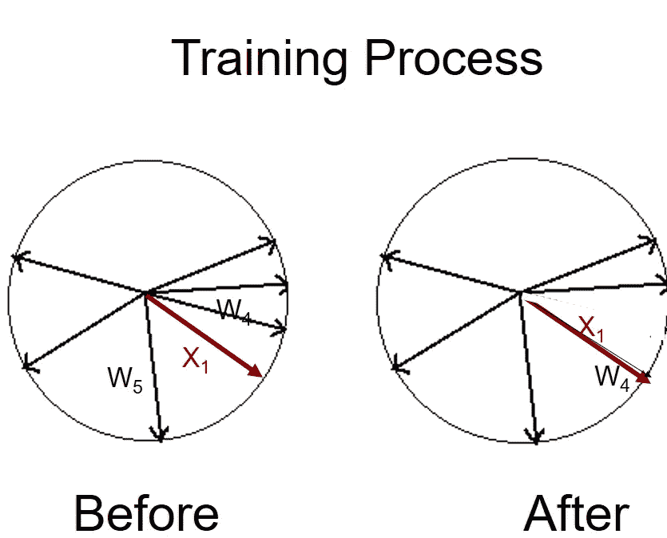

培训过程

类似地，对所有输入模式继续这一过程，直到输入向量与每个输入模式的获胜节点的权重向量一致。

# 训练方程——koho nen 学习规则

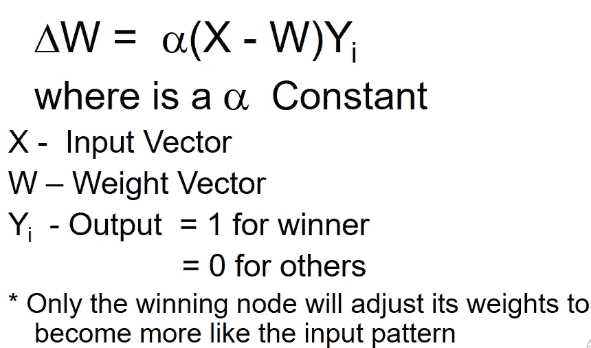

Kohonen 学习规则

我们可以使用 Kohonen 学习规则来验证这一数学解释，在 koho nen 学习规则中，仅对输出为 1 的获胜输出节点调整网络权重。否则，权重调整为零，因为输出为零。当输出为 1 时，通过使获胜节点的输入向量 X 和权重向量 W 彼此相等来调整权重。这是通过调整这两个向量之间的角度来实现的。当两个向量彼此一致时，网络被训练，并且不需要进一步的权重调整。对所有的输入模式继续这个过程，直到人工神经网络被完全训练。

# 最终想法

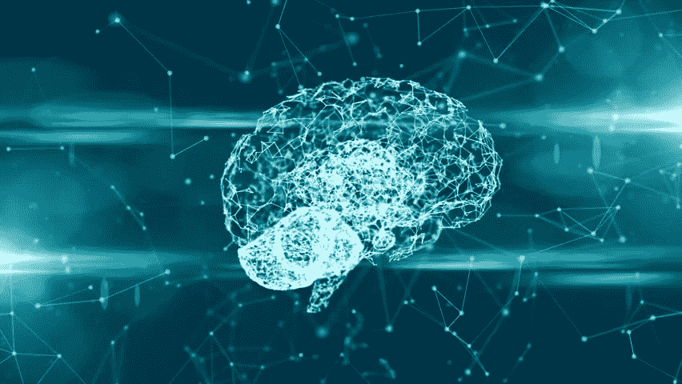

[最终想法](https://pbs.twimg.com/ext_tw_video_thumb/1106222620138180609/pu/img/H4rE8Jamf92b0OUj.jpg)

我希望这篇文章能帮助你理解无监督人工神经网络中自组织映射(SOMs)竞争学习背后的实际理论。写这篇文章的目的是与世界其他地方分享我的经验丰富的讲师的重要知识。这一切都要归功于我的大学高级讲师 H.L. Premaratne 博士，

*   神经网络和模式识别
*   图像处理和计算机视觉

这是根据他的要求写的，因为互联网上缺乏解释这一理论的文章。我希望你们都能从这方面的专家那里获得宝贵的知识。

谢谢大家！！！…