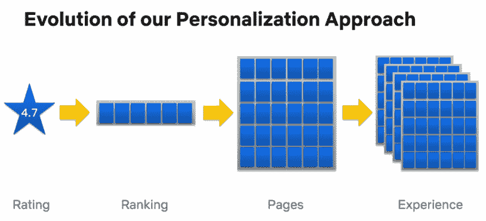
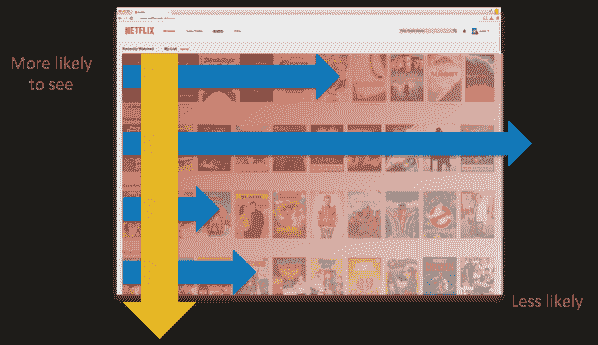
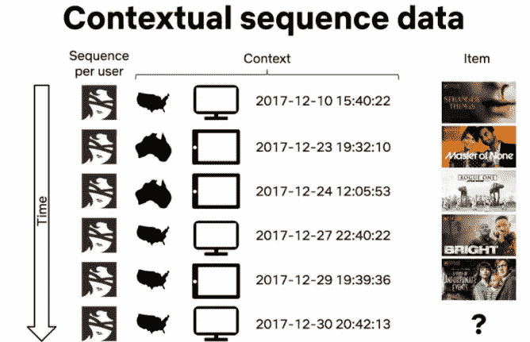
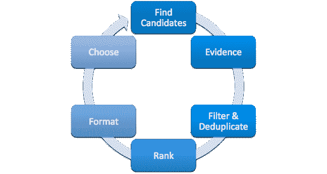
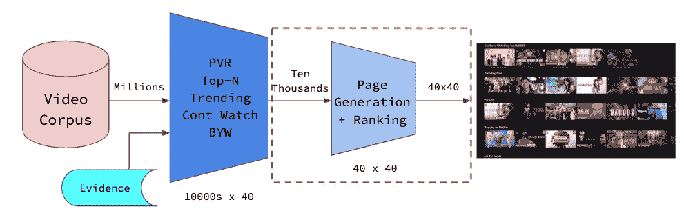
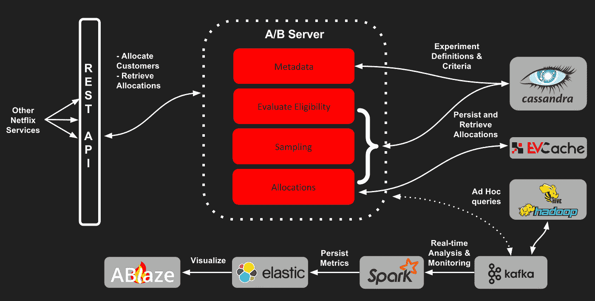

# 深入探究网飞的推荐系统

> 原文：<https://towardsdatascience.com/deep-dive-into-netflixs-recommender-system-341806ae3b48?source=collection_archive---------1----------------------->

## 网飞如何通过个性化实现 80%的流时间

在 [Unsplash](https://unsplash.com?utm_source=medium&utm_medium=referral) 上由 [Thibault Penin](https://unsplash.com/@thibaultpenin?utm_source=medium&utm_medium=referral) 拍摄的照片

在这个时代，网飞是大多数人的同义词，是电影和电视节目的首选流媒体服务。然而，大多数人不知道的是，网飞在 20 世纪 90 年代末开始采用订阅模式，将 DVD 邮寄到美国的家庭。

## Netflix 奖

2000 年，网飞推出了个性化电影推荐，2006 年，推出了 **Netflix 奖、**机器学习和数据挖掘竞赛，奖金为 100 万美元。当时，网飞使用了其专有的推荐系统*cinema tech*，该系统的均方根误差*(RMSE)为 0.9525，并要求人们将这一基准提高 10%。一年后能够实现目标或接近目标的团队将获得奖金。*

一年后，2007 年进步奖的获得者使用了矩阵分解(T10)和受限玻尔兹曼机器(T12)的线性组合，实现了 0.88 的 RMSE。在对源代码做了一些修改后，网飞将这些算法投入生产。值得注意的是，尽管一些团队在 2009 年实现了 0.8567 的 RMSE，但该公司并没有将这些算法投入生产，因为需要工程努力来获得边际精度增加。这为现实生活中的推荐系统提供了重要的一点——模型改进和工程努力之间总是存在积极的关系。

## 流媒体——新的消费方式

网飞没有采纳 Netflix 奖项的改进模式的一个更重要的原因是，它在 2007 年引入了流媒体。随着流媒体的出现，数据量急剧增加。它必须改变其推荐系统生成推荐和接收数据的方式。

来源:[个性化的最新趋势——网飞的观点](https://slideslive.com/38917692/recent-trends-in-personalization-a-netflix-perspective)

快进到 2020 年，网飞已经从美国邮寄 DVD 的邮件服务转变为拥有 1.828 亿用户的全球流媒体服务。因此，它的推荐系统从预测收视率的回归问题转变为排名问题、页面生成问题、用户体验最大化问题(定义为最大化流媒体播放的小时数，即个性化所有可以个性化的内容)。本文旨在解决的主要问题是:

> 网飞用什么作为它的推荐系统？

## 网飞作为一个企业

网飞有一个基于订阅的模式。简单来说，网飞的会员越多，收入就越高。收入可以被视为三个因素的函数:

1.  新用户获取率
2.  取消率
3.  前成员重新加入的比率

## 网飞的推荐系统有多重要？

80%的流时间是通过网飞的推荐系统实现的，这是一个非常令人印象深刻的数字。此外，网飞相信，创造一个用户体验，将寻求提高保留率，这反过来又转化为客户获取的节省(估计截至 2016 年每年 1B 美元)。

# 网飞推荐系统

## 网飞如何对头衔进行排名？

很明显，网飞利用了基于行的两级排名系统，排名发生在:

1.  每行内(最强的建议在左边)
2.  跨行(最强烈的建议在顶部)

来源:[网飞科技博客](https://netflixtechblog.com/learning-a-personalized-homepage-aa8ec670359a)

每行突出显示一个特定的主题(例如，前 10 名、趋势、恐怖等)，并且通常使用一种算法来生成。每个成员的主页由大约 40 行多达 75 个项目组成，这取决于成员使用的设备。

## 为什么是行？

优势可以从两个角度来看——1)作为用户，当呈现一排相似的项目时，它更连贯，然后决定他或她是否有兴趣观看该类别中的某些内容；2)作为一家公司，收集反馈更容易，因为向右滚动一行表示感兴趣，而向下滚动(忽略该行)表示不感兴趣(不一定不相关)。

> **有趣的事实:**你知道吗，艺术品也会根据你的个人资料和喜好而个性化？点击了解更多[！](https://netflixtechblog.com/selecting-the-best-artwork-for-videos-through-a-b-testing-f6155c4595f6)

## 用的是什么算法？

网飞使用了其论文中提到的各种排名器，尽管每个模型的架构细节并没有具体说明。以下是它们的概要:

**个性化视频排名(PVR)** —这是一种通用算法，通常根据某种标准(例如暴力电视节目、美剧、爱情片等)并结合用户特征和受欢迎程度等次要特征来过滤目录。

PVR 生成项目的示例

**Top-N Video Ranker**——类似于 PVR，除了它只看排名的头部，看整个目录。这是优化使用的指标，看看目录排名的头部(如地图@K，NDCG)。

前 N 名排名生成标题的示例

**趋势现在排名更靠前**——这种算法捕捉了网飞推断为强预测因素的时间趋势。这些短期趋势可能从几分钟到几天不等。这些事件/趋势通常是:

1.  具有季节性趋势并会重复发生的事件(如情人节导致浪漫视频消费上升)
2.  一次性的短期事件(如冠状病毒或其他灾难，导致对相关纪录片的短期兴趣)

趋势 Now ranker 生成标题的示例

**继续查看排名者** —该算法查看成员已经消费但尚未完成的项目，通常为:

1.  情节性内容(如戏剧系列)
2.  非情节性的内容，可以一点一点地消费(例如，完成一半的电影，独立于情节的连续剧，如《黑镜》)

该算法计算成员继续观看的概率，并包括其他上下文感知信号(例如，自观看以来经过的时间、放弃点、观看的设备等)。

继续观看排名器生成标题的示例

在 Justin Basilico [2]的演讲中，他介绍了 RNNs 在时间敏感序列预测中的应用，我认为这种算法中使用了 RNNs。他设计出，网飞可以利用特定成员过去的游戏以及上下文信息，并以此预测该成员的下一个游戏可能是什么。特别地，使用连续时间和离散时间上下文作为输入执行得最好。

来源:来自[2]的剪辑幻灯片

视频-视频相似性排名—也就是因为你看了(BYW)

该算法基本上类似于基于内容的过滤算法。根据成员消费的项目，该算法计算其他类似的项目(使用项目-项目相似性矩阵)并返回最相似的项目。在其他算法中，这一个是非个人化的，因为没有利用其他的边特征。然而，它是个性化的，在某种意义上说，它是一个有意识的选择，显示一个特定项目的类似项目，一个成员的主页(更多细节在下面的页面生成)。

BYW 生成标题的示例

**行生成过程**

上述每个算法都经历了下图所示的行生成过程。例如，如果 PVR 正在查看*言情*标题，它将找到符合该类型的候选，同时拿出*证据*来支持一行的呈现(例如，该成员先前观看过的*言情*电影)。根据我的理解，这种*证据选择*算法被合并(或一起使用)到上面列出的所有其他排序算法中，以创建一个更精确的项目列表排序(见下面网飞的模型工作流程图)。

> *这个*证据选择*算法* *使用*“所有【网飞】显示的信息都在页面的左上方，包括网飞奖上被重点关注的预测星级；大纲；显示的关于视频的其他事实，例如任何奖项、演员阵容或其他元数据；以及[网飞]用来在用户界面的行和其他地方支持[他们的]建议的图像。*【1】*”

五种算法中的每一种都经历了相同的行生成过程，如下图所示。

来源:网飞科技博客[3]

## 页面生成

在算法生成候选行(已经在每个行向量中排序)之后，网飞如何决定显示这 10，000 行中的哪一行呢？

网飞的工作流程模型

历史上，网飞一直使用基于模板的方法来解决页面生成的问题，即大量的行争夺宝贵的屏幕空间。这是一项不仅注重准确性，而且同时提供多样性、可访问性和稳定性的任务。其他考虑因素包括硬件能力(使用什么设备)以及哪些行/列在第一眼和滚动时是可见的。

这意味着网飞想要准确地预测用户在那个时段想看什么，但不要忘记他/她可能想继续看中途中断的视频。与此同时，它希望通过提供一些新鲜的东西来突出其目录的深度，并可能捕捉到成员所在地区正在发生的趋势。最后，当用户与网飞互动了一段时间，并习惯于以某种方式浏览页面时，稳定性是必要的。

有了所有这些要求，我们就可以理解为什么基于模板的方法一开始就能很好地工作，因为我们可以随时满足一些固定的标准。然而，在提供良好的会员体验方面，拥有许多这样的规则自然会使网飞处于局部最优状态。

## **那么我们如何处理这个行排序问题呢？**

**基于行的方法**

基于行的方法使用现有的推荐或*学习排序*方法来对每行进行评分，并基于这些分数对它们进行排序。这种方法可能相对较快，但缺乏多样性。一个成员可能最终会看到一个满是符合他/她兴趣的行的页面，但是行与行之间可能非常相似。那么我们如何融合多样性呢？

**分阶段进场**

对行上升方法的一个改进是使用阶段式方法，其中每一行都像上面的方法一样评分。但是，从第一行开始按顺序选择行，每当选择一行时，都会重新计算下一行，以考虑它与前面的行以及已经为页面选择的前面的项目的关系。这是一个简单的贪婪的阶段式方法。

我们可以通过使用 *k* 行前瞻方法来改进这一点，在计算每行的得分时，我们考虑接下来的 *k* 行。然而，这两种方法都不能获得全局最优。

**机器学习方法**

网飞使用的解决方案和方法是一种机器学习方法，他们的目标是通过训练一个模型来创建一个评分函数，该模型使用他们为其成员创建的主页的历史信息，包括他们实际看到的内容，他们如何互动以及他们玩了什么。

当然，还有许多其他功能和方式可以为算法表示主页中的特定行。它可以简单到使用所有的项目元数据(作为嵌入)并聚合它们，或者按位置索引它们。不管用什么特性来表示页面，主要目标是生成假设的页面，并查看用户会与哪些项目进行交互。然后使用页面级度量进行评分，例如 *Precision@m-by-n* 和 *Recall@m-by-n* (它们是对 *Precision@k* 和 *Recall@k* 的改编，但是是在二维空间中)。

页面级指标(来源:[学习个性化主页](https://netflixtechblog.com/learning-a-personalized-homepage-aa8ec670359a))

# 冷启动、部署和大数据

## 冷启动问题

古老的冷启动问题——网飞也有。传统上，网飞试图通过要求新成员填写一份调查来“启动”推荐，从而获得一些用户偏好信息来抑制这种行为[6]。如果跳过这一步，推荐引擎将会提供一组多样且受欢迎的标题。

此外，最近在这个新冠肺炎时期，*网飞党*(一个 Chrome 扩展)被创建，在我看来，这对于抑制这个冷启动问题有巨大的影响，因为这些数据可能会被送回网飞进行分析。

简单地说，网飞曾经是单人活动(至少是可以被网飞监控的)。你可以一个人在家或者和一群朋友一起看比赛，但是网飞不知道你和谁一起看比赛。有了*网飞派对*，网飞可能会创建一个你与谁互动过的图表，并可能会执行一种类似协同过滤的算法，为新用户做推荐。

## 这都是关于测试的

线下评价和线上评价的差距依然存在。虽然离线指标有助于评估我们的模型在训练数据上的表现，但不能保证这些结果会转化为用户体验的实际改善(即总观看时间)。因此，网飞团队建立了一个令人难以置信的高效 A/B 测试流程来快速测试他们构建的这些新算法。

请记住，A/B 测试本身是一门艺术，因为有许多变量需要考虑，包括*如何*选择控制和测试组，*如何*确定 A/B 测试是否具有统计意义(即，从整体上改善整体用户体验)，选择控制/测试组大小，在 A/B 测试中使用什么指标，等等。

来源:[都是关于测试的:网飞实验平台](https://netflixtechblog.com/its-all-a-bout-testing-the-netflix-experimentation-platform-4e1ca458c15)

从根本上说，离线评估有助于网飞确定 ***何时*** 将模型投入 A/B 测试，以及 ***将哪些*** 模型投入 A/B 测试。你可以在这里阅读更多关于网飞的 A/B 测试实验过程[。](https://netflixtechblog.com/its-all-a-bout-testing-the-netflix-experimentation-platform-4e1ca458c15)

## 数据，数据，数据和更多的数据

通过在线流媒体，网飞管理和访问的数据是无限的。只有采用正确的架构才能管理如此大量的数据，即分离离线****在线*** 和 ***近线*** 计算。*

*使用**离线计算**，对*数据量*和算法计算复杂性的限制较少，因为它以批处理方式运行，具有宽松的定时要求。但是，它很容易在两次更新之间变得陈旧，因为最新的数据也没有并入。对于个性化架构，一个关键问题是以无缝的方式结合在线和离线计算。*

*通过**在线计算**，我们期望对最近的事件和用户交互做出响应，因此必须实时完成。因此，在线计算不能太复杂且计算成本高。此外，回退机制是必要的，例如恢复到预先计算的结果。*

*有了**近线计算**，我们在这两种方法之间找到了一个折中方案，它可以执行类似在线的计算，但不需要实时服务，允许它(计算和服务)异步。这为对每个事件进行更复杂的处理打开了大门，例如更新推荐以反映在成员开始观看电影后立即观看了该电影。这对增量学习算法很有用。*

*下图显示了网飞的详细建筑图。*

**

*来源:个性化和推荐的系统架构[5]*

*要深入了解这些组件是如何使用的，请阅读下面的[博客文章](https://netflixtechblog.com/system-architectures-for-personalization-and-recommendation-e081aa94b5d8)。*

## ***结论***

**

*来源: [UX 星球:Binging on the Algorithm](https://uxplanet.org/netflix-binging-on-the-algorithm-a3a74a6c1f59)*

*也就是说，是时候狂欢了——看男孩们！在新冠肺炎的艰难时期保持安全。感谢上帝给了网飞。*

****支持我！*** —如果你喜欢我的内容并且*没有*订阅 Medium，请考虑支持我并通过我的推荐链接[在这里](https://davidcjw.medium.com/membership)(注:*你的一部分会员费将作为推荐费*分摊给我)。*

## *参考*

*[1] [网飞推荐系统](https://dl.acm.org/doi/10.1145/2843948)*

*[2] [个性化的最新趋势:网飞的观点](https://slideslive.com/38917692/recent-trends-in-personalization-a-netflix-perspective)*

*[3] [学习个性化主页](https://netflixtechblog.com/learning-a-personalized-homepage-aa8ec670359a)*

*[4] [一切都是为了测试:网飞实验平台](https://netflixtechblog.com/its-all-a-bout-testing-the-netflix-experimentation-platform-4e1ca458c15)*

*[5] [通过 A/B 测试选择最佳视频作品](https://netflixtechblog.com/selecting-the-best-artwork-for-videos-through-a-b-testing-f6155c4595f6)*

*[6] [网飞的推荐系统如何运作](https://help.netflix.com/en/node/100639)*