# 降维并深入主成分分析

> 原文：<https://towardsdatascience.com/deep-dive-into-principal-component-analysis-fc64347c4d20?source=collection_archive---------40----------------------->

## 以及求解的 Kaggle 数据集

# 内容

在本帖中，我们将了解:

1.  降维的需要
2.  降维方法
3.  基于奇异值分解的 PCA 算法
4.  特征向量和特征值的直觉
5.  使用 PCA 时要记住的提示
6.  卡格尔的 MNIST 数字数据集上的五氯苯甲醚插图

在迄今为止的这一系列机器学习帖子中，我们深入研究了[上一篇](/machine-learning-vi-unsupervised-learning-k-means-kaggle-dataset-with-k-means-1adf5c30281b)帖子中的第一个无监督学习算法(K-means)。在这篇文章中，我们将深入了解另一种流行的无监督学习算法，称为主成分分析(PCA)。与 K-means 不同，PCA 不是一种聚类算法，而是一种用于降维的算法，同时试图复制原始数据集的特征，这在很大程度上是这样做的。在这篇文章中，在深入研究 PCA 的技术细节和数学知识之前，我将尝试为 PCA 中的每一个概念提供直觉。所以，在了解 PCA 是干什么的之前，让我们先了解一下什么是降维。

# 降维

数据集的维度相当于该数据集中存在的要素数量。数据集中的要素数量越多，其维度就越高。术语“特征”和“尺寸”经常互换使用。降维是将数据从高维空间转换到低维空间，以便低维表示试图复制原始数据集中的所有特征，尽管是以压缩的形式。

# 降维的需要

当数据集中的特征(维度)数量增加时，表现良好的机器学习模型的性能会显著下降。当在如此大规模的数据集上训练模型时，它无法将训练数据集的模式推广到真实世界的数据集，导致**过度拟合，从而导致性能**下降。

拥有包含大量要素(维度)的数据集的另一个缺点是，它在加载到数据帧时会消耗大量的主内存。在训练占用如此大量内存的机器学习模型时，**训练过程变得缓慢**，因为模型必须处理大量数据。在这里，你可以争辩说，我们可以使用小批量的数据来训练模型([小批量梯度下降](https://machinelearningmastery.com/gentle-introduction-mini-batch-gradient-descent-configure-batch-size/))，以减少数据占用的内存。但是有个问题。假设我们在 **k** 批量加载数据。如果原始数据具有 **n** 个特征，那么模型在每个小批量所占用的内存将与 **k** x **n** 成比例。如果通过降维，我们可以将特征的数量从 **n** 减少到**n’**，那么每个小批量将占用与**k**x**n’**成比例的内存，这比第一种情况占用的内存少得多。现在，我们可以通过减少批处理大小 **k** 来补偿第一种情况下占用的大量内存。但是，提供具有大量要素的较少数据将无法捕获数据中的模式，因为数据点的数量越少，数据点稀疏分布的概率就越高。

在真实世界的数据集中，**有许多相互关联的特征**，即并非所有的特征都是相互独立的。对于健壮的机器学习模型，我们希望输入数据的特征彼此独立，因为大量的依赖特征使得模型偏向这些特征。

上述所有案例都强调了一个事实，即对于具有大量特征(维度)的数据集，我们需要在训练任何回归器/分类器来执行预测任务之前减少特征的数量。高维数据的上述弊端通常被称为 [**维数灾难**](https://en.wikipedia.org/wiki/Curse_of_dimensionality) 。

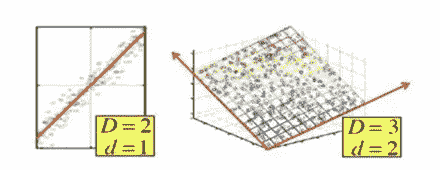

将 **D** 尺寸缩小至 **d** 尺寸([来源](https://www.assignmentpoint.com/business/business-statistics/dimensionality-reduction.html))

# 降维方法

降维问题可以分为两个部分:

(一)特征选择

(二)特征提取

特征选择是一种技术，其中我们有一个包含大量特征的数据集，我们选择这些特征的子集用于训练过程。这个子集可以通过直觉或一些统计技术来确定，如递归特征消除(RFE)，我们在这篇文章中用来解决 Kaggle 的巨大数据集。然而，这种方法并不*有效，因为随着一些特征的丢失，我们可能会丢失数据中的重要信息。*

在要素提取中，我们从现有数据集构建新要素(少于实际要素数)。我们应该**只选择特征提取，前提是我们可以处理原始数据集中特征的丢失**。特征提取是一种通过创建少量特征(维度)来复制数据集特征多样性(方差)的优秀技术，但其代价是个体特征身份的损失，即提取的特征不能被人类理解，因为它们由数字而不是其他值组成。有助于特征提取的算法有:

㈠主成分分析

㈡t-分布随机邻居嵌入(t-SNE)

在下面的章节中，我们将详细介绍主成分分析(PCA)。

**注意:**特征提取通常优于特征选择，但在构建机器学习模型时，我们应该始终使用原始特征集来训练初始模型，因为在某些情况下，维数减少不会产生比基础模型更大的改进。

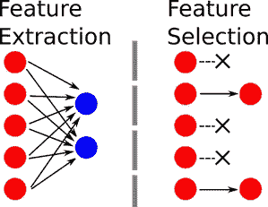

([来源](https://www.groundai.com/project/a-scalable-saliency-based-feature-selection-method-with-instance-level-information/1))

# 主成分分析

PCA 是一种**无监督学习算法**，也是最广泛使用的降维算法之一。在一行中，PCA 只不过是将一个 **n** 维特征空间的轴变换到一个 **k** 维特征空间，这对数据集的方差几乎没有影响。数据的方差是定义数据点在原始特征空间中如何分布的属性，并且在执行 PCA 时保留该属性是很重要的，以便从给定特征中获得最大变化的数据点，缺少该属性会导致所得到的机器学习模型性能不佳，因为该模型将不能概括模式。每个 **k** 维度被称为主分量，其中 **k** 是 PCA 算法的输入。这些主成分中的每一个都根据它们所获得的方差以降序排序。例如，当将 100 维的特征空间减少到 10 维的特征空间时，第一主成分(维度)捕获最大的方差，第二主成分捕获稍小的方差，等等。

现在我们对 PCA 有了一个概念，在深入研究 PCA 算法之前，让我们先来看一个 PCA 的例子。为了便于说明，我们将通过一个例子来说明 PCA 如何通过保留数据的方差将二维特征空间转换成一维特征空间。

考虑下面的散点图。该散点图有一些数据点(蓝点)，其中每个数据点由 x 轴和 y 轴上的值表示。正如我前面提到的，PCA 只不过是数据方向上的轴的变换，使得经过 **n** 变换的轴(k < n)中的 **k** 指向数据的方向。这里 k = 1，n = 2。将 PCA 应用于给定的数据会将二维特征空间的轴转换为由下面所示的虚线轴表示的轴。我们可以清楚地看到，这两个轴中只有一个轴似乎能够很好地逼近所有的数据点，因此，我们可以成功地说，给定的数据只能在一维而不是二维中表示，因此，PCA 发挥了它的魔力。

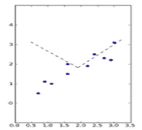

([来源](https://glowingpython.blogspot.com/2011/07/principal-component-analysis-with-numpy.html))

但是 PCA 是如何知道在这个特定方向上变换轴的呢？PCA 从轴的随机变换开始，然后测量所有数据点在每个轴上垂直投影**时的总平方距离(投影误差)。这可以被认为是 PCA 的成本函数，并且该算法的目标是最小化该成本函数。作为结果，最小化过程产生上面的轴的虚线变换。当绘制数据点的散点图时，从下图中我们可以看到水平轴单独代表所有数据点的能力有多好，同时保留了沿该轴的大部分方差。与水平轴相比，垂直轴具有非常小的数据方差，并且如果水平轴已经捕获了我们想要的最小阈值方差(例如> 90%)，那么我们可以说 PCA 已经成功地完成了将二维特征空间转换成一维特征空间的工作。**

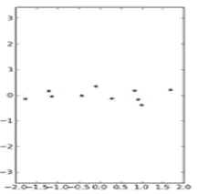

([来源](https://glowingpython.blogspot.com/2011/07/principal-component-analysis-with-numpy.html)

**注:**将二维特征空间转换为一维特征空间，上述过程与线性回归非常相似。但请记住，这里的目标不是构建一条概括所有数据点的直线，而是在数据方向上变换轴，这对于二维问题可能类似于线性回归，但对于 PCA 在高特征空间中的应用，最终结果非常不同。

看过 PCA 如何工作的例子后，让我们深入研究 PCA 算法。

# 主成分分析算法

在深入算法之前，我会推荐(非强制)阅读[这个关于栈交换的](https://stats.stackexchange.com/questions/2691/making-sense-of-principal-component-analysis-eigenvectors-eigenvalues)答案。你不需要读完整的答案，跟着它直到你开始发现事情变得复杂，然后从这里继续这篇文章。请放心，在这篇文章结束时，你会很好地掌握 PCA 算法。

PCA 是机器学习中较难的算法之一，因为它涉及到复杂线性代数的使用。PCA 的整个算法可以分为两步:

㈠数据标准化

(ii)输入相关矩阵的特征分解

标准化数据是数据预处理步骤，也是 PCA 算法的重要组成部分，因为它将不同数据特征的所有数据值降低到相同的尺度。这分两步实现:**均值归一化**和**特征缩放**。在均值归一化中，从每个要素的所有值中减去该要素的均值。因此，每个特征的新平均值为零。一旦执行了均值归一化，即使在均值为零之后，数据值仍然可能分布得很开。每个特性的值在不同的范围内，对于 PCA，我们希望这些值在特定的范围内。为此，我们可以将每个特征的归一化平均值除以每个特征的标准差。这一过程的总体效果是，我们获得了特定范围内所有特征的数据值，这些数据值集中在该范围内(由于平均值为零)。上述过程的公式如下所示:

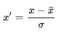

其中 **x̅** 是一个特性的所有值的平均值， ***σ*** *是标准偏差，****x’****是最终的标准化值。*

在讨论特征分解之前，让我们将输入训练特征从输出标签中分离出来，因为 PCA 是一种无监督的学习算法。如果输入数据集具有 **n** 个训练特征和 **m** 个训练示例，则表示数据的矩阵大小为 **m** x **n** ，即训练示例表示为行，特征表示为列。既然这个矩阵代表的是输入数据，那我们就称之为 **X** 。我们知道，当我们对该数据执行 PCA 时，特征数 **n** 将减少到 **k** 。我们把 PCA 后得到的形状 **k** x **m** 的输入矩阵称为 **Z** 。

让我们一步一步地进行特征分解。

1.  特征分解的第一步包括为输入数据构建相关矩阵。这通过输入矩阵的转置和原始输入矩阵的矩阵乘法来计算，并表示为 **XᵀX** 。相关矩阵是一个 **n** x **n** 矩阵，顾名思义，它计算数据集的要素之间的相关程度。相关矩阵中的所有值都在-1 和 1 之间，其中正值表示 2 个值强相关，负值表示 2 个值不相关。相关矩阵是对称矩阵，因为**相关(a，b) =相关(b，a)** 。下图是已经应用了 PCA 的数据集的相关矩阵的热图。我们可以看到，所有的对角线值都接近 1，这表明每个特征都与其自身有很强的相关性，但所有其他值都是负的，这表明每个特征与其他特征几乎没有相关性。这就是应用 PCA 后的最终相关矩阵。然而，相关矩阵 **XᵀX** 需要转换成这样的矩阵，为此，相关矩阵 **XᵀX** 的特征向量和特征值发挥作用。在继续之前，你应该看一下[这个](https://www.youtube.com/watch?v=PFDu9oVAE-g&vl=en)视频，以便直观地了解矩阵的特征向量和特征值代表什么。然而，我已经在下面的一节中简要介绍了这一点。

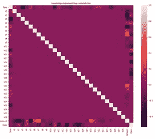

**2。**一旦计算出相关矩阵，我们可以使用**奇异值分解**对原始输入矩阵 **X** 进行(特征)分解。通过奇异值分解，我们可以将矩阵 **X** 分解成如下 3 个矩阵:

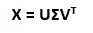

在哪里

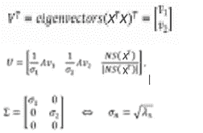

二维数据的奇异值分解

NS 表示矩阵的零空间，并且 **λ(n)** 表示对应于特征向量 v(n)的特征值。

我们如何想出 SVD 用于 PCA 的想法是许多统计学家和数学家的天才之作，但为了进一步了解如何使用通过 SVD 分解的矩阵，我推荐观看[这个](https://www.youtube.com/watch?v=Ls2TgGFfZnU)视频，以满足自己将矩阵的本征分解为 3 个矩阵是正确的。

**理解特征向量和特征值**

术语“eigen”是一个德语词，意思是“特性”。特征向量和特征值是矩阵的特征。矩阵可以被认为是多个向量的组合，并且特征向量是一个这样的特殊向量，其指向数据的最大方差的方向，并且特征向量的长度是其特征值。一旦变换(如 PCA)应用于矩阵，特征向量的方向不会改变(对于所有其他普通向量，它会改变)，但对应于该特征向量的特征值会改变。在这里，我们不需要关心计算特征向量和特征值的过程，因为这是一个非常复杂的步骤，是 python 中线性代数库的一部分，其中有针对该计算的优化实现。

**3。**一旦我们分离出特征向量和特征值，我们就可以通过测量它们在向量 **Vᵀ** 中对应的特征值来对矩阵 **U** 中的值进行降序排序。一旦我们有了按特征值降序排列的特征向量，第一个特征向量捕获原始数据的最大方差，第二个特征向量捕获比第一个稍小的方差，依此类推。这里每个特征向量被称为一个**主分量**。在下一节中，我们将看到如何选择主成分的数量。

**4。**现在假设我们已经选择了第一个 **K 个**主成分，那么我们通过下面提到的公式中的矩阵乘法得到最终的简化特征矩阵:

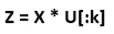

这里，U[:k]是形状(n，k)的 U 矩阵的前 k 个特征向量的切片，X 是形状(m，n)的输入特征矩阵。结果存储在矩阵 Z 中。我们也可以从 Z 中取回原始输入矩阵，但其中的数据值将是原始值的近似值，但我们会取回原始特征。

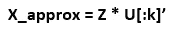

X_approx 是一个(m，n)形矩阵。

现在，当我们构建 Z 的关联矩阵时，它应该类似于前面显示的热图。这表明 PCA 已经成功地应用于输入数据，因此我们已经成功地消除了所有相互关联或冗余的特征。

# 选择主成分的数量

早先我们假设我们在应用 PCA 之后选择 **K** 个主成分。但是，如何选择 **K** ？我们希望通过这 K 个主成分，获取原始数据的最大方差。然而，所需的变化量取决于手头的机器学习任务。但是，建议我们保留原始方差的 90% — 99%之间的方差，并尽可能使用最少的主成分。为了确保这一点，我们首先从第一个主成分开始，并测量它捕获的方差。然后，我们考虑前两个主成分，并测量这个组合捕获了多少方差。重复这个过程，直到我们得到 K 个主成分，产生期望的方差。导致我们得到这个期望方差的主成分的总数是用于进一步训练机器学习模型(回归器/分类器/神经网络)的维度(主成分)的最终数量。检查给定主成分是否保留 99%方差的公式如下:

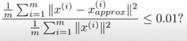

# 应用 PCA 时要记住的要点

1) PCA 应该仅应用于训练数据集。对于交叉验证和测试数据集，应该只应用由 PCA 创建的 **X - > Z** 映射。

2)可能发生的是，由于 PCA 有助于减少输入特征的数量，它也可以防止模型的过度拟合。虽然这在一定程度上是正确的，但在实践中，总是试图通过正则化方法来解决过拟合问题，因为应用 PCA 在这方面没有太大的区别。

3)对于每一个具有大量特征的机器学习问题，使用 PCA 进行降维可能是诱人的，但是我们应该总是尝试用原始特征集来训练我们的第一个模型。如果这不能产生理想的结果，那么我们应该考虑对输入特征应用 PCA。

PCA 算法到此为止。我们已经学习了 PCA 是如何帮助降维的，以及它背后的数学原理。为了巩固这些概念，我在 Kaggle 上创建了[这个](https://www.kaggle.com/vardaanbajaj/illustration-of-pca-through-mnist-dataset/comments?scriptVersionId=39720618)笔记本(详见下一节),它也展示了 PCA 如何可视化一些主要组件。

# 问题陈述

我们使用包含 784 个特征值的 MNIST 数字数据集，其中每个特征代表一个像素值。这个问题的任务是制造一个数字识别器。我还没有创建一个识别数字的模型，因为它将使用神经网络，我还没有讨论过神经网络，但 784 有很多特征，通过对输入数据应用 PCA，您会看到大约 300 个特征足以捕捉数据的 95%的方差，这是一个非常好的特征减少。如果你对它们有一定的了解，你可以在遵循这里的 PCA 步骤之后，尝试训练一个神经网络来自己从减少的特征中识别数字。问题的数据集可以在[这里](https://www.kaggle.com/c/digit-recognizer/data)找到。

让我们从导入所需的库和测量输入数据的形状开始。

```
import numpy as np
import pandas as pd
import matplotlib.image as mpimg
import matplotlib.pyplot as plt
import matplotlib
%matplotlib inlinefrom sklearn.decomposition import PCA
import osfor dirname, _, filenames **in** os.walk(‘/kaggle/input’):
  for filename **in** filenames:
    print(os.path.join(dirname, filename))
```

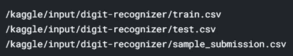

```
df = pd.read_csv("/kaggle/input/digit-recognizer/train.csv")
df.head()
```

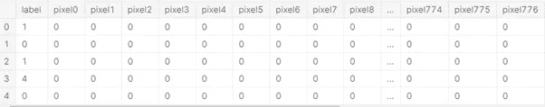

```
df.shape
```

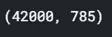

给定的数据集有 42000 个训练样本、784 个特征和 1 个输出标签。让我们将输入要素与输出标注分开。

```
test_df = df['label']
train_df = df.drop('label', axis = 1)
```

现在，我们需要在应用特征分解之前将数据标准化。

```
*# Standardize the data* from sklearn.preprocessing import StandardScaler
X = train_df.values
X_std = StandardScaler().fit_transform(X)
```

在下面的步骤中，我们首先为输入数据构建相关矩阵，然后计算特征向量和相应的特征值。一旦我们有了这些特征向量，我们就根据特征值按降序对它们进行排序，并计算每个特征向量所代表的方差的百分比。

```
*# Calculating Eigenvectors and eigenvalues of Cov matirx* mean_vec = np.mean(X_std, axis=0)
cov_mat = np.cov(X_std.T)
eig_vals, eig_vecs = np.linalg.eig(cov_mat)*# Create a list of (eigenvalue, eigenvector) tuples* eig_pairs = [ (np.abs(eig_vals[i]),eig_vecs[:,i]) for i **in** range(len(eig_vals))]*# Sort the eigenvalue, eigenvector pair from high to low* eig_pairs.sort(key = lambda x: x[0], reverse= True)*# Calculation of Explained Variance from the eigenvalues* tot = sum(eig_vals)
var_exp = [(i/tot)*100 for i **in** sorted(eig_vals, reverse=True)] *# Individual explained variance* cum_var_exp = np.cumsum(var_exp) *# Cumulative explained variance*
```

通过打印变量 *var_exp* 和 *cum_var_exp* ，您可以观察每个特征向量对方差的贡献，正如预期的那样，当我们遍历特征向量时，个体方差会减小，但累积方差最终会达到 100%。让我们画出每个特征向量的方差来验证我们的观察。

```
plt.plot(list(range(784)), cum_var_exp, label = 'Cumulative Variances')plt.xlabel('Feature No.')
plt.ylabel('Variance %')
plt.title('Cumulative Variance % v/s Features')plt.show()
```

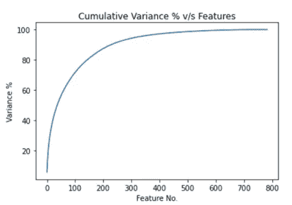

```
plt.plot(list(range(784)), var_exp, label = 'Individual Variances')plt.xlabel('Feature No.')
plt.ylabel('Variance %')
plt.title('Individual Variance % v/s Features')plt.show()
```

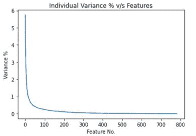

从上述两个图中可以清楚地看出，大部分方差是在 200-300 个特征之间捕获的，300 个特征之后的个体方差接近于零。因此，使用 200-300 个特征将是一个非常好的选择，因为已经捕获了接近 95%的变化。因此，让我们使用前 300 个特征执行 PCA，并可视化由前 25 个特征向量-特征值对捕获的特征类型。

```
n_components = 300
pca = PCA(n_components= n_components).fit(train_df.values)
eigenvalues = pca.components_n_row = 5
n_col = 5*# Visualizing first 25 eigenvectors through their eigenvalues* plt.figure(figsize=(13,12))
for i **in** list(range(n_row * n_col)):
  offset =0
  plt.subplot(n_row, n_col, i + 1)
  plt.imshow(eigenvalues[i].reshape(28,28), cmap='jet')
  title_text = 'Eigenvalue ' + str(i + 1)
  plt.title(title_text, size=6.5)
  plt.xticks(())
  plt.yticks(())
  plt.show()
```

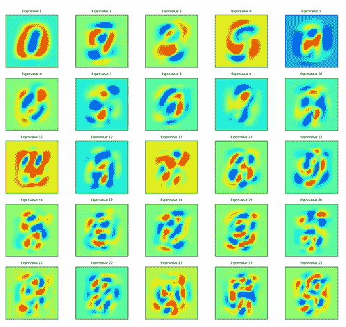

上面的子图描绘了 PCA 方法决定为数字数据集生成的前 25 个最佳方向或主分量轴。当我们将第一个分量“特征值 1”与第 25 个分量“特征值 25”进行比较时，很明显，在搜索中，每个经过的特征向量正在生成更复杂的方向或分量，以最大化新特征子空间中的方差，这支持了先前研究的理论。

在绘图时，我使用了“jet”彩色地图，但是你可以在这里[尝试许多值，看看哪一个给出了最好的视觉效果。](https://matplotlib.org/3.1.0/tutorials/colors/colormaps.html)

到目前为止，我们只是将数据视为独立的像素。让我们将这些像素绘制成 28 x 28 像素的图像，以便能够看到数字的图像，而不只是看到 1 和 0。

```
*# plotting some numbers from the dataset* plt.figure(figsize=(14,12))for digit_num **in** range(0,50):
  plt.subplot(7,10,digit_num+1)
  grid_data = train_df.iloc[digit_num].to_numpy().reshape(28,28)
  plt.imshow(grid_data, interpolation = "none", cmap = "gist_gray")
  plt.xticks([])
  plt.yticks([])plt.tight_layout()
```

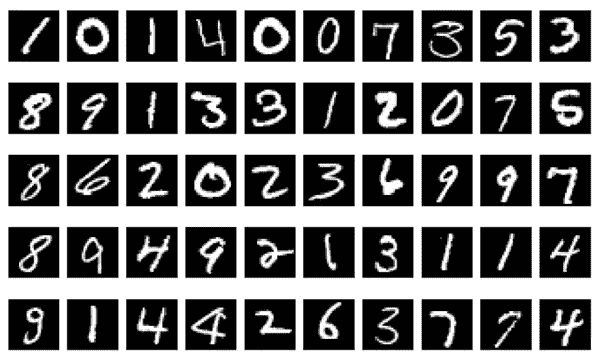

从上面的 50 位图像中，我们可以看到所有图像的顶部、底部、左侧和右侧都是黑色的。这意味着对应于这些列的像素值是多余的，因此是无用的。在 PCA 将移除的许多类型的冗余特征中，这可能是其中最突出的。

最后，我们将使用 10000 个数据点和 30 个主成分，并尝试查看每个主成分捕获的方差是否大于后续主成分。如果是这样的话，这意味着常设仲裁院成功地完成了任务。

```
X = train_df[:10000].values*# Standardizing the values* X_std = StandardScaler().fit_transform(X)*# Call the PCA method with 30 components.* pca = PCA(n_components = 30)
pca.fit(X_std)
X_30d = pca.transform(X_std)
y = test_df[:10000].values plt.scatter(X_30d[:,0], X_30d[:,1])
plt.xlabel('First Principal Component')
plt.ylabel('Second Principal Component')
plt.show()plt.scatter(X_30d[:,0], X_30d[:,9])
plt.xlabel('First Principal Component')
plt.ylabel('Tenth Principal Component')
plt.show()plt.scatter(X_30d[:,0], X_30d[:,19])
plt.xlabel('First Principal Component')
plt.ylabel('Twentieth Principal Component')
plt.show()plt.scatter(X_30d[:,0], X_30d[:,29])
plt.xlabel('First Principal Component')
plt.ylabel('Thirtyth Principal Component')
plt.show()
```

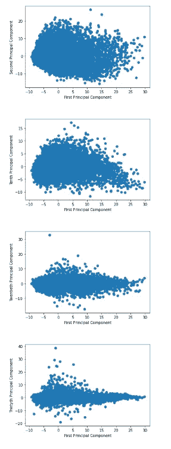

上面每个图中的横轴表示第一主成分，纵轴具有第二、第十、第二十和第三十主成分。我们可以清楚地看到，在每个图中，数据沿水平轴的分布更大，而在随后的图中，沿垂直轴的分布显著减小，这意味着初始主成分比其他成分捕获更多的方差。这证明了 PCA 实现的正确性。

这个帖子到此为止。我们在这篇文章中深入研究了主成分分析，这确实是我们迄今为止所涉及的最困难的话题之一。在下一篇文章中，我们将详细介绍异常检测算法。