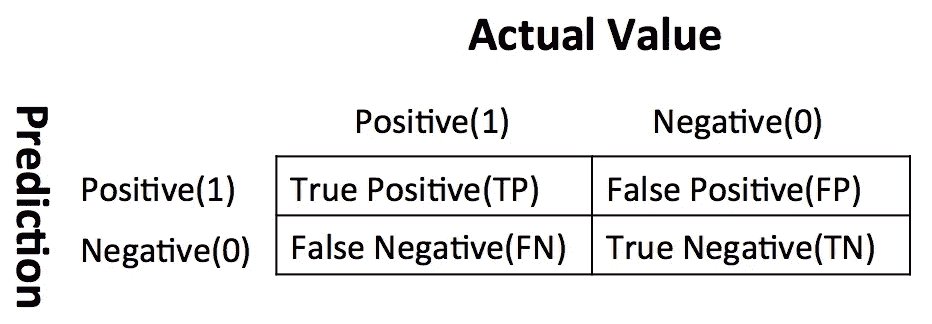
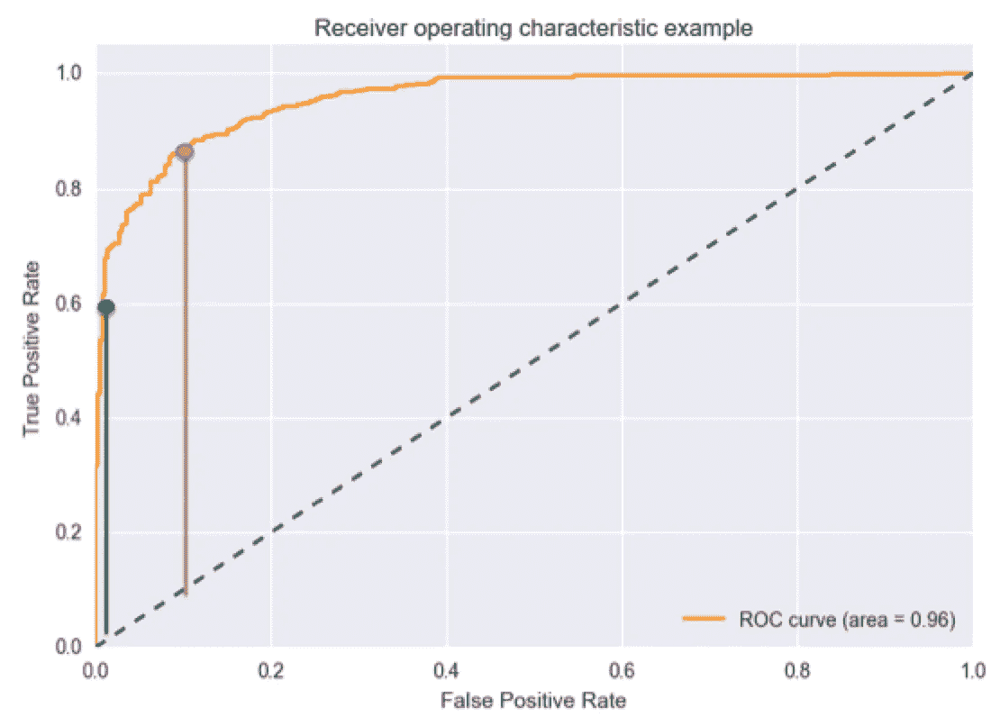
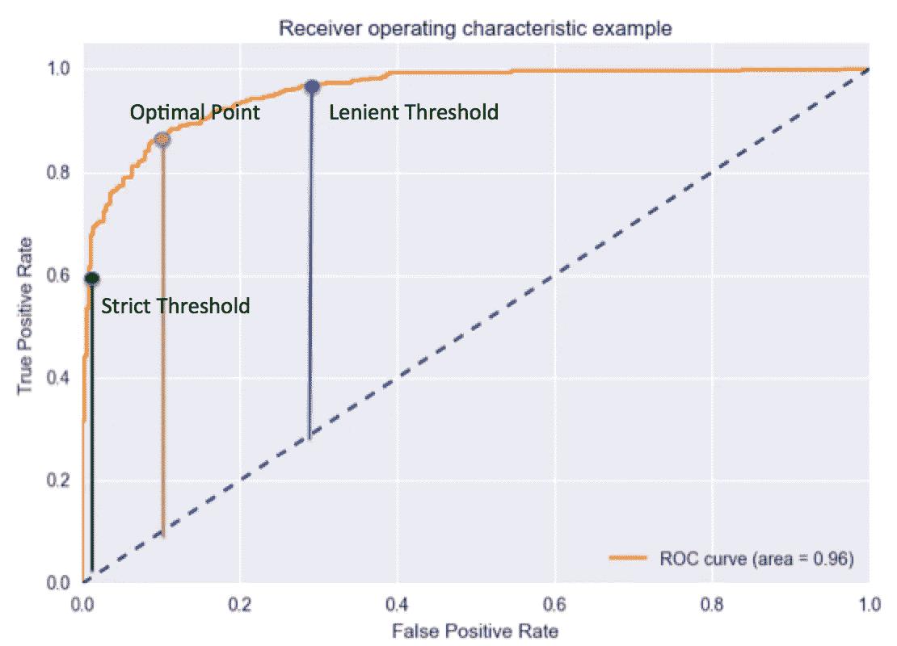

# 深入研究 ROC-AUC

> 原文：<https://towardsdatascience.com/deep-dive-into-roc-auc-cfdd78959ac3?source=collection_archive---------43----------------------->

## 为什么 ROC 曲线和曲线下面积对分类很重要？


来源:图片由来自 Unsplash 的 Geran De Klerk 提供

相信大部分人如果对数据科学感兴趣的话，之前都听过 ROC 曲线或者曲线下面积。然而，ROC 曲线到底是什么，为什么 ROC 曲线下的面积是评估分类模型的良好度量？我在上一篇文章中简要介绍了分类的顶级指标，但我将在本文中更详细地介绍。

## 一些背景信息

ROC 的全称是接收机工作特性。它最初是在第二次世界大战期间为雷达信号探测的使用而创建的。美国已经用它来提高雷达探测日本飞机的准确性。这就是为什么它被称为接收机工作特性。

AUC 或曲线下面积就是 ROC 曲线下的面积。在我们进入什么是 ROC 曲线之前，我们需要快速了解混淆矩阵。



来源:作者-困惑矩阵

从上图可以看出，混淆矩阵是你的预测(1 或 0) vs 实际值(1 或 0)的组合。根据你的预测值和你是否正确分类，它被分为 4 个部分。例如，真阳性是您正确地将病例分类为阳性的病例数，而假阳性是指您错误地将病例分类为阳性的病例数。

混淆矩阵只包含绝对数字。然而，基于这些数字，我们可以开发许多新的基于百分比的指标。真阳性率和假阳性率就是其中的两个。

1.  真阳性率(TPR):在真阳性案例中，有多少百分比被正确地捕获到模型中

TPR=TP/(TP+FN)

1.  假阳性率(NPR):在真正阴性的病例中，有多少百分比实际上是假阳性。

NPR=FP/(FP+TN)

> 好了，现在让我们进入 ROC 曲线！

## 什么是 ROC 曲线？


来源:作者 ROC 曲线示例

从图中可以看出，ROC 曲线只是 TPR 对 NPR 的曲线。好了，故事结束了…

> 开个玩笑！
> 
> 你可以从图表中读到更多的信息。这里我想问的第一件事是:模型结果的 TPR、FPR 只有一套，你是如何形成这么多的点来绘制图形的？

这又回到了分类模型的工作原理。当你建立一个像决策树一样的分类模型，你想根据输入来分类股票明天是上涨还是下跌。分类模型将首先根据您提供的历史值计算增加或减少的概率。之后，基于**阈值**，它将决定结果是增加还是减少。

没错，这里的关键词就是门槛。不同的阈值产生不同的 TPR 和 FPR。它们代表不同的点，形成 ROC 曲线。根据历史数据，如果增加的可能性超过 50%,您可以将输出选择为“增加”,但是您也可以增加阈值，并且只有在超过 90%的可能性时才显示“增加”。如果你选择 90%的信心，而不是 50%，你会更有信心，你选择显示'增加'的股票很可能会增加，但你可能会错过一些潜在的股票。

## 为什么我在图上画蓝色虚线？

我们知道，曲线下面积(AUC)越大，分类就越好。理想或完美的曲线是一条从(0，0)到(0，1)然后到(1，1)的垂直线，这意味着该模型可以 100%区分正面和负面情况。然而，如果你随机选择每种情况，TPR 和 FPR 应该以同样的速度增长。蓝色虚线显示了当您盲目猜测每种情况下的阳性或阴性时的 TPR 和 FPR 曲线，对于该对角线，曲线下面积(AUC)为 0.5。

## 如果我改变门槛，TPR、FPR 和 ROC 曲线会发生什么变化？



看 ROC 曲线上的两个点。绿点有一个非常高的阈值，这意味着只有当你有 99%的把握时，你才能将这个案例归类为阳性。红点具有相对较低的阈值，这意味着如果你有 90%的信心，你可以将该病例归类为阳性。

> TPR 和 FPR 从绿点到红点的变化是什么？

TPR 和 FPR 都增加了。当您降低阈值时，可以识别更多的阳性病例，因此 TP 增加，TP/(TP+FN)也增加。另一方面，由于阈值的降低，你不可避免地会错误地将一些负面情况归类为正面情况，因此 FP & FP/(FP+TN)也会增加。

**我们可以看到，TPR 和 FPR 是正相关的，你必须在最大限度地捕捉正面案例和最小化负面案例的错误分类之间进行平衡。**

## 如何选择 ROC 曲线上的最优点？



很难定义最佳点，因为您应该为业务案例选择最合适的阈值。然而，**一般规则是最大化(TPR-FPR)，在图中用橙色和蓝色虚线**之间的垂直距离表示。

从上面的图表中我们可以看到，在这三个点中，红点的 TPR-FPR 最大，应该被认为是最优点。从红点移到绿点，门槛变得更加严格。然而，大量的阳性病例没有从模型中捕获，错误分类病例的减少低于比例。从红点移动到蓝点，阈值变得更加宽松，并且增加了比正确识别的正点更多的错误分类的正点。

## 为什么 ROC 曲线下的面积是评估分类模型的良好指标？

一个好的机器学习模型的度量应该显示模型的真实和一致的预测能力。这意味着如果我改变测试数据集，它不应该有非常不同的分数。

**ROC 曲线不仅考虑了分类结果，还考虑了所有类别的预测概率。**例如，如果输出基于 51%的概率被正确分类，那么如果使用另一个测试数据集，它很可能被错误分类。此外，ROC 曲线还考虑了跨越不同阈值的表现，因此它是评估**不同组中的病例**的分离程度的综合指标。

## **分类模型的可接受 AUC 分数是多少？**

正如我之前展示的，对于二元分类问题，如果你随机选择，你可以获得 0.5 AUC。因此，如果你正在解决一个二元分类问题，**一个合理的 ROC 分数应该是> 0.5** 。一个好的分类模型通常具有 AUC 分数> 0.9，但是它完全依赖于应用。

## 如何用 Python 计算 AUC 并绘制 ROC 曲线？

> 如果只是想找 AUC 评分，可以参考 sklearn 度量包[这里](https://scikit-learn.org/stable/modules/generated/sklearn.metrics.roc_auc_score.html)。
> 
> 如果你想为你的模型结果绘制 ROC 曲线，你可以参考[这里的](https://scikit-learn.org/stable/auto_examples/model_selection/plot_roc.html)

```
# Calculate FPR, TPR and AUC
from sklearn.metrics import roc_curve, auc
fpr, tpr, treshold = roc_curve(y_test, y_score_new)
roc_auc = auc(fpr, tpr)#Plot ROC curve
plt.plot(fpr, tpr, color='darkorange',
         label='ROC curve (area = %0.2f)' % roc_auc)
plt.plot([0, 1], [0, 1], color='navy', linestyle='--')
plt.xlim([0.0, 1.0])
plt.ylim([0.0, 1.05])
plt.xlabel('False Positive Rate')
plt.ylabel('True Positive Rate')
plt.title('Receiver operating characteristic example')
plt.legend(loc="lower right")
plt.show()
```

下面是我在本文中使用的绘制 ROC 示例图的代码。你需要两个输入，y 的真实值和预测概率。注意 **roc_curve 函数只需要正例的概率，而不需要两类的概率**。如果你有一个多类分类的问题，你也可以使用这个包，在上面的链接中有一个如何绘制的例子。

如果您有兴趣了解评估分类模型的其他顶级指标，可以参考下面的链接:

[](https://medium.com/@songhaowu/top-5-metrics-for-evaluating-classification-model-83ede24c7584) [## 评估分类模型的 5 大指标

### 与回归模型不同的是，当我们评估分类模型的结果时，我们不能只关注预测…

medium.com](https://medium.com/@songhaowu/top-5-metrics-for-evaluating-classification-model-83ede24c7584)