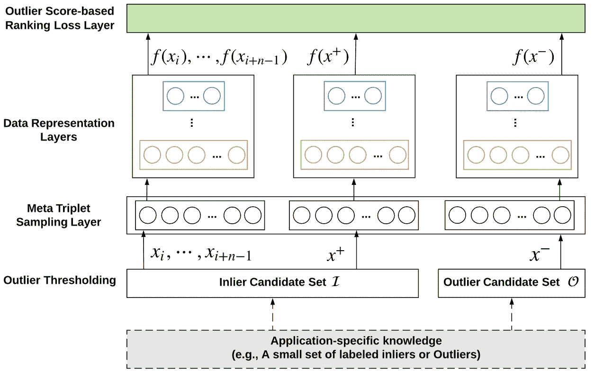
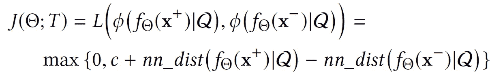
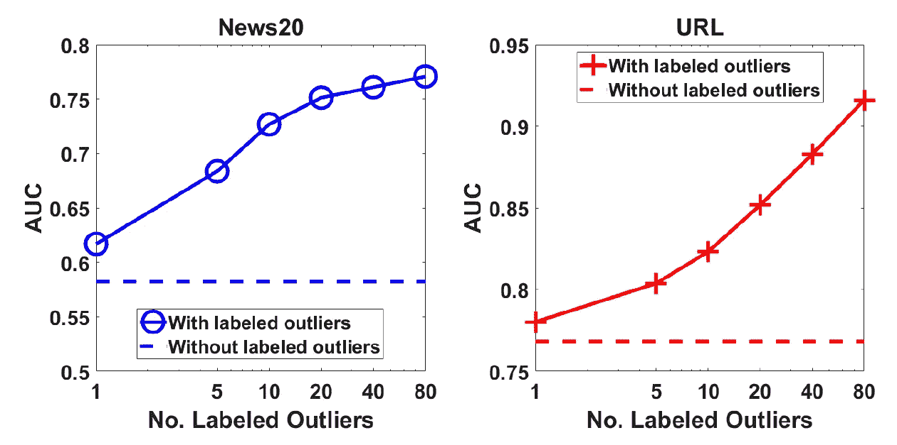
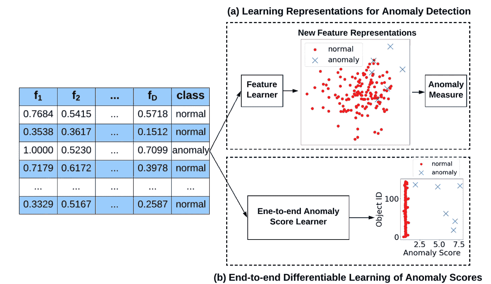
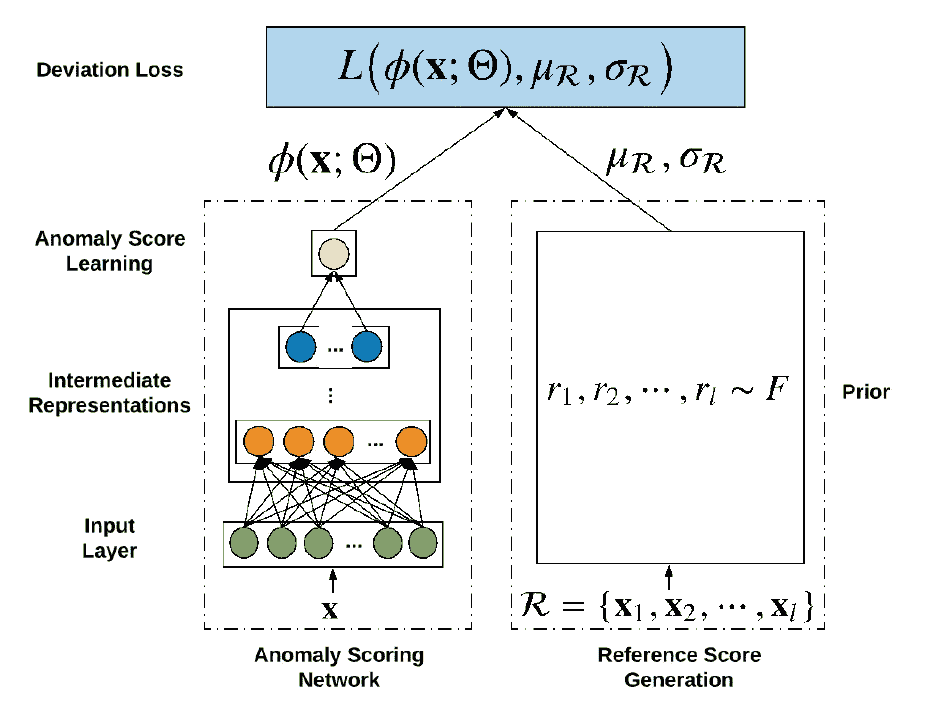
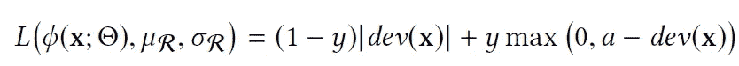
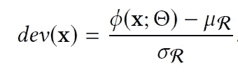
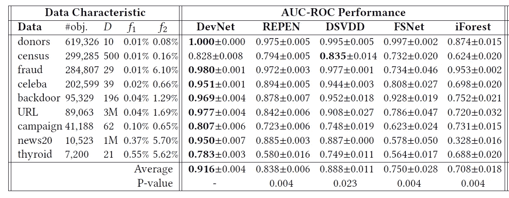

# 深层少炮异常检测

> 原文：<https://towardsdatascience.com/deep-few-shot-anomaly-detection-b33f130d1f80?source=collection_archive---------12----------------------->

## [入门](https://towardsdatascience.com/tagged/getting-started)

## 利用一些标记的异常实例来执行异常的异常通知检测

由于缺乏大规模的标记异常数据，现有的(深层或浅层)异常检测方法通常被设计为无监督学习(在完全无标记的数据上训练)或半监督学习(在专门标记的正常数据上训练)。因此，当在许多真实世界异常检测应用中这样的信息可用时，它们难以利用先验知识(例如，一些标记的异常)。这些有限的标记异常可能源自已部署的检测系统，例如一些成功检测到的网络入侵记录，或者它们可能来自用户，例如少量由客户报告并由银行确认的欺诈性信用卡交易。由于假设在训练过程中只有非常少量的标记异常可用，该研究路线中的方法可以归入“少量异常检测”这一大类。但是，它们与一般的少投学习也有一些根本的区别。我将在最后讨论更多的差异。在这篇文章中，我将分享我们在利用深度学习技术解决这个问题方面的一些令人兴奋的工作。

# **研究问题**

给定一组大的正常(或未标记)训练数据和非常有限数量的标记异常数据，我们的目标是适当地利用这些小的标记异常数据和大的正常/未标记数据来学习异常检测模型。

# 基于深度距离的异常检测方法

REPEN [1]可能是第一个深度异常检测方法，旨在利用少数标记的异常来学习基于异常的检测模型。REPEN 的关键思想是学习特征表示，使得异常在随机数据子样本中具有比正常数据实例更大的最近邻距离。这种随机最近邻距离是最有效的异常测量方法之一，如[2，3]所示。REPEN 的目标是学习为这种最先进的异常测量量身定制的特征表示。REPEN 的框架如下图所示。

REPEN 的框架

REPEN 被强制学习比随机数据子集 x_i，…，x_{i+n-1}中的正常实例 x+更大的异常 x-的最近邻距离。总体目标如下

其中 Q 是从未标记/正常训练数据中采样的随机数据子集，f 是神经网络使能的特征学习函数，nn_dist 返回数据子集 Q 中 x 的最近邻距离。

正如你在上面看到的，当大量的训练数据只包含正常数据或者完全没有标记的数据时，REPEN 可以工作。在后一种情况下，我们也没有标记的异常数据，REPEN 使用一些现有的异常检测器来产生一些伪标记的异常数据。所以，REPEN 也可以在完全无人监管的环境下工作。

虽然标记的异常数据是有限的，但是与它的无监督版本相比，REPEN 可以实现非常显著的准确性性能。一些令人印象深刻的结果可以在下面找到。随着标记异常的数量从 1 增加到 80，AUC 性能快速增加。

REPEN 的源代码发布在

 [## 关松胖/深度异常值检测

### 这个库向您展示了一个深度异常检测(或异常检测)算法，它使用三元组网络来…

github.com](https://github.com/GuansongPang/deep-outlier-detection) 

# 深度偏离网络:一种端到端异常检测优化方法

与 REPEN 专注于基于距离的异常测量的特征表示学习不同，偏差网络(DevNet [4])旨在利用有限的标记异常数据来执行端到端异常得分学习。下图显示了关键的区别，前者优化了表示，而后者优化了异常分数。

侧重于表示学习的方法与端到端异常检测方法

具体来说，如下面的框架所示，给定一组训练数据实例，所提出的框架首先使用神经异常分数学习器为其分配异常分数，然后基于先验概率定义一些正常数据实例的异常分数的均值，作为指导后续异常分数学习的参考分数。最后，该框架定义了一个损失函数，称为偏差损失，以强制异常的异常分数与正常数据对象的异常分数在统计上有显著的偏差。在 DevNet 的实现中，高斯先验被用于使用基于 Z 分数的偏差损失来执行异常分数的直接优化。

DevNet 的框架

DevNet 的损失函数如下所示

其中，dev 是基于 Z 得分的偏差函数，定义如下

其中 phi 是基于神经网络的映射函数，其将输入 x 投影到标量输出，mu 和 sigma 从高斯先验中提取。这种损失使得 DevNet 能够将正常实例的异常分数推至尽可能接近 mu，同时在 mu 和异常的异常分数之间强制至少 a 的偏差。

DevNet 在广泛的真实世界数据集上进行评估。一些结果如下所示。DevNet 的性能明显优于几个最先进的竞争方法，包括 REPEN、深度一类分类器、少镜头分类器和无监督方法 Forest。更有趣的结果可以在[4]中找到。

DevNet 的源代码和数据集发布在

 [## 关松胖/偏离-网络

### 作者:庞关松，，安东·范·丹亨。偏差网络深层异常检测(KDD19)。偏差…

github.com](https://github.com/GuansongPang/deviation-network) 

# 少量异常检测与少量分类

在少量异常检测中，有限的异常样本可能来自不同的异常类别，因此表现出完全不同的流形/类别特征。这从根本上不同于一般的少量学习(主要是分类任务)，其中有限的例子是特定于类的，并假设共享相同的流形/类结构。因此，在少量异常检测中，必须小心处理来自一些新型异常类别的未知异常。两篇文章[5，6]旨在解决这个问题。我将在后面讨论这两项研究。

除了上面介绍的两种方法之外，还有一些其他的论文解决了同样的问题。详情请见调查报告[7]。

## 参考

[1]庞，曹，陈，刘，(2018 年 7 月)。基于随机距离的异常值检测的超高维数据的学习表示。在第 24 届 ACM SIGKDD 知识发现国际会议的会议记录中&数据挖掘(第 2041-2050 页)。[2]庞，g，廷，K. M .，[3]阿尔布雷希特，D. (2015 年 11 月).LeSiNN:通过识别最不相似的最近邻来检测异常。在 *2015 年 IEEE 国际数据挖掘研讨会(ICDMW)* (第 623–630 页)。IEEE。
[3]杉山，m .，T22 博格瓦德特，K. (2013 年)。通过采样进行基于距离的快速异常检测。在*神经信息处理系统的进展*(第 467–475 页)。
【4】庞，g，沈，c .&范登亨格尔，A. (2019，7 月)。基于偏差网络的深部异常探测。在*第 25 届 ACM SIGKDD 知识发现国际会议论文集&数据挖掘*(第 353–362 页)。
【5】庞，g，沈，c，金，h .&亨格尔，A. V. D. (2019)。深度弱监督异常检测。 *arXiv 预印本:1910.13601* 。
【6】庞，g，亨格尔，A. V. D，沈，c .&曹，L. (2020)。用于未知异常检测的深度强化学习。arXiv 预印本:2009.06847 。
【7】庞，g，沈，c，曹，l，&亨格尔，A. V. D. (2020)。用于异常检测的深度学习:综述。arXiv 预印本:2007.02500 。