# 我的情节糟透了。以下是我如何修复它们。

> 原文：<https://towardsdatascience.com/deep-guide-into-styling-plots-delivering-effective-visuals-12e40107b380?source=collection_archive---------35----------------------->

## 你的，在某种意义上，可能也是。


图片来自 [Pixabay](https://pixabay.com/?utm_source=link-attribution&utm_medium=referral&utm_campaign=image&utm_content=2734073) 的[霍尔格·朗梅尔](https://pixabay.com/users/holgersfotografie-47038/?utm_source=link-attribution&utm_medium=referral&utm_campaign=image&utm_content=2734073)

> 你的工作效率取决于你与他们交流的能力。

我想我们都同意，在数据科学领域，初学者比学长多。因为这种差异，大部分在线课程、教程都是为初学者设计的。特别是，教授数据可视化的课程大多是在探索性数据分析的背景下教授的。结果你看看 [Kaggle](https://www.kaggle.com/) 或者 [GitHub](https://github.com/) ，到处都是写满剧情的 EDA 笔记本。

我从来不认为这是一件坏事，而是说数据可视化的实践从一开始就变得非常有限。DV 在现实世界中有许多应用，而不仅仅是在死气沉沉的笔记本中，你必须知道如何为任何观众和任何场合创造情节。

当我说我的情节很糟糕时，我暗示如果我把它们带离它们的舒适区(EDA)，它们将不会有任何好处。我会说它们对我的 EDAs 来说已经足够好了，但是它们绝对不适合数据科学世界之外的人。

这篇文章介绍了一些不常用的方法来设计你的情节，使它们更容易理解，并为任何不精通技术的人做好准备。

> **免责声明**:这篇文章是为那些已经对 Seaborn，Matplotlib 和 Pandas 有一些经验的人设计的。此外，它不是一个关于如何创建某种类型的地块的教程，而是给你一个全面的样式指南。

## 概观

∘ [设置](#7ba6)
∘ [设置上下文](#1c97)
∘ [设置样式](#4765)
∘ [注释文本，深度引导](#3f0d)
∘ [休息一下，观看一些鱼](#03ef)
∘ [去除棘或轴以更加清晰(去除棘)](#385e)
∘ [轴标签和标题](#7e82)
∘ [颜色和调色板](#5cdd)

## 设置

我将使用诺贝尔奖数据集。它包含了从成立到 2016 年诺贝尔奖获得者的数据，可以从 Kaggle 下载。对于样式，我将同时使用 Matplotlib 和 Seaborn。

> 此外，知道如何使用 Matplotlib 的 OOP 接口也很重要。这个界面，配合 Seaborn，允许你无限定制你的情节。如果你不熟悉，我另外写了一篇文章:

[](/clearing-the-confusion-once-and-for-all-fig-ax-plt-subplots-b122bb7783ca) [## 一劳永逸地澄清困惑:fig，ax = plt.subplots()

### 了解 Matplotlib 中的图形和轴对象

towardsdatascience.com](/clearing-the-confusion-once-and-for-all-fig-ax-plt-subplots-b122bb7783ca) 

## 设置背景

准备在除 EDAs 之外的任何其他地方显示您的图被称为解释性数据分析。这是你让你的情节尽可能完美的地方。解释性分析(EA)应该主要关注使用简单而强大的图表来洞察数据集，并且应该为任何受众而设计。

如果你是做 EA 的，人们并不关心你的代码有多好，模块化，可复制。他们只是想了解数据。我建议你为自己做探索性的数据分析，然后，在一个单独的笔记本上总结你的分析要点。这个笔记本应该更多的是讲故事的类型，这真的很重要。

所以，现在让我们来谈谈如何设置情节的背景。这里的上下文只是指你应该如何根据你在哪里显示它们来缩放你的图。

Seaborn 提供从小规模到大规模的 4 种选择。分别是**纸、笔记本、谈资、**和**海报**。让我们来看看它们的区别:

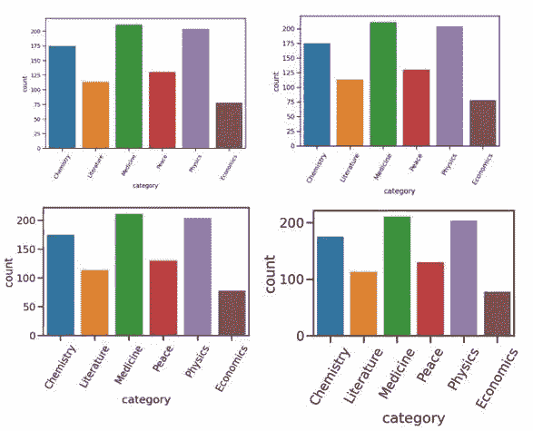

希伯恩的不同背景

对于 EDA 来说，最好还是坚持用`notebook`。然而，如果你正在做一个演示，或者写一篇涉及情节的博客文章，使用`talk`。上下文不会改变绘图本身，但会放大和缩小刻度线。我使用`with`上下文管理器来临时设置上下文。还有一个等效功能`sns.set_context()`不能和*(嗯哦)* `with`一起使用。

## 设置样式

Matplotlib 和 Seaborn 中都有几种样式。Matplotlib 不仅如此，还包括 Seaborn 的风格。改变风格会对你所有的情节产生影响。选择一个大多是基于个人喜好，但有时你将不得不根据你的情节来选择。

如果有许多条形图或线图，最好选择带有背景网格的主题。网格使估计条形的高度或线图的值变得更加容易:


如果不使用线条或线条，则不需要网格。这几种风格你随便选一个:`white`、`dark`、`ticks`。我在这篇文章中只给出了 Seaborn 风格，它们可以使用`sns.set_style()`来设置。然而，如果你想使用 Matplotlib 样式，该列表可在[这里](https://matplotlib.org/3.3.1/gallery/style_sheets/style_sheets_reference.html)获得。让我们看一个 Matplotlib 的例子:

```
plt.style.use('dark_background')
```

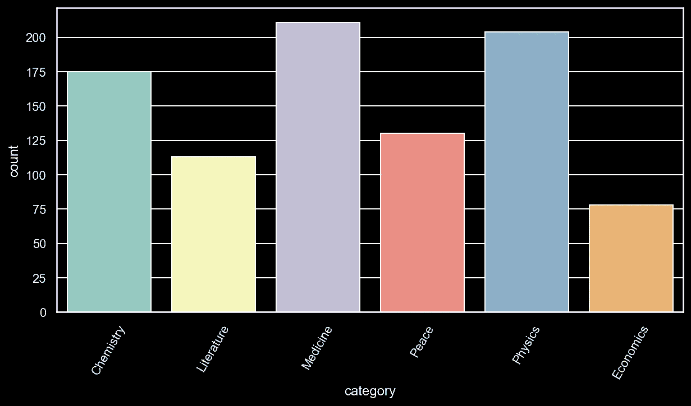

## 注释文本，深度指南

不管你的情节有多美，有多丰富，有时候读起来还是很困难的。因此，您可以使用注释和箭头来指向情节的重要部分，而不是以文本墙的形式提供描述。这一节是关于在图的任何部分放置文本。

首先，让我们向一个空图形放置一个文本:

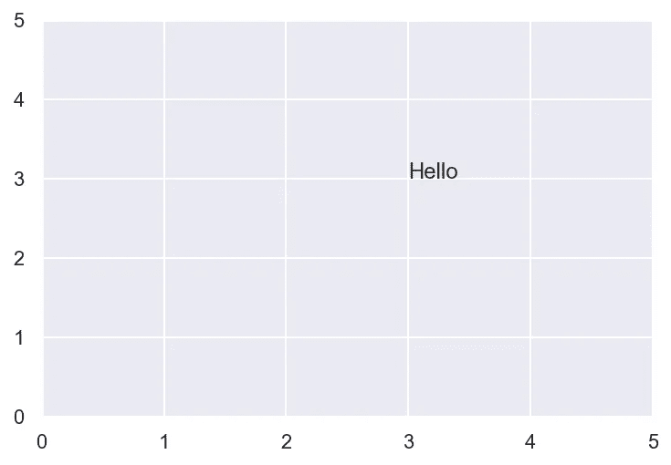

我们创建一个空的支线剧情。然后，我设置轴限制来绘制更大的图形。`annotate()`接受的第一个参数是要放置的文本。下一个也可能是最重要的参数是`xycoords`。它可以接受一定范围的值，但最好将其设置为`data`。这意味着我们基于我们的数据来定义文本的坐标。因此，当我将`xy`参数设置为(3，3)时，它会根据轴值来放置它们。让我们在上一个文本的上方 1 点处添加另一个文本:

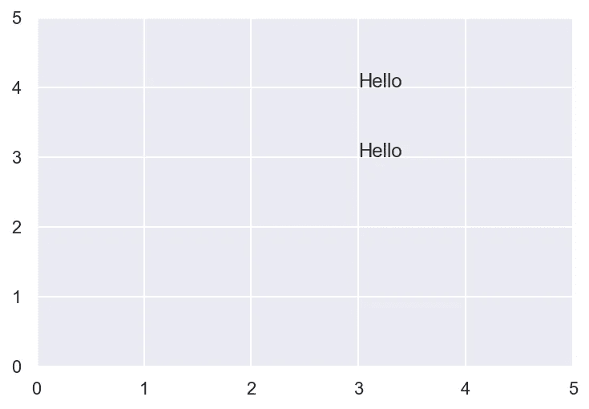

我们调整了`xy`的 y 值，将一个文本放在前一个文本之上 1 磅。请注意，因为我将`xycoords`设置为`data`，所以单位被计算以匹配轴刻度。如果我们在`XAxis`上有日期，你可以向`xy`提供一个日期来指定`x`坐标。

有时，网格节点可能不是放置文本的最佳位置。您可能希望指向绘图的特定部分，但希望文本从其他偏移位置出现。例如，上面的示例将文本放置在(3，3)坐标处。但是如果我们想要指向同一个点，但是想要文本出现在稍微偏上和偏左的位置呢？Matplotlib 为这些情况提供了另外两个参数:

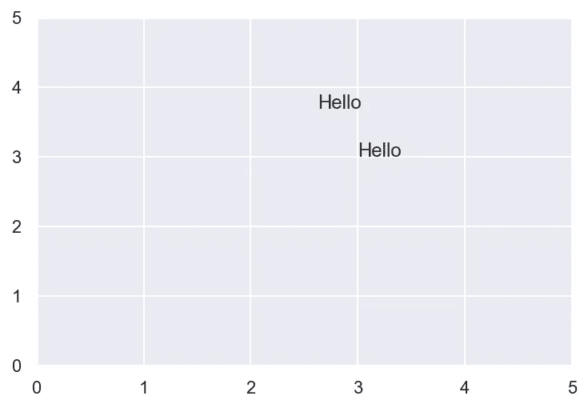

`textcoords`就像`xycoords`接受不同的缩放单位一样。如果我们将`textcoords`设置为`offset points`，matplotlib 将 x 和 y 值解释为我们想要将文本移动`xy`多少个单位。所以解释上面的代码，我们想要注释(3，3)点，但是想要文本出现在上面 30 点和左边 25 点。这种方法非常灵活，因为它允许以我们想要的任何方式控制文本的位置。

现在，让我们回到我们的例子。我们有一个计数图，但不是让观众猜测，我们想把每个酒吧的高度放在自己的顶部。这对解读有很大帮助。来看看剧情:


要在每个条形上方放置一个文本，我们必须找出每个条形的高度。我将图分配给变量的原因是它提供了一些关于图的附加属性:

任何带条形的图都有一个我们可以使用的有用属性，称为`patches`:

如您所见，图中有 6 个`Rectangle`对象，就像图中有 6 个条一样。我们打印了第一个条形，从输出中可以看出它的高度是 175。现在，让我们循环遍历每个`Rectangle`对象，并获得它们的高度和它们的`x`坐标:

为了获得高度或`y`值，我们使用`.get_height()`函数，为了获得`x`值，我们使用`.get_x()`。我们还应该得到宽度，这样我们就知道每个条形的中心在哪里。

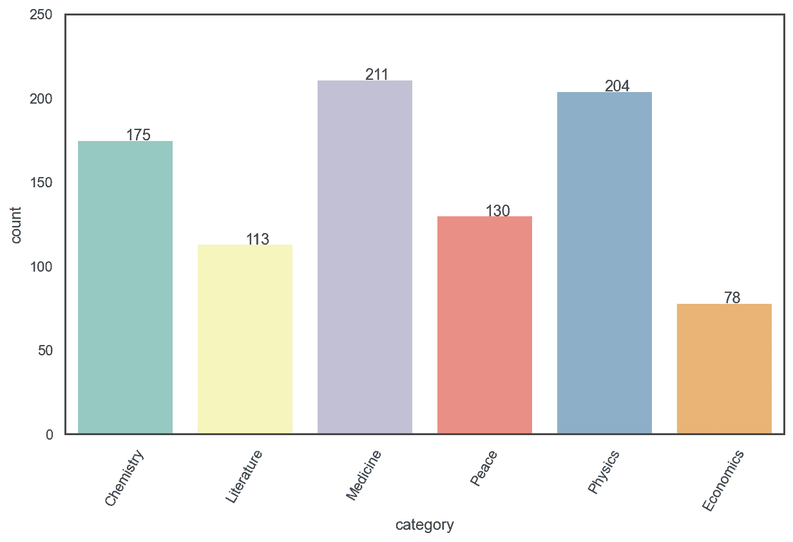

好吧，我们有短信，但是看起来很奇怪。我们必须给他们一些喘息的空间和一些格式化。我们将使用我们之前讨论过的偏移文本功能:


这就对了，你在顶部放置了每个条形的高度。要达到正确的条件需要一些努力，所以我建议你重读这一节并自己练习。

标注图有许多其他方法，我无法在本文中一一介绍。所以，我就题目单独写了一篇。请查看:

[](/finally-learn-to-annotate-place-text-in-any-part-of-the-plot-d9bcc93c153f) [## 掌握` plt.annotate()`让您的情节更上一层楼

### 上帝保佑所有阅读 Matplotlib 文档的人

towardsdatascience.com](/finally-learn-to-annotate-place-text-in-any-part-of-the-plot-d9bcc93c153f) 

## 休息一下，看些鱼


照片由 [Pexels](https://www.pexels.com/photo/school-of-gray-fish-3536511/?utm_content=attributionCopyText&utm_medium=referral&utm_source=pexels) 的[哈里森·海因斯](https://www.pexels.com/@harrisonhaines?utm_content=attributionCopyText&utm_medium=referral&utm_source=pexels)拍摄

## 为了更加清晰起见，去掉了脊线或轴(去除脊线)

因此，我们正在逐步改进我们的简单计数图。在我们输入每个条形的精确值后，没有必要保存`YAxis`，因为它没有给出任何信息。同样，我们也不需要`Y`记号标签。

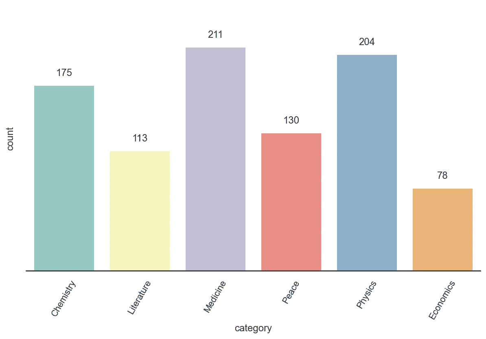

`despine()`功能可通过 Seaborn 获得。为了给它更多的灵活性，你必须指定使用`ax`的子情节。这就是为什么我一直用`fig`和`ax`对象来处理 Seaborn。Matplotlib 和 Seaborn 是一股需要共同应对的力量。

在接下来的部分，我将改进我们的计数图。因此，为了避免重复，我将围绕情节的主要部分包装一个函数。此外，我将改为单一颜色，稍后我会解释原因:

## 坐标轴标签和标题

现在，我们最后来谈谈轴标签和标题。它们相当简单，我相信大多数人已经熟悉我将要谈到的方法。首先，我将展示如何改变标签和标题的字体大小和颜色。

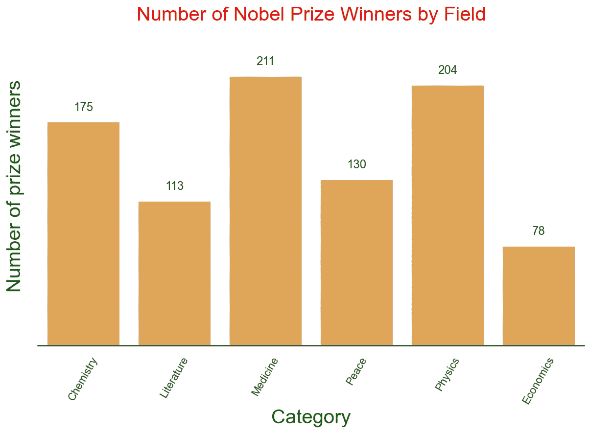

对于我们的情节，默认黑色是好的，但我只是想展示一个例子。事实上，一个信息丰富的标题就足够了。我们不需要轴标签。我会将它们移除，并切换回黑色:

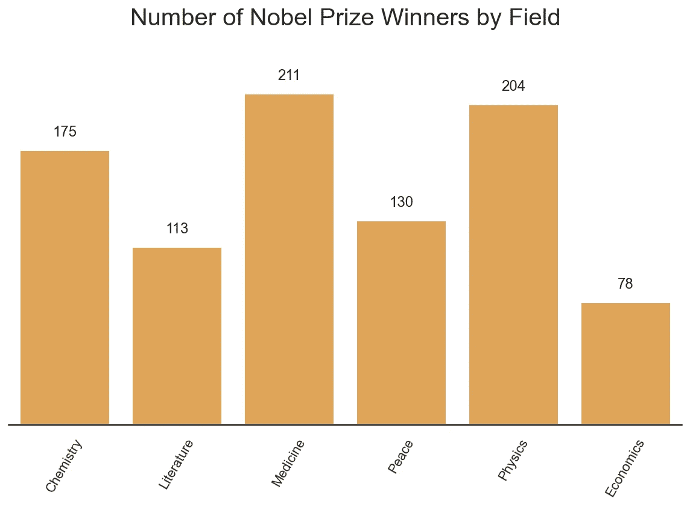

## 颜色和调色板

谈到颜色，有许多事情需要考虑。第一个是数据类型。根据您的数据，有不同的调色板可供选择:

1.  **圆形调色板**:如果你的数据没有顺序，这是最好的选择。
2.  **顺序调色板**:如果您的数据具有一致的范围，从低到高，反之亦然，请使用这些调色板。
3.  **发散调色板**:最好在数据的高点和低点都令人感兴趣时使用。

还有，在颜色不增加任何新信息的情况下，尽量避免使用颜色。或者使用色盲调色板。对于我们的计数图示例，颜色不编码任何新数据。这就是为什么我对所有的条使用单一的颜色。

现在，让我们看另一个使用顺序调色板的例子。我将使用预加载的钻石数据集作为示例:

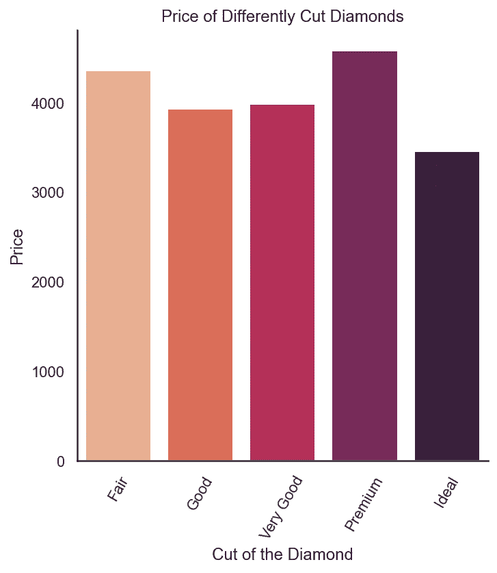

这里，小节有特定的顺序。这就是为什么使用连续调色板是好的。让我们看另一个例子:

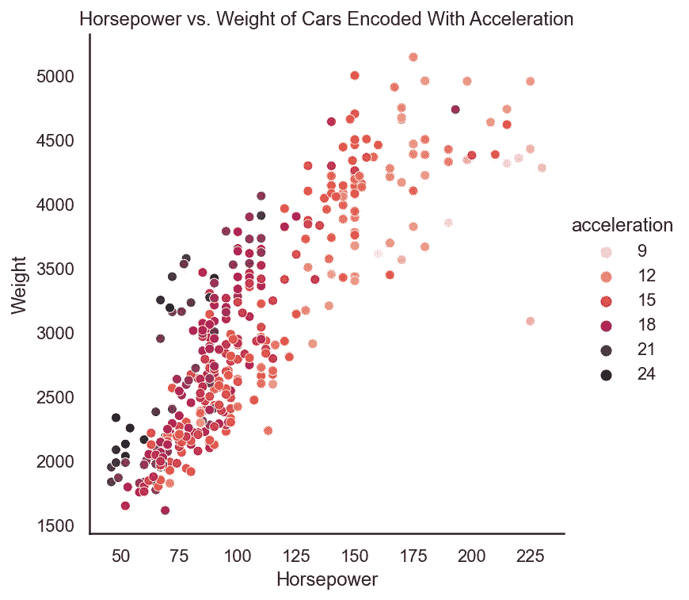

如你所见，选择正确的调色板非常重要。以下是可用的调色板:

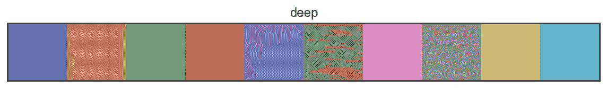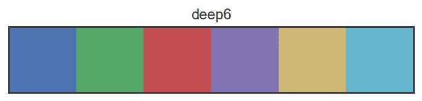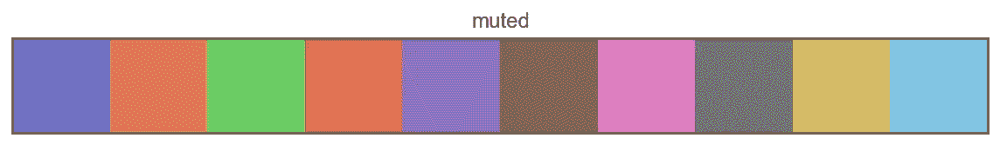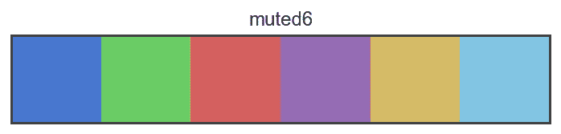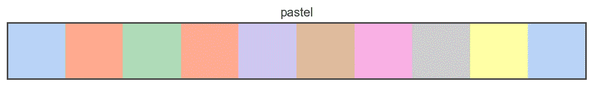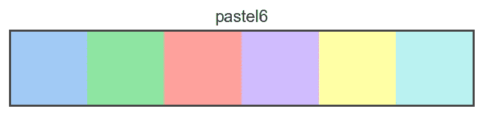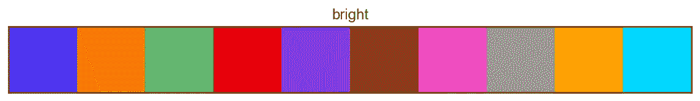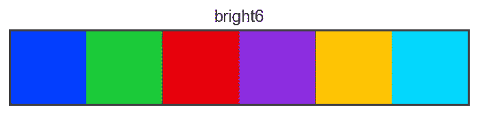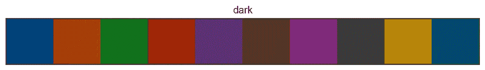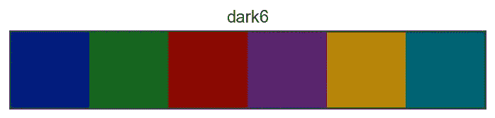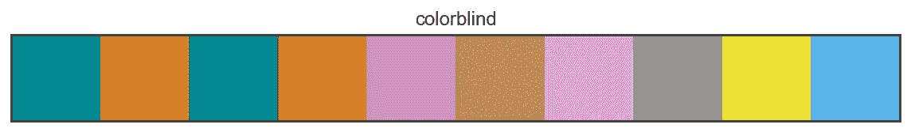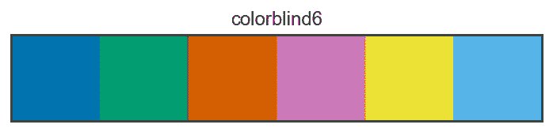

`palplot()`创建这些好看的调色板图，而`color_palette()`给出当前图。我建议你阅读[这篇](https://chrisalbon.com/python/data_visualization/seaborn_color_palettes/)文章，了解更多关于调色板和颜色的信息。

## 为任务选择正确的绘图

为不同的观众选择正确的剧情至关重要。我不是在谈论为数据选择正确的图。相反，选择一个以尽可能简单的方式描述您的数据的洞察力。

关于**单条支线剧情**的一般经验法则:确保一条主线剧情包含的变量不超过 4 个。它没有增加新的信息，反而增加了新的难度。理想是两三个。如果需要更多，请尝试在两个或多个单独的图中显示您的结果。

**绘图类型**:选择易于阅读的绘图，如条形图、线图或散点图。复杂的图，即使它们给了数据深刻的洞察力，也不容易被许多人解释和理解。在**探索性**数据分析中，尝试使用工具箱中的一切来最好地理解您的数据。在**解释性**阶段，用简单的情节概括要点。不要包括像 KDE(核密度估计)，小提琴图，盒图，蜂群等图。除非你想让你的观众眼睛流血(或者耳朵流血，如果你在演讲的话)。

**多个支线剧情**:尽量避免。如果单个图形上有多个图，它们会变得难以阅读，因为比例会变小。在进行分析时，首先使用分面或小多次波来理解数据。然后，在你的 FacetGrid 或支线剧情网格中选择最重要的支线剧情，并单独显示它们。或者并排，如果有两个。确保你显示的支线剧情不超过 3 个。这个需要一个例子:

```
sns.relplot(x='carat', y='price', 
            data=diamonds, col='cut', col_wrap=3)
```

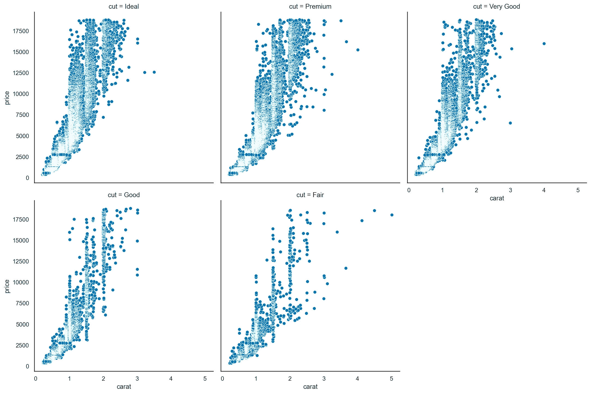

这个 FacetGrid 比较了每种钻石切割的价格和克拉数。对于一个普通人来说，这是很难接受的，他们可能不会看每一个。例如，他们可能感兴趣的是理想钻石的价格如何变化。因此，您获取第一个子情节并单独显示它，而不显示整个 FacetGrid。你可能需要在这方面下点功夫:

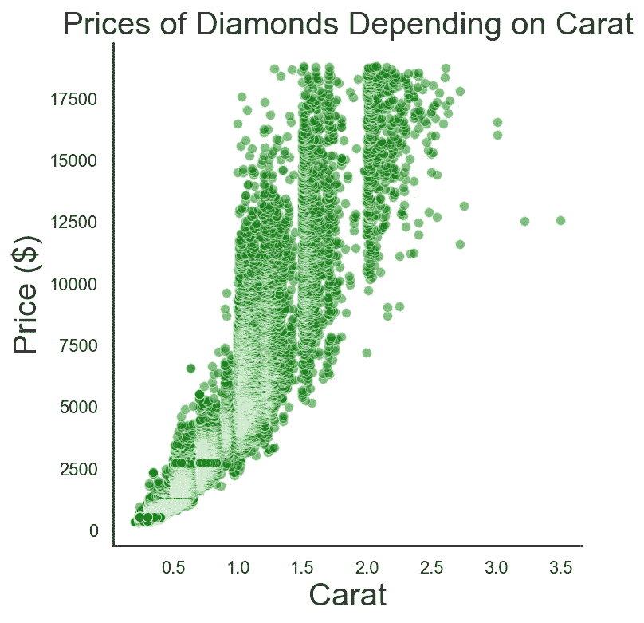

这个方法好多了。你可以在关注最重要的部分的同时，快速提及其他剧情的进展。

## 包扎

呼，这是很多。我给了你很多信息。但这是最好的结果。看完文章，你现在已经准备好把任何情节变成杰作了。使用这里讨论的方法进行解释性数据分析或数据故事讲述。如果你想从成千上万的人中脱颖而出，你也可以在探索性数据分析中使用它们。去打动一些人吧！

**请留下反馈，分享文章。作为一名作家，你的支持对我来说意味着一切！这里还有一些关于数据可视化的文章:**

[](/master-a-third-of-seaborn-statistical-plotting-with-relplot-df8642718f0f) [## 掌握 Seaborn 的三分之一:用 relplot()统计绘图

### 如果你能在锡伯恩做到，就在锡伯恩做吧

towardsdatascience.com](/master-a-third-of-seaborn-statistical-plotting-with-relplot-df8642718f0f) [](/mastering-catplot-in-seaborn-categorical-data-visualization-guide-abab7b2067af) [## 掌握 Seaborn 中的 catplot():分类数据可视化指南。

### 如果你能在锡伯恩做到，那就在锡伯恩做吧，#2

towardsdatascience.com](/mastering-catplot-in-seaborn-categorical-data-visualization-guide-abab7b2067af)