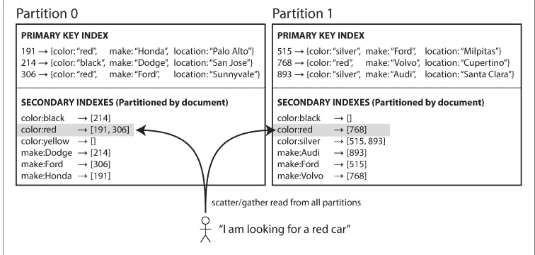

# 深入分区数据库

> 原文：<https://towardsdatascience.com/deep-into-partitioning-in-databases-b5e53197cae0?source=collection_archive---------29----------------------->

## 关于数据库中数据如何分区的所有内容

照片来自[https://unsplash.com/](https://unsplash.com/)

数据库是任何应用程序设计中不可或缺的一部分，在应用程序设计中，进程会写入和管理数据。尽管可能永远不需要从头开始设计数据库，但了解其设计以及不同数据库处理数据的方式将有助于您选择最合适的数据存储，从而提供所需的可伸缩性和性能。本文将详细介绍数据库如何处理数据分区。

# 什么是数据分区？

数据库中的数据被分成多个分区。每个分区都被定义为每个数据恰好驻留在一个分区中。一个节点可以包含多个分区。进行分区是为了确保可伸缩性，因为整个数据可能无法放入单个节点。不同的分区可以驻留在不同的节点上。每个节点都可以用自己的分区提供查询服务。这个过程也被称为**分片**。除了分区，每个分区还被复制到多个节点以确保可用性。

数据分区(来源:[微软文档](https://docs.microsoft.com/en-us/rest/api/storageservices/designing-a-scalable-partitioning-strategy-for-azure-table-storage)

# 倾斜的分区和热点

创建数据分区所遵循的技术可能会导致分区之间的负载分布不均匀。一些分区比其他分区提供更多的查询。这种不公平的划分被称为倾斜。在极端情况下，整个负载可以在单个分区 ie 上结束。5 个分区中有 4 个是空闲的。具有不成比例的高负载的分区被称为热点。这种分区效率较低，会导致节点间的负载分布不均匀。

# 数据分区的方法

我们将讨论三种不同的数据分区方法:

1.  随机分布
2.  按键范围分区
3.  通过键的散列进行分区

# 密钥的随机分布

一种简单的方法是将数据随机平均分配到不同的分区中。这将导致相等的数据分布，但是没有办法确定哪个键位于哪个分区。这将使阅读变得极其困难。

# 按键范围分区

另一种方法是将关键字划分为不同的范围，并将每个范围分配给一个分区。例如，值为 A–E 的键可以位于分区 1，F–K 位于分区 2，L–R 位于分区 3，依此类推。范围需要等间距。例如，具有关键字 F、G、H 的数据可以更少，并导致形成其中具有更多关键字的范围(F-K)。

按键分区(来源: [AWS 博客](https://aws.amazon.com/blogs/database/sharding-with-amazon-relational-database-service/)

这种方法的优点是数据在分区之间均匀分布，并简化了范围查询。但是这种方法的问题是它可能导致热点的形成。考虑一种情况，其中密钥依赖于时间戳。在这种情况下，所有的写流量都将移动到单个分区。

# 通过键的散列进行分区

另一种方法可以是计算密钥的散列，并且每个分区可以被分配一个散列范围。在这种情况下，一个好的散列函数不需要在加密方面很强，但应该均匀地分布数据。

通过范围键的散列进行分区(来源: [AWS 文档](https://docs.aws.amazon.com/amazondynamodb/latest/developerguide/HowItWorks.Partitions.html)

它将在不同的分区之间平均分配数据和负载，但是使得范围查询变得困难。

# 分区和辅助索引

辅助索引用于根据不同于主键的字段高效地查询数据。分区将如何解决二级索引上的查询？如果整个数据都驻留在一个分区中，那么为整个数据创建一个二级索引并使用它就很简单了。分区使辅助索引上的查询变得复杂。这种查询有两种方法:

1.  ***按文档划分二级索引(或本地索引)*** :这样每个分区维护自己的本地二级索引。查询作为分散和收集工作，即它需要从每个分区收集结果，然后合并它。

按文档划分二级索引(*来源:* [设计数据密集型应用](http://a-fwd.to/1AuRTAU))

*2。* ***按项划分二级索引(或全局索引)*** *:* 这里有一个覆盖全部数据的全局二级索引。对于每个键，它存储它所在的分区。由于单个节点可能无法容纳完整的索引，因此全局索引也可以划分到不同的节点中。例如，带有键 A-R 的索引可以驻留在节点 1 上，而驻留在节点 2 上。全局索引增加了写入延迟，但提供了更快的读取速度。

*按项目划分二级索引(来源:* [设计数据密集型应用](http://a-fwd.to/1AuRTAU)

# 重新平衡分区

随着时间的推移，数据可能会增长，查询类型可能会改变，或者需要替换、删除或添加一些节点。这种情况包括将数据从一个节点移动到另一个节点。重新平衡的要求是:

1.  重新平衡后，负载应该在节点间平均分配。
2.  在重新平衡时，数据库应该能够提供读写 ie。数据存储应该可用。
3.  不应在节点之间移动不必要的数据。

重新平衡可以自动完成，也可以手动完成。

# 再平衡战略

1.  *怎么不做*:为什么不通过 hash(key) mod N 给一个分区分配键，其中 N 是节点数？因为随着 N 的变化，它将需要大量的重新洗牌和分区移动。
2.  *固定分区数量:*决定分区数量。分区数量可以大于节点数量(N)。每个节点将包含许多分区。当删除或添加一个节点时，一些现有分区可以移动到新节点。
3.  *动态分区:*在固定分区的情况下，分区无法适应不断增长的数据量。在动态分区中，您可以决定分区的初始数量。随着分区大小随着数据的增加而增加，它会拆分以创建新的分区。同样，如果数据被删除，它也会收缩。拆分后，其中一个分区可以分配给不同的节点。
4.  *按节点比例划分:*在这种情况下，每个节点包含固定数量的分区。每个分区的大小与数据集的大小成比例增长。当添加一个新节点时，一些现有的分区被分成两半，一半被移动到新节点。分区边界是随机选取的，因此需要通过键的散列进行分区。

# 资源

要阅读更多关于数据库和应用程序设计的内容，我强烈推荐阅读 Martin Kleppmann 的“[设计数据密集型应用程序](http://a-fwd.to/1AuRTAU)”。

希望你喜欢这篇文章！