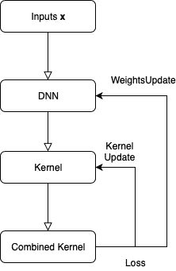
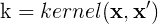
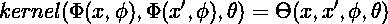
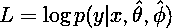
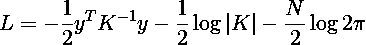

# 用于少镜头学习的深核和高斯过程

> 原文：<https://towardsdatascience.com/deep-kernels-and-gaussian-processes-for-few-shot-learning-38a4ac0b64db?source=collection_archive---------10----------------------->


缺少一个可靠的预测器

在这篇文章中，我们将对 Patacchiola 等人的论文 [*中的关键概念进行分解，并展示一个简单的关于少量拍摄图像回归任务的例子。本文假设了一些关于*](https://arxiv.org/abs/1910.05199)*[高斯过程](/quick-start-to-gaussian-process-regression-36d838810319)的背景知识，以及它们是如何在监督学习中使用的(比如获得后验分布和选择核函数)。我们将讨论少投学习的高层次方面，并对该方法进行总结，但不涉及太多的数学细节，这些可以在上面链接的论文中读到。*

链接到我的其他文章:

1.  [tensor flow 中的自定义损失函数](/custom-tensorflow-loss-functions-for-advanced-machine-learning-f13cdd1d188a)
2.  [Softmax 分类](/the-softmax-function-neural-net-outputs-as-probabilities-and-ensemble-classifiers-9bd94d75932)
3.  [气候分析](/analyzing-climate-patterns-with-self-organizing-maps-soms-8d4ef322705b)
4.  [曲棍球骚乱和极端值](https://medium.com/@hhl60492/black-swans-and-hockey-riots-extreme-value-analysis-and-generalized-extreme-value-distributions-d4b4b84cd374)

**简介**

少量学习(FSL)是学习理论和 ML 架构的一个领域，它专注于理解监督学习模型如何从少量训练样本中有效地学习和预测。FSL 的相关方面是优雅地获得预测的不确定性，并增加模型的鲁棒性和泛化能力。FSL 是一个重要的研究领域，因为很大一部分生产监督的机器学习系统，如特斯拉的自动驾驶仪，需要大量的数据和训练时间，以便至少在某种程度上是可靠的，即使这样也容易出现[重大泛化问题](https://www.forbes.com/sites/thomasbrewster/2019/04/01/hackers-use-little-stickers-to-trick-tesla-autopilot-into-the-wrong-lane/#64362c727c18)(因此我仍然喜欢驾驶自己的汽车)。与此相关的是，这些系统必须能够处理呈现给它们的信息的模糊性，并在它们的预测中给出不确定性的度量，以便在现实生活情况中是稳健的。


特斯拉新推出的 HW3 自动驾驶硬件系统。每个特斯拉“芯片”都集成了一个 GPU 和两个用于神经网络预测的特殊硬件加速器。此外，这次有更多的传感器，而不仅仅是摄像机，但同样的原理也适用于处理雷达和超声波回波的摄像机数据。

许多最受欢迎的监督学习模型，如深度神经网络(DNNs)和提升树，在训练样本数量少于数千个时，无法给出足够可靠的预测，更不用说数十个甚至一个样本了。从动物和人类学习的角度来看，少射学习来得相当自然。一个天真的动物(通常)不需要不止一次地吃一种有毒的水果来避免它和后来其他模糊相似的水果。然而，由于 [*没有免费的午餐*](https://en.wikipedia.org/wiki/No_free_lunch_theorem) ，某些 FSL 方法存在局限性，比如讽刺的是，当我们有大量样本时，正如我们将看到的。

[我的一篇早期文章](/custom-tensorflow-loss-functions-for-advanced-machine-learning-f13cdd1d188a)介绍了在 oldschool Tensoflow (TF 1.x)中实现的一个有趣的 FSL 架构，该架构利用了从高斯过程(GP)分类器模型到深度神经网络的*知识提炼*，其中来自 GP 和 DNN 的联合损失在 DNN 进行了优化，以便训练 DNN 从极少的训练样本中给出更现实的预测，这些预测反映了数据中的不确定性。2019 年底，Patacchiola 等人推出了一种新方法，该方法将深度神经网络和 GPs 的结合进行了进一步，也许更优雅。为简便起见，我们将他们的方法称为深度内核传输或 DKT。

DKT 方法的主要贡献是在少量回归和跨域分类(即，在不同数据集上训练分类器)方面优于 FSL 专业 DNNs 的性能。

**基本概念**

**简而言之，在预测阶段，DNN 获得我们希望 GP 拟合的(高维)输入，并对其应用非线性维度缩减，将其转换为低得多的维度表示。然后，将变换后的输出馈入 GP 核函数，并通过常规 GP 后验计算来计算后验。**

**在训练过程中，使用一个*证据* *损失*对 DNN 和 GP 核的参数进行联合优化，该损失是 GP 的联合对数边际概率或可能性*。*DNN 和 GP 各自通过采用(部分)梯度 w.r.t .获得其各自的相对于联合证据损失的损失，并通过合适的优化器进行更新(Adam 是作者的选择)。**



DKT 培训流程图

值得注意的是，DNN 和核仍然是分开的，即 DNN 不是整个核，也不能取代 GP 核的*形式*的选择(事实上，作者声明径向基核和谱核在他们的实验中表现良好)。DNN 的参数实际上是神经网络的权重，GP 核的参数是核函数中的参数(如 [RBF 核](https://en.wikipedia.org/wiki/Radial_basis_function_kernel)中的参数 *σ* )。

原则上，当处理 2D 图像或张量并计算 GP 后验时，这解决了高维计算难题。通过多类分类中不同类的几个示例或回归任务中的几个示例训练 DNN，允许 DKT 将 GP 的预测属性与 DNNs 的信息表示能力相结合。

**神经网络反馈协方差核**

核函数 k( **x，x’**)计算两个“点”之间的协方差，或一般的向量、矩阵或张量。这个核函数用于填充协方差矩阵 **K** 的元素，我们用它来计算 GP 中的后验分布。



然后，我们使用由其权重*参数化的 DNN**φ**将我们的训练数据前馈到由 ***θ*** *参数化的合适的内核**θ**。**

**

***经验贝叶斯近似***

**

*用参数的点估计逼近边际似然后的联合损失*

*拥有贝叶斯 GP 框架的好处在于，我们可以假设所有要拟合的参数和输入( ***φ，θ，* x** ) 在以目标输出为条件的一些高维空间中形成联合高斯分布。事实上，一般 GP 概念是贝叶斯推理的一个极好的例子。我们拥有作为输入和模型参数的先验数据，以及作为目标的证据数据，并且我们计算后验分布，该后验分布填充我们假设对数据进行建模的核函数的无限维空间希尔伯特空间。*

*然而，当试图计算预测中的全部后验概率时，出现了一些计算问题，因为需要变分推断方法来计算全部后验概率，并且会使计算变得难以进行。作者通过将参数集(由 hats 表示)固定为点估计值(在联合高斯公式中，参数集被假设为分布，与[贝叶斯神经网络](/making-your-neural-network-say-i-dont-know-bayesian-nns-using-pyro-and-pytorch-b1c24e6ab8cd)中的权重分布假设完全相同)来近似后验概率，并对对数联合边际似然性应用直接的最大似然估计，这被称为*经验贝叶斯*或 MLE II 型近似，因此边际似然性由上面的正则似然函数 *L* 近似。损失的[解析项由作者给出:](https://stats.stackexchange.com/questions/280105/log-marginal-likelihood-for-gaussian-process)*

**

*近似后损失的解析项*

*其中协方差矩阵 *K* 由核θ填充(吸收了高斯噪声参数)， *y* 是目标集合， *N* 是训练示例或跨域任务(例如，不同数据集)的数量。每组参数**和 *θ* 然后在它们各自对 *L* 的偏导数上得到更新。这种损失形式的好处在于，它自然地用-log|K|项进行了正则化，这不利于模型的复杂性。***

**所有这些要花多少钱？**

**可能和最高期权特斯拉 Cybertruck 一样多。从我收集的信息来看，训练一个 Convnet 的时间复杂度大约为 O(n⁵，计算损耗的矩阵求逆运算至少为 O(n)，因此有理由假设我们在训练 DKT 时至少有巨大的 O(n⁵) + O(n ) = O(n⁸的时间复杂度。当然，权衡的结果是在少量的学习中，你只需要很少的训练样本。然而，与此同时，全球定位系统的独特优势是预测本身的预测不确定性的可用性。人们将不得不训练大量的 dnn 或增强树，以获得类似的稳健的不确定性度量。**

****几个镜头影像回归****

**好吧，那么这个模型实际上做得有多好？让我们看看试图从一幅图像中的人脸预测人类年龄的问题…只有 98 幅图像可以用来训练。这些图片来自 https://github.com/JingchunCheng/All-Age-Faces-Dataset 的**

**为了简单起见，我们将调整图像的大小为 80x80 像素的固定大小，并将其下采样为只有一个颜色通道的灰度图像。我们还将使用一个简单的 RBF 内核，因为这对作者来说似乎工作得很好。回购情况如下:**

**[**https://github.com/hhl60492/deep-kernel-transfer**](https://github.com/hhl60492/deep-kernel-transfer)**

**一些实施注意事项:**

1.  **最初的 repo 使用 PyTorch 并启用了 CUDA，但是在我的 fork 中，CUDA 依赖性被移除了，因此没有 CUDA/GPU 支持的读者可以运行该模型**
2.  **修改了一些数据加载器脚本和张量的内部形状，以允许对 AAF 图像进行训练-在复杂的 ML 模型/管道中，将数据争论和处理抽象为单独的脚本，并尽可能模块化数据加载和训练/预测组件是一个好主意！**

****结果****

**GPNet 回归模型在 98 个随机选择的男性和女性 80×80 JPG 灰度图像上训练，以它们的年龄标签(来自图像文件名)作为目标，持续 100 个时期。发现将年龄目标标准化为[-1，1]对于给出有用的结果是必要的。一般来说，这是深度学习系统的一个大问题，因为必须仔细选择与网络中的激活函数(尤其是回归的输出节点)和损耗(参见[对数 RMSE 损耗](https://stats.stackexchange.com/questions/56658/how-do-you-interpret-rmsle-root-mean-squared-logarithmic-error))相对应的输入和目标归一化(或缺乏归一化)。**

**此外，在训练之前，没有对图像应用数据增强、对比度调整、去噪或其他处理方法，以证明该方法的稳健性。**

**在没有 GPU 的慢速 Core i5 笔记本电脑上，此培训只需不到几分钟的时间。一组 5 幅图像的选定测试结果如下:**

```
**Test image filelists/AAF/test/07896A10_gs.jpg **pred 13.78601193428039 95% CI[ -18.663501739501953 , 46.23552858829498 ] target: 9.999999403953552**Test image filelists/AAF/test/07275A76_gs.jpg **pred 68.74524354934692 95% CI[ 36.295726895332336 , 101.19476318359375 ] target: 75.99999904632568**Test image filelists/AAF/test/testA27_gs.jpg **pred 27.942177653312683 95% CI[ -4.507339000701904 , 60.39169430732727 ] target: 26.999999582767487**Test image filelists/AAF/test/07588A05_gs.jpg **pred 9.622436761856079 95% CI[ -22.82707691192627 , 42.07195341587067 ] target: 5.0000011920928955**Test image filelists/AAF/test/07455A02_gs.jpg **pred 7.124289870262146 95% CI[ -25.32522678375244 , 39.57380652427673 ] target: 2.000001072883606****
```

**结果非常好，绝对平均年龄误差只有 4.7 岁左右。此外，给出了置信区间(负区间值可以指示较年轻年龄的不确定性偏差)，因此确定性较低的预测具有较宽的区间，反之亦然。一些有趣的事情可以尝试，将旋转/扭曲的图像以及非人类的物体/脸给模型，看看测试结果是什么。同样，随着更多的训练时期，可以预期更好的结果和更小的置信区间。**

**总的来说，结果是在或超过人类水平的表现…毕竟，你能猜出在下面的测试集中的人的年龄吗？同样，你能估计出这个猜测 95%的置信区间吗？**

****

**一些测试图像。我的个人资料图片(testA27_gs.jpg)上的预测相当吓人。**

**最后注意:由于将 GP 映射到交叉熵损失之后，使用这种方法的少数镜头分类任务有点复杂，但公式在论文中，代码也包含在原作者的报告中。**

****结论****

**我们看到了 DKT 是如何组合在一起的，GPs 在预测方面的有趣之处，以及它们如何应用于少量学习中的问题。如果未来的安全关键型实时机器学习系统，如特斯拉的 autopilot 或竞争对手，结合了 GPs 的一些元素，以提高它们在各种现实世界环境中的鲁棒性，而不仅仅是白天沙漠中的一些空高速公路，我不会感到惊讶。一如既往，请随意回复这篇文章，祝数据科学快乐。**