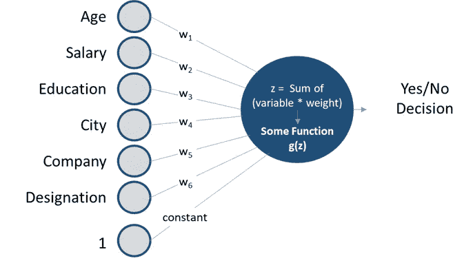
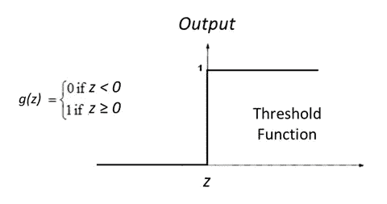
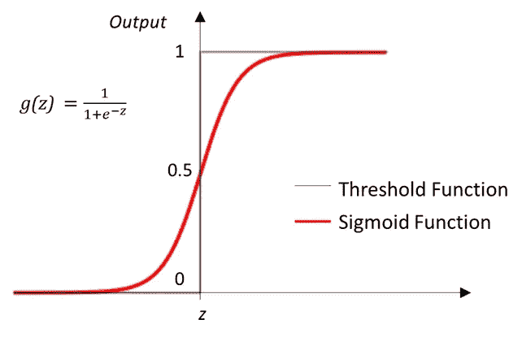
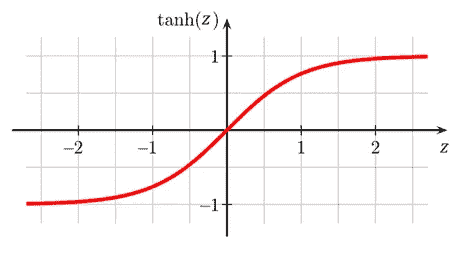
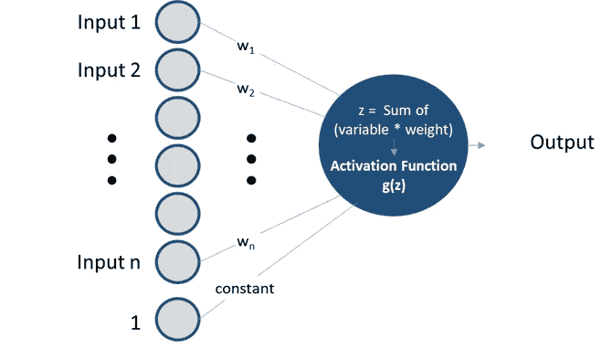
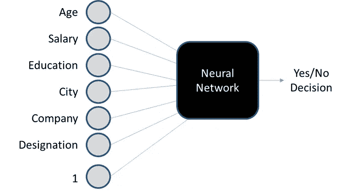
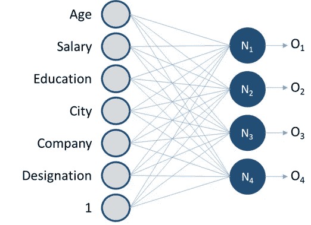
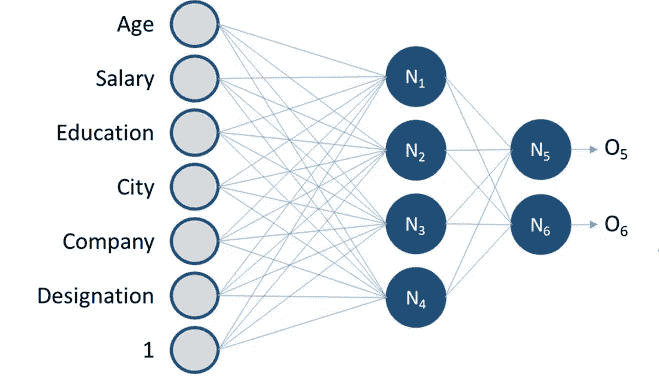
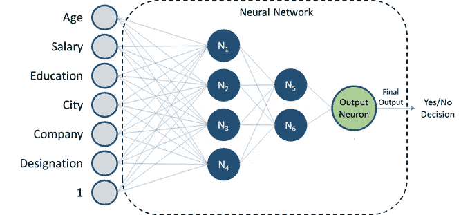
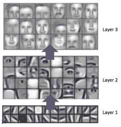

# 神经网络讲解—深度学习 101

> 原文：<https://towardsdatascience.com/deep-learning-101-neural-networks-explained-9fee25e8ccd3?source=collection_archive---------45----------------------->

## 人工神经网络的结构及其工作背后的直觉

过去几十年见证了渗透和计算能力的巨大繁荣，在这场信息革命中，人工智能从根本上改变了人们和企业做出决策的方式。这些前沿人工智能解决方案的海报男孩——深度学习和神经网络，尽管它们大肆宣传，但只有少数人理解。

在本文中，我将尝试解释什么是神经网络，它们是如何工作的，以及它们的优势和局限性。希望能让你相信，它们比想象的要简单得多。

> 注意:深度学习是机器学习的一个子集，如果你不确定它是如何工作的，我建议你先看看这篇文章。

在开始之前，让我们探索一个更简单的问题，建立一些基本概念。

# 逻辑回归

假设我们是一家信用卡公司，目标客户是没有足够信用记录的人。通过使用用户的历史数据，我们想要决定是否应该给新的申请人发放信用卡。

假设我们做出决策的数据如下。

年龄

薪水

教育

城市

公司

指定

> 注意:我意识到后 4 个是“定性”变量，但是对于这个例子，让我们假设我们可以以某种方式量化它们

最后的决定是“是”或“否”,从而使它成为一个分类问题。为了解决这个问题，我们将对我们的线性回归方法做一个小小的修改——在将变量乘以它们的权重(我们在线性回归中使用的斜率或系数的技术上正确的名称)并将它们相加(和常数)之后，结果可以是任何数字，并且为了将其转换为是/否决策，我们将必须进一步处理它，即通过一个函数传递它。

对于 *g* 的一个选择可以是简单的阈值函数:

即。如果变量和权重的和积是 z < 0，则判定为**否**，如果 Z > =0，则判定为**是**

然而，通常，我们可能需要结果的概率，而不是绝对的是或否，而且因为计算最佳权重的算法更适合平滑(或者用技术术语来说，可微分)函数，所以我们使用一种称为 sigmoid 的不同函数。

将所有这些联系在一起，对于新客户，我们可以输入不同的变量(年龄、工资等。)，将他们与权重的乘积求和，应用 sigmoid 函数，得到他有资格办卡的概率，这整个过程就叫逻辑回归。

# 激活功能

通过逻辑回归走弯路的原因是为了引入激活函数的概念。逻辑回归中使用的阈值或 sigmoid 函数是激活函数的例子。
任何应用于变量和权重的和积的函数(*注意，每个变量都有相应的权重*)被称为激活函数。除了上面讨论的阈值和 sigmoid 函数之外，其他一些常用的函数

## ReLU(整流线性单位):

*这意味着如果 Z 是正数，则原样返回，否则返回 0。*

## 双曲正切值:

*这是在 y 轴上向下拉伸的 sigmoid，因此它的中心在(0，0)而不是(0，0.5)*

这些函数及其微小的变化是神经网络中最常用的激活函数，原因超出了本文的范围。

# 神经网络简介

将上面讨论的逻辑回归单元推广到可变数量的输入，我们得到:

即。每个单元(也称为神经元)接收几个输入，输出一个数字。

> 注意:
> 对于逻辑回归示例，激活是 sigmoid 函数，输出是预测的概率。
> 在线性回归的情况下，没有激活函数(也称为线性激活函数，即。g(z) = z)，输出就是我们预测的数。

回到我们之前检查申请人的信用卡资格的例子。对于我们的分类任务，代替逻辑回归模型，我们可以创建神经网络来获得更好的结果。

为了创建神经网络，第一步只是将几个单元或神经元堆叠在一起以创建一层。

请注意，每个蓝色圆圈是一个处理单元(神经元)，它执行输入(年龄、工资、教育等)和权重的和积，并应用激活函数(比如 ReLU)来给出输出。每个神经元都有不同的权重集，并返回不同的输出。

现在，就像这一层，我们的输入是数据的变量(*年龄，工资，教育等*)，我们可以让这一层的输出( *O1，O2，O3，O4* )流入下一层作为它的输入。

我们可以继续像这样增加层。为了完成神经网络，我们添加了一个输出神经元，它将最后一层的输出作为其输入，并返回最终输出(对我们的用例来说是/否决定)。

恭喜你。我们的神经网络准备好了！

对于任何申请人，关于他们的输入变量的数据将进入第一层的 4 个神经元中的每一个。每个神经元将输出一个数字，这一组 4 个数字将作为第二层的输入，第二层的 2 个输出将被发送到最终输出神经元，最终输出神经元的功能就像逻辑回归一样，并返回我们对申请人资格的预测概率。

上面的每个蓝色或绿色圆圈是一个神经元，它们有各自的权重。这些权重必须由模型“学习”，只是线性回归中的线，其中模型学习什么斜率给出最接近训练数据的结果。这是通过称为反向传播和梯度下降的过程发生的，这超出了本文的范围。

但一旦我们“训练”了模型，即学习了所有神经元的最佳权重，输入数据被发送到神经网络，每个神经元将其输入和权重相乘，对总和应用激活并将其发送到下一层，直到我们有最终结果。

> 注意:通常，ReLU(或其变体之一)用作中间层中的激活，对于输出层，激活由手边的任务决定——线性(或无激活)用于回归任务，Sigmoid 用于分类。

# 隐藏层

蓝色层(输入和最终输出神经元之间的层)称为隐藏层。这些都是模型“深”的地方。没有这些，我们的模型将是一个简单的线性或逻辑回归。

那么添加隐藏层的整个过程的好处是什么，它们的输出意味着什么。

隐藏层神经元试图捕捉数据中的潜在模式，这将有助于模型预测个人的信誉。

例如，其中一个神经元可以推断他的收入是否足以支付他所在城市的平均生活费用。例如，另一个神经元可以关注公司和职位，以了解他们的工作保障；另一个神经元可以关注年龄、教育和职位，以了解他们的工作表现。其中一个人甚至可以关注候选人的年龄和教育资格，以推断他是否有可能继续深造，如果这被证明是信用卡公司决定他/她的资格的相关因素。

这些推论有助于 NN 对申请人的资格做出更好的决定。像候选人的薪水是否充足、工作保障、表现等方面的见解。将是比直接使用输入变量(*年龄、工资、教育等*)更好的判断他/她的资格的指标。

> 注意:一个神经元专注于某个变量仅仅意味着它对那个变量有更高的量级(正的或负的)权重。神经元将使用梯度下降算法自动调整它们的权重，以给出最接近它们被训练的数据的输出。

上面提到的推论只是神经元可能正在计算的例子。在现实中，检查神经网络(检查神经元的权重)，我们可能会发现一些模式，这些模式可能不符合我们对一般领域的理解，或者不能被人类直接解释，但已经被神经网络识别为与对给定数据进行预测相关。因此，神经网络也被称为**黑盒模型。**因为即使模型预测的准确度很高，但结果通常是不可解释的，也就是说，其用户甚至其开发者通常无法解释他们为什么会得到他们正在得到的结果。

处理图像的深度学习模型(卷积神经网络或 CNN)可以在一定程度上得到解释。

例如，在上面用于面部识别的 CNN 的表示([来源](https://ujjwalkarn.me/2016/08/11/intuitive-explanation-convnets/))中，我们可以看到，在第一层中，模型正在识别不同角度的直线和曲线。在第二层中，这些线条和曲线被组合起来以识别面部的不同部分，如眼睛、鼻子、嘴唇等。第三层使用这些部分来识别不同类型的脸。识别面部的最终结果将由这些不同类型的面部的加权和产生。

> 注意:层的数量和每层中神经元的数量被称为**超参数**，其期望值由数据科学家通过反复试验找到。不像权重，(又名**参数**，其最优值是通过微积分或其他数学方法找到的。

# 离别笔记

上面描述的 NN 是一种适合于结构化(或表格)数据的体系结构。对于非结构化数据，我们有不同的体系结构—卷积神经网络用于图像数据，递归神经网络用于文本、声音或其他顺序数据。在这些架构中，各层的结构有些不同，以便为它们的用例产生更好的结果。

希望这让你对什么是神经网络(NNs)和深度学习有了基本的了解，并且它没有看起来那么复杂。:)