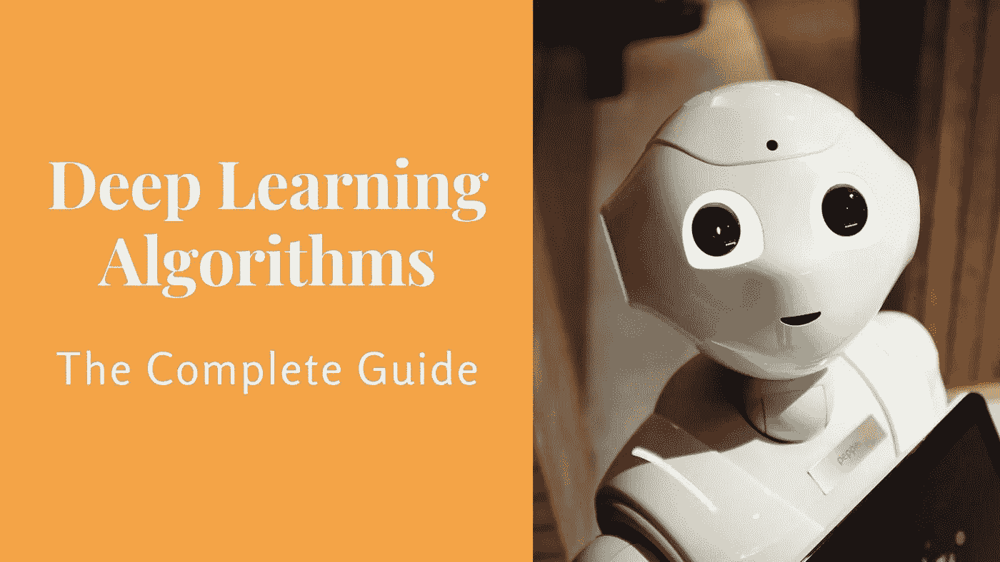
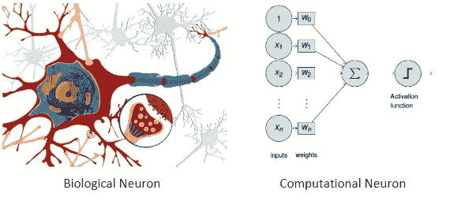
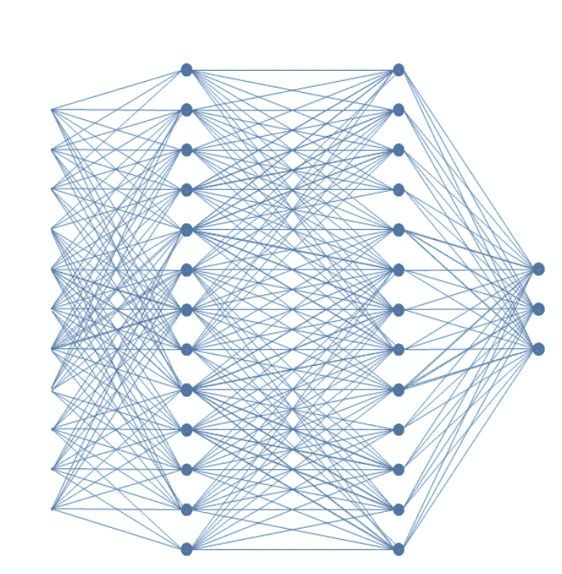
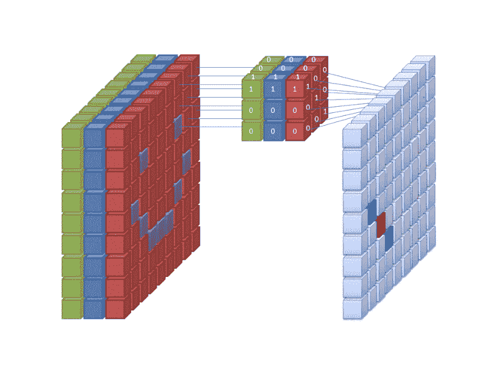
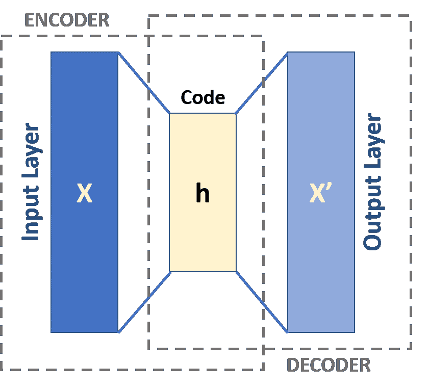
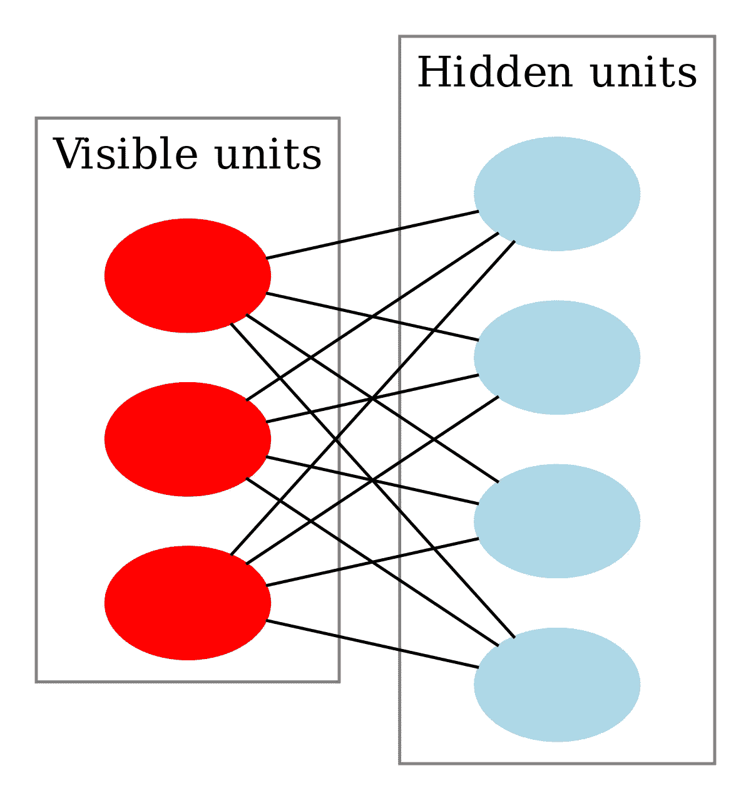

# 深度学习算法——完全指南

> 原文：<https://towardsdatascience.com/deep-learning-algorithms-the-complete-guide-e4e7c535b2fc?source=collection_archive---------15----------------------->

深度学习正在吞噬世界。

炒作始于 2012 年左右，当时一个神经网络在图像识别任务上实现了超人的性能，只有少数人能够预测将要发生的事情。

在过去的十年里，越来越多的算法变得可行。越来越多的公司开始在日常业务中添加它们。

在这里，我试图涵盖所有最重要的深度学习算法和架构，这些算法和架构是多年来为计算机视觉和自然语言处理等各种应用而构想的。

其中一些比另一些使用得更频繁，每一种都有自己的优点和缺点。

我的主要目标是让你对这个领域有一个大致的了解，并帮助你理解在每个特定的情况下你应该使用什么算法。因为我知道对于一个想从头开始的人来说这看起来很混乱。

但是在阅读完指南之后，我相信你将能够认识到什么是什么，并且你将准备好马上开始使用它们。

因此，如果你正在寻找一个真正完整的深度学习指南，让我们开始吧。

来源:theaisummer.com

深度学习在科学界和企业界越来越受欢迎。自 2012 年卷积神经网络在图像识别竞赛(ImageNet 大规模视觉识别挑战赛)中获得前所未有的准确性以来，[每年都有越来越多的研究论文问世](https://www.technologyreview.com/s/612768/we-analyzed-16625-papers-to-figure-out-where-ai-is-headed-next/)，越来越多的公司开始将神经网络融入他们的业务。据估计，深度学习目前是一个 25 亿美元的市场，预计到 2023 年将达到 181.6 亿美元。

# 但是什么是深度学习呢？

根据[维基百科](https://en.wikipedia.org/wiki/Deep_learning):“深度学习(也称为深度结构化学习或差分编程)是基于具有表示学习的人工神经网络的更广泛的机器学习方法家族的一部分。学习可以是有监督的、半监督的或无监督的”。

在我看来，**深度学习是一组受人脑处理数据和创建决策模式的工作方式启发的算法，是对称为人工神经网络**的单一模型架构的扩展和改进。

# 神经网络

就像人脑一样，[神经网络](http://karpathy.github.io/neuralnets/)由神经元组成。每个神经元接收信号作为输入，将它们乘以权重，求和并应用非线性函数。这些神经元一个挨着一个堆叠在一起，组织成层。

但是我们这样做能得到什么呢？

来源:维基共享

事实证明，神经网络是优秀的**函数逼近器。**

我们可以假设每一个行为和每一个系统最终都可以用一个数学函数来表示(有时是一个非常复杂的函数)。如果我们设法找到那个函数，我们就能从本质上理解这个系统的一切。但是找到这个函数非常困难。所以，我们需要估计一下。进入神经网络。

# 反向传播

神经网络能够使用大量数据和一种称为[反向传播](https://brilliant.org/wiki/backpropagation/)的迭代算法来学习所需的功能。我们向网络输入数据，它产生一个输出，我们将该输出与期望的输出进行比较(使用损失函数),然后根据差值重新调整权重。

并重复。并重复。使用称为[随机梯度下降](https://ruder.io/optimizing-gradient-descent/)的非线性优化技术进行权重调整。

过一段时间后，网络会变得非常擅长产生输出。因此，训练结束了。因此，我们设法逼近我们的函数。如果我们将一个未知输出的输入传递给网络，它会根据近似函数给出一个答案。

让我们用一个例子来说明这一点。假设出于某种原因，我们希望用树来标识图像。我们向网络输入任何类型的图像，它就会产生一个输出。因为我们知道图像实际上是否有树，所以我们可以将输出与我们的真实值进行比较，并调整网络。

随着我们传递的图像越来越多，网络犯的错误会越来越少。现在我们可以给它一个未知的图像，它会告诉我们图像中是否包含一棵树。很酷，对吧？

多年来，研究人员对最初的想法进行了惊人的改进。每一种新的体系结构都针对一个特定的问题，其中一种实现了更好的准确性和速度。我们可以将所有这些新模型分为特定的类别:

# 前馈神经网络(FNN)

前馈神经网络通常是[全连接](https://theaisummer.com/Neural_Network_from_scratch/)，这意味着一层中的每个神经元都与下一层中的所有其他神经元相连接。所描述的结构被称为多层感知器，起源于 1958 年。单层感知器只能学习线性分离模式，但多层感知器能够学习数据之间的非线性关系。

来源:维基百科常见

他们非常擅长分类和回归等任务。与其他机器学习算法相反，它们不那么容易收敛。他们拥有的数据越多，准确性就越高。

# 卷积神经网络(CNN)

卷积神经网络采用了一种称为[卷积](https://theaisummer.com/Neural_Network_from_scratch_part2/)的功能，其背后的概念是，我们不是将每个神经元与所有下一个神经元相连，而是仅将它与少数神经元(感受野)相连。

在某种程度上，他们试图正则化前馈网络以避免过度拟合(当模型只学习预先看到的数据而不能概括时)，这使得它们非常善于识别数据之间的空间关系。

来源:维基共享

这就是为什么他们的主要用例是计算机视觉和应用程序，如图像分类、视频识别、医学图像分析和[自动驾驶汽车](https://theaisummer.com/Self_driving_cars/)，在这些应用程序中，他们实现了真正的超人性能。

它们也非常适合与其他类型的模型(如递归网络和自动编码器)结合使用。一个这样的例子是[手语识别](https://theaisummer.com/Sign-Language-Recognition-with-PyTorch/)。

# 递归神经网络(RNN)

递归网络非常适合与时间相关的数据，它们用于时间序列预测。他们使用某种形式的反馈，将输出返回给输入。你可以把它想象成一个从输出到输入的循环，以便把信息传递回网络。因此，他们能够记住过去的数据，并在预测中使用这些信息。

为了获得更好的性能，研究人员已经将原始神经元改造成更复杂的结构，如 [GRU 单元](https://www.coursera.org/lecture/nlp-sequence-models/gated-recurrent-unit-gru-agZiL)和 [LSTM 单元](https://theaisummer.com/Bitcon_prediction_LSTM/)。LSTM 单元已经被广泛用于自然语言处理中的任务，例如语言翻译、语音生成、文本到语音合成。

来源:维基共享

# 递归神经网络

递归神经网络是另一种形式的递归网络，不同之处在于它们以树状形式构造。因此，他们可以在训练数据集中建模分层结构。

由于它们与二叉树、上下文和基于自然语言的解析器的联系，它们传统上用于 NLP 的应用中，如音频到文本的转录和情感分析。然而，它们往往比循环网络慢得多

# 自动编码器

[自动编码器](https://theaisummer.com/Autoencoder/)主要用作无监督算法，其主要用例是维度缩减和压缩。他们的诀窍是试图使输出等于输入。在其他工作中，他们试图重建数据。

它们由一个编码器和一个解码器组成。编码器接收输入，并在较低维度的潜在空间中对其进行编码。解码器获取该向量，并将其解码回原始输入。

来源:维基百科常见

这样，我们可以从网络的中间提取一个维数更少的输入表示。天才，对吧？

当然，我们可以用这个想法来复制相同但稍有不同甚至更好的数据(训练数据扩充、数据去噪等)

# 深度信念网络和受限玻尔兹曼机器

[受限玻尔兹曼机器](/restricted-boltzmann-machines-simplified-eab1e5878976)是具有生成能力的随机神经网络，因为它们能够学习其输入的概率分布。与其他网络不同，它们只包含输入和隐藏层(没有输出)。

在训练的前一部分，他们接受输入并产生一个表示。在后向传递中，他们从表示中重建原始输入。(与自动编码器完全一样，但在一个网络中)。

来源:维基共享

多个 RBM 可以叠加形成一个[深度信念网络](http://deeplearning.net/tutorial/DBN.html)。它们看起来完全像完全连接的层，但它们在训练方式上有所不同。这是因为它们按照 RBMs 的训练过程(如前所述)成对训练层

然而，dbn 和 RBM 已经被科学界抛弃，取而代之的是变化的自动编码器和 gan

# 生成对抗网络

gan 是由 Ian Goodfellow 在 2016 年推出的，它们基于一个简单而优雅的想法:你想要生成数据，比如说图像。你是做什么的？

你建立两个模型。你训练第一个生成假数据(生成器)，第二个辨别真假(鉴别器)。你让他们互相竞争。

生成器在图像生成方面变得越来越好，因为它的最终目标是欺骗鉴别器。鉴别器变得越来越擅长区分真假图像，因为它的目标是不被愚弄。结果是我们现在有了来自鉴别器的难以置信的真实的假数据。

生成性对抗网络的应用包括视频游戏、天文图像、室内设计、时尚。基本上，如果你的领域中有图像，你可以潜在地使用 GANs。Oooh，你还记得深度假货吗？是啊，那都是甘斯做的。

# 变形金刚(电影名)

变压器也是非常新的，它们主要用于语言应用，因为它们开始使循环网络过时。他们基于一种叫做注意力的概念，这种概念被用来迫使网络专注于一个特定的数据点。

你不用过于复杂的 LSTM 单位，而是使用注意力机制来根据重要性衡量输入的不同部分。[注意力机制](https://lilianweng.github.io/lil-log/2018/06/24/attention-attention.html)只不过是另一层权重，其唯一目的是调整权重，使输入片段优先，而其他片段不优先。

事实上，转换器由许多堆叠的编码器(形成编码器层)、许多堆叠的解码器(解码器层)和一堆关注层(自我关注和编码器-解码器关注)组成

转换器被设计为处理有序的数据序列，例如自然语言，用于各种任务，例如机器翻译和文本摘要。如今，BERT 和 GPT-2 是两个最著名的预训练自然语言系统，用于各种 NLP 任务，它们都基于 Transformers。

# 图形神经网络

非结构化数据通常不太适合深度学习。在许多真实世界的应用程序中，数据是非结构化的，并以图形格式组织。想想社交网络、化合物、知识图表、空间数据。

[图形神经网络](https://theaisummer.com/Graph_Neural_Networks/)的目的是对图形数据进行建模，这意味着它们识别图形中节点之间的关系，并生成图形的数字表示。就像嵌入一样。因此，它们可以在任何其他机器学习模型中用于各种任务，如聚类、分类等。

# 自然语言处理中的深度学习

# 单词嵌入

单词嵌入是单词到数字向量的表示，以某种方式捕获它们之间的语义和句法相似性。这是必要的，因为神经网络只能从数字数据中学习，所以我们必须找到一种方法将单词和文本编码成数字。

*   [Word2Vec](https://pathmind.com/wiki/word2vec) 是最流行的技术，它试图通过基于上下文预测单词(CBOW **)** 或基于单词预测周围的单词(Skip-Gram)来学习嵌入。Word2Vec 只不过是一个简单的两层神经网络，以单词作为输入和输出。单词以一键编码的形式输入到神经网络中。
*   在 CBOW 的情况下，输入是相邻的字，输出是想要的字。在 Skip-Gram 的情况下，情况正好相反。
*   [Glove](https://medium.com/@jonathan_hui/nlp-word-embedding-glove-5e7f523999f6) 是另一个扩展 Word2Vec 思想的模型，它将 word 2 vec 与潜在语义分析等矩阵分解技术相结合，这些技术被证明是非常好的全局文本统计，但无法捕捉局部上下文。所以这两者的结合给了我们两个世界最好的东西。
*   脸书的 FastText 使用了一种不同的方法，用字符级的表示代替单词。
*   **上下文单词嵌入**用递归神经网络代替 Word2Vec，在给定句子中的当前单词的情况下，预测下一个单词。这样，我们可以捕捉单词之间的长期依赖关系，每个向量都包含当前单词和过去单词的信息。最著名的版本叫做 [ELMo](https://allennlp.org/elmo) ，它由两层双向 LSTM 网络组成。
*   [注意力机制](https://blog.floydhub.com/attention-mechanism/)和变形金刚正在让 RNN 过时(如前所述)，通过加权最相关的单词，忘记不重要的单词。

# 序列建模

序列模型是自然语言处理的一个组成部分，因为它出现在许多常见的应用程序中，如[机器翻译](https://www.tensorflow.org/tutorials/text/nmt_with_attention)，语音识别，自动完成和情感分类。序列模型能够处理一系列输入或事件，例如单词文档。

例如，假设你想把一个句子从英语翻译成法语。

为此，您需要一个[序列到序列模型(seq2sec)](https://blog.keras.io/a-ten-minute-introduction-to-sequence-to-sequence-learning-in-keras.html) 。Seq2sec 型号包括一个编码器和一个解码器。编码器获取序列(英语句子)并产生输出，即输入在潜在空间中的表示。这个表示被馈送到解码器，解码器给我们新的序列(法语句子)。

编码器和解码器最常见的架构是递归神经网络(主要是 LSTMs ),因为它们在捕捉长期依赖性和转换器方面表现出色，往往更快、更容易并行化。有时，它们也与卷积网络结合使用，以获得更高的精度。

[伯特](https://github.com/google-research/bert)和 [GPT-2](https://openai.com/blog/better-language-models/) 被认为是两个最好的语言模型，他们实际上是基于转换器的序列模型。

# 计算机视觉中的深度学习

来源:维基共享

# 定位和目标检测

[图像定位](https://theaisummer.com/Localization_and_Object_Detection/)的任务是定位图像中的对象，并用边界框标记它们，而对象检测也包括对象的分类。

这些相互关联的任务是由计算机视觉中一个叫做 R-CNN 的基本模型(及其改进)来处理的。RCNN 及其前身快速 RCNN 和快速 RCNN 利用了区域建议和卷积神经网络。

外部系统或网络本身(在更快的 RCNN 的情况下)以固定大小的盒子的形式提出一些感兴趣的区域，该盒子可能包含对象。这些框通过 CNN(如 AlexNet)进行分类和校正，CNN 决定框中是否包含对象，对象是什么，并确定边界框的尺寸。

# 单发探测器

单发探测器和它最著名的成员 [YOLO(你只看一次)](https://theaisummer.com/YOLO/)放弃区域提议的想法，他们使用一组预定义的盒子。

这些框被转发给 CNN，CNN 为每个框预测一定数量的具有置信度得分的边界框，它检测位于其中的一个对象，并将该对象分类到一个类别中。最后，我们只保留得分高的包围盒。

多年来，YOLOv2、YOLOv3 和 YOLO900 在速度和精度上都比最初的想法有所改进。

# 语义分割

计算机视觉中的一个基本任务是基于图像中所有像素的上下文将其分类，也称为语义分割。在这个方向，全卷积网络(FCN)和 U-网是两个最广泛使用的模型。

*   **全卷积网络(FCN)** 是一种具有一个卷积和一个去卷积网络的编码器-解码器架构。编码器对图像进行下采样以捕获语义和上下文信息，而解码器进行上采样以检索空间信息。这样，我们就能以尽可能小的时间和空间复杂度来检索图像的上下文。
*   **U 网**基于跳跃连接的巧妙想法。它们的编码器具有与解码器相同的大小，并且跳跃连接将信息从第一个传输到后者，以便增加最终输出的分辨率。

# 姿态估计

[姿态估计](https://theaisummer.com/Human-Pose-Estimation/)是在图像和视频中定位人体关节的问题，它可以是 2D 或 3D。在 2D，我们估计每个关节的(x，y)坐标，而在 3D 中是(x，y，z)坐标。

[PoseNet](https://github.com/tensorflow/tfjs-models/tree/master/posenet) 在该领域占据主导地位(它是大多数智能手机应用程序的首选模型),它使用卷积神经网络(没想到会这样，是吧？).我们将图像输入 CNN，然后使用单姿态或多姿态算法来检测姿态。每个姿势都与一个置信度得分和一些关键点坐标相关联。最后，我们保留置信度最高的那些。

# 包扎

这就是了。当时所有必不可少的深度学习算法。

当然，我不能包括所有已发表的架构，因为它们实际上成千上万。但是它们中的大多数都是基于这些基本模型中的一个，并用不同的技术和技巧对其进行改进。

我也相信我需要很快更新这个指南，因为在我们说话的时候新的论文就要出来了。但这就是深度学习的美妙之处。新突破的空间如此之大，以至于有点可怕。

现在轮到你了。去用这些算法构建你自己的令人惊奇的应用程序吧。或者甚至创建一个新的，会在我们的列表中出现。为什么不呢？

玩得开心，继续学 AI。

*原载于 2020 年 2 月 26 日 https://theaisummer.com***。**