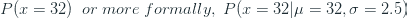

# 深度学习和信息论

> 原文：<https://towardsdatascience.com/deep-learning-and-information-theory-e953e78fbb06?source=collection_archive---------31----------------------->

付费墙是否困扰着你？点击 [*这里*](/deep-learning-and-information-theory-e953e78fbb06?source=friends_link&sk=edd2b0a3807d9753a49f9a780208d930) *可以绕过去。*

试图建立对信息论概念的直觉和数学理解，以及如何将其应用于深度学习

如果你试图理解机器学习背后的数学，包括深度学习，你会遇到信息论的主题——熵、交叉熵、KL 散度等。信息论的概念在机器学习领域一直很流行，从决策树的分裂标准到生成对抗网络中的损失函数。

如果你是机器学习的初学者，你可能没有努力去深入理解“*背后的数学。fit()* ”，但随着你的成熟和遇到越来越复杂的问题，理解数学或至少数学背后的直觉变得至关重要，以便在正确的地方有效地应用正确的技术。

当我开始的时候，我也犯了同样的错误。我会将“交叉分类熵”视为神经网络中的损失函数，我认为这是理所当然的——这是一种适用于多类标签的神奇损失函数。我将“熵”视为决策树中的一个分裂标准，我只是在不了解它是什么的情况下进行实验。但是随着我的成熟，我决定花更多的时间去理解基础知识，这极大地帮助了我获得正确的直觉。这也有助于理解流行的深度学习框架 PyTorch 和 Tensorflow 实现不同损失函数的不同方式，并决定何时使用什么。

这篇博客是我总结我对信息论的基本概念的理解，以及不同深度学习框架的实现如何不同。我试图解释的每一个概念都以介绍和加强直觉的方式开始，然后提供与之相关的数学作为奖励。我总是发现没有什么比数学更能理清思路了。

# 信息论

在 20 世纪早期，全世界的计算机科学家和数学家都面临着一个问题。如何量化信息？我们来考虑下面的两句话:

*   明天会下雨
*   明天会下大雨

作为人类，我们直觉地理解这两个句子传递了不同的信息量。第二个比第一个信息量大得多。但是，如何量化呢？你如何用数学语言来表达？

克劳德·e·香农(Claude E. Shannon)带着他的开创性论文《沟通的数学理论》(A Mathematical Theory of Communication)[1]进入了我们的讨论。香农介绍了作为统计过程的交流的定性和定量模型。在许多其他的想法和概念中，他引入了信息熵和“比特”的概念，比特是信息测量的基本单位。

信息论非常庞大，但是我将尝试用一个简短的术语表来总结关键的信息。

*   *信息*被认为是要通过称为*信道*的介质传输的符号序列。
*   *熵*是在给定一些符号分布知识的情况下，一串符号中的不确定量。
*   *Bit* 是一个信息单位，或者一个符号序列。
*   传递 1 比特的信息意味着将接收者的不确定性减少 2

# 熵

让我们举一个例子，用它来阐明熵背后的直觉。无处不在的“盒子里的球”的例子和任何例子一样好。

有一个装有 100 个球的盒子，这些球有四种不同的颜色——蓝色、红色、绿色和黄色。让我们假设盒子里每种颜色有 25 个球。一个*发送器*从容器中随机拾取一个球，并将该信息发送给一个*接收器*。对于我们的例子，让我们假设发射机在印度，接收机在澳大利亚。让我们假设我们处于 20 世纪早期，那时电报是远距离通讯的主要方式之一。电报信息的问题在于，它们是按字数收费的，所以如果你有预算，你需要小心你发送的内容(这可能现在看起来不重要，但我向你保证它会的)。这只是给公式增加了一个限制——你不能通过电报发送真正的单词“blue”。英语没有 26 个符号，只有两个符号——0 和 1。

现在，让我们看看我们将如何对这四个响应进行编码。我相信你们都知道二进制数字系统。因此，如果我们有四个结果，我们可以使用长度为 2 的代码得到唯一的代码。我们用它来为我们的四个结果分配一个代码。这是固定长度编码。

另一种思考方式是减少不确定性。我们知道这四种结果的可能性都是相等的(各有 1/4 的概率)。当我们传递关于捡球颜色的信息时，不确定性减少了 4。我们知道 1 位可以减少 2 倍的不确定性，要减少 4 倍的不确定性，我们需要两位。

从数学上讲，如果我们使用的代码中有 m 个符号，我们将需要 log₂M 位来编码信息。

我们用来发送信息的平均位数是多少？

**平均值和期望值**

什么是平均值？在概率的世界里，平均值是概率分布的期望值。

期望值也可以这样想:如果我们从盒子中随机挑选一个球 1000 次，记录对该消息进行编码所需的比特长度，并取所有这 1000 个条目的平均值，您将得到比特长度的期望值。

如果所有结果的可能性相等，P(x) = 1/N，其中 N 是可能结果的数量。在这种情况下，期望值变成了一个简单的平均值。

让我们稍微改变一下示例的设置。现在我们有 25 个蓝色球、50 个红色球、13 个绿色球和 12 个黄色球，而不是相同数量的彩色球。这个例子更好地解释了其余的概念，因为现在你知道概率分布的期望值是什么，我们可以遵循这个惯例。

期望值不会改变，因为无论选择哪个球，使用的位数仍然是 2。

但是，当前的编码方案是最佳的吗？这就是可变长度编码发挥作用的地方。让我们来看看三种不同的可变编码方案。

现在我们知道了如何计算位长的期望值，让我们来计算三种方案的期望值。比特长度最小的应该是最经济的吧？

**编码方案 1:**

我们对蓝色和红色使用 1 位，对绿色和黄色各使用 2 位。

**编码方案二:**

我们对蓝色使用 1 位，对红色使用 2 位，对绿色和黄色各使用 3 位。

**编码方案 3:**

我们对蓝色使用 2 位，对红色使用 1 位，对绿色和黄色各使用 3 位。

编码方案 1 是显而易见的选择，对吗？这就是变长编码变得棘手的地方。如果我们从盒子里拿起一个球，它是蓝色的。因此，我们将“0”作为消息发送到澳大利亚。在澳大利亚有机会阅读这个信息之前，我们选择了另一个球，它是绿色的。所以我们把“10”送到澳大利亚。现在，当澳大利亚查看消息队列时，他们会在那里看到“010”。如果是固定长度的代码，我们就会知道每隔 *n 个*符号就有一个断点。但是，如果没有这一点，“010”可以解释为蓝色，绿色或蓝色，红色，蓝色。这就是为什么一个代码应该是*唯一可解码的*。如果两个不同的符号串从未产生相同的编码位串，则称一个码是唯一可解码的。这导致了这样一种情况，即每添加一个额外的符号，就必须放弃一些代码。克里斯·奥拉有一个很棒的博客来解释这个概念。

这给我们留下了编码方案 2 和 3。两者都是*唯一可解码的*。它们之间的唯一区别是，在方案 2 中，我们对蓝色使用 1 位，对红色使用 2 位。方案 2 是相反的。我们知道从盒子里得到红球的可能性比蓝球大得多。因此，对红球使用较小的长度是有意义的，这就是为什么方案 3 的比特长度的期望值低于方案 2 的原因。

现在你可能想知道为什么我们如此关心比特的预期长度。最佳可能编码方案的这种预期比特长度被称为 ***香农熵*** 或简称为**熵**。只有一部分是不完整的。对于给定的问题，如何计算最佳位数？

简单的答案是-log₂p(x).

并将其扩展到整个概率分布 *P* ，我们取期望值:

在我们的例子中，结果是:

对于那些有兴趣知道我们是如何得出这个公式的人，请继续阅读。

# 数学

虽然直觉有助于获得想法，但你无法真正衡量它。每次遇到新问题，都不能拿着纸和笔坐下来，想出最佳编码方案再计算熵。这就是数学的用武之地。

唯一可解码码的特性之一是前缀特性。任何代码字都不应该是另一个代码字的前缀。这意味着，每当您选择一个长度较短的代码时，您就放弃了以该代码为前缀的所有可能的代码。如果我们把 01 作为一个代码，我们不能使用 011 或 01001 等。因此，选择每个代码会产生成本。引用克里斯·奥拉的博客:

> *买一个长度为 0 的码字的成本是 1，所有可能的码字——如果你想拥有一个长度为 0 的码字，你就不能拥有任何其他的码字。像“0”一样，长度为 1 的码字的成本是 1/2，因为一半可能的码字以“0”开始。像“01”一样，长度为 2 的码字的成本是 1/4，因为所有可能的码字的四分之一以“01”开始。一般来说，码字的成本随着码字的长度呈指数*下降*。*
> 
> [*克里斯·奥拉的博客*](https://colah.github.io/posts/2015-09-Visual-Information/#optimal-encodings)*【2】*

成本可以量化为

其中 L 是消息的长度。反过来，我们得到:

现在，成本是多少？我们的花费与需要编码的特定结果成正比。所以我们为一个特定的变量 x 花费 P(x)，因此成本= P(x)。(为了更好地了解这一成本，请阅读克里斯·奥拉的博客文章 [2])

# 交叉熵

在我们的例子中，现在澳大利亚也有一个盒子，里面有同样的四个彩色球。但是球的分布是不同的，如下所示(用 *q* 表示)

现在澳大利亚想做和印度一样的实验，并发回他们选择的球的颜色。他们决定使用先前设置的相同编码方案来进行通信。

因为编码方案是从源分布中导出的，所以每个结果的比特长度与以前相同。例如。

但是不同信息的使用频率发生了变化。因此，现在澳大利亚抽出的球的颜色将有 50%的时间是绿色的，以此类推。我们为第一个用例(印度到澳大利亚)推导出的编码方案并未针对第二个用例(澳大利亚到印度)进行优化。

这就是交叉熵，它可以正式定义为:

其中 p(x)是用于提出编码方案的分布的概率，q(x)是使用它们的分布的概率。

交叉熵总是等于或大于熵。在最好的情况下，源和目的地分布完全相同，在这种情况下，交叉熵变成熵，因为我们可以用 p(x)代替 q(x)。用机器学习的术语来说，我们可以说预测分布是 p(x)，地面真值分布是 q(x)。因此，预测分布和真实分布越相似，熵和交叉熵就越接近。

# 库尔贝克-莱布勒散度

既然我们已经理解了熵和交叉熵，我们就可以理解另一个名字很吓人的概念了。这个名字太吓人了，甚至从业者都称之为 KL 散度，而不是实际的 Kullback-Leibler 散度。这个来自信息论深处的怪物是一个非常简单易懂的概念。

KL 背离衡量一个分布与另一个分布的背离程度。在我们的例子中，我们使用用于从印度到澳大利亚的通信的编码方案来进行反向通信。在机器学习中，这可以被认为是试图用预测分布(q)来逼近真实分布(p)。但是这样做，我们花费了比发送消息所需更多的比特。或者，我们有一些损失，因为我们用 q 逼近 p，这种信息的损失叫做 KL 散度。

KL 散度的两个关键性质值得注意:

1.  KL 散度是非负的。即它总是零或正数。
2.  KL 散度是非对称的。即从 p 到 q 的 KL 散度不等于 q 到 p 的 KL 散度。正因为如此，它不是严格意义上的距离。

KL(P||Q)可以用以下方式解释:

*   从 Q 到 P 的背离
*   P 相对于 Q 的相对熵
*   Q 有多接近 P

# 数学

让我们看看我们是如何得出公式的，这将增强我们对 KL 散度的理解。

从直觉上我们知道 KL(P||Q)是用 Q 逼近 P 时丢失的信息，那会是什么呢？

只是重述一下我们的示例与 ML 系统的类比，以帮助您更好地连接这些点。让我们利用澳大利亚向印度发送消息的情况，使用为从印度到澳大利亚的消息设计的相同编码方案。

*   带球盒子(在印度和澳大利亚)是概率分布
*   当我们准备一个机器学习模型(分类或回归)时，我们所做的是逼近一个概率分布，并且在大多数情况下输出概率分布的期望值。
*   基于概率分布设计编码方案就像准备一个模型来输出该分布。
*   在印度有球的盒子是预测的分布，因为这是我们在设计编码方案时假设的分布。
*   在澳大利亚有球的盒子是真正的发行版，因为这是使用编码方案的地方。

当我们在澳大利亚使用编码方案时，我们知道比特的期望值。就是 *Q* w.r.t. *P* 的交叉熵(其中 P 是预测分布，Q 是真实分布)。

现在，有一些低效率，因为我们使用的是为另一种概率分布设计的编码方案。这里的理想案例是什么？预测分布等于真实分布。这意味着如果我们使用为 Q 设计的编码方案来发送信息。这就是 q 的熵。

因为我们有实际的交叉熵和理想熵，所以由于编码方案而丢失的信息是

这也应该给你一些直觉，为什么这个指标是不对称的。

*注意:我们已经讨论了整个博客，假设随机变量 X 是一个离散变量。如果它是一个连续变量，只需将∑替换为∫，公式就会再次生效。*

# 深度学习的应用

损失函数是深度学习系统的核心。我们传播以调整权重的梯度源自这个损失函数。分类问题中最流行的损失函数来自信息论，特别是熵。

# 分类交叉熵损失

在 N 向分类问题中，神经网络通常有 N 个输出节点(二进制分类除外，它只有一个节点)。这些节点的输出也称为逻辑。*逻辑是在我们应用激活*之前神经网络的实值输出。如果我们通过 softmax 层传递这些逻辑，输出将被转换成类似于样本是该特定类的概率(统计学家现在会在坟墓里翻来翻去)。

本质上，softmax 将原始逻辑转换为概率。因为我们现在有了概率，我们可以像之前回顾的那样计算交叉熵。

用机器学习的术语来说，交叉熵公式是:

其中 N 是样本数，C 是类别数，y 是真实概率，y_hat 是预测概率。在典型的情况下，y 将是目标标签的独热码表示(到处都是零，一个表示正确的标签)。

## 交叉熵和对数似然

**概率与可能性**

在非技术术语中，可能性和概率可以互换使用。但在统计学中，以及通过扩展机器学习，它有不同的意义。简而言之，概率是指我们谈论结果的时候，而可能性是指假设。

让我们以正态分布为例，均值为 30，标准差为 2.5。我们可以从分布中找到抽取值为 32 的概率。

现在让我们颠倒一下情况，考虑我们不知道基本的分布。我们只有从分布中得到的观察值。在这种情况下，我们仍然可以像假设特定分布之前一样计算概率。

现在我们正在寻找一个特定的观察结果被假定的参数所描述的可能性。当我们最大化这种可能性时，我们会得到最适合抽取样本的参数。这是可能性。

总结一下:

在机器学习中，由于我们试图从数据中估计潜在的分布，我们总是试图最大化可能性，这被称为**最大似然估计**。在实践中，我们最大化对数似然，而不是似然。

**数学**

其中 N 是样本数，f 是一个函数，它给出了给定协变量 x 和参数时 y 的概率。

当我们处理上述乘积项时，有两个困难:

*   从数学的角度来看，当它是求和的时候，积分和导数更容易处理
*   从计算机科学的角度来看，将许多小数字相乘会产生非常小的数字，从而导致算术下溢

这就是对数可能性发挥作用的地方。如果我们应用对数函数，乘积就变成了总和。并且由于对数是单调变换，最大化对数似然性也将最大化似然性。因此，为了方便起见，我们几乎总是最大化对数似然，而不是纯似然。

**交叉熵=对数似然**

让我们将 *q* 视为真实分布，将 *p* 视为预测分布。 *y* 是样本的目标， *x* 是输入特征。

基本事实分布通常是可能标签上的一个热点表示。

对于 yᵢ的 xᵢ样本，交叉熵为:

其中 *Y* 是所有标签的集合

q(y|xᵢ项)对于 y 中除 yᵢ之外的所有元素都是 0，对于 yᵢ.是 1 所以这个术语简化为:

其中 yᵢ是样品的正确标签。

现在对所有 N 个样本求和，

也就是对数似然的负值。所以最大化对数似然相当于最小化交叉熵。

# 二元交叉熵损失

在二元分类中，神经网络只有一个输出，通常通过一个 sigmoid 层。如下所示的 sigmoid 图层将逻辑值压缩为 0 到 1 之间的值。

因此，s 形图层的输出相当于事件的概率。因此，如果我们有两个类，0 和 1，随着网络关于样本为“1”的置信度增加，sigmoid 层的输出也变得更接近 1，反之亦然。

二元交叉熵(BCE)是专门为二元分类定制的损失函数。让我们从公式开始，然后试着将它与我们目前所学的内容进行对比。

虽然这个公式乍一看可能不熟悉，但这只是我们前面提到的交叉熵的一个特例。与多类输出不同，我们只有一个介于 0 和 1 之间的输出。因此，为了应用交叉熵公式，我们综合创建两个输出节点，一个具有 *y* ，另一个具有 *1-y* (根据概率定律，我们知道在二元结果中，概率总和为 1)，并对所有结果的交叉熵求和。

# 库尔巴克-莱布勒发散损失

我们知道 KL 散度是不对称的。如果 *p* 是预测分布， *q* 是真实分布，有两种方法可以计算 KL 散度。

项目 1

项目 2

第一个叫做 KL 向前发散。它给出了预测值偏离真实分布的程度。第二个叫做后向 KL 散度。它给出了真实分布与预测分布的偏离程度。

在监督学习中，我们使用前向 KL 散度，因为可以证明最大化前向 KL 散度相当于最大化交叉熵(我们将在数学部分详述)，并且交叉熵更容易计算。由于这个原因，交叉熵在最简单的用例中比 KL 散度更可取。变分自动编码器和 GANs 是 KL 散度再次变得有用的几个领域。

当前向 KL 对均值做同样的事情时，后向 KL 散度用于强化学习并鼓励优化以找到分布的模式。关于 KL 前向和后向背离的更多细节，请阅读 Dibya Ghosh 的博客文章

## 数学

我们知道 KL 散度是交叉熵和熵的差。

因此，N 个样本的交叉熵损失为:

现在，优化目标是通过改变参数化预测分布 *p* 的参数来最小化这种损失。因为 H(q)是真实分布的熵，与参数无关，所以可以认为它是一个常数。优化时，我们知道常数是不重要的，可以忽略不计。所以损失变成了:

总之，我们从交叉熵损失开始，证明了最小化交叉熵等同于最小化 KL 散度。

# 在流行的深度学习框架中实现

这些损失在 PyTorch 和 Tensorflow 等流行的深度学习框架中的实现方式有点混乱。PyTorch 尤其如此。

PyTorch

*   [binary_cross_entropy](https://pytorch.org/docs/stable/nn.functional.html#binary-cross-entropy) —这要求在计算损失之前，逻辑值通过一个 sigmoid 层
*   [binary _ cross _ entropy _ with _ logits](https://pytorch.org/docs/stable/nn.functional.html#binary-cross-entropy-with-logits)—这要求将原始输出或 logits 传递给 loss。损耗实现在内部应用一个 sigmoid
*   [cross_entropy](https://pytorch.org/docs/stable/nn.functional.html#cross-entropy) —它期望 logits 作为输入，并在计算熵损失之前应用 softmax(技术上是 log softmax)
*   [nll_loss](https://pytorch.org/docs/stable/nn.functional.html#nll-loss) —这是简单的负对数似然损失。这要求在计算损失之前，logits 通过 softmax 层
*   [KL _ div](https://pytorch.org/docs/stable/nn.functional.html#kl-div)-这期望在计算损失之前，逻辑通过 softmax 层

Tensorflow 2.0 / Keras

默认情况下，所有 Tensorflow 2.0 亏损都将概率作为输入，即 logits 在输入亏损之前要通过 Sigmoid 或 Softmax。但是它们提供了一个参数 *from_logits* ，该参数被设置为 *True* 将接受 logits 并转换为内部概率。

*   [二元交叉熵](https://www.tensorflow.org/api_docs/python/tf/keras/losses/BinaryCrossentropy?version=stable) —计算 a *y_true* 和 *y_pred* 的 BCE 损失。 *y_true* 和 *y_pred* 是一维张量——每个样本一个值。
*   [CategoricalCrossentropy](https://www.tensorflow.org/api_docs/python/tf/keras/losses/CategoricalCrossentropy?version=stable)—计算 a *y_true* 和 *y_pred* 的交叉熵。 *y_true* 是标签的一个热点表示，而 *y_pred* 是一个多维张量——每个样本的类值数量
*   [SparseCategoricalCrossentropy](https://www.tensorflow.org/api_docs/python/tf/keras/losses/SparseCategoricalCrossentropy?version=stable)—计算 a *y_true* 和 *y_pred* 的交叉熵。 *y_true* 是一维张量——每个样本的单个值——而 *y_pred* 是多维张量——每个样本的类值数量
*   [KLDivergence](https://www.tensorflow.org/api_docs/python/tf/keras/losses/KLDivergence?version=stable) —计算从 *y_pred* 到 *y_true* 的 KL 散度。这是一个例外，因为它总是期望概率作为输入。

我们已经到了博客的结尾，我希望现在你对神奇的损失函数有了更好的理解和直觉，它使深度学习成为可能。

# 参考

1.  香农，C.E. (1948)，“通信的数学理论”，*贝尔系统技术杂志*，27，第 379–423 页&第 623–656 页，1948 年 7 月&10 月。
2.  克里斯·奥拉赫，[视觉信息](https://colah.github.io/posts/2015-09-Visual-Information)，colah.github.io
3.  迪比亚·戈什哈， [KL 机器学习发散](https://dibyaghosh.com/blog/probability/kldivergence.html)，【http://www.dibyaghosh.com】T2

*原载于 2020 年 1 月 9 日 http://deep-and-shallow.com***。**