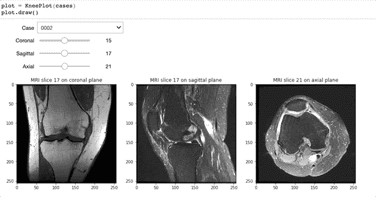
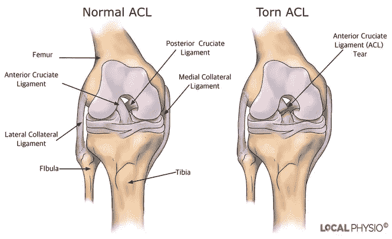
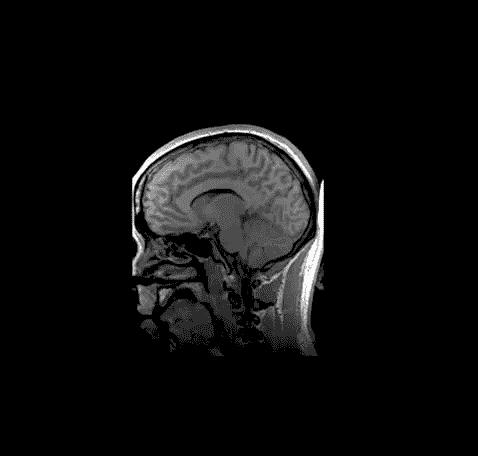
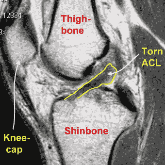
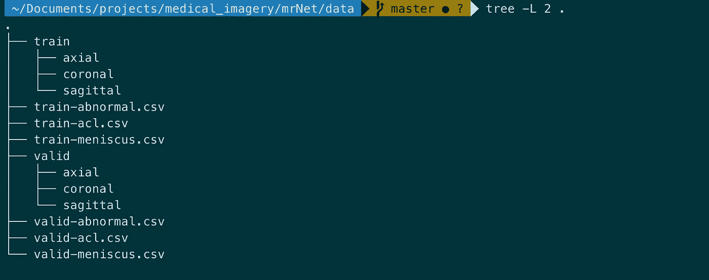
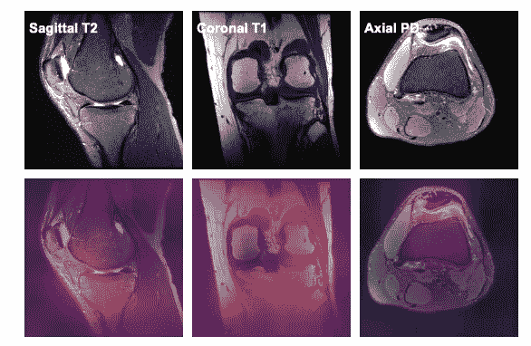
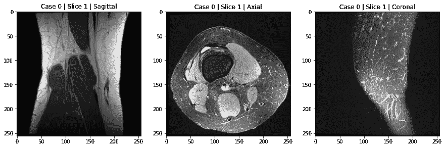

# 用 Python 分析膝关节磁共振成像🚑

> 原文：<https://towardsdatascience.com/deep-learning-and-medical-imaging-part-1-explore-the-mrnet-mri-dataset-of-knee-injuries-f519d063165?source=collection_archive---------12----------------------->

## 学习使用 python 分析 MRI 扫描来检测严重的膝盖损伤

我总是对改变人们生活的有影响力的人工智能应用感到惊讶，我认为如今这种转变正在发生的领域之一是**医疗保健。**


照片由 [EVG 拍摄](https://www.pexels.com/@evgphotos?utm_content=attributionCopyText&utm_medium=referral&utm_source=pexels)来自[派克斯](https://www.pexels.com/photo/three-person-looking-at-x-ray-result-1170979/?utm_content=attributionCopyText&utm_medium=referral&utm_source=pexels)

人工智能和医疗保健是我直到最近才考虑的一个关联。所以我给自己设定了一个个人挑战:**了解一个医疗应用程序，实现它，并分享它。**

在我快乐地追求数据的过程中，我偶然发现了 **MRNet** :由**斯坦福 ML 小组**收集的用于研究膝盖损伤的膝盖 MRI 数据集。该数据集可通过书面请求获得，并附有该团队发表的一篇研究论文。简而言之，这项工作提出了一个神经网络结构，检测 3 种类型的膝关节损伤具有非常好的性能。

# 今天你将学到什么👨‍💻

*   关于膝关节功能障碍，你可能和我一样不熟悉。所以我会尽我所能来解释我们将要面对的膝盖损伤的类型
*   我将简要介绍磁共振成像，并解释它产生的数据类型:我们将看到深度学习有很大的潜力来处理它，用于**医疗诊断自动化**
*   我们将探索斯坦福大学提供的 MRNet 数据集
*   我将向您展示如何在没有 javascript 代码的情况下高效地构建交互式数据探索小部件。只有 Python 代码。

**剧透警告** ⚠️ **这是它的样子**



开始吧！😁

# 前十字韧带撕裂

在这个项目中，我们将特别关注前交叉韧带(ACL)撕裂，这是足球或篮球顶级运动员最常见的膝盖损伤。

当前交叉韧带被拉伸、部分撕裂或完全撕裂时，就会发生 ACL 撕裂。最常见的损伤是完全撕裂。

症状包括疼痛，受伤时发出爆裂声，膝盖不稳定和关节肿胀。

美国每年大约有 200，000 例前交叉韧带撕裂，每年有超过 100，000 例前交叉韧带重建手术。



[来源](https://corephysio.com.au/what-is-an-acl-injury/)

为了诊断膝关节损伤，我们通常使用磁共振成像。

# 磁共振成像

磁共振成像(MRI)是一种用于放射学的医学成像技术，用于形成身体解剖和生理过程的图像。

核磁共振用于诊断您对治疗的反应，以及检测撕裂和结构问题，如心脏病发作、脑损伤、血管损伤等。

这是头部核磁共振成像的动画:



来源:[维基百科](https://en.wikipedia.org/wiki/Magnetic_resonance_imaging)

核磁共振扫描不是一个器官的单一图像。它是一组堆叠在一起的不同图像或切片(这就是为什么你会看到一个动画穿过 MRI 的每个切片)。

你可以把核磁共振成像想象成根据给定的平面，在不同的深度水平上检查器官的过程。

# 前交叉韧带撕裂诊断和自动化的高潜力

如上所述，膝关节 MRI 是诊断膝关节损伤的首选方法。然而，膝关节核磁共振成像的**解释非常耗时，并且容易出现诊断错误和可变性**。用于解释这种类型的图像数据的自动化系统可以优先考虑高风险患者，并帮助临床医生进行诊断。

此外，对放射科医师产生较少假阳性的系统是非常有利的，因为它消除了进行不必要的侵入性膝关节手术的风险。

在接下来的帖子中，我们将看到如何使用深度学习在 MRI 扫描上建立 ACL 撕裂分类器。但是我们先来看看这个帖子里的数据，了解一下。



# MRNet 数据集

MRNet 是由吴恩达的斯坦福实验室提供的膝盖 MRI 数据集。

它分为训练集(1130 个案例)、验证集(120 个案例)和测试集(120 个案例)，组织如下:



请注意，我们没有访问测试集的权限。

请注意，该病例也指患者。所以我们将互换使用这两个术语。

# 我们要用什么文件？

**train-acl.csv** 和 **valid-acl.csv** (我们暂时忽略其他文件)分别表示训练和验证数据上每个案例(正常或遭受 acl 撕裂)的标签。

在训练和有效文件夹中，每个病例都有 3 个从不同平面拍摄的 MRI 扫描:矢状面、冠状面和轴面。

为了对病例做出正确的决定，放射科医师通常从不同的平面查看 MRI 扫描，以获得全局视图。



给定患者的 3 次 MRI 扫描不一定具有相同数量的切片。

对于不同的病例(或患者)和给定的平面，MRI 扫描也不一定有相同数量的切片。**这是一条需要记住的重要信息，因为它决定了我们稍后将用于分类的深度学习模型的架构。**

# 用一些代码探索 MRNet 数据集💻

现在让我们来看看这些数据，并对其进行探究。

CSV 文件 **train-acl.csv** 和 **valid-acl.csv** 具有相同的两列结构:

*   案例:案例的 id
*   异常:二进制值(1/0)表示 ACL 断裂

```
print(train_acl.shape)
# (1130, 2)
```

前交叉韧带撕裂出现在不到 20%的训练集中。

```
train_acl.Abnormal.value_counts(normalize=True)# 0    0.815929
# 1    0.184071
# Name: Abnormal, dtype: float64
```

让我们从三个平面的角度来看一个给定的例子:

每一次核磁共振扫描都是 s 层的张量。每个切片都是大小为(256，256)的灰度图像。

让我们想象每个平面上的第一个:



绘制 MRI 扫描的切片并在三个不同的平面之间有一个全局视图不是很方便，特别是当每次 MRI 扫描有大量切片并需要检查每个切片时。

因此，下面是我们如何将一个静态的 matplolib 图转换成**一个交互式小部件**，它允许你:

*   选择一个案例
*   在每个平面的切片上滑动
*   看到图动态变化

让我们来看看如何做到这一点:

您首先需要将数据加载到一个方便的字典中，其中键是病例号，值是字典，键是平面，对应的值是表示 MRI 扫描的 NumPy 数组。

装完 100 箱后，让我们看看 0000 箱

```
print(cases['0000'].keys())
#dict_keys(['coronal', 'sagittal', 'axial'])
```

正如所料，它包含一个嵌套字典，将 plane 映射到 NumPy 数组对象。

让我们看看这个:

```
print(cases['0000']['axial'].shape)
print(cases['0000']['coronal'].shape)
print(cases['0000']['sagittal'].shape)# (44, 256, 256)
# (36, 256, 256)
# (36, 256, 256)
```

现在我们定义一个名为 KneePlot 的类，它从 **cases** 对象创建交互式绘图。

该类别定义了:

*   抽象方法 **plot_slices** 绘制给定案例的三个切片。每次在小部件上进行交互时，都会自动调用这个方法
*   一个 **draw** 方法，负责定义 dropdown 和 slider 小部件，这些小部件获取用户输入数据并将它们交互地传递给 **plot_slices** 。


# 关于数据的一些考虑🤔

*   从一个平面到另一个平面，切片是显著不同的:作为一个非专业人士，这是我注意到的第一件事
*   在给定的平面内，切片也可以显著不同。事实上，我们稍后会看到，一些切片可以更好地突出前交叉韧带撕裂
*   在下一篇文章中，我们将为每个平面建立一个 MRI 撕裂分类。接下来我们会看到，这三个模型的组合优于单个模型
*   根据给定平面进行的 MRI 扫描可以被认为是堆叠切片的体积。正如我们之前所说的，病例不一定共享相同的切片，磁共振成像**不能批量**放置。我们将看到如何有效地处理这个问题。

# 然后🔜:建立 ACL 撕裂分类模型

在下一篇文章中，我们将构建一个卷积神经网络，它将接收 MRI 扫描并预测 ACL 撕裂的概率。

[](/deep-learning-and-medical-imaging-how-to-provide-an-automatic-diagnosis-f0138ea824d) [## 深度学习和医学成像🚑-如何提供自动诊断？

### 了解如何使用 PyTorch 训练高精度的 MRI 扫描膝关节损伤分类器

towardsdatascience.com](/deep-learning-and-medical-imaging-how-to-provide-an-automatic-diagnosis-f0138ea824d) 

我们将讨论这个网络的架构以及处理数据处理、数据扩充和迁移学习的不同组件。

我们将看到如何使用 PyTorch 将所有内容组合在一起。移至下一篇文章了解更多详情。

*原载* [*此处*](https://www.ahmedbesbes.com/blog/acl-tear-detection-part-1) *。*