# 用于动作识别的深度学习架构

> 原文：<https://towardsdatascience.com/deep-learning-architectures-for-action-recognition-83e5061ddf90?source=collection_archive---------13----------------------->

## 2014 年至 2019 年的最新进展回顾

# 摘要

深度学习方法已经在经验上证明了在为诸如对象识别、图像字幕和语义分割等任务学习图像表示方面的显著成功。卷积神经网络通过参数共享卷积和局部不变性构建最大池神经元，使我们能够有效地捕捉图像中数据结构的空间局部性假设。在这篇文献综述中，我想探讨深度学习技术对视频任务的影响，特别是动作识别。

我想探索时空特征如何通过各种深层架构聚合，光流作为输入的作用，对实时能力的影响，以及所学特征的紧凑性和可解释性。

然后，我将提出未来研究的领域，我认为这些领域可以帮助我们以更好地捕捉现实世界的时间假设的方式偏向深度学习架构；自然流形。

# 在深度学习革命之前

在 2014 年之前，最先进的技术侧重于从稀疏或密集采样轨迹形成的手工特征。例如，一种流行的方法称为改进的密集轨迹(iDT) [1]，提取一组密集的兴趣点的轨迹和特征，将它们编码在固定大小的视频描述中，然后像 SVM 这样的分类器在最终的“单词包”表示上进行训练。在这种方法中，需要对每一帧进行大量的预处理。必须在帧之间计算光流，还计算光流的梯度，并且为两者产生减去平均值的直方图。这些都被认为是编码到固定大小视频描述中的输入特征。在视频表示的深度学习方法中，我们将观察预处理如何对端到端可训练性和实时能力产生影响。

# 后深度学习

## 2014

2014 年后，深度学习架构在 UCF101、Sports-1M 和 HMDB51 等里程碑式的视频动作识别数据集上获得了最先进的性能。2014 年，两篇重要的突破性论文让深度学习在视频识别方面有了起步*。Karpathy 等人利用卷积神经网络*进行大规模视频分类。艾尔。Simonyan 和 Zisserman [3]的视频中用于动作识别的【2】和*双流卷积网络导致了单流和双流网络**T5 在动作识别中的流行。***

卡帕西等人。艾尔。探索了如何融合时态数据与单流 2D 卷积神经网络。他们测试了图 1 中提出的架构。

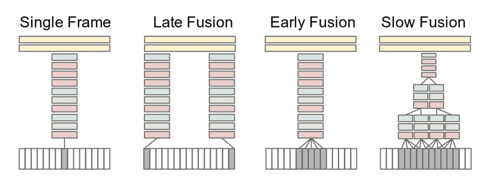

图 1 —单流网络架构。红色、绿色和蓝色方框分别表示卷积层、归一化层和汇集层。在慢速融合模型中，所描绘的列共享参数。[2]

单帧网络本质上是一个没有时间特征的图像分类网络。后期融合使用两个相距很远的帧，并通过展平从这两个帧处理的特征，在紧密连接的层融合深层等级特征。早期的融合将帧堆叠为通道，并通过对整个帧堆叠进行 2D 卷积来学习视频描述符。慢速融合试图从一堆帧中以分层的方式连接特征，因此随着网络变得更深，更多的时间特征被学习。他们的结果总结在表 1 中。

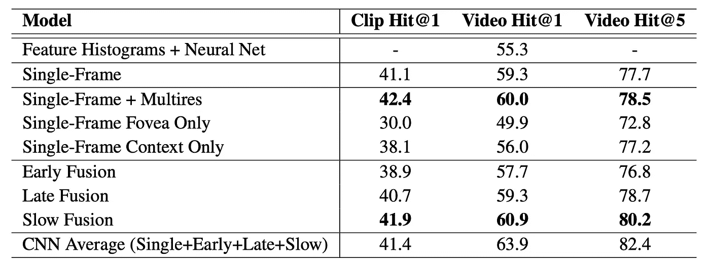

表 1—Sports-1M 测试集的 200，000 个视频的结果。Hit@k 值表示在前 k 个预测中包含至少一个基本事实标签的测试样本的比例。[2]

单流策略的优势在于，我们可以从在大规模图像数据集上训练的模型中使用迁移学习。我们也不需要为光流预处理图像，因为我们在该架构中直接使用 RGB 图像数据。这使得单流网络成为实时处理的候选。在作者提出的融合架构中，参数的数量从深 2D CNN 显著增加。为了减轻这一点，作者建议使用多分辨率流。一种是将高分辨率视网膜中央凹流嵌入到视频的中央裁剪区域，并结合整个视频的低分辨率上下文流，如图 2 所示。

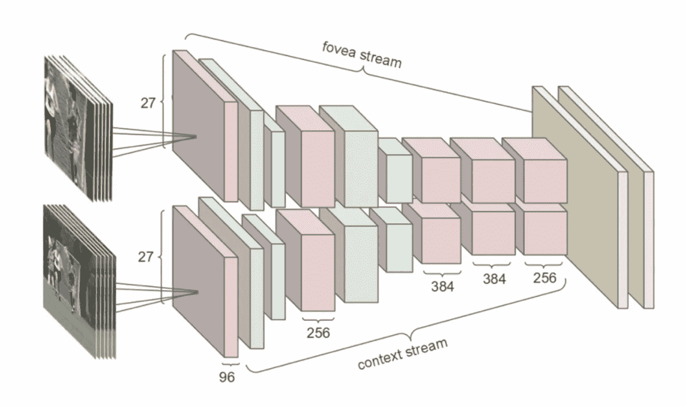

图 2 —多分辨率流有两个流，由交替的卷积(红色)、归一化(绿色)和汇集(蓝色)层组成。两条溪流汇聚成两个完全连接的图层(黄色)。[2]

根据经验，这大大减少了参数数量，与单帧架构相当。

从表 1 公布的结果中，我们看到，仅使用单个帧，所提出的架构未能有效提升性能。这些模型的弱点是它们不能很好地捕捉运动特征。然而，这篇论文确实揭示了迁移学习对于动作识别非常有用。与在 UCF101 [2]上从头开始训练的模型相比，在 Sports-1M 上预先训练然后在顶部 3 层进行微调的模型在 UCF101 数据集上的准确性提高了 20%以上。

在 2014 年，Simonyan 和 Zisserman 提出了一个两个流架构，分别处理空间特征和时间特征[3]，如图 3 所示。

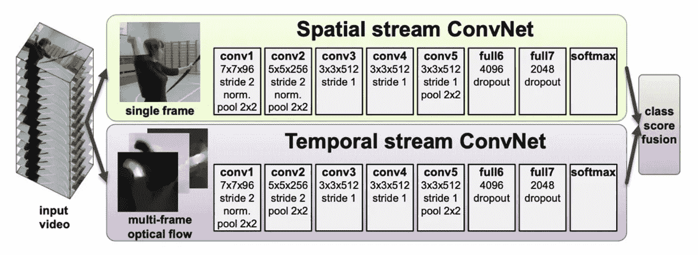

图 3 -双流网络[3]

视频的单个帧被传递到 2D 卷积网络，而预处理的多帧光流被传递到单独的 2D 卷积网络。每个流形成一个预测，类分数由它们的融合决定。这种架构的缺点是它不是端到端可训练的，因为光流需要单独计算，并且两个流都需要单独训练。空间流可以从大型图像数据集学习，而时间流必须在视频数据集上训练。这样，迁移学习就不完全适用于这种架构。此外，计算光流所需的预处理使得该算法难以具有实时能力。如下表 2 所示，这种方法的优势在于其能够与 IDT 等当时最先进的技术相匹配。

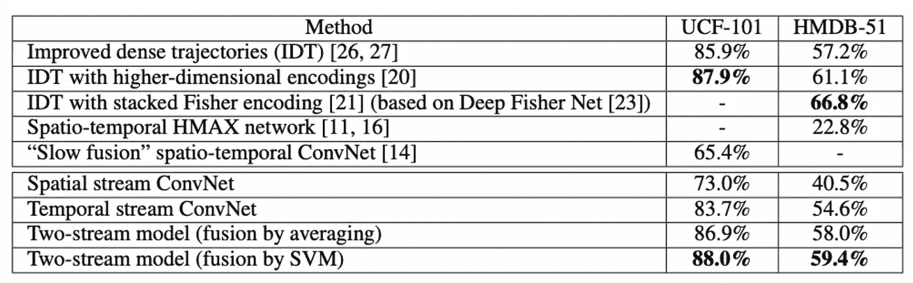

表 2—3 次分割的平均 ConvNet 精度[3]

这为视频分类的深度学习的进一步研究打开了大门。这项研究表明，卷积深度网络可以有效地捕捉一些运动特征，并将其与空间特征相结合，以形成对动作类别的准确预测。

在 2014 年至 2019 年之后的未来 5 年中开发的深度学习架构在很大程度上遵循了围绕下图 4 所示架构的变化。

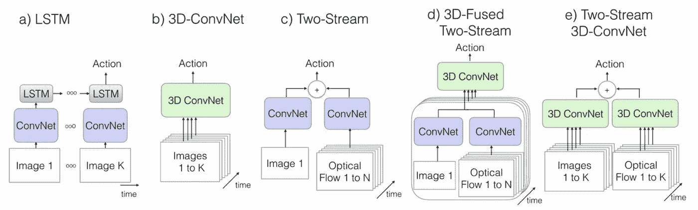

图 4 —动作识别的各种架构。k 代表视频中的总帧数，N 代表视频中相邻帧的子集。[4]

前两种方法 a)和 b)分别使用 LSTM 和 3D ConvNet，具有端到端可训练和实时能力的优点。这是因为它们不依赖于光流，而是必须学习编码这些信息的特征。这允许网络在端到端训练中直接学习时空特征。方法 c)-e)不是实时的，也不是端到端可训练的，因为它们需要对原始数据进行光流计算。方法 b)、d)和 e)使用 3D 卷积。这从传统的 2D conv net 中创建了大量的参数。对于为 UCF101 数据集训练的单个 3D 卷积神经网络，可以有 33M +参数，相比之下，在 2D 的情况下只有 5M+参数[4]。这极大地影响了训练成本，因为在 Sports-1M 上训练 3D ConvNet 模型需要大约 2 个月的时间。这使得难以为视频数据搜索正确的架构。大量的参数也产生了过度拟合的风险。

Donahue 等人在 2014 年的论文*用于视觉识别和描述的长期递归卷积网络*中普及了视频的 LSTM 架构。铝[5]。这座建筑被称为 LRCN。它是编码器-解码器架构的直接扩展，但用于视频表示。LRCN 网络的优势在于它可以处理各种长度的序列。它还可以适用于其他视频任务，如图像字幕和视频描述。缺点是 LRCN 无法超越当时的技术水平，但它确实比单帧架构有所改进，如表 3 所示。

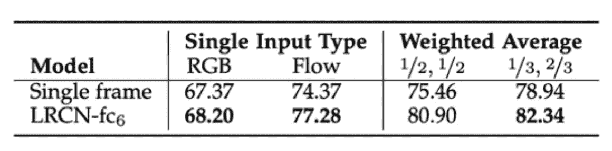

表 3 —活动识别:在 UCF101 [25]数据集上，使用 RGB 和 flow 输入，将单帧模型与 LRCN 网络进行活动识别比较。[5]

对于隐藏的递归图层来说，空间要素的时间建模很难掌握。根据经验，向 RGB 模型中添加更多的隐藏单元并不会改善过去的 256 个隐藏单元。然而，在使用流输入的同时添加更多的隐藏单元产生了 1.7%的精度提升，从 256 个单元增加到 1024 个单元。这表明 LRCN 在学习光流或运动的类似表达方面有一段艰难的时间。

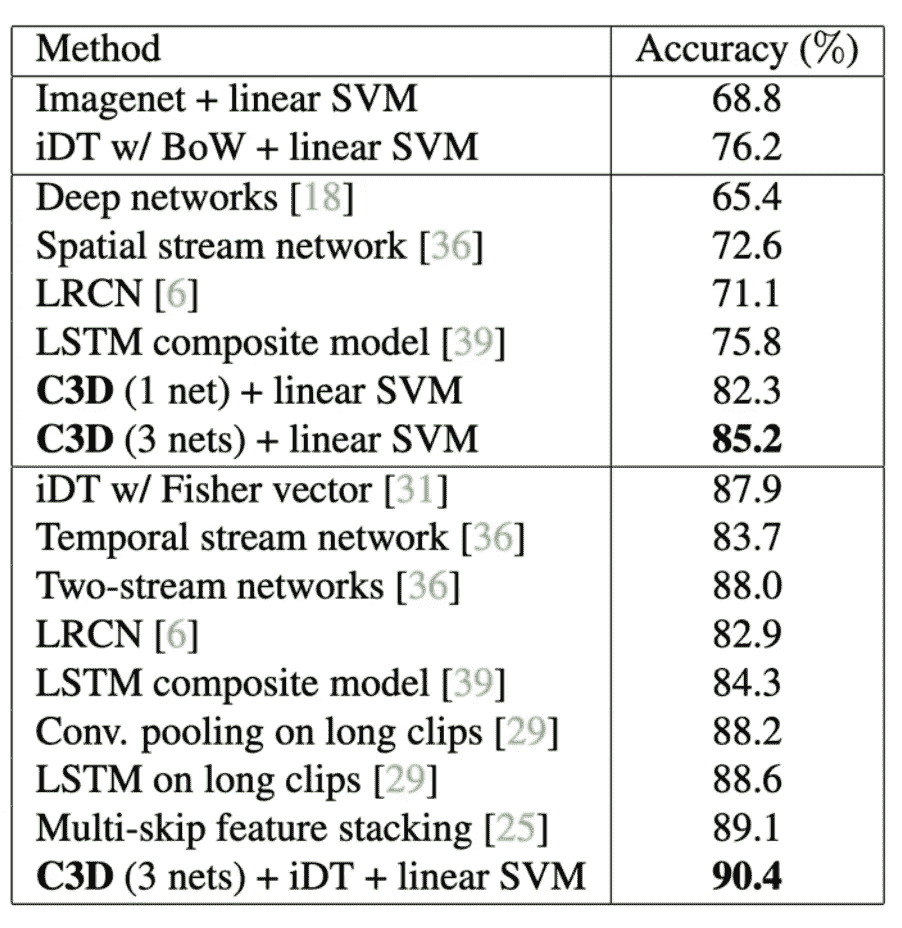

表 4—ucf 101 上的动作识别结果。2015 年，C3D 与基线和最先进的方法进行了比较。[6]

## 2015

在 Du Tran 等人的 2015 年研究论文*用 3D 卷积网络学习时空特征*中，3D 卷积网络被确立为新的最先进技术。铝[6]。在这篇论文中，他们确定了具有 3x3x3 核的 3D 卷积网络(C3D)在学习时空特征方面是最有效的。有趣的是，解卷积揭示了网络正在学习片段的前几帧的空间外观，随后是后面几帧的显著运动。这种架构非常强大，因为许多视频可以实时处理，因为 C3D 的处理速度高达 313fps。由该网络生成的视频描述符也是紧凑的和有区别的，因为我们可以通过 PCA 将卷积生成的特征投影到 10 维，并且仍然在 UCF101 数据集上实现 52.8%的准确性。

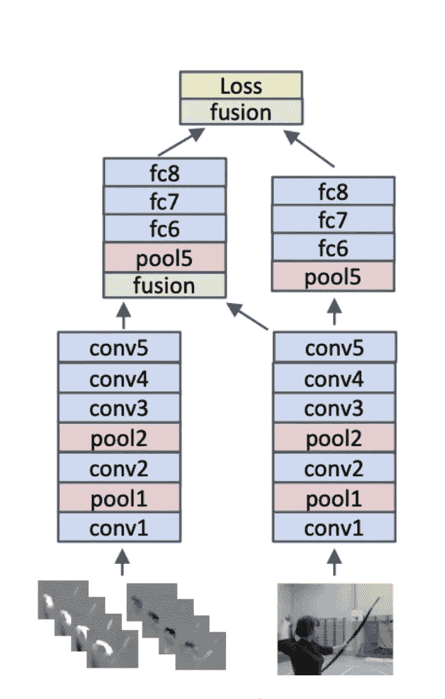

图 5——两层融合架构(conv5 之后和 fc8 之后),其中保留了两个网络塔，一个作为混合时空网络，一个作为纯空间网络。[7]

## 2016

2016 年，重心转回二流网。在 Zisserman 等人的用于视频动作识别的卷积双流网络融合中。艾尔。[7]，作者解决了如何有效地融合跨流的空间和时间数据，并创建可以处理长期时间依赖性的多级丢失。这里的激励思想是，为了区分图像不同部分的类似运动，如刷牙和刷牙，网络需要在一个像素位置结合空间特征和运动特征。理论上，在密集连接的层之前融合流的方法可以实现这一点。在提出的架构中，作者在两个位置融合了两个流，如图 5 *所示。*该网络能够更好地捕捉不同子网中的运动和空间特征，并击败了最先进的 IDT 和 C3D 方法。多级损失由最后融合层的时空损失和由时间网络的输出形成的单独时间损失形成。这使得研究人员能够创建时空特征，并对长期时间依赖性进行建模。这种方法仍然存在原始双流网络的缺点，但由于增强的架构更好地服务于我们的现实世界偏差，因此性能更好。

## 2017

2017 年，朱等人。艾尔。通过引入一个学习光流的隐藏流(称为 MotionNet [8])，two stream 网络向前迈进了一步。这种端到端的方法允许研究人员跳过明确计算光流。这意味着两个流方法现在可以是实时的，并且来自错误预测的误差也可以传播到 MotionNet 中，以获得更优化的光流特征。

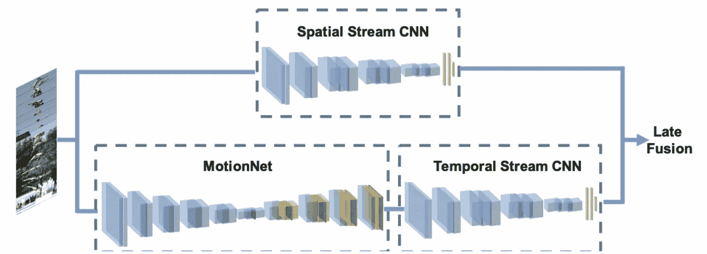

图 6 — MotionNet 将连续的视频帧作为输入，并估计运动。然后时间流 CNN 学习把运动信息投射到动作标签上。[8]

研究人员发现，隐藏的双流 CNN 的性能与非隐藏方法类似，但现在每秒可以处理 10 倍以上的帧，如表 6 所示。这实现了双流方法的实时能力。

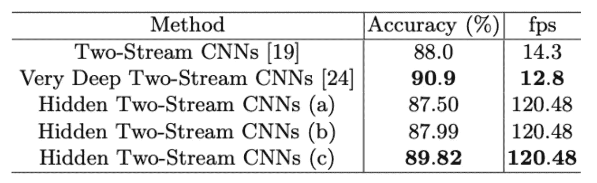

表 6-双流法及其在 UCF101 上的精度。[8]

MotionNet 子网是可扩展的，可以应用于其他需要计算光流的深度学习方法。这很重要，因为它允许我们实时地做其他的方法。

2017 年， *Quo Vadis，动作识别？Zisserman 等人的新模型和动力学数据集*。艾尔。通过将它与来自两个信息流网络的知识相结合，使 C3D 向前迈进了一步[4]。研究人员提出了一种新颖的双流膨胀 3D ConvNet (I3D)。2D ConvNets 的过滤器和池内核扩展到 3D，赋予它们额外的时间维度。这使得研究人员能够将 2D 分类的成功架构应用于 3D。研究人员还利用在 ImageNet 等海量图像数据集上训练的 2D ConvNet 模型的参数来引导这些 3D 过滤器。

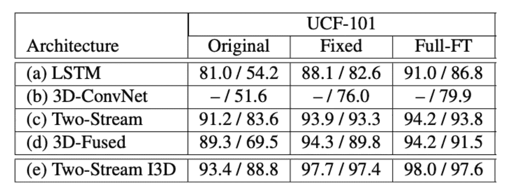

表 7——在 UCF-101 和 HMDB-51 测试集(两个测试集的第一部分)上，以 ImageNet 预训练重量为起点和不含 ImageNet 预训练重量的架构的性能。原文:UCF-101 或 HMDB-51 上的火车；修正:来自动力学的特征，最后一层在 UCF-101 或 HMDB-51 上训练；全英尺:动力学预训练与端到端微调 UCF-101 或 HMDB-51。[4]

在双流架构中对顺序 RGB 帧和顺序光流帧使用 3D ConvNets 使研究人员能够在 UCF101 上击败最先进的技术。研究人员利用动力学数据集确立了迁移学习的明显重要性。不幸的是，他们使用的模型体系结构不是端到端可训练的，并且没有实时能力。

## 2018

在 2017 年至 2018 年，深度残差学习的许多进展导致了像 3DResNet 和伪残差 C3D (P3D)这样的新颖架构[9]。不幸的是，我不会在这篇文献综述中涵盖这些论文，但我确实恭敬地承认它们对现有技术的影响。

## 2019

最近一次是在 2019 年 6 月，杜川等人。艾尔。提出信道分离卷积网络(CSN)用于在*视频分类中使用信道分离卷积网络进行动作识别*【10】。研究人员基于在 Xception 和 MobileNet 模型中获得巨大成功的组卷积和深度卷积的思想。

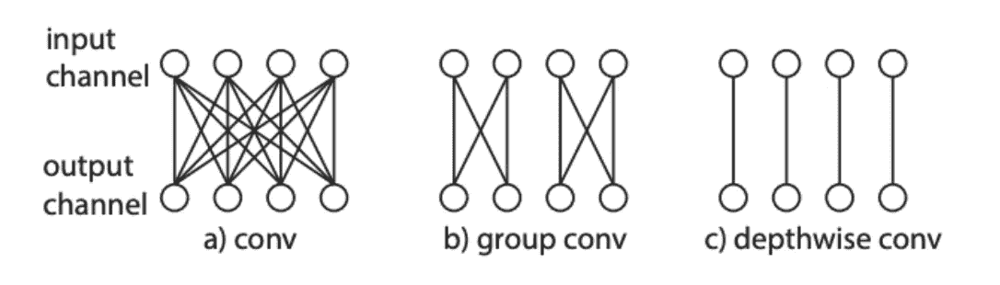

图 7 — (a)传统卷积，只有一个组。(b)具有两个群的群卷积。c)深度方向卷积，其中组的数量与输入/输出滤波器的数量相匹配。

基本上，群卷积通过不完全连接引入了正则化和更少的计算。深度卷积是组卷积的极端情况，其中输入和输出通道等于组的数量，如图 7 所示。传统的卷积网络在其 3D 卷积中联合模拟信道相互作用和局部相互作用(空间或时空)。

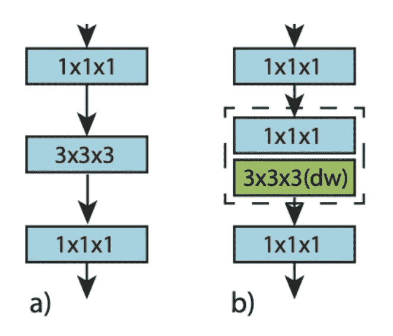

图 8 — (a)标准 ResNet 瓶颈模块。(b)交互保留的瓶颈块。

研究人员提议将 3x3x3 卷积核分解为两个不同的层，其中第一层是用于局部通道交互的 1x1x1 卷积，第二层是用于局部时空交互的 3x3x3 深度卷积。通过使用这些模块，研究人员显著减少了网络中的参数数量，并引入了一种强有力的正则化形式。信道分离的块允许网络在不同的层中本地学习空间和时空特征。

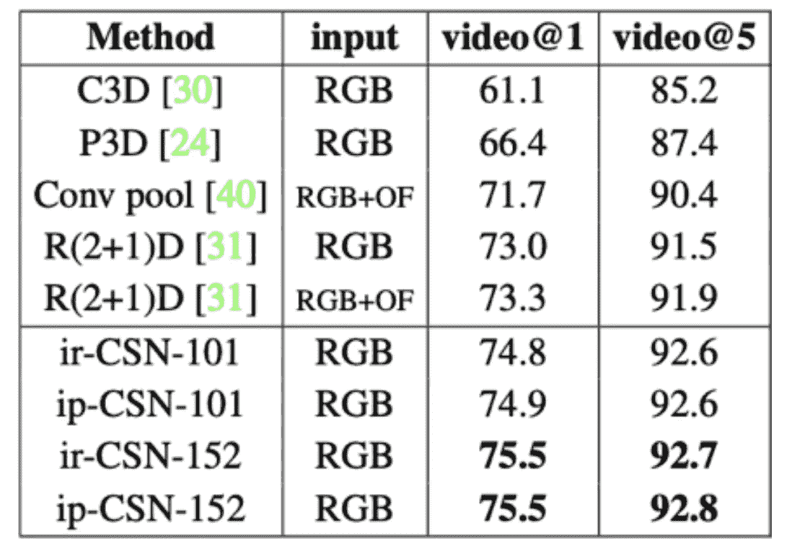

表 8 —与 Sports-1M 上最先进架构的比较

如表 8 所示，CSN 改进了 Sports-1M 数据集上的最新 RGB 方法，如 R(2+1)D、C3D 和 P3D。在推理过程中，网络速度也提高了 2-4 倍。该模型也是从头开始训练的，其中表中的其余模型是在 ImageNet 或 Kinetics 数据集上预先训练的。这种新的架构改进了以前的因子分解网络，同时减少了过拟合，速度非常快，并在基准数据集上产生了最先进的精度。

# 结论

## 技术发展水平

动作识别的当前技术状态(2019 年 8 月)是通道分离网络。这个网络有效地在它们自己不同的层中捕获空间和时空特征。通道分离卷积块清楚地学习这些特征，但是在卷积的所有阶段局部地组合它们。这减轻了执行时间和空间两个流网络的缓慢融合的需要。网络也不需要像在 C3D 中那样在学习空间或时间特征之间做出决定，在那里网络可以决定学习两个维度之间混合的特征。该网络有效地捕获了 2D 空间切片应该形成自然图像的偏差，而时间方向上的 2D 切片具有不同的时间属性，并且不属于自然流形。这样，研究人员通过创建两个独立的不同层来处理每个方向来加强这种偏见。通道分离是动作识别中向前迈出的重要一步，即使从零开始训练，也已经取得了领先的结果。它还能够进行实时推理。由于这些原因，我相信 CSN 的是目前的艺术状态

## 摘要

我们已经了解到，深度学习已经彻底改变了我们处理动作识别视频的方式。深度学习文献已经从使用改进的密集轨迹走了很长的路。从图像分类的姐妹问题中获得的许多知识已经被用于推进用于动作识别的深度网络。具体而言，卷积图层、池化图层、批量归一化和残差连接的使用已从 2D 空间中借鉴过来，并成功应用于 3D 中。许多使用空间流的模型都是在大量影像数据集上进行预训练的。光流在早期深度视频架构(如双流网络和融合网络)中也在表示时间特征方面发挥了重要作用。光流是我们的数学定义，我们认为后续帧中的运动可以描述为所有像素的密集计算的流向量。最初，网络通过使用光流来提高性能。然而，这使得网络无法进行端到端训练，并限制了实时能力。在现代深度学习中，我们已经超越了光流，相反，我们构建了能够天生学习时间嵌入并且端到端可训练的网络。

我们还了解到，动作识别是一个真正独特的问题，有其自身的复杂性。摩擦的第一个来源是与 3D 卷积相关的高计算和存储成本。一些模型需要 2 个多月的时间来进行体育训练-在现代 GPU 上需要 100 万。摩擦的第二个来源是视频架构搜索没有标准的基准[11]。Sports-1M 和 UCF101 高度相关，当选择视频的一部分进行训练，但实际上可能不包含实际动作(因为它可能在视频的另一部分中)时，错误标签分配是常见的。摩擦的最后一个来源是，设计一个视频深度神经网络并非易事。层的选择、如何预处理输入以及如何对时间维度建模是一个未解决的问题。上述论文的作者试图以经验方式解决这些问题，并提出了解决视频中时间建模的新架构。

# 未来的研究

对于未来的研究，我建议研究如何在深度视频网络架构中包含更多我们对现实世界的偏见。一个有趣的垂直研究是深度建模如何与更好的视频分类相关联。当前的视频分类方法必须知道视频是在 3D 环境中拍摄的。深度是我们空间感知的重要组成部分。当前的方法可能需要学习如何在 2D 特征的时空模型中表达深度。也许使用单目深度估计网络可以帮助当前的视频网络更好地理解环境本身。一个重要的观察结果是，视频中的任何空间变化都来自两个来源:我们正在观察的外部对象的转换，或者观察者本身改变视角或位置。这两种运动源都必须被当前的网络所学习。研究如何使用深度场来模拟变化的来源将会很有趣。

# 引文

[1]王恒，亚历山大·克勒泽，科迪莉亚·施密德，.基于密集轨迹的动作识别。CVPR 2011 — IEEE 计算机视觉会议

[2] Karpathy，Andrej 等，“用卷积神经网络进行大规模视频分类”IEEE 计算机视觉和模式识别会议录。2014.

[3]西蒙扬、卡伦和安德鲁·齐泽曼。"用于视频中动作识别的双流卷积网络."神经信息处理系统进展。2014.

[4]卡雷拉、若昂和安德鲁·齐塞曼。“Quo vadis，动作识别？一个新的模型和动力学数据集。”IEEE 计算机视觉和模式识别会议录。2017.

[5] Donahue，Jeffrey 等，“用于视觉识别和描述的长期递归卷积网络”IEEE 计算机视觉和模式识别会议录。2015.

[6] Tran，Du 等，“用三维卷积网络学习时空特征”IEEE 计算机视觉国际会议论文集。2015.

[7] Feichtenhofer、Christoph、Axel Pinz 和 Andrew Zisserman。“视频动作识别的卷积双流网络融合。”IEEE 计算机视觉和模式识别会议录。2016.

[8]朱，易等.用于动作识别的隐双流卷积网络."计算机科学课堂讲稿(2019):363–378。交叉引用。网络。

[9]邱、、、。“用伪 3d 残差网络学习时空表示。”IEEE 计算机视觉国际会议论文集。2017.

[10] Tran，Du，等，“用信道分离卷积网络进行视频分类”arXiv 预印本 arXiv:1904.02811 (2019)。

[11] Tran，Du，等，“用于时空特征学习的 Convnet 架构搜索”arXiv 预印本 arXiv:1708.05038 (2017)。