# 基于深度学习的推荐系统

> 原文：<https://towardsdatascience.com/deep-learning-based-recommender-systems-3d120201db7e?source=collection_archive---------1----------------------->

[自由股票](https://unsplash.com/@freestocks?utm_source=medium&utm_medium=referral)在 [Unsplash](https://unsplash.com?utm_source=medium&utm_medium=referral) 上的照片

## 现代电影推荐人简介

传统上，推荐系统基于诸如聚类、最近邻和矩阵分解的方法。然而，近年来，深度学习在多个领域取得了巨大的成功，从图像识别到自然语言处理。推荐系统也受益于深度学习的成功。事实上，今天最先进的推荐系统，如 [Youtube](https://research.google/pubs/pub45530/) 和[亚马逊](https://www.amazon.science/the-history-of-amazons-recommendation-algorithm)的推荐系统，是由复杂的深度学习系统驱动的，而不是传统方法。

# 为什么是这个教程？

在阅读这里的许多有用的教程时，这些教程涵盖了使用传统方法(如矩阵分解)的推荐系统的基础，我注意到缺少涵盖基于深度学习的推荐系统的教程。在本笔记本中，我们将浏览以下内容:

*   如何使用 PyTorch Lightning 创建自己的基于深度学习的推荐系统
*   推荐系统中隐式和显式反馈的区别
*   如何在不引入偏差和数据泄漏的情况下训练-测试分割用于训练推荐系统的数据集
*   评估推荐系统的标准(提示:准确性或 RMSE 是不合适的！)

# 本教程的数据集

本教程使用 MovieLens 20M 数据集提供的电影评论，这是一个受欢迎的电影评级数据集，包含从 1995 年到 2015 年收集的 2000 万条电影评论。

如果你想跟随本教程中的代码，你可以查看我的 [Kaggle 笔记本](https://www.kaggle.com/jamesloy/deep-learning-based-recommender-systems)，在那里你可以运行代码，并在跟随本教程时看到输出。

# 使用隐式反馈构建推荐系统

在我们建立我们的模型之前，理解**隐式**和**显式**反馈之间的区别，以及为什么现代推荐系统建立在隐式反馈的基础上是很重要的。

## 明确的反馈

在推荐系统的背景下，显式反馈是从用户那里收集的**直接**和**定量**数据。例如，亚马逊允许用户在 1-10 的范围内给购买的商品打分。这些评级直接由用户提供，该量表允许亚马逊量化用户偏好。另一个显式反馈的例子包括 YouTube 上的拇指向上/向下按钮，该按钮捕捉用户对特定视频的显式偏好(即喜欢或不喜欢)。

然而，显式反馈的问题是它们很少。想想看，你上一次点击 YouTube 视频上的“喜欢”按钮，或者给你的网上购物打分是什么时候？很有可能，你在 YouTube 上观看的视频数量远远大于你明确评价的视频数量。

## 隐性反馈

另一方面，隐式反馈是从用户**交互**中间接收集的，它们充当用户偏好的代理。比如说。你在 YouTube 上观看的视频被用作隐性反馈，为你量身定制推荐，即使你没有明确地对这些视频进行评级。隐性反馈的另一个例子包括你在亚马逊上浏览过的商品，它被用来为你推荐其他类似的商品。

隐性反馈的好处是丰富。使用隐式反馈构建的推荐系统还允许我们通过每次点击和交互来实时定制推荐。今天，在线推荐系统是使用隐式反馈构建的，这允许系统在每次用户交互时实时调整其推荐。

# 数据预处理

在开始构建和训练我们的模型之前，让我们做一些预处理，以获得所需格式的 MovieLens 数据。

为了保持内存使用的可管理性，我们将只使用该数据集中 30%用户的数据。让我们随机选择 30%的用户，只使用所选用户的数据。

过滤数据集后，现在有来自 41，547 个用户的 6，027，314 行数据(这仍然是一个很大的数据！).数据帧中的每一行都对应于一个用户对一部电影的评论，如下所示。

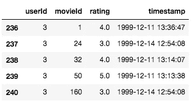

## 列车测试分离

除了评级，还有一个**时间戳**列，显示提交评论的日期和时间。使用时间戳列，我们将使用留一法实现我们的训练测试分割策略。对于每个用户，最近的评论被用作测试集(即，省去一个)，而其余的将被用作训练数据。

为了说明这一点，用户 39849 评论的电影如下所示。用户评论的最后一部电影是 2014 年的热门电影《银河护卫队》。我们将使用这部电影作为该用户的测试数据，并使用其余已审查的电影作为训练数据。

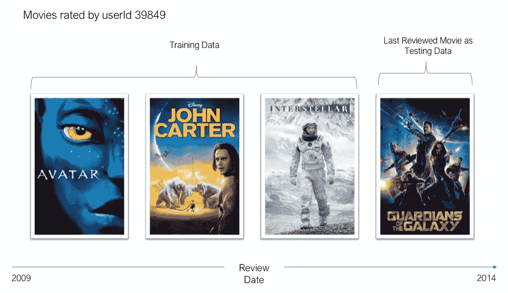

themoviedb.org 电影海报(免费使用)

这种训练-测试分离策略经常在训练和评估推荐系统时使用。进行随机分割是不公平的，因为我们可能会使用用户最近的评论进行训练，而使用早期的评论进行测试。这引入了带有前瞻偏差的数据泄漏，并且经过训练的模型的性能不能推广到真实世界的性能。

下面的代码将使用留一法将我们的评级数据集分成一个训练集和一个测试集。

## 将数据集转换成隐式反馈数据集

如前所述，我们将使用隐式反馈来训练一个推荐系统。然而，我们使用的 MovieLens 数据集是基于显式反馈的。要将该数据集转换为隐式反馈数据集，我们只需将评级二进制化，并将其转换为“1”(即正面类别)。值“1”表示用户已经与项目进行了交互。

值得注意的是，使用隐式反馈重新定义了我们的推荐器试图解决的问题。在使用显式反馈时，我们不是试图预测电影评级，而是试图预测用户是否会与每部电影进行交互(即点击/购买/观看)，目的是向用户呈现交互可能性最高的电影。

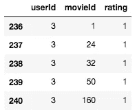

不过，我们现在确实有一个问题。在二值化我们的数据集之后，我们看到数据集中的每个样本现在都属于正类。然而，我们还需要负样本来训练我们的模型，以指示用户没有交互的电影。我们假设这些电影是用户不感兴趣的——尽管这是一个笼统的假设，可能不是真的，但在实践中通常效果很好。

下面的代码为每行数据生成 4 个负样本。换句话说，阴性样本与阳性样本的比例为 4:1。这个比例是随意选择的，但我发现它在实践中工作得相当好(你可以自己找到最佳比例！).

太好了！我们现在有了模型所需格式的数据。在我们继续之前，让我们定义一个 PyTorch 数据集以便于训练。下面的类只是将我们上面写的代码封装到一个 PyTorch 数据集类中。

# 我们的模型——神经协同过滤(NCF)

虽然有许多基于深度学习的推荐系统架构，但我发现由 [He 等人](https://arxiv.org/abs/1708.05031)提出的框架是最简单的，它足够简单，可以在这样的教程中实现。

## 用户嵌入

在我们深入模型的架构之前，让我们熟悉一下嵌入的概念。嵌入是一个低维空间，它从高维空间中捕捉向量的关系。为了更好地理解这个概念，让我们仔细看看用户嵌入。

想象一下，我们希望根据用户对两种类型电影的偏好来代表他们——动作片和爱情片。让第一维度是用户有多喜欢动作片，第二维度是用户有多喜欢言情片。

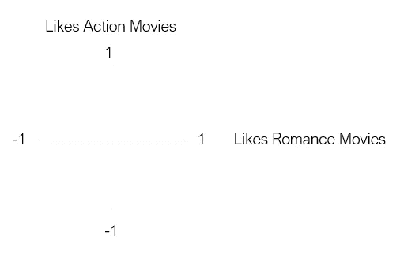

现在，假设 Bob 是我们的第一个用户。鲍勃喜欢动作片，但不喜欢爱情片。为了将 Bob 表示为一个二维向量，我们根据他的偏好将他放在图中。

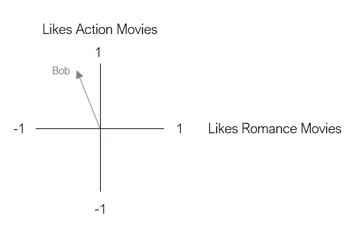

我们的下一个用户是乔。乔是动作片和爱情片的超级粉丝。我们用二维向量来表示 Joe，就像 Bob 一样。

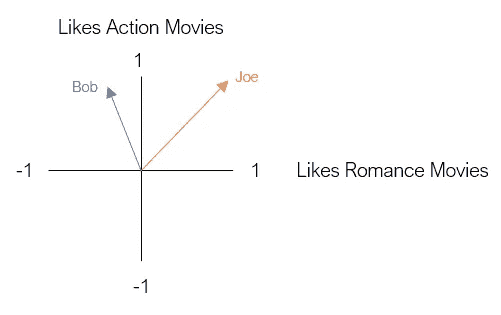

这个二维空间被称为嵌入。从本质上说，嵌入减少了我们的用户，这样他们可以在一个低维空间中以一种有意义的方式被表示。在这种嵌入中，具有相似电影偏好的用户被放置在彼此附近，反之亦然。

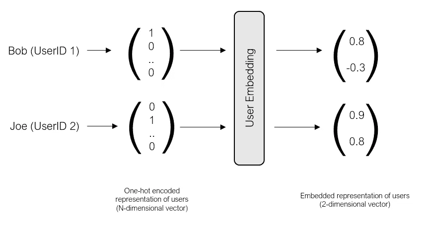

当然，我们并不局限于仅仅使用二维来表示我们的用户。我们可以使用任意数量的维度来表示我们的用户。更多的维度可以让我们更准确地捕捉每个用户的特征，但代价是模型变得复杂。在我们的代码中，我们将使用 8 个维度(我们将在后面看到)。

## 习得嵌入

同样，我们将使用一个单独的项目嵌入层来表示低维空间中项目(即电影)的特征。

您可能想知道，我们如何学习嵌入层的权重，以便它提供用户和项目的准确表示？在我们之前的例子中，我们使用 Bob 和 Joe 对动作和爱情电影的偏好来手动创建我们的嵌入。有没有办法自动学习这样的嵌入？

答案是**协同过滤**——通过使用评分数据集，我们可以识别相似的用户和电影，从现有评分中创建用户和项目嵌入。

## 模型架构

现在我们对嵌入有了更好的理解，我们准备定义模型架构。正如您将看到的，用户和项目嵌入是模型的关键。

让我们使用以下培训示例来浏览模型架构:

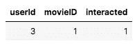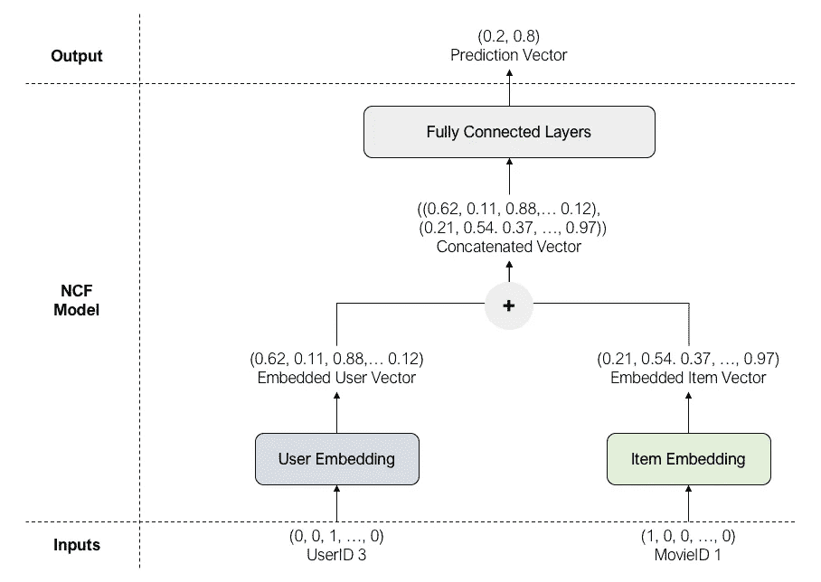

对于 userId = 3 和 movieId = 1，模型的输入是一次性编码的用户和项目向量。因为这是一个正样本(用户实际评分的电影)，真实标签(互动)为 1。

用户输入向量和项目输入向量分别被馈送到用户嵌入和项目嵌入，这导致更小、更密集的用户和项目向量。

嵌入的用户和项目向量在通过一系列完全连接的层之前被连接，这将连接的嵌入映射到预测向量作为输出。在输出层，我们应用 Sigmoid 函数来获得最可能的类。在上面的例子中，最可能的类是 1(正类)，因为 0.8 > 0.2。

现在，让我们用 PyTorch Lightning 来定义这个 NCF 模型！

让我们使用 GPU 为我们的 NCF 模型训练 5 个时期。

注: [PyTorch Lightning](https://github.com/PyTorchLightning/pytorch-lightning) 相对于 vanilla PyTorch 的一个优势是，你不需要编写自己的锅炉板训练代码。注意[训练师](https://pytorch-lightning.readthedocs.io/en/latest/trainer.html)类如何让我们只用几行代码就能训练我们的模型。

# 评估我们的推荐系统

既然我们已经训练出了模型，我们就可以使用测试数据来评估它了。在传统的机器学习项目中，我们使用准确性(对于分类问题)和 RMSE(对于回归问题)等指标来评估我们的模型。然而，这样的度量对于评估推荐系统来说过于简单。

为了设计一个好的评估推荐系统的指标，我们需要首先了解现代推荐系统是如何使用的。

在网飞，我们可以看到如下建议列表:

类似地，亚马逊使用一个推荐列表:

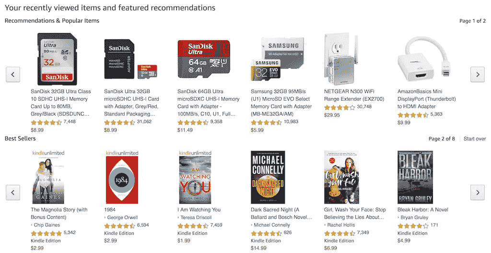

这里的关键是，我们不需要用户与推荐列表中的每一个单项**进行交互。相反，我们只需要用户与列表上的至少一个**项目进行交互——只要用户这样做，推荐就有效。****

为了模拟这种情况，让我们运行下面的评估协议，为每个用户生成一个前 10 个推荐项目的列表。

*   对于每个用户，随机选择 99 个用户**没有交互过的物品。**
*   将这 99 个项目与测试项目(用户最后交互的实际项目)结合起来。我们现在有 100 个项目。
*   对这 100 个项目运行模型，并根据它们的预测概率对它们进行排序。
*   从 100 个项目列表中选择前 10 个项目。如果测试项目出现在前 10 个项目中，那么我们说这是成功的。
*   对所有用户重复该过程。命中率就是平均命中率。

这个评估协议被称为**命中率@ 10** ，它通常用于评估推荐系统。

## 命中率@ 10

现在，让我们使用描述的协议来评估我们的模型。

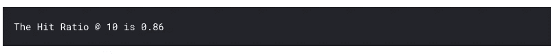

我们有一个相当不错的命中率@ 10 分！从上下文来看，这意味着 86%的用户被推荐了他们最终与之互动的实际项目(在 10 个项目的列表中)。还不错！

# 下一步是什么？

我希望这对于创建基于深度学习的推荐系统是一个有用的介绍。要了解更多信息，我推荐以下资源。

[来自 Neptune . ai——推荐系统:机器学习指标和商业指标](https://neptune.ai/blog/recommender-systems-metrics)。neptune.ai 的作者写了一份非常全面的推荐系统指南。如果你有兴趣，我鼓励你去看看。

## 其他资源

*   [Wide &深度学习——谷歌为推荐系统推出的模型](https://ai.googleblog.com/2016/06/wide-deep-learning-better-together-with.html)
*   [微软推荐库——推荐系统最佳实践](https://github.com/microsoft/recommenders)
*   [基于深度学习的推荐系统——有用的调查报告](https://arxiv.org/pdf/1707.07435.pdf)