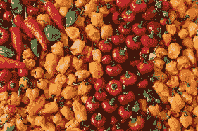
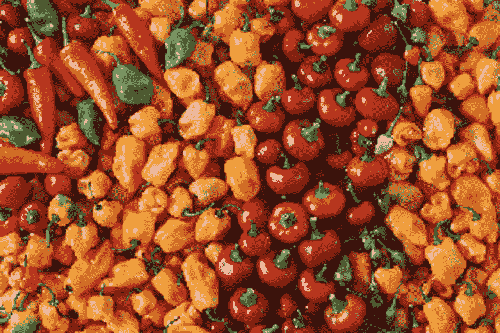

# 基于深度学习的 OpenCV 超分辨率

> 原文：<https://towardsdatascience.com/deep-learning-based-super-resolution-with-opencv-4fd736678066?source=collection_archive---------2----------------------->

## 如何使用最新的算法，通过 OpenCV 库中一个简单易用的函数来提高图像的分辨率。


[凯西·塞尔文](https://unsplash.com/@kathysg?utm_source=unsplash&utm_medium=referral&utm_content=creditCopyText)在[号航天飞机](https://unsplash.com/s/photos/butterfly?utm_source=unsplash&utm_medium=referral&utm_content=creditCopyText)上的照片

**目录**

*   超分辨率
*   在 OpenCV 中放大图像的步骤
*   不同的预训练模型
*   结果样本
*   注释和参考资料

# **OpenCV 中的超分辨率**

OpenCV 是一个开源的计算机视觉库，有大量优秀的算法。自从最近的一次合并以来，OpenCV 包含了一个基于深度学习方法的易于使用的界面来实现超级分辨率(SR)。该界面包含经过预先训练的模型，可以非常容易和有效地用于推理。在这篇文章中，我将解释它能做什么，并逐步展示如何使用它。**到目前为止，它与 C++和 Python 一起工作。**

注意:使用此代码不需要任何关于 SR 的知识。我在一台 Ubuntu 16.04 机器上运行这个，但是它适用于任何其他发行版(它也适用于视窗)。

# **步骤**

*   1.使用 contrib 模块(包含 dnn_superres)安装 OpenCV。
*   2.下载经过预先培训的模型。
*   3.放大图像。

1.  **与 contrib 模块一起安装 OpenCV。**

我们的第一步是安装 OpenCV。**有些功能会在以后发布，所以要小心版本:4.2.0 为 C++，4.3.0 添加 Python wrap，4.4.0 添加 GPU 推理。**您可以按照 [opencv 文档](https://docs.opencv.org/master/d7/d9f/tutorial_linux_install.html)中的说明进行操作。*非常重要的是*你也要安装 contrib 模块，因为这是 SR 接口代码所在的地方。您可以选择安装所有 contrib 模块或只安装必要的 SR 模块。我们将使用的接口或模块称为 dnn_superres (dnn 代表深度神经网络；超级分辨率的超级图像)。

2.**下载预先训练好的模型。**

我们需要单独下载预训练的模型，因为 OpenCV 代码库不包含它们。原因是有些模型很大。因此，如果它们在标准代码库中，可能不需要它们的人仍然必须下载它们。有几个模型可供选择(参见本文中的模型一节)。都是流行 SR 论文的实现。就目前来说，还是选个小型号吧。你可以在这里下载[。这个预先训练的模型可以将图像的分辨率提高 2 倍。更多模型及其解释，请参见本文中的模型部分。](https://github.com/Saafke/FSRCNN_Tensorflow/blob/master/models/FSRCNN_x2.pb)

3.**放大图像。**

现在我们准备升级我们自己的图像甚至视频。我将提供 C++和 Python 的示例代码。(如果要用 GPU 进行推理，也请参考本页底部的注释。)我们先来看 **C++** :

我将解释代码的重要部分。

```
//Read the desired model
string path = "FSRCNN_x2.pb";
sr.readModel(path);
```

这将加载所选模型的所有变量，并为神经网络的推断做准备。参数是下载的预训练模型的路径。当您想要使用不同的模型时，只需下载它(参见本文的模型部分)并更新路径。

```
//Set the desired model and scale to get correct pre- and post-processing
sr.setModel("fsrcnn", 2);
```

这让模块知道您选择了哪个模型，因此它可以选择正确的预处理和后处理。您必须指定正确的模型，因为每个模型使用不同的处理。

第一个参数是模型的名称。可以在“edsr”、“fsrcnn”、“lapsrn”、“espcn”中选择。*非常重要的一点是*该型号是您在“sr.readModel()”中指定的型号的正确型号。请参见页面底部的型号部分，了解各型号的规格。

第二个参数是放大系数，即你将增加多少倍的分辨率。同样，这需要与您选择的型号相匹配。每个模型都有一个单独的放大系数文件。

```
//Upscale
Mat img_new;
sr.upsample(img, img_new);
cv::imwrite( "upscaled.png", img_new);
```

这是推理部分，它通过神经网络运行你的图像，并产生你的放大图像。

现在只需编译和运行您的文件来升级您的图像！

下面是用 **Python** 编写的代码:

它和 C++中的几乎完全一样，除了两件事。

1.  您必须使用不同的构造函数:

```
# Create an SR object
sr = dnn_superres.DnnSuperResImpl_create()
```

2.放大时，您可以直接分配放大的图像，而不是创建占位符图像:

```
# Upscale the image
result = sr.upsample(image)
```

# **型号**

该模块目前支持 4 种不同的 SR 型号。它们都可以按 2、3 和 4 的比例放大图像。LapSRN 甚至可以扩大到 8 倍。它们在准确性、大小和速度上有所不同。

1.  **EDSR**【1】**。**这是性能最好的型号。然而，它也是最大的模型，因此具有最大的文件大小和最慢的推理。你可以在这里下载[。](https://github.com/Saafke/EDSR_Tensorflow/tree/master/models)
2.  **ESPCN**【2】**。**这是一个小模型，推理又快又好。它可以进行实时视频放大(取决于图像大小)。你可以在这里下载[。](https://github.com/fannymonori/TF-ESPCN/tree/master/export)
3.  **fsr CNN**【3】**。**这也是推理快速准确的小模型。也可以做实时视频向上扩展。你可以在这里下载[。](https://github.com/Saafke/FSRCNN_Tensorflow/tree/master/models)
4.  **LapSRN**【4】**。**这是一个中等大小的模型，可以放大 8 倍。你可以在这里下载[。](https://github.com/fannymonori/TF-LapSRN/tree/master/export)

有关这些模型的更多信息和实现，请参见[模块的 GitHub 自述文件](https://github.com/opencv/opencv_contrib/tree/master/modules/dnn_superres)。关于广泛的基准测试和比较，请点击。

# 样品

我们来看一些结果！(如果你在手机上，放大看区别更清楚。)


投入


通过双线性插值放大(系数为 3)。


由 FSRCNN 放大(系数为 3)。


由 ESDR 升级(系数为 3)。



输入。Randy Fath 在 [Unsplash](https://unsplash.com/s/photos/vegetable?utm_source=unsplash&utm_medium=referral&utm_content=creditCopyText) 上拍摄的照片



通过双线性插值放大(系数为 3)。


由 FSRCNN 放大(系数为 3)。


由 ESDR 升级(系数为 3)。


原图。

如您所见，这些模型产生了非常令人满意的结果，完全破坏了简单双线性插值的性能。特别是 EDSR 给出了惊人的结果，尽管它有点慢(几秒钟的推断)。自己试试吧！

**实施注意事项:**

*   如果它在使用。jpg 图片，试试。png 格式。
*   确保 setModel()参数与 readModel()中使用的模型相匹配。
*   尝试不同的模型，在速度和性能方面得到不同的结果。
*   如果你想使用你的 GPU 进行推理(标准是 CPU)，你可以在读取模型后将后端和目标设置为 CUDA。根据你的 GPU，它会给你一个速度上的提升。这是新特性，所以需要 4.4.0 版本。[参见相关的拉取请求。](https://github.com/opencv/opencv_contrib/pull/2599)你还需要构建支持 CUDA 的 opencv，比如像这样:[链接到 opencv 构建命令](https://gist.github.com/Saafke/3e53662286ac3254d34b1d6b9e5b1604)。

在 C++中设置后端/目标

在 Python 中设置后端/目标

## 参考

[1] Bee Lim，Sanghyun Son，Heewon Kim，Seungjun Nah，和 Kyoung Mu Lee，“用于单个图像超分辨率的增强深度残差网络”，*第二届 NTIRE:图像恢复和增强研讨会的新趋势以及与 2017 年 CVPR 相关的图像超分辨率挑战。*

[2] Shi，w .，Caballero，j .，Huszár，f .，Totz，j .，Aitken，a .，Bishop，r .，Rueckert，d .和 Wang，z .，“使用高效亚像素卷积神经网络的实时单幅图像和视频超分辨率”，*IEEE 计算机视觉和模式识别会议论文集*2016。

[3]赵东，陈变来，唐晓鸥。“加速超分辨率卷积神经网络”，*2016 年 ECCV*欧洲计算机视觉会议论文集。

[4]赖伟生，黄，J. B .，Ahuja，n .和杨，M. H .，*“用于快速和精确超分辨率的深度拉普拉斯金字塔网络”，*IEEE 计算机视觉和模式识别会议论文集，2017。