# 深度学习基础

> 原文：<https://towardsdatascience.com/deep-learning-basics-1d26923cc24a?source=collection_archive---------23----------------------->

## [深度强化学习讲解— 03](https://towardsdatascience.com/tagged/deep-r-l-explained)

## 初学者的基本概念

> 这是“[深度强化学习讲解](https://towardsdatascience.com/tagged/deep-r-l-explained)”系列文章的第三篇。如果你以前有深度学习的知识，你可以跳过这篇文章，去读下一篇。
> 
> 或者，如果您对深入学习的基础知识感兴趣，并希望在下一篇文章中继续使用 PyTorch，您可以阅读这篇文章。

在这篇文章中，我将回顾神经网络的主要概念，让读者理解深度学习的基础知识，以便用它在强化学习问题中编写代理程序。为了便于解释，我将把这篇文章放在一个有助于介绍理论概念的例子中。

> [本出版物西班牙文版](https://medium.com/aprendizaje-por-refuerzo/3-funciones-de-valor-y-la-ecuación-de-bellman-7b0ebfac2be1)

 [## 3.英勇勋章和贝尔曼勋章

### 访问第 3 页的自由介绍

medium.com](https://medium.com/aprendizaje-por-refuerzo/3-funciones-de-valor-y-la-ecuaci%C3%B3n-de-bellman-7b0ebfac2be1) 

# 手写数字的分类

作为案例研究，我们将创建一个数学模型，允许我们识别手写数字，如下所示:

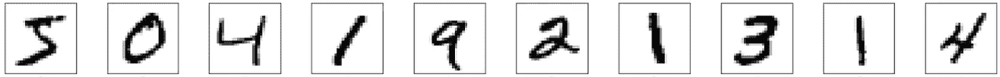

目标将是创建一个神经网络，给定一幅图像，该模型识别它所代表的数字。例如，如果我们向模型输入第一张图片，我们会期望它回答这是一张 5。下一个是 0，下一个是 4，以此类推。

## 不确定性分类问题

实际上，我们正在处理一个分类问题，给定一幅图像，模型将其分类在 0 到 9 之间。但有时，甚至我们会发现自己有某些疑问，例如，第一个图像代表 5 还是 3？

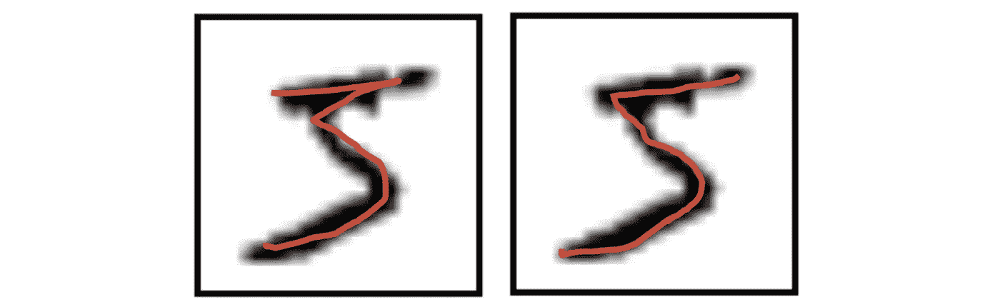

为此，我们将创建的神经网络返回一个具有 10 个位置的向量，指示 10 个可能数字中每一个的可能性:

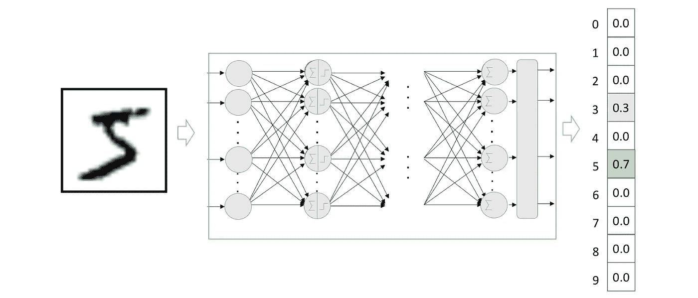

## 数据格式和操作

在下一篇文章中，我们将解释如何使用 PyTorch 编写这个例子。目前，只需提到我们将使用 MNIST 数据集来训练模型，该数据集包含 60，000 张手工制作的数字图像。这个黑白图像(包含灰度级的图像)的数据集已经归一化为 28×28 像素。

为了便于将数据摄取到我们的基本神经网络中，我们将把输入(图像)从二维(2D)转换成一维(1D)的向量。也就是说，28×28 个数字的矩阵可以由 784 个数字(逐行连接)的向量(数组)表示，这种格式接受密集连接的神经网络作为输入，就像我们将在本文中看到的那样。

如前所述，我们需要用 10 个位置的向量来表示每个标签，其中对应于表示图像的数字的位置包含 1，其余的包含 0。这个将标签转换成与不同标签的数量一样多的零的向量，并将 1 放入对应于标签的索引中的过程被称为*独热编码*。例如，数字 7 将被编码为:

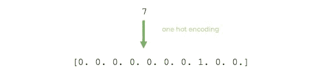

# 神经网络组件

现在我们准备开始解释基本神经网络概念的最小集合。

## 普通的人工神经元

为了展示基本神经元是怎样的，让我们假设一个简单的例子，其中我们在二维平面中有一组点，并且每个点已经被标记为“正方形”或“圆形”:

给定一个新的点“ **× 【T3”)，我们想知道它对应什么标号:**

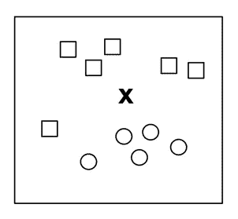

一种常见的方法是画一条线将两个组分开，并使用这条线作为分类器:

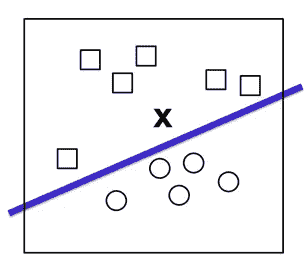

在这种情况下，输入数据将由( *x1，x2* )形式的向量表示，这些向量表示它们在这个二维空间中的坐标，我们的函数将返回‘0’或‘1’(在线的上方或下方)，以知道它应该被分类为“正方形”还是“圆形”。它可以定义为

更一般地说，我们可以将这条线表示为:

为了对输入元素 X(在我们的例子中是二维的)进行分类，我们必须学习一个与输入向量维数相同的权重向量 W，即向量( *w1，w2* )和一个 *b* 偏差。

有了这些计算值，我们现在可以构建一个人工神经元来对新元素 *X* 进行分类。基本上，神经元在输入元素 *X* 的每个维度的值上应用计算权重的向量 *W* ，并在最后添加偏差 *b.* 其结果将通过非线性“激活”函数来产生结果“0”或“1”。我们刚刚定义的这种人工神经元的功能可以用更正式的方式来表达，例如

现在，我们将需要一个函数，它对变量 *z* 进行转换，使其变成‘0’或‘1’。虽然有几个函数(“激活函数”)，但在本例中，我们将使用一个称为 *sigmoid* 函数的函数，该函数针对任何输入值返回 0 到 1 之间的实际输出值:

如果我们分析前面的公式，我们可以看到它总是倾向于给出接近 0 或 1 的值。如果输入 z 相当大且为正，则负 z*处的“e”为零，因此， *y* 取值为 1。如果 *z* 具有大的负值，那么对于“e”的大正数，公式的分母将是一个大的数字，因此 *y* 的值将接近 0。从图形上看，sigmoid 函数呈现如下形式:*

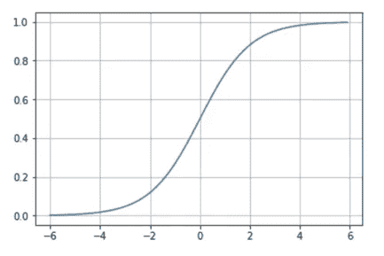

到目前为止，我们已经介绍了如何定义人工神经元，这是神经网络可以拥有的最简单的架构。特别是，这种架构在本主题的文献中被命名为**感知器**，由 Frank Rosenblatt 于 1957 年发明，并通过以下方案以一般方式进行了直观总结:

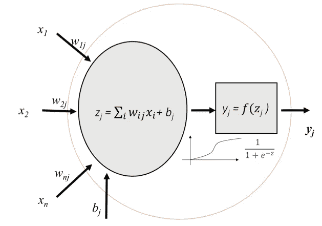

前一个神经元(我们将使用)的简化(两个)视觉表示可以是:

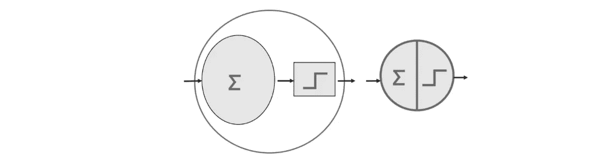

## 多层感知器

在该领域的文献中，当我们发现神经网络具有一个*输入层*，一个或多个由感知器组成的层，称为*隐藏层*，以及一个具有几个感知器的最终层，称为*输出层*时，我们称之为**多层感知器** (MLP)。一般来说，当基于神经网络的模型由多个隐层组成时，我们称之为*深度学习*。在视觉上，它可以用以下方案来表示:

MLP 通常用于分类，特别是当类别是排他性的时，如在数字图像分类的情况下(从 0 到 9 的类别)。在这种情况下，输出层返回属于每个类的概率，这要归功于一个名为 **softmax** 的函数。视觉上，我们可以用以下方式表示它:

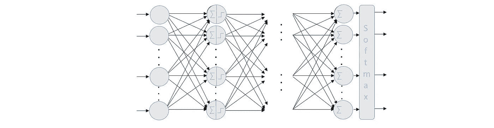

正如我们提到的，除了 *sigmoid* 之外，还有几个激活函数，每个都有不同的属性。其中之一就是我们刚刚提到的那个 *softmax* 激活函数，它将有助于呈现一个简单神经网络的示例，以在两个以上的类中进行分类。目前，我们可以将 *softmax* 函数视为 *sigmoid* 函数的推广，它允许我们对两个以上的类进行分类。

## Softmax 激活功能

我们将以这样的方式来解决这个问题:给定一个输入图像，我们将获得它是 10 个可能数字中的每一个的概率。这样，我们将有一个模型，例如，可以预测图像中的 5，但只有 70%的把握是 5。由于这幅图中数字上半部分的笔画，看起来它有 20%的几率变成 3，甚至有一定的概率变成其他数字。虽然在这种特殊情况下，我们会认为我们的模型的预测是 5，因为它是概率最高的一个，但这种使用概率分布的方法可以让我们更好地了解我们对预测的信心程度。这在这种情况下很好，因为数字是手工制作的，当然在很多情况下，我们不能 100%确定地识别数字。

因此，对于这个分类示例，我们将为每个输入示例获得一个输出向量，该输出向量具有在一组互斥标签上的概率分布。也就是说，10 个概率的向量(每个概率对应于一个数字)以及所有这 10 个概率的总和导致值 1(概率将在 0 和 1 之间表示)。

正如我们已经提出的，这是通过在我们的神经网络中使用具有 ***softmax*** 激活函数的输出层来实现的，其中该 *softmax* 层中的每个神经元取决于该层中所有其他神经元的输出，因为所有这些神经元的输出之和必须是 1。

但是 *softmax* 激活功能是如何工作的呢？ *softmax* 函数基于计算某个图像属于特定类别的“证据”,然后这些证据被转换为它属于每个可能类别的概率。

一种测量某一图像属于特定类别的证据的方法是对属于该类别的每个像素的证据进行加权求和。为了解释这个想法，我将使用一个可视化的例子。

假设我们已经学习了数字 0 的模型。目前，我们可以把模型看作是“某种东西”,它包含了知道一个数是否属于某一类的信息。在这种情况下，对于数字 0，假设我们有一个如下所示的模型:

在这种情况下，具有 28×28 像素的矩阵，其中红色像素表示负权重(即，减少其所属的证据)，而蓝色像素表示正权重(其证据是更大的增加)。白色代表中性值。

假设我们在上面画了一个零。一般来说，零点的轨迹会落在蓝色区域(请记住，我们讨论的是归一化为 20×20 像素的图像，后来以 28×28 的图像为中心)。很明显，如果我们的笔画越过红色区域，很可能我们写的不是零；因此，使用基于如果我们通过蓝色区域则相加，如果我们通过红色区域则相减的度量标准似乎是合理的。

为了确认它是一个好的度量，现在让我们想象我们画了一个三；很明显，我们用于零的前一个模型中心的红色区域会影响前面提到的指标，因为，正如我们在下图的左部看到的，当我们写 3 时，我们忽略了:

但另一方面，如果参考模型是对应于数字 3 的模型，如上图右侧所示，我们可以看到，一般来说，代表数字 3 的不同可能走线大多位于蓝色区域。

我希望读者看到这个直观的例子后，已经直觉地知道上面提到的权重的近似值是如何让我们估计出它是多少的。

一旦属于 10 个类别中的每一个的证据被计算出来，这些必须被转换成概率，其所有成分的总和加 1。为此，softmax 使用计算证据的指数值，然后将它们归一化，使总和等于 1，形成概率分布。属于类别 *i* 的概率为:

直观地说，使用指数得到的效果是，多一个单位的证据具有乘数效应，少一个单位的证据具有反效应。关于这个函数有趣的事情是，一个好的预测在向量中有一个接近 1 的值，而其余的值接近 0。在弱预测中，将有几个可能的标签，它们将具有或多或少相同的概率。

## 手写数字的神经网络模型

对于这个例子，我们将把一个非常简单的神经网络定义为两层序列。视觉上，我们可以用以下方式表示它:

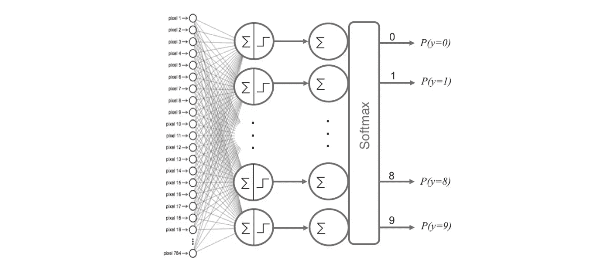

在可视化表示中，我们明确表示我们有模型的 784 个输入特征(28×28)。具有 sigmoid 激活功能的第一层 10 个神经元“提取”输入数据，以获得所需的 10 个输出，作为下一层的输入。第二层将是由 10 个神经元组成的 *softmax* 层，这意味着它将返回代表 10 个可能数字的 10 个概率值的矩阵(如我们之前所述，其中每个值将是当前数字的图像属于其中每个数字的概率)。

# 学习过程

训练我们的神经网络，即学习我们的参数值(权重 *W* 和 *b* 偏差)是深度学习最真实的部分，我们可以将神经网络中的这一学习过程视为神经元层“往返”的迭代过程。“去”是信息的前向传播，“回”是信息的后向传播。

## 训练循环

第一阶段**前向传播**发生在网络暴露于训练数据时，这些数据穿过整个神经网络以计算它们的预测(标签)。也就是说，通过网络传递输入数据，使得所有神经元将它们的变换应用于它们从前一层神经元接收的信息，并将它发送到下一层神经元。当数据已经穿过所有层，并且其所有神经元已经进行了它们的计算时，将到达最后一层，具有那些输入示例的标签预测的结果。

接下来，我们将使用一个**损失函数**来估计损失(或误差),并比较和衡量我们的预测结果相对于正确结果的好坏程度(请记住，我们是在一个受监督的学习环境中，我们有一个标签来告诉我们期望值)。理想情况下，我们希望成本为零，也就是说，估计值和期望值之间没有偏差。因此，随着模型被训练，神经元互连的权重将被逐渐调整，直到获得良好的预测。

一旦计算出损失，该信息就被反向传播。因此，它的名字:**反向传播**。从输出层开始，损失信息传播到隐藏层中直接对输出做出贡献的所有神经元。然而，基于每个神经元对原始输出的相对贡献，隐藏层的神经元仅接收总损失信号的一部分。这个过程一层一层地重复，直到网络中的所有神经元都接收到描述它们对总损失的相对贡献的损失信号。现在我们已经将这些信息传播回来，我们可以调整神经元之间连接的权重。

视觉上，我们可以用这个阶段的视觉方案(基于我们的神经网络的先前视觉表示)来总结我们已经解释的内容:

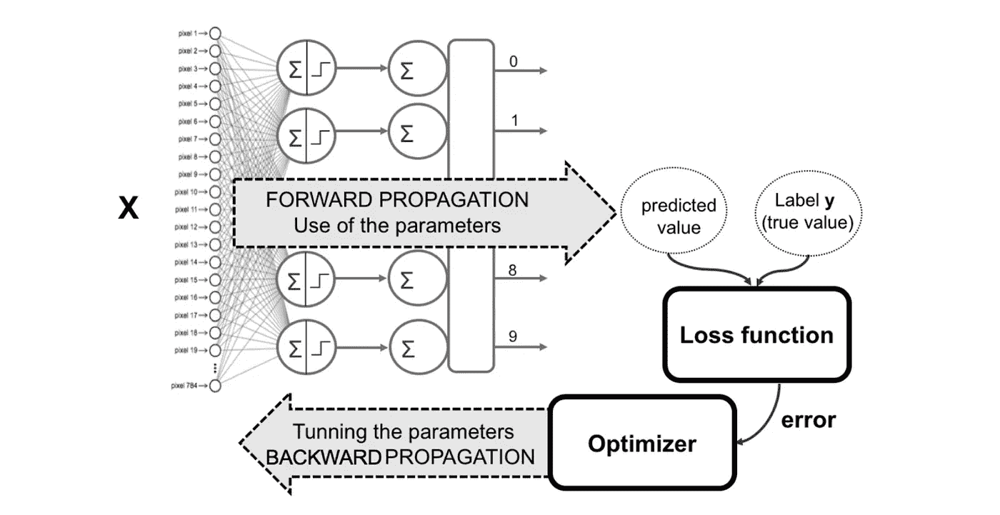

我们正在做的是，在下次使用网络进行预测时，让损失尽可能接近于零。

一般而言，我们可以将学习过程视为一个全局优化问题，其中参数(权重和偏差)必须以最小化上述损失函数的方式进行调整。在大多数情况下，这些参数无法解析求解，但一般来说，它们可以通过**优化器**(迭代优化算法)很好地逼近，例如一种称为**梯度下降**的技术。这种技术在损失函数的导数(或梯度)的计算的帮助下以小增量改变权重，这允许我们看到朝着全局最小值“下降”的方向；这通常是在我们在每次迭代中传递给网络的所有数据集的连续迭代(历元)中的成批数据中完成的。

读者可以访问深度神经网络的[学习过程](/learning-process-of-a-deep-neural-network-5a9768d7a651)一文，了解关于这个训练循环的更多细节，尽管就本节的目的而言，我不认为这是必要的。

## 交叉熵损失函数

我们可以为我们的神经网络模型选择范围广泛的损失函数。例如，确保读者知道通常用于回归的*均方误差* (MSE)损失函数。对于本文中提出的分类，通常使用的损失函数是**交叉熵**，它允许测量两个概率分布之间的差异。

交叉熵损失，或**对数损失**，衡量分类模型的性能，其输出是 0 到 1 之间的概率值。根据上下文的不同，两者略有不同，但在深度学习中，当计算 0 和 1 之间的错误率时，它们会解决相同的问题。

交叉熵损失随着预测概率偏离实际标签而增加。完美的模型的对数损失为 0。在二进制分类中，类的数量是 2，交叉熵可以计算为:

在我们的多类分类示例中，我们为每个观察值的每个类标签计算单独的损失，并对结果求和:

在哪里

*   ***C*** —类的数量(在我们的例子中是 10)
*   **日志** —自然日志
*   ***y****—二进制指示器(0 或 1)如果分类标签 **𝑐** 是观察的正确分类 **𝑜***
*   ****p*** —预测概率观测值 ***o*** 属于类 ***c****

*在这篇文章中，我回顾了神经网络的主要概念，以使读者理解深度学习的基础知识，以便在强化学习问题中使用它来编程代理。在下一篇文章中，我们将使用 PyTorch 编写这篇文章中的例子，我们将向读者介绍 PyTorch 的基本特性，这是我们将在这一系列文章中使用的框架。*

*下一篇在[见！](/deep-learning-with-pytorch-a93b09bdae96)*

# *深度强化学习讲解系列*

***由** [**UPC 巴塞罗那理工**](https://www.upc.edu/en) **和** [**巴塞罗那超级计算中心**](https://www.bsc.es/)*

*一个轻松的介绍性[系列](https://torres.ai/deep-reinforcement-learning-explained-series/)以一种实用的方式逐渐向读者介绍这项令人兴奋的技术，它是人工智能领域最新突破性进展的真正推动者。*

* [## 深度强化学习解释-乔迪托雷斯。人工智能

### 本系列的内容](https://torres.ai/deep-reinforcement-learning-explained-series/) 

# 关于这个系列

我在五月份开始写这个系列，那是在巴塞罗那的封锁期。老实说，由于封锁，在业余时间写这些帖子帮助了我 [**#StayAtHome**](https://twitter.com/hashtag/StayAtHome?src=hashtag_click) 。感谢您当年阅读这份刊物；它证明了我所做的努力。

**免责声明** —这些帖子是在巴塞罗纳封锁期间写的，作为个人消遣和传播科学知识，以防它可能对某人有所帮助，但不是为了成为 DRL 地区的学术参考文献。如果读者需要更严谨的文档，本系列的最后一篇文章提供了大量的学术资源和书籍供读者参考。作者意识到这一系列的帖子可能包含一些错误，如果目的是一个学术文件，则需要对英文文本进行修订以改进它。但是，尽管作者想提高内容的数量和质量，他的职业承诺并没有留给他这样做的自由时间。然而，作者同意提炼所有那些读者可以尽快报告的错误。*