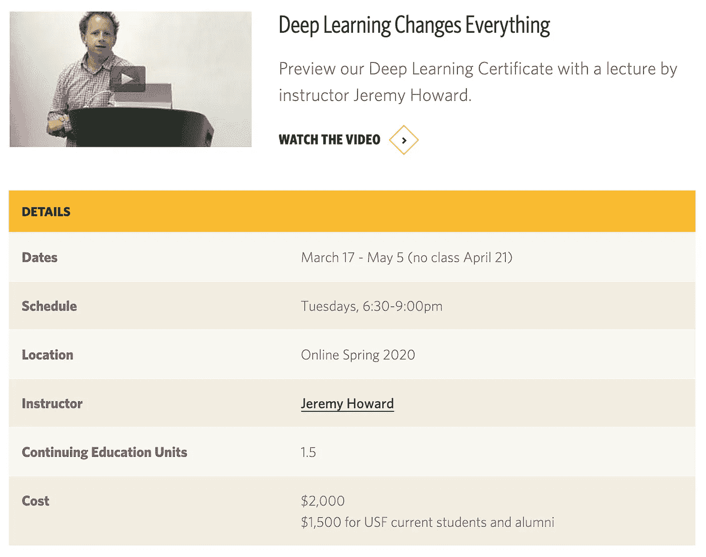
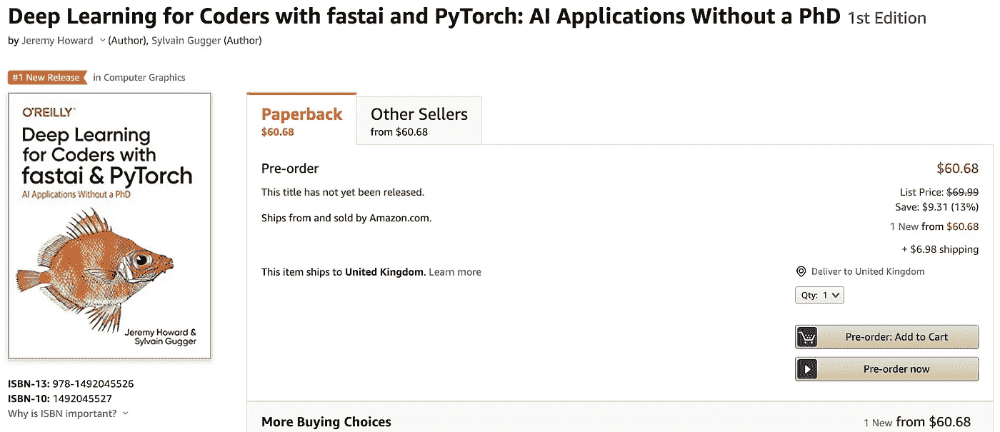
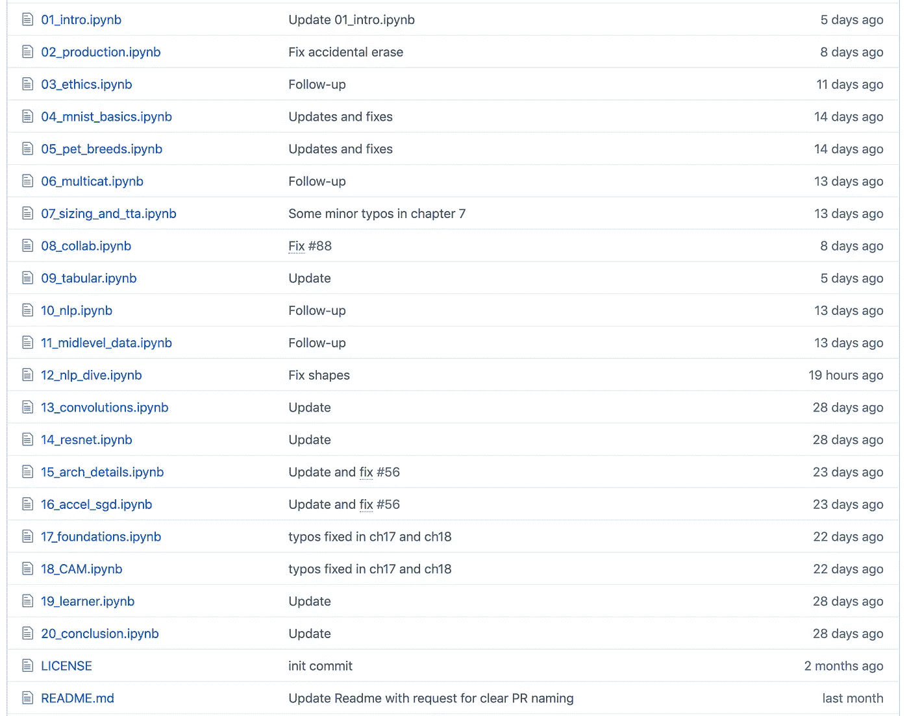

# 价值 2000 美元的深度学习课程笔记本现已开源

> 原文：<https://towardsdatascience.com/deep-learning-course-notebooks-worth-2-000-are-now-open-source-7d6bc759ef47?source=collection_archive---------15----------------------->

## 这些笔记本构成了 fast.ai 创始人 ***【杰瑞米·霍华德】***[新书](https://www.amazon.com/Deep-Learning-Coders-fastai-PyTorch/dp/1492045527)的基础，并用于[一个价值 2000 美元的深度学习课程](https://www.usfca.edu/data-institute/certificates/deep-learning-part-one)。

fast . ai 2000 美元深度学习课程

前 [Kaggle](https://www.kaggle.com/) 首席科学家，fast.ai 创始人，ai 教育家， ***杰瑞米·霍华德*** 将其 AI 课程笔记本开源。这些笔记本用于他从 2020 年 3 月开始在旧金山大学教授的一门课程。

课程笔记本代码现在可以在 GitHub 上免费获得。

> fastai 的书现在在 Github 中是免费的

两周前，杰瑞米·霍华德在 Github 上发布了讲稿的草稿。他在短短两天内收获 2k 星，迅速登上日趋势榜榜首。

另外，这个项目也是杰瑞米·霍华德新书**与 fastai & PyTorch** 合作的《程序员深度学习》的草稿，目前还没有正式发布。这相当于为您节省了 60 美元。

来源于亚马逊

虽然这本书目前处于预购状态，但它被读者寄予厚望，长期以来一直位居亚马逊计算机科学图书排行榜的第一位。

# 书籍内容

该书初稿已出版 20 章(包括引言和结论)。内容从最著名的人工智能“Hello Word problem”，MNIST 图像分类开始，然后是 NLP，递归神经网络，卷积神经网络和可解释性。

fastai 图书草稿内容来自 [Github](https://github.com/fastai/fastbook)

本课程不适合初学者，前提是具备 Python 和 PyTorch 知识。

要在 Jupyter Notebook 中运行代码，您需要安装:

> fastai v2、Graphviz、ipywidgets、matplotlib、nbdev、pandas、scikit-learn、微软 Azure 认知服务图片搜索

它们都可以通过 PyPI 直接安装。

这个 [*fastbook*](https://github.com/fastai/fastbook) 不仅仅是一本教材，更是一个 AI 社区资源。在最后的留言里，作者希望每一个完成这本书的人，和大家交流成功的经验。

# 版权

最后，提到版权是非常重要的。

从 2020 年开始，fastbook 项目中的所有内容都是杰瑞米·霍华德和西尔万·古格的版权。

笔记本和 python `.py`文件中的代码受 GPL v3 许可证的保护。其余部分(包括笔记本和其他散文中的所有减价单元格)未经许可不得进行任何形式或媒体的再分发或更改，除非复制笔记本或分叉此回购供您私人使用。**禁止商业或广播使用**。

这是来自杰瑞米·霍华德的关于开源和版权的信息

> 如果您看到有人在其他地方托管这些材料的副本，请让他们知道他们的行为是不允许的，并可能导致法律诉讼。此外，他们会伤害社区，因为如果人们忽视我们的版权，我们就不太可能以这种方式发布额外的材料。
> 
> 杰瑞米·霍华德，来自 [fastbook 自述](https://github.com/fastai/fastbook)

# 尽情享受吧！

以下是链接

*   fastbook 项目:[https://github.com/fastai/fastbook](https://github.com/fastai/fastbook)
*   课程:[https://www . usfca . edu/data-institute/certificates/deep-learning-part-one](https://www.usfca.edu/data-institute/certificates/deep-learning-part-one)