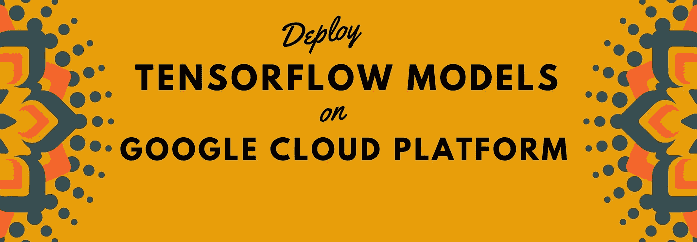
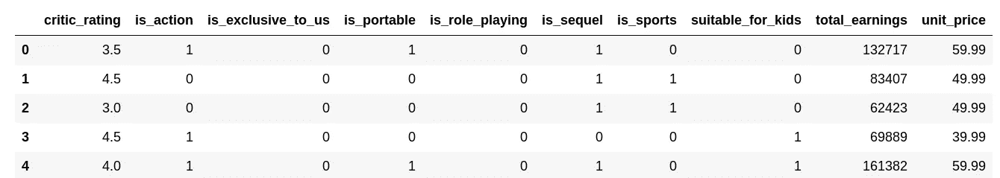
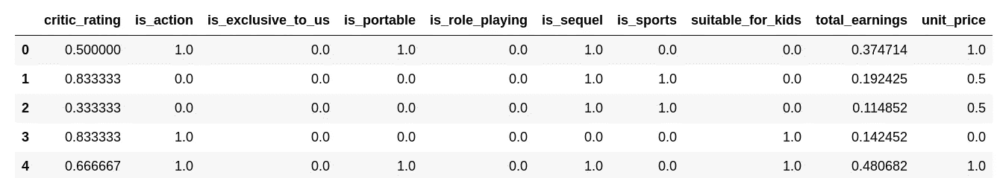
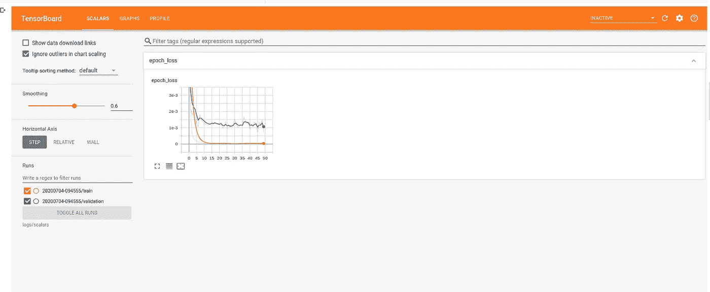
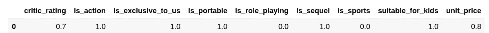

# 用 TensorFlow 建模，在 Google 云平台上服务

> 原文：<https://towardsdatascience.com/deep-learning-course-v1-guide-81a53c238901?source=collection_archive---------21----------------------->

## 实用指南

## 在可扩展的云平台上服务 TensorFlow 模型



在本指南中，我们学习如何开发一个 TensorFlow 模型，并在谷歌云平台(GCP)上提供服务。我们考虑使用 TensorFlow 和 Keras APIs 实现的三层神经网络来预测产品收益的回归问题。

本指南的主要学习成果是

1.  在 Tensorflow 中建立、编译和拟合模型
2.  在 Google colab 中设置 tensorboard
3.  保存、加载和预测看不见的数据
4.  在 Google 云平台上部署 TensorFlow 模型

在本指南中，我们将使用 TensorFlow 2.1.0 和 Google colab 运行时环境。我们将使用 google colab 来训练使用 TensorFlow 和 Keras APIS 的模型。从 TensorFlow 2.0 开始，Keras 现在是 TensorFlow 包的一部分。Google colab 在免费的 GPU 和 TPU 上提供机器学习模型的训练。因此，建议环境获得在 GPU 和 TPU 上训练您的深度学习模型的实践经验。而且可以设置 tensorboard，更好的了解模型训练。本指南附带了一个 Google colab 的工作副本，可以帮助您快速入门。

```
# Install TensorFlow >2.0
!pip install tensorflow==2.1.0
```

导入必要的 python 库以及 TensorFlow 和 Keras 函数

```
# Import libraries
import pandas as pd
from sklearn.preprocessing import MinMaxScaler
import os
import numpy as np
from __future__ import absolute_import, division, print_function, unicode_literals

import tensorflow as tf

from tensorflow.keras.layers import Dense, Flatten, Conv2D
from tensorflow.keras import Model
from tensorflow.keras.models import Sequential, load_model
```

加载张量板扩展

```
# Load tensorboard 
%load_ext tensorboard
```

## 为数据安装 Gdrive

要在 Google colab 环境中访问数据，有多种方法。我最喜欢的一个方法是将数据上传到你的 Google Drive，然后在 colab 中安装 Google Drive。

可以从 [data_deep_learning](https://github.com/amjadraza/blogs-data/tree/master/deep_leraning_tensorflow) 下载用于训练和测试的数据。可以尝试其他开源数据集试试。

我们需要安装 google drive 来读取存储在 google drive 中的数据。下面是最简单的安装方法。您将被要求输入访问过程生成的令牌。你可以参考文章《[使用 Google Colab GPU VM + Drive 作为长期深度学习训练运行的持久存储](https://medium.com/@prajwal.prashanth22/google-colab-drive-as-persistent-storage-for-long-training-runs-cb82bc1d5b71)》了解更多关于使用 Google drive 作为 Colab 的数据存储的信息。

> 我已经把数据上传到我的 google drive 上，以便于访问。你可以照着做。

```
from google.colab import drive
drive.mount('/content/drive')Go to this URL in a browser: 
Enter your authorization code:
··········
Mounted at /content/drive
```

## 加载培训和验证数据

我已经将培训和验证数据上传到我的 google drive。出于练习的目的，您可以尝试任何其他开源数据。对于本教程，数据已经准备好进入训练集和测试集，但是在实际问题中，最有可能的是数据必须逐个任务地清理和准备。在我看来，机器学习科学家几乎 50%的工作是准备与机器学习模型兼容的数据

> 确保培训、有效和测试拆分中没有信息泄漏。

最近，杰森·布朗利在他的网站【https://machinelearningmastery.com/blog/. 发表了一系列关于数据准备的文章

```
# I have already uploaded the data to my google drive

data_path= '/content/drive/My Drive/data_deep_learning_tensorflow/'

output_dir =  '/content/drive/My Drive/Deep_Learning_Course/Ex_Files_Building_Deep_Learning_Apps/'
```

阅读我们问题的训练和测试数据。目标是预测给定产品的总收入，给出下列特征。

```
# Reading the traing and test data
training_data_df = pd.read_csv(data_path + 'sales_data_training.csv')

test_data_df = pd.read_csv(data_path + 'sales_data_test.csv')training_data_df.head()
```



## 标准化要素数据

标准化是大多数机器学习模型的推荐做法，并已被证明是可行的。Scikit-learn 附带了一些业界信任的转换，用于预处理数据。

MinMaxScaler 是 Scikit-learn 转换模块中实现的常用转换之一。它在 0 和 1 之间缩放数据。在输入张量流模型训练之前，建议对训练和测试数据进行归一化。

```
scalar = MinMaxScaler(feature_range=(0,1))
scaled_training = scalar.fit_transform(training_data_df)
scaled_test = scalar.fit_transform(test_data_df)

scaled_training_df = pd.DataFrame(data = scaled_training, columns=training_data_df.columns)
scaled_test_df = pd.DataFrame(data = scaled_test, columns=training_data_df.columns)
```

让我们来看看缩放后的数据

```
scaled_training_df.head()
```



对于有监督的机器学习模型，我们将特征和目标分成`X`和`y` NumPy 数组。TensorFlow 模型也是如此，使用这种格式的数据。

```
# Splitting the feature and target columns. Using this dataset, we aim to predict total_earnings
X = scaled_training_df.drop('total_earnings', axis=1).values
Y = scaled_training_df['total_earnings'].values
```

## 用 Keras 顺序 API 定义张量流模型

为了定义深度学习模型，我们使用 TensorFlow 2.1.0 附带的 Keras API 模块。我们从一个具有两个中间 **relu** 层的基本模型开始。输入维度是 9，输出维度是 1。

```
# Define the Model

model = Sequential()

model.add(Dense(50, input_dim=9, activation = 'relu'))

model.add(Dense(100, activation = 'relu'))

model.add(Dense(50, activation = 'relu'))

model.add(Dense(1, activation = 'linear'))

model.compile(loss = 'mean_squared_error', optimizer = 'adam')
```

显示定义的模型摘要

```
model.summary()Model: "sequential_1"
_________________________________________________________________
Layer (type)                 Output Shape              Param #   
=================================================================
dense_4 (Dense)              (None, 50)                500       
_________________________________________________________________
dense_5 (Dense)              (None, 100)               5100      
_________________________________________________________________
dense_6 (Dense)              (None, 50)                5050      
_________________________________________________________________
dense_7 (Dense)              (None, 1)                 51        
=================================================================
Total params: 10,701
Trainable params: 10,701
Non-trainable params: 0
_________________________________________________________________
```

准备类似于训练数据的测试特征和目标

```
X_test = scaled_test_df.drop('total_earnings', axis=1).values
Y_test = scaled_test_df['total_earnings'].values
```

为 tensorboard 安排复试

```
# Setup for tensorboard
from datetime import datetime
logdir="logs/scalars/" + datetime.now().strftime("%Y%m%d-%H%M%S")
tensorboard_callback = tf.keras.callbacks.TensorBoard(log_dir=logdir)
```

用`verbose=0`和`epochs=50`训练模型，并将测试数据作为验证集。

```
# Train the network
training_history = model.fit(X, Y,
                             epochs = 50,
                             shuffle=True,
                             verbose=0,
                             validation_data=(X_test, Y_test),
                             callbacks=[tensorboard_callback])

print("Average test loss: ", np.average(training_history.history['loss']))Average test loss:  0.0003906410974522077
```

让我们在 tensorboard 中显示训练/验证错误

```
# Click on the view output full screen from dropdown cell menu if tensorboard does not show up itself
%tensorboard --logdir logs/scalars
```



## 验证结果

训练的验证是任何机器学习框架中非常重要的步骤之一。这里，我们互换使用验证/测试错误。

```
test_error_rate = model.evaluate(X_test,
                                 Y_test,
                                 verbose=0)
print('The mean squared error for test data is {}'.format(test_error_rate))The mean squared error for test data is 0.09696226567029953
```

## 对看不见的数据进行预测并保存模型

让我们读取样本输入数据并测试我们的模型，以预测并在本地保存模型供将来使用。

```
# Read the values of features for new product and test on our traioned model 
df_new_products = pd.read_csv(data_path + 'proposed_new_product.csv').values# Use our trained moel to predict
predictions = model.predict(df_new_products)# Scaling up the earnings prediction using our Normalisation Parameters
predictions = predictions + 0.1159
predictions = predictions/0.0000036968

print('Earnings predictions for Proposed product - ${}'.format(predictions))Earnings predictions for Proposed product - $[[270639.12]]# Save the Model

model.save(output_dir + 'trained_model.h5')

print('Trained Model saved at {}'.format(output_dir))Trained Model saved at /content/drive/My Drive/Deep_Learning_Course/Ex_Files_Building_Deep_Learning_Apps/
```

## 检索已保存的预测模型

一旦我们对模型感到满意，我们就可以在本地保存这个模型，并且可以用来对看不见的数据进行预测。这个模型可以托管在云上，你可以发送输入数据来获得预测。

```
# Importing saved model

model_trained = load_model(output_dir + 'trained_model.h5')# Read the values of features for new product and test on our traioned model 
df_new_products = pd.read_csv(data_path + 'proposed_new_product.csv').valuespredictions = model_trained.predict(df_new_products)
predictions = predictions + 0.1159
predictions = predictions/0.0000036968

print('Earnings predictions for Proposed product - ${}'.format(predictions))Earnings predictions for Proposed product - $[[270639.12]]
```

## 在 Google Cloud 上部署训练模型

一旦我们有了训练好的模型，下一个任务就是部署它来为客户服务。有各种可用的部署选项，但在这一节中，我们重点关注在谷歌云人工智能平台上部署它。

## 先决条件

在 google cloud 上部署 TensorFlow 模型的先决条件是

*   熟悉谷歌云项目
*   基本了解存储桶和 it `gsutils`命令行工具
*   基本了解与谷歌云交互的`gcloud`命令行工具
*   经过训练的 Tensorflow 2.1.0 模型
*   阅读下面的指南，了解如何部署机器学习模型的详细信息

> [如何在云人工智能平台上部署 TensorFlow 2 模型](https://blog.tensorflow.org/2020/04/how-to-deploy-tensorflow-2-models-on-cloud-ai-platform.html)

通过 colab 验证您的 google 帐户

```
from google.colab import auth
auth.authenticate_user()
```

创建一个谷歌云项目，如果没有做之前和存储模型桶。

```
# GCP project name
CLOUD_PROJECT = 'gcpessentials-rz'
BUCKET = 'gs://' + CLOUD_PROJECT + '-tf2-models'
```

将所需的项目设置为在 colab 环境中使用的默认环境变量。

```
# Set the gcloud consol to $CLOUD_PROJECT 9Environment Variable for your Desired Project)
!gcloud config set project $CLOUD_PROJECTUpdated property [core/project].
```

使用`gsutil`命令行实用程序创建 Bucket。您可以使用 python API 来创建存储桶。现在让我们坚持使用命令行方法。

```
# Create the storage bucket for tf2 Models
!gsutil mb $BUCKET
print(BUCKET)Creating gs://gcpessentials-rz-tf2-models/...
gs://gcpessentials-rz-tf2-models
```

将 TensorFlow 模型保存到刚刚创建的存储桶中。您可以确认模型文件是从 google 控制台图形用户界面上传的。

```
MODEL = 'earnings-prediction'
model.save(BUCKET + f'/{MODEL}', save_format='tf')WARNING:tensorflow:From /usr/local/lib/python3.6/dist-packages/tensorflow_core/python/ops/resource_variable_ops.py:1786: calling BaseResourceVariable.__init__ (from tensorflow.python.ops.resource_variable_ops) with constraint is deprecated and will be removed in a future version.
Instructions for updating:
If using Keras pass *_constraint arguments to layers.
INFO:tensorflow:Assets written to: gs://gcpessentials-rz-tf2-models/earnings-prediction/assets
```

## 服务于模型的配置

有两种方法可以设置在 google cloud 上服务的模型。第一个是使用 GCP 图形控制台，另一个是使用 gcloud 命令行工具，如[如何在云 AI 平台上部署 TensorFlow 2 模型](https://blog.tensorflow.org/2020/04/how-to-deploy-tensorflow-2-models-on-cloud-ai-platform.html)中所述。我跟随 GCP 控制台进行了这次部署。一些关键点

*   确保您的模型数据上传到存储桶中
*   建议对您的模型和存储桶使用相同的区域(有时会产生问题)。
*   请耐心等待，创建模型/版本可能需要几分钟时间
*   第一次做的时候，仔细阅读所有的说明

```
!gcloud ai-platform versions create $VERSION \
  --model $MODEL \
  --origin $MODEL_DIR \
  --runtime-version=2.1 \
  --framework='tensorflow' \
  --python-version=3.7
```

## 获取已部署模型的预测

一旦部署了模型，并且您可以看到绿色的勾号，就该测试模型的预测了。一些需要考虑的要点。

*   使用**测试&测试模型预测使用您的版本或模型选项卡下的**选项卡。
*   输入 JSON 数据取决于您如何定义您的模型

```
# [Reference](https://github.com/GoogleCloudPlatform/python-docs-samples/blob/master/ml_engine/online_prediction/predict.py)

import googleapiclient.discovery

def predict_json(project, model, instances, version=None):

    service = googleapiclient.discovery.build('ml', 'v1')
    name = 'projects/{}/models/{}'.format(project, model)

    if version is not None:
        name += '/versions/{}'.format(version)

    response = service.projects().predict(
        name=name,
        body={'instances': instances}
    ).execute()

    if 'error' in response:
        raise RuntimeError(response['error'])

    return response['predictions']
```

加载看不见的数据进行预测

```
df_new_products = pd.read_csv(data_path + 'proposed_new_product.csv')df_new_products
```



将数据转换成 JSON 格式，以便与上面写的`predict_json`程序兼容。

```
tdata_instances = {'dense_input':df_new_products.values[0].tolist()}predictions_gcloud = predict_json(CLOUD_PROJECT, 'earnings_prediction', tdata_instances, version='v1')
predictions_gcloud = predictions_gcloud[0]['dense_3'][0] + 0.1159
predictions_gcloud = predictions_gcloud/0.0000036968

print('Earnings predictions for Proposed product - ${}'.format(predictions_gcloud))Earnings predictions for Proposed product - $261848.21778936993
```

# 谷歌 Colab 笔记本

按照下面的谷歌合作笔记本来复制和实践这个指南。

# 结论

在本指南中，我们学习了使用 TensorFlow 2.1.0 训练深度学习模型，并将训练好的模型部署在谷歌云平台上。以下是指南的重点。

*   安装 TensorFlow 2.1..google colab 中的 0
*   在 google colab 中设置 tensorboard
*   使用 TensorFlow 构建、编译和训练模型
*   评估并保存训练好的模型
*   加载已保存的模型以根据看不见的数据进行预测
*   在 Google Cloud 上部署模型
*   使用云中部署的模型进行预测

# 参考资料/阅读/链接

1.  [https://blog . tensor flow . org/2020/04/how-to-deploy-tensor flow-2-models-on-cloud-ai-platform . html](https://blog.tensorflow.org/2020/04/how-to-deploy-tensorflow-2-models-on-cloud-ai-platform.html)
2.  https://scikit-learn.org/stable/modules/preprocessing.html
3.  【https://www.tensorflow.org/tutorials/keras/regression 
4.  [https://www.tensorflow.org/tutorials/keras/save_and_load](https://www.tensorflow.org/tutorials/keras/save_and_load)