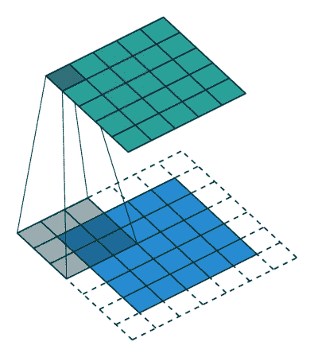
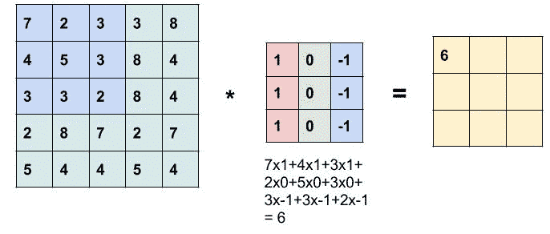

# 计算机视觉的深度学习

> 原文：<https://towardsdatascience.com/deep-learning-for-computer-vision-c4e5f191c522?source=collection_archive---------35----------------------->

## 理解 CNN 的卷积层、池层和全连接层

计算机视觉中的深度学习在短时间内取得了快速进展。深度学习在计算机视觉中的一些应用包括人脸识别系统、自动驾驶汽车等。

本文介绍了卷积神经网络，也称为 *convnets* ，这是一种广泛用于计算机视觉应用的深度学习模型。我们将深入了解它的组件、卷积层、池层和全连接层等层，以及如何应用它们来解决各种问题。

所以让我们开始吧。

## 有线电视新闻网的目标:


猫

上面是一只猫的图片，小时候我们被告知这种动物是猫。随着我们长大，学习和看到更多猫的图像，我们的大脑记录了它的各种特征，如眼睛、耳朵、面部结构、胡须等。下一次我们看到具有这些特征的动物图像时，我们能够预测它是一只猫，因为这是我们从经验中学到的。

现在我们需要在计算机上模拟同样的行为。这类问题在计算机视觉中被称为图像分类问题，我们试图识别图像中存在的对象。

给定一幅图像，首先计算机应该能够提取它的特征，然后根据这些特征，预测那个物体是什么。他们如何实现这一目标？嗯，简单的答案是通过 CNN。他们是如何做到这一点的，我们将深入探讨。

## CNN 简介:

因此，CNN 的目标是执行两个任务:第一个是特征提取，第二个是聚集所有提取的特征并基于它进行预测。

在我们深入研究各个组件之前，让我们看看 CNN 是什么样子的。


描绘 Conv、池化和全连接层的 CNN 架构示例来源:[https://www . learnopencv . com/WP-content/uploads/2017/11/CNN-schema 1 . jpg](https://www.learnopencv.com/wp-content/uploads/2017/11/cnn-schema1.jpg)

从上图中，我们可以看到三种类型的层，分别是:**卷积层、汇聚层和全连接层**。(我们将在接下来的章节中讨论这些)

如果上面的图片没有完全理解，那也没关系。我们看到这一点的原因是为了在脑海中想象 CNN 是什么样子，这样一旦我们理解了它的各个层次，我们就可以很容易地将这些点联系起来。

## 卷积运算:

卷积是细胞神经网络的基本构件之一。卷积运算的主要目的是从输入图像中提取边缘、曲线、拐角、梯度方向等特征。我们将通过一个边缘检测示例来理解卷积运算。

给定一幅图像，我们想要提取该图像中所有的水平和垂直边缘。下图描述了同样的情况。


卷积运算的例子

假设我们有一个 6x6 的灰度图像。现在，为了检测图像中的边缘，我们构建了一个 3x3 的矩阵。在 CNN 的术语中，它被称为过滤器或内核。使用这两个矩阵，我们将执行卷积运算。结果矩阵，即卷积运算的输出将是大小为 4×4 的矩阵。下图描述了同样的情况。


卷积运算的例子

现在，我们如何计算得到的 4x4 矩阵的元素如下:
为了计算左上角的元素，我们将使用 3x3 滤镜并将其粘贴到原始输入图像的 3x3 区域的顶部。接下来，我们将做元素方面的乘积来给出我们想要的值。


接下来，为了计算第二个元素，我们将滤波器(即黄色方块)向右移动一步，进行相同的元素乘积，然后将它们相加。同样，我们可以填充该行的所有元素。


向右滑动过滤器一步以获得所需的值

现在，为了获得下一行中的元素，我们将把过滤器向下移动到下一行，重复相同的元素级乘积，并将它们相加。因此，我们可以同样地填充其余的元素。下面向我们展示了最终的结果。


卷积运算

这里有几点。当使用 3×3 矩阵进行卷积时，6×6 矩阵得到 4×4 矩阵。这些本质上是矩阵。但是左边的矩阵便于解释为输入图像，中间的一个解释为滤波器，右边的一个解释为输出特征。

输出特征尺寸的计算如下:

```
n x n input image       f x f filter**output dimension = (n - f + 1)**Above example:        6 x 6 input image       3 x 3 filter
                      (6 - 3 + 1) x (6 - 3 + 1)
output dimensions =   4 x 4
```

注意:我们的过滤器的值通常被称为权重。我们如何决定重量值是在训练中学到的。它们用一些随机值初始化，并随着每个训练步骤不断调整。

## 填料

每次执行卷积运算时，我们都会丢失边界像素中的一些信息。此外，我们的形象缩小了一点。有时，我们会希望减少输出大小，以节省训练期间的资源消耗。然而，有时我们可能希望保持输出和输入的空间维度不变。为此，我们可以使用填充的概念。

填充只是在输入要素的每一侧添加适当数量的行和列。填充实质上使过滤器产生的特征图与原始图像的大小相同。



带填充的卷积，p = 1 来源:[https://github.com/vdumoulin/conv_arithmetic](https://github.com/vdumoulin/conv_arithmetic)

在图(左)中，一个尺寸为 5x5 的蓝色正方形代表我们的输入图像，它通过在每边添加几行零来填充。当使用 3×3 滤波器进行卷积时，输出维数与输入维数相同，即 5×5，如绿色方块所示。如果我们没有使用填充，输出尺寸将是 3x3。因此，填充 1 保持了输入和输出的空间维度相同。

## 有效且相同的填充

让我们根据是否添加填充来理解术语。

**有效**:当卷积期间没有添加填充，并且我们的结果输出是收缩尺寸时。示例:

```
Input size:   6 x 6   (i x i)
Filter size:  3 x 3   (f x f)
Output size: (i – f + 1)
             (6 – 3 + 1) = 4
             = 4 x 4
```

**相同**:添加填充，使输出尺寸与输入尺寸相同时。为了计算输出尺寸，我们对上面的公式进行了修改，以考虑填充参数。示例:

```
Input size:        6 x 6   (i x i)
Filter size:       3 x 3   (f x f)
Padding:           1       (p)
Output size:       **(i + 2p - f +1)**    
                   (6 + 2x1 – 3 + 1) = 6
                   = 6 x 6
```

注意:按照惯例，滤波器尺寸 *f* 通常是奇数，否则填充将是不对称的。一些最常用的过滤器尺寸为 3x3、5x5 和 1x1。

## 阔步

在我们的工作示例中，为了计算下一个元素，我们将过滤器向右移动一位。我们在输入图像上移动过滤器的行数是我们的步幅参数。

跨距定义了遍历图像时滤波器的步长。默认情况下，在任何框架中它都可能是 1。


步幅 s = 2 的卷积来源:[https://github.com/vdumoulin/conv_arithmetic](https://github.com/vdumoulin/conv_arithmetic)

在左图中，一个 5x5 的蓝色方块代表我们的输入图像。使用 3x3 滤波器进行卷积时，步长值为 2，我们得到了尺寸为 2x2 的下采样输出图。如果我们保持 stride 为 1，输出维度将是 3x3。

因此，我们可以在训练中增加步幅(步)长度以节省空间或减少计算时间。然而，当这样做时，我们将放弃一些信息，因此这是资源消耗(无论是 CPU 还是内存)和从输入中检索信息之间的权衡。

注意:一般来说，我们通常将步幅值保持为 1，并使用其他方法对我们的特征地图进行下采样，如使用池图层。

## 卷积运算概述:

卷积运算的主要目的是从输入图像中提取有意义的信息，如边缘、曲线等。下面的动画总结了卷积运算中元素的计算方式。



卷积运算概述

以下等式总结了输出要素地图的尺寸。


公式

使用上述等式的示例:

```
**6x6** input image,  **3x3** filter    |    **7x7** input image, **3x3** filter
padding **p=1**   &  stride, **s=1**    |    padding **p=1**  &  stride, **s=2**
                                |
                                |
Output size:                    |    Output size:
(6 + 2*1 – 3)/1 + 1 = 6         |    (7 + 2*1 - 3)/2 = 4
**6 x 6**                           |    **4 x 4**
```

## 体积卷积:

我们已经完成了矩阵的卷积运算。现在让我们了解如何对体积执行卷积运算，这将使它更加强大。以前我们有一个 6x6 的灰度图像。现在，让我们假设我们有一个 6x6 的 RGB 图像，因此它的尺寸将为 6x6x3，而不是 3x3 的滤镜，这次我们将使用 3x3x3 的滤镜。

输出大小仍为 4x4(与之前相同)，但是，元素的计算方法是在每个通道中执行元素乘积，然后将它们相加，如下所示:


体积卷积:每个通道中的元素乘积，然后将它们相加。来源:[https://indoml . com/2018/03/07/student-notes-convolutionary-neural-networks-CNN-introduction/](https://indoml.com/2018/03/07/student-notes-convolutional-neural-networks-cnn-introduction/)

这里需要注意的一点是，输入和滤波器中的通道数必须相等。我们这样做的原因是，它允许我们在不同通道上使用不同的滤波器，比如在所有通道中使用边缘检测器，以提取更有意义的信息。所以想法是一样的。在输出要素地图中获取尽可能多的信息。

注意:过滤器中的通道数通常没有明确规定。假设它等于输入的深度。例如，如果我们有一个尺寸为 26x26x64 的输入，我们使用一个尺寸为 3x3 的滤波器进行卷积，这意味着滤波器中的通道数将为 64，因此其实际尺寸为 3x3x64。

## 使用多个过滤器的卷积:

现在我们知道如何对体积进行卷积，那么增加滤波器的数量怎么样？每个过滤器提取一些特征，像一个是提取垂直边缘，另一个是水平或 45 度线等。换句话说，扩展卷积以使用多个滤波器。

扩展我们的工作示例，我们仍然有一个 6x6x3 的输入。现在，我们有两个 3x3 维度的过滤器，而不是一个(深度为 3 是隐含的)。使用每个滤波器以类似的方式执行卷积操作。因此，我们将获得两个 4x4 输出特征地图。将一个堆叠在另一个之上，我们可以说输出尺寸为 4x4x2，如下所示:


使用 2 个滤波器的卷积。输出是两个 4x4 特征地图。每个过滤器一个来源:[https://indoml . com/2018/03/07/student-notes-convolutionary-neural-networks-CNN-introduction/](https://indoml.com/2018/03/07/student-notes-convolutional-neural-networks-cnn-introduction/)

因此，我们现在可以根据过滤器的数量来检测多个特征。卷积的真正力量得到了释放，因为现在我们可以从输入中提取大量的语义信息。

让我们考虑一个例子来理解多个过滤器中存在的值(权重)的数量:

```
Input Volume dimensions: **26x26x64**      
filter Size: **3x3**(since input depth=64, filter depth will also be 64)
and we have **32** such filters being used for feature extraction**Hence, total number of weights in our filter will be:**
  weights in one filter = **3 x 3 x 64 = 576**
  Total filters = **32**
  Total weights = **32 x 576 = 18,432**
```

这都是关于卷积运算的。现在让我们看看 CNN 中的典型卷积层是什么样子的:

## 卷积层:

在上面的例子中，我们得到了两个 4x4 的输出图。现在，我们将为每个输出图添加一个偏差。偏差是一个实数，我们将它添加到每个特征图的所有 16 个元素中。偏差就像线性方程中添加的截距，用于模拟真实世界的场景。然后，我们将通过应用激活函数来添加非线性。

没有激活函数的神经网络将简单地是线性回归模型**，**，其能力有限，并且在大多数时间不能很好地工作。如果没有激活功能，我们的神经网络将无法学习和模拟复杂类型的数据，如图像、视频等。

激活函数有多种选择，最流行的是 ReLU 激活函数。

> ReLU 函数如果看到正整数，将返回相同的数字，如果看到负数，将返回零。

它纠正了消失梯度问题。此外，从 *tanh* 激活函数来看，它在收敛方面好了 6 倍。(关于激活功能的更多信息将在另一篇文章中介绍)。

下图描述了偏置加法，并将 ReLU 激活应用于我们的示例:


卷积层的整体计算

我们从 6x6x3 到 4x4x2 输出图的整个计算是 CNN 中的一个卷积层。卷积运算的目的是从输入图像中提取高级特征，例如边缘。 *Convnets* 不需要仅限于单个卷积层。

传统上，第一卷积层负责捕获低级特征，例如边缘、颜色、梯度方向等。随着图层的增加，该架构也适应了高级功能，为我们提供了一个对数据集中的图像有全面了解的网络，就像我们会做的那样。

## 池层:

除了卷积层， *convnets* 还使用池层来减少我们的表示大小，以加快计算速度。池化负责减小卷积要素的空间大小，从而降低处理数据所需的计算能力。

该操作的工作原理如下:


在图(左)中，以步幅 2 遍历输入图像上的 2×2 窗口，并且最大值保留在每个象限中。这被称为最大池操作。

最常见的形式是池图层，其大小为 2x2 的过滤器以 2 的步长应用，沿宽度和高度对输入中的每个深度切片进行 2 倍缩减采样。直觉是，如果在任何象限中存在一个特性，池将通过保持激活功能将启动的高数值来试图保留该特性

池化减少了要处理的要素地图系数的数量，并促使网络学习要素的空间等级，即，使连续的卷积层根据它们覆盖的原始输入的部分来查看越来越大的窗口。


两种类型的汇集操作

有两种类型的池:最大和平均池**。**最大池返回过滤器覆盖的图像部分的最大值。平均池返回内核覆盖的图像部分的所有值的平均值。

注意:在池化层的培训中没有需要学习的参数。具有较大感受野的池大小具有太大的破坏性。

## 完全连接层:

完全连接图层的目的是获取卷积/池化过程的结果，并使用它们将图像分类到标签中。这些层的作用与传统深度神经网络中的层相同。主要区别是输入将是由 CNN 的早期阶段(卷积层和池层)创建的形状和形式。


完全连接的层

展平是将数据转换为一维数组，以将其输入到完全连接的层。


展平，FC 输入层，FC 输出层

FC 输入层将展平的矢量作为输入，并应用权重和激活来预测正确的标签。FC 输出层给出了每个标签的最终概率。两层的区别在于激活功能。ReLU 输入，softmax 输出。(我们将在另一篇文章中对此进行更深入的讨论)

## 总结:

*   CNN 主要有两个目标:特征提取和分类。
*   CNN 有三层，即卷积层、汇集层和全连接层。CNN 的每一层都学习越来越复杂的过滤器。
*   第一层学习基本的特征检测过滤器:边缘、拐角等
*   中间层学习检测物体部分的过滤器。对于面部，他们可能会学会对眼睛、鼻子等做出反应
*   最后一层有更高的表现:他们学习识别不同形状和位置的完整物体。


CNN 架构示例

要实现一个示例 CNN，您可以在这里按照[的指导实现](https://github.com/rktayal/multiclass_training_cnn)。