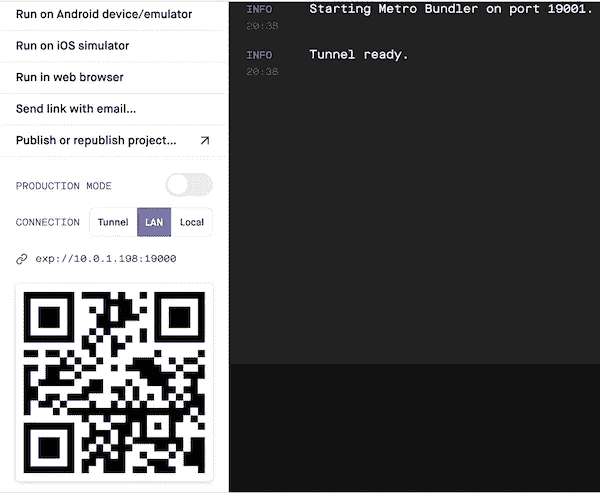
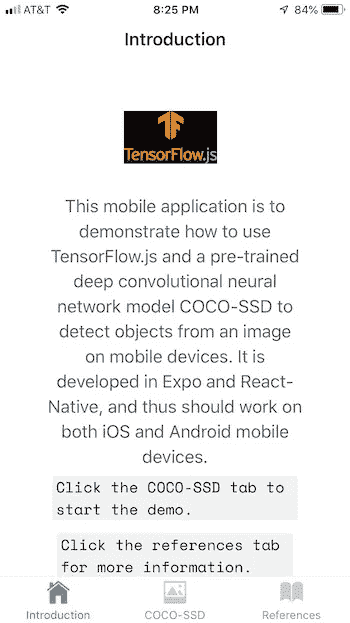
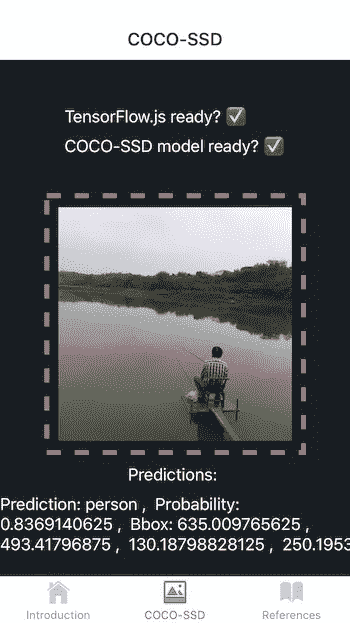
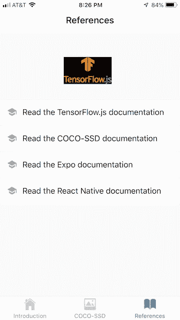

# 用于在移动设备上检测图像中的对象的深度学习

> 原文：<https://towardsdatascience.com/deep-learning-for-detecting-objects-in-an-image-on-mobile-devices-7d5b2e5621f9?source=collection_archive---------24----------------------->

## 使用 Expo、React-Native、TensorFlow.js 和 COCO-SSD 开发移动对象检测应用程序


作者照片

最近我发表了一篇文章[【1】](/deep-learning-for-image-classification-on-mobile-devices-f93efac860fd)，演示如何使用[Expo](https://docs.expo.io/versions/v37.0.0/)【2】、[React](https://reactjs.org/docs/introducing-jsx.html)【3】和[React Native](https://reactnative.dev/docs/getting-started)【4】开发一个多页面移动应用程序，该应用程序使用 tensor flow . js【5】和一个预先训练好的卷积神经网络模型 [MobileNet](https://github.com/tensorflow/tfjs-models/tree/master/mobilenet) 在移动设备上进行图像分类。

如[1]中所述，[React](https://reactjs.org/docs/introducing-jsx.html)【3】是一个用于构建 Web 用户界面的流行 JavaScript 框架。Reactive Native 继承和扩展了组件框架(如组件、道具、状态、 [JSX](https://reactjs.org/docs/introducing-jsx.html) 等)。)的 React，以支持使用预构建的原生组件(如*视图*、*文本*、*触摸不透明、*等)开发原生 Android 和 iOS 应用。特定于移动平台的语言(例如 Object-C、Swift、Java 等)中的本机代码。)通常使用 Xcode 或 Android Studio 开发。为了简化移动应用程序开发，Expo 为我们提供了一个围绕 React 原生和移动原生平台构建的框架和平台，允许我们使用 JavaScript/TypeScript 在 iOS、Android 和 web 应用程序上开发、构建和部署移动应用程序。因此，任何文本编辑器工具都可以用于编码。

关于机器学习移动应用，[tensor flow . js for React Native](https://blog.tensorflow.org/2020/02/tensorflowjs-for-react-native-is-here.html)是我们训练新的机器学习和深度学习模型和/或直接在移动设备上使用预训练模型进行预测和其他机器学习目的的强大使能器。

在本文中，与[1]类似，我开发了一个多页面移动应用程序来演示如何使用 TensorFlow.js [5]和一个预训练的卷积神经网络模型 COCO-SSD [6][7]，一个新的 SSD(单次多盒检测器)[8]，用于在移动设备上检测图像中的 COCO(上下文中的常见对象)[9]。

与[1]类似，这个移动应用在 Mac 上开发如下:

*   使用 Expo 生成多页面应用程序模板
*   安装库
*   在 [React JSX](https://reactjs.org/docs/introducing-jsx.html) 开发移动应用代码
*   编译和运行

假设最新的 [node.js](https://nodejs.org/en/download/) 已经安装在你的本地电脑/笔记本电脑上，比如 Mac。

# 1.正在生成项目模板

为了使用 *Expo CLI* 自动生成一个新的项目模板，首先需要安装 *Expo CLI* :

```
npm install *expo-cli*
```

然后可以生成一个新的 Expo 项目模板，如下所示:

```
expo init *coco-ssd
cd coco-ssd*
```

本文中的项目名称为 *coco-ssd* 。

如[1]中所述，我选择世博管理工作流的选项卡模板来自动生成几个示例屏幕和导航选项卡。TensorFlow logo 图像文件[tfjs.jpg](https://github.com/amandeepmittal/mobilenet-tfjs-expo/blob/master/assets/tfjs.jpg)在本项目中使用，需要存储在生成的。/assets/images 目录。

# 2.安装库

为移动设备开发对象检测应用程序需要安装以下库:

*   [@tensorflow/tfjs](http://twitter.com/tensorflow/tfjs) ，即 TensorFlow.js，一个用于训练和部署机器学习模型的开源硬件加速 JavaScript 库。
*   [@ tensor flow/tfjs-react-native](http://twitter.com/tensorflow/tfjs-react-native)，TensorFlow.js 在移动设备上新的平台集成和后端。
*   [@ React-Native-community/async-storage](https://github.com/react-native-community/async-storage)，React Native 的异步、未加密、持久、键值存储系统。
*   [@ tensor flow-models/coco-SSD](https://github.com/tensorflow/tfjs-models/tree/master/coco-ssd)，预训练模型，可以将图像作为输入，并返回一组最可能的对象类预测、它们的置信度和位置(边界框)。
*   expo-gl ，提供了一个视图，作为 [OpenGL ES](https://en.wikipedia.org/wiki/OpenGL_ES) 渲染目标，用于渲染 2D 和 3D 图形。
*   [jpeg-js](https://www.npmjs.com/package/jpeg-js) ，node.js 的纯 javascript JPEG 编码器和解码器

```
npm install [*@react*](http://twitter.com/react)*-native-community/async-storage* [*@tensorflow/tfjs*](http://twitter.com/tensorflow/tfjs)[*@tensorflow/tfjs-react-native*](http://twitter.com/tensorflow/tfjs-react-native) *expo-gl* [*@tensorflow*](http://twitter.com/tensorflow)*-models/coco-ssd jpeg-js*
```

此外，*@ tensor flow/tfjs-react-native/dist/bundle _ resource _ io . js*需要*react-native-fs*(react-native 的原生文件系统访问):

```
npm install *react-native-fs*
```

[*Expo-camera*](https://www.npmjs.com/package/expo-camera)*(为设备的前置或后置摄像头渲染预览的 React 组件)也是需要的，因为它在[*@ tensor flow/tfjs-React-native*](http://twitter.com/tensorflow/tfjs-react-native)*/dist/camera/camera _ stream . js*中使用。*

```
*expo install *expo-camera**
```

# *3.开发移动应用程序代码*

*如前所述，首先我使用 *Expo CLI* 自动生成示例屏幕和导航标签。然后，我修改了生成的屏幕，并添加了一个新的屏幕来检测图像中的对象。以下是生成的屏幕:*

*   *简介屏幕(参见图 2)*
*   *对象检测 COCO-SSD 屏幕(参见图 3 和图 4)*
*   *参考屏幕(参见图 5)*

*屏幕底部有三个相应的选项卡用于导航。*

*本文主要讨论 COCO-SSD 屏幕类(源代码见[10]),用于图像中的对象检测。本节的其余部分将讨论对象检测的实现细节。*

# *3.1 准备 TensorFlow、COCO-SSD 模型和摄像机访问*

*生命周期方法*componentidmount*()用于初始化 TensorFlow.js，加载预先训练好的 COCO-SSD 模型，在 COCO-SSD 屏幕的用户界面准备就绪后，获取移动设备上访问摄像头的权限。*

```
*async componentDidMount() {
    await tf.ready(); // preparing TensorFlow
    this.setState({ isTfReady: true});    
    this.model = await cocossd.load(); // preparing COCO-SSD model
    this.setState({ isModelReady: true });       
    this.getPermissionAsync(); 
}getPermissionAsync = async () => {
    if (Constants.platform.ios) {
        const { status } = await Permissions.askAsync(Permissions.CAMERA_ROLL)
        if (status !== 'granted') {
            alert('Please grant camera roll permission for this project!')
        }
    }
}*
```

# *3.2 选择图像*

*一旦 TensorFlow 库和 COCO-SSD 模型准备就绪，就调用方法 *selectImage* ()来选择移动设备上的图像以进行对象检测。*

```
*selectImage = async () => {
    try {
      let response = await ImagePicker.launchImageLibraryAsync({
        mediaTypes: ImagePicker.MediaTypeOptions.All,
        allowsEditing: true,
        aspect: [4, 3]
      }) if (!response.cancelled) {
        const source = { uri: response.uri }
        this.setState({ image: source })
        this.detectObjects()
      }
    } catch (error) {
      console.log(error)
    }
}*
```

# *3.3 检测图像中的对象*

*一旦在移动设备上选择了图像，就会调用 *detectObjects* ()方法来检测图像中的对象。*

*在该方法中，首先使用 TensorFlow React Native 的 *fetch* API 在移动设备上加载选定的图像。然后调用方法 *imageToTensor* ()将加载的原始图像数据转换为 3D 图像张量。最后，调用准备好的 COCO-SSD 模型，以将 3D 图像张量作为输入，并生成检测到的对象的列表及其类别、概率和位置(边界框)。*

```
*detectObjects = async () => {
    try {
      const imageAssetPath = Image.resolveAssetSource(this.state.image)
      const response = await fetch(imageAssetPath.uri, {}, { isBinary: true })
      const rawImageData = await response.arrayBuffer()
      const imageTensor = this.imageToTensor(rawImageData)
      const predictions = await this.model.detect(imageTensor)
      this.setState({ predictions: predictions })
    } catch (error) {
      console.log('Exception Error: ', error)
    }
}imageToTensor(rawImageData) {
    const TO_UINT8ARRAY = true
    const { width, height, data } = jpeg.decode(rawImageData, TO_UINT8ARRAY)
    // Drop the alpha channel info for COCO-SSD
    const buffer = new Uint8Array(width * height * 3)
    let offset = 0 // offset into original data
    for (let i = 0; i < buffer.length; i += 3) {
      buffer[i] = data[offset]
      buffer[i + 1] = data[offset + 1]
      buffer[i + 2] = data[offset + 2]      
      offset += 4
    }    
    return tf.tensor3d(buffer, [height, width, 3])
}*
```

*注意， *fetch* API 有两个版本，一个是 React *fetch* API，另一个是 TensorFlow React Native 的 *fetch* API。正确的是 TensorFlow React Native 的 *fetch* ，可以安装如下:*

```
*import { fetch } from ‘[@tensorflow/tfjs-react-native](http://twitter.com/tensorflow/tfjs-react-native)’*
```

# *3.4 上报对象检测结果*

*一旦物体检测完成，调用方法 *renderPrediction* ()在移动设备的屏幕上显示物体检测结果。*

```
*renderPrediction = (prediction, index) => {
    const pclass = prediction.class;
    const score  = prediction.score;
    const x = prediction.bbox[0];
    const y = prediction.bbox[1];
    const w = prediction.bbox[2];
    const h = prediction.bbox[3]; return (
      <View style={styles.welcomeContainer}>
        <Text  key={index} style={styles.text}>
          Prediction: {pclass} {', '} Probability: {score} {', '} Bbox: {x} {', '} {y} {', '} {w} {', '} {h} 
        </Text>
      </View>
    )
}*
```

# *4.编译和运行移动应用程序*

*本文中的移动应用程序由一个 react 本地应用服务器和一个或多个移动客户端组成。移动客户端可以是 iOS 模拟器、Android 模拟器、iOS 设备(例如，iPhone 和 iPad)、Android 设备等。我验证了 Mac 上的移动应用服务器和 iPhone 6+和 iPad 上的移动客户端。*

# *4.1 启动 React 本地应用服务器*

*如[1]中所述，在任何移动客户端可以开始运行之前，移动应用服务器需要启动。以下命令可用于编译和运行 react 本地应用服务器:*

```
*npm install
npm start*
```

*如果一切顺利，应该会出现如图 1 所示的 Web 界面。*

**

***图 1:** React 原生应用服务器。*

# *4.2 启动移动客户端*

*一旦移动应用服务器开始运行，我们就可以在移动设备上启动移动客户端。*

*因为我在本文中使用 Expo [2]进行开发，所以在移动设备上需要相应的 Expo 客户端/应用程序。iOS 移动设备的 Expo 客户端应用程序在苹果商店免费提供。*

*在 iOS 设备上安装 Expo 客户端应用后，我们可以使用移动设备上的摄像头扫描 react 本地应用服务器的条形码(见图 1)，以使用 Expo 客户端应用运行移动应用。*

*图 2 显示了 iOS 设备(iPhone 和 iPad)上移动应用程序的简介屏幕。*

**

***图二:**介绍画面。*

*图 3 和图 4 示出了检测图像中物体的两种不同场景。图 3 示出了在图像中检测汽车和卡车的屏幕。*

**

***图 3:** 检测图像中的汽车和卡车。*

*以下是对象检测的输出:*

```
*Array [
  Object {
    "bbox": Array [
      61.6607666015625,
      700.927734375,
      230.8502197265625,
      185.11962890625,
    ],
    "class": "car",
    "score": 0.8818359375,
  },
  Object {
    "bbox": Array [
      292.78564453125,
      651.4892578125,
      279.60205078125,
      160.94970703125,
    ],
    "class": "truck",
    "score": 0.61669921875,
  },
]*
```

*图 4 示出了检测图像中的人的屏幕。*

**

***图 4:** 检测图像中的人。*

*图 5 显示了参考屏幕。*

**

***图 5:** 参考屏幕。*

# *5.摘要*

*与[1]类似，在本文中，我使用 Expo [2]、[、React JSX](https://reactjs.org/docs/introducing-jsx.html)、[3]、React Native [4]、React Native 的 TensorFlow.js 和预训练的卷积神经网络模型 COCO-SSD [6]开发了一个多页面移动应用程序，用于在移动设备上检测图像中的对象。*

*我验证了 Mac 上的移动应用服务器和 iOS 移动设备(iPhone 和 iPad)上的移动应用客户端。*

*正如[1]和本文所展示的那样，这种移动应用程序有可能被用作开发其他机器学习和深度学习移动应用程序的模板。*

*本文的移动应用程序项目文件可以在 Github [10]中找到。*

# *参考*

1.  *Y.张，[面向移动设备的图像分类深度学习](https://medium.com/p/deep-learning-for-image-classification-on-mobile-devices-f93efac860fd?source=email-80e8f2faf4bc--writer.postDistributed&sk=fdd9218d4f879cda3cc064d20701a939)*
2.  *[世博会](https://docs.expo.io/versions/v37.0.0/)*
3.  *[反应过来](https://reactjs.org/docs/getting-started.html)*
4.  *[反应原生](https://reactnative.dev/docs/getting-started)*
5.  *[tensor flow . js for React Native](https://blog.tensorflow.org/2020/02/tensorflowjs-for-react-native-is-here.html)*
6.  *[COCO-SSD](https://github.com/tensorflow/tfjs-models/tree/master/coco-ssd)*
7.  *J.黄等，[现代卷积目标检测器的速度/精度权衡](https://arxiv.org/abs/1611.10012)*
8.  *W.刘等， [SSD:单次多盒探测器](https://arxiv.org/abs/1512.02325)*
9.  *林廷烨等，[微软 COCO:上下文中的公共对象](https://arxiv.org/abs/1405.0312)*
10.  *Y.张， [Github 中的手机 app 项目文件](https://github.com/yzzhang/machine-learning/tree/master/mobile_apps/objects_detection)*