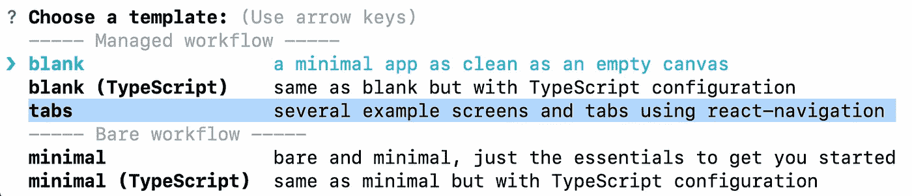
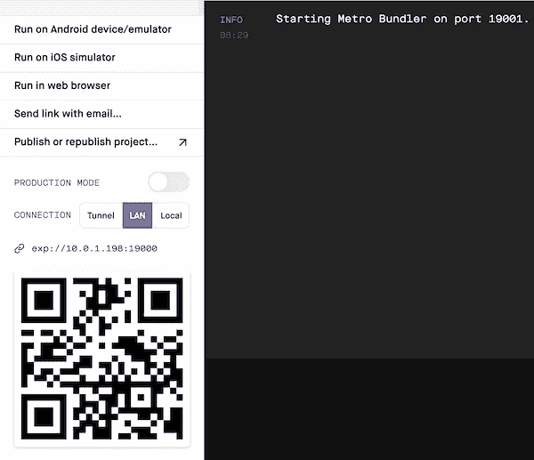
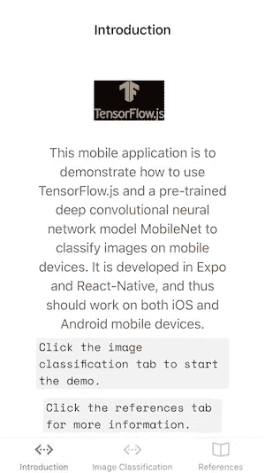
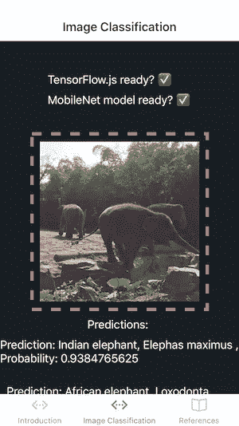
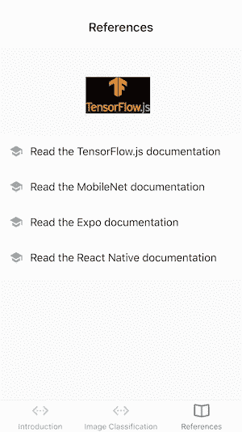

# 用于移动设备上图像分类的深度学习

> 原文：<https://towardsdatascience.com/deep-learning-for-image-classification-on-mobile-devices-f93efac860fd?source=collection_archive---------35----------------------->

## 使用 Expo、React-Native、TensorFlow.js 和 MobileNet 开发移动影像分类应用程序


React 是一个流行的 JavaScript 框架，用于构建 Web 用户界面。 [Reactive Native](https://reactnative.dev/docs/getting-started) 继承和扩展了组件框架(如组件、道具、状态、等)。)来支持原生 Android 和 iOS 应用程序的开发，使用预先构建的原生组件，如*视图*、*文本*、*触摸不透明、*等。本机代码通常使用 Xcode 或 Android Studio 开发。

[Expo](https://docs.expo.io/versions/v37.0.0/) 是一个围绕 React 原生和移动原生平台构建的框架和平台，允许我们从相同的 JavaScript/TypeScript 代码库开发、构建和部署 iOS、Android 和 web 应用上的移动应用。JavaScript/TypeScript 代码可以使用任何文本编辑器工具来开发。

随着[tensor flow . js for React Native](https://blog.tensorflow.org/2020/02/tensorflowjs-for-react-native-is-here.html)的发布，现在可以在移动设备上训练新的机器学习和深度学习模型和/或使用预训练的模型进行预测和其他机器学习目的。

在本文中，与[3]类似，我使用 Expo [4]和 React Native [5]开发了一个多页面移动应用程序，该应用程序使用 TensorFlow.js [1]和预训练的卷积神经网络模型 MobileNet [2]在移动设备上进行图像分类。

此移动应用程序在 Mac 上开发如下:

*   使用 Expo 生成多页面应用程序模板
*   安装库
*   在 [React JSX](https://reactjs.org/docs/introducing-jsx.html) 开发移动应用代码
*   编译和运行

# 1.使用 Expo 生成项目模板

为了使用 *Expo CLI* 自动生成新的项目模板，首先需要安装 *Expo CLI* :

```
npm install *expo-cli*
```

然后可以生成一个新的 Expo 项目模板，如下所示:

```
expo init *react-native-deeplearning
cd react-native-deeplearning*
```

本文中的项目名称为*react-native-deep learning*。

如下所示，我选择 Expo managed workflow 的选项卡模板来自动生成几个示例屏幕和导航选项卡。



TensorFlow logo 图像文件[tfjs.jpg](https://github.com/amandeepmittal/mobilenet-tfjs-expo/blob/master/assets/tfjs.jpg)【3】在本项目中使用，需要存储在生成的。/assets/images 目录。

# 2.安装库

需要为移动设备上的影像分类应用程序安装以下库:

*   [@tensorflow/tfjs](http://twitter.com/tensorflow/tfjs) ，即 TensorFlow.js，一个用于训练和部署机器学习模型的开源硬件加速 JavaScript 库。
*   [@ tensor flow/tfjs-react-native](http://twitter.com/tensorflow/tfjs-react-native)，TensorFlow.js 在移动设备上新的平台集成和后端。
*   [@ React-Native-community/async-storage](https://github.com/react-native-community/async-storage)，React Native 的异步、未加密、持久、键值存储系统。
*   [@ tensor flow-models/mobilenet](https://github.com/tensorflow/tfjs-models/tree/master/mobilenet)，预训练模型，可以将图像作为输入，并返回一组最有可能的预测及其置信度。
*   [expo-gl](https://docs.expo.io/versions/latest/sdk/gl-view/) ，提供了一个充当 [OpenGL ES](https://en.wikipedia.org/wiki/OpenGL_ES) 渲染目标的视图，用于渲染 2D 和 3D 图形。
*   [jpeg-js](https://www.npmjs.com/package/jpeg-js) ，node.js 的纯 javascript JPEG 编码器和解码器

```
npm install [*@react*](http://twitter.com/react)*-native-community/async-storage* [*@tensorflow/tfjs*](http://twitter.com/tensorflow/tfjs)[*@tensorflow/tfjs-react-native*](http://twitter.com/tensorflow/tfjs-react-native) *expo-gl* [*@tensorflow*](http://twitter.com/tensorflow)*-models/mobilenet jpeg-js*
```

此外，*react-native-fs*(react-native 的本地文件系统访问)是*@ tensor flow/tfjs-react-native/dist/bundle _ resource _ io . js*所需要的:

```
npm install *react-native-fs*
```

由于在[*@ tensor flow/tfjs-React-native*](http://twitter.com/tensorflow/tfjs-react-native)*/dist/camera/camera _ stream . js*中使用了[*Expo-camera*](https://www.npmjs.com/package/expo-camera)**(为设备的前置或后置摄像头渲染预览的 React 组件)。**

```
*expo install *expo-camera**
```

# *3.开发移动应用程序代码*

*如前所述，首先，我使用 *Expo CLI* 自动生成示例屏幕和导航标签。然后，我修改了生成的屏幕，并添加了一个新的图像分类屏幕。因此(详见下一节)，我创建了三个屏幕:*

*   *简介屏幕(参见图 3)*
*   *图像分类屏幕(见图 4)*
*   *参考屏幕(参见图 5)*

*屏幕底部有三个相应的选项卡用于导航。*

*本文重点介绍图像分类屏幕类(源代码见[7])。本节的其余部分将讨论实现细节。*

## *3.1 准备 TensorFlow、MobileNet 模型和摄像机访问*

*生命周期方法*componentidmount*()用于初始化 TensorFlow.js，加载预先训练好的 MobileNet 模型，在图像分类屏幕的用户界面准备就绪后，获取在移动设备上访问相机的权限。*

```
*async componentDidMount() {
    await tf.ready(); // preparing TensorFlow
    this.setState({ isTfReady: true,}); this.model = await mobilenet.load(); // preparing MobileNet model
    this.setState({ isModelReady: true }); this.getPermissionAsync(); // get permission for accessing camera on mobile device
  }getPermissionAsync = async () => {
    if (Constants.platform.ios) {
        const { status } = await Permissions.askAsync(Permissions.CAMERA_ROLL)
        if (status !== 'granted') {
            alert('Please grant camera roll permission for this project!')
        }
    }
}*
```

## *3.2 选择图像*

*一旦 TensorFlow 库和 MobileNet 模型准备就绪，就会调用方法 *selectImage* ()来选择移动设备上的图像以进行模型预测。*

```
*selectImage = async () => {
    try {
      let response = await ImagePicker.launchImageLibraryAsync({
        mediaTypes: ImagePicker.MediaTypeOptions.All,
        allowsEditing: true,
        aspect: [4, 3]
      }) if (!response.cancelled) {
          const source = { uri: response.uri }
          this.setState({ image: source })
          this.classifyImage()
      }
    } catch (error) {
      console.log(error)
    }
}*
```

## *3.3 图像分类*

*与[3]类似，一旦在移动设备上选择了一幅图像，就会调用 *classifyImage* ()方法进行图像分类。*

*在该方法中，首先使用 TensorFlow React Native 的 *fetch* API 在移动设备上加载选定的图像。然后调用方法 *imageToTensor* ()将加载的原始图像数据转换为 3D 图像张量。最后，调用准备好的 MobileNet 模型以将 3D 图像张量作为输入，并生成具有概率/置信度的前 3 个预测。*

```
*classifyImage = async () => {
    try {
      const imageAssetPath = Image.resolveAssetSource(this.state.image)
      const response = await fetch(imageAssetPath.uri, {}, { isBinary: true })
      const rawImageData = await response.arrayBuffer()
      const imageTensor = this.imageToTensor(rawImageData)
      const predictions = await this.model.classify(imageTensor)
      this.setState({ predictions: predictions })
    } catch (error) {
      console.log('Exception Error: ', error)
    }
}imageToTensor(rawImageData) {
    const TO_UINT8ARRAY = true
    const { width, height, data } = jpeg.decode(rawImageData, TO_UINT8ARRAY)
    // Drop the alpha channel info for mobilenet
    const buffer = new Uint8Array(width * height * 3)
    let offset = 0 // offset into original data
    for (let i = 0; i < buffer.length; i += 3) {
      buffer[i] = data[offset]
      buffer[i + 1] = data[offset + 1]
      buffer[i + 2] = data[offset + 2] offset += 4
    } return tf.tensor3d(buffer, [height, width, 3])
}*
```

*注意 *fetch* API 有两个版本，一个是 React fetch API，另一个是 TensorFlow React Native 的 *fetch* API。*

> *务必为 TensorFlow React Native 导入正确的 fetch API，如下所示，以避免类似“filereader.readasarraybuffer 未在 React Native 中实现”的错误:*

```
*import { fetch } from ‘[@tensorflow/tfjs-react-native](http://twitter.com/tensorflow/tfjs-react-native)’*
```

## *3.4 报告图像分类结果*

*一旦图像分类完成，调用方法 *renderPrediction* ()在移动设备的屏幕上显示预测结果。*

```
*renderPrediction = (prediction) => {
    return (
      <View style={styles.welcomeContainer}>
        <Text key={prediction.className} style={styles.text}>
          Prediction: {prediction.className} {', '} Probability: {prediction.probability}
        </Text>
      </View>
    )
}*
```

# *4.编译和运行移动应用程序*

*本文中的移动应用程序由一个 react 本地应用服务器和一个或多个移动客户端组成。移动客户端可以是 iOS 模拟器、Android 模拟器、iOS 设备(例如，iPhone 和 iPad)、Android 设备等。我验证了 Mac 上的移动应用服务器和 iPhone 6+和 iPad 上的移动客户端。*

## *4.1 启动 React 本地应用服务器*

*移动应用服务器需要在任何移动客户端开始运行之前启动。以下命令可用于编译和运行 react 本地应用服务器:*

```
*npm install
npm start*
```

*如果一切顺利，应该会出现如图 1 所示的 Web 界面。*

**

## *4.2 启动移动客户端*

*一旦移动应用服务器开始运行，我们就可以在移动设备上启动移动客户端。*

*因为我在本文中使用 Expo [4]进行开发，所以在移动设备上需要相应的 Expo 客户端/应用程序。iOS 移动设备的 Expo 应用程序在 Apple Store 中提供。*

**

***图 2:**Apple Store 中的 Expo 客户端 app。*

*在 iOS 设备上安装 Expo 客户端应用后，我们可以使用移动设备上的摄像头扫描 react 本地应用服务器的条形码(见图 1)，以使用 Expo 客户端应用运行移动应用。*

*图 3、4、5 显示了移动应用程序在 iOS 设备(iPhone 和 iPad)上的结果屏幕。*

**

***图 3:**iOS 设备上的介绍画面。*

**

***图 4:**iOS 设备上的图片分类屏幕。*

**

***图 5:**iOS 设备上的参考屏幕。*

# *5.摘要*

*在本文中，我使用 Expo [4]、[、React JSX](https://reactjs.org/docs/introducing-jsx.html)、React Native [5]、TensorFlow.js [1]和预训练的卷积神经网络模型 MobileNet [2]开发了一个用于移动设备上图像分类的多页面移动应用程序。*

*我验证了 Mac 上的移动应用服务器和 iOS 移动设备(iPhone 和 iPad)上的移动应用客户端。*

*这款移动应用有可能被用作开发其他机器学习和深度学习移动应用的模板。*

*Github [7]中提供了移动应用程序项目文件。*

# *参考*

1.  *[tensor flow . js for React Native](https://blog.tensorflow.org/2020/02/tensorflowjs-for-react-native-is-here.html)*
2.  *[移动互联网](https://github.com/tensorflow/tfjs-models/tree/master/mobilenet)*
3.  *A.Mittal，[使用 TensorFlow.js 和 MobileNet 在 React Native 上进行图像分类](https://heartbeat.fritz.ai/image-classification-on-react-native-with-tensorflow-js-and-mobilenet-48a39185717c)*
4.  *[世博会](https://docs.expo.io/versions/v37.0.0/)*
5.  *[反应原生](https://reactnative.dev/docs/getting-started)*
6.  *[反应过来](https://reactjs.org/docs/getting-started.html)*
7.  *Y.张， [Github 中的手机 app 项目文件](https://github.com/yzzhang/machine-learning/tree/master/mobile_apps/image_classification)*