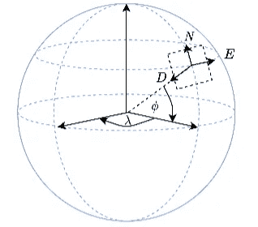
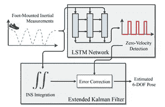
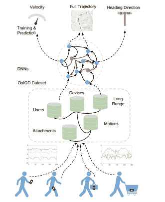

# 惯性导航的深度学习

> 原文：<https://towardsdatascience.com/deep-learning-for-inertial-navigation-441b7628a326?source=collection_archive---------19----------------------->

## 基于深度学习的惯性导航前沿解决方案综述。

Or 等人 2020

# 介绍

在过去十年中，出现了许多视觉辅助导航方法，因为这些方法的应用范围很广(黄，2019)。换句话说，以低成本惯性传感器为唯一信息源的惯性导航经典领域已经开始受到所涉及的新颖深度学习方法的关注。惯性导航的主要问题是漂移，这是误差的一个重要来源。更多的问题包括错误的初始化、不正确的传感器建模和近似误差。

在这篇文章中，我们回顾了深度学习和惯性测量单元(IMU)在经典惯性导航系统(INS)中的集成，这些集成仅解决了上述部分问题。首先，我们介绍一些先进的架构来改进速度估计、降噪、零速度检测以及姿态和位置预测。其次，讨论了 KITTI 和 OxIOD 数据集。最后，给出了具有深度学习的行人惯性导航方案。

# **基于深度学习的尖端解决方案**

导航领域的主要问题之一是速度估计。随着估计变得精确，它也将影响位置解。在 Cortes 等人 2018 年发表的工作中，提出了一种基于深度学习的速度估计方法。主要思想是在经典的惯性导航系统(INS)中加入速度约束。他们仅通过使用 CNN 来估计 IMU 的速度，然后通过这种预测来约束 INS 解。将这种估计公式化为回归深度学习任务，其中输入是 IMU 在几秒内的六通道，输出是速度，这将改善轨迹跟踪和运动模式分类。

科尔特斯等人，2018 年

我想展示的下一个作品是关于降噪的。由于许多低成本传感器会受到高幅度噪声的影响，并且噪声随时间变化，因此需要对其进行滤波。然而，由于这些噪声分布难以估计，使用基于深度学习的方法似乎可以解决这个问题。Chen 等人(2018)提出了一种新的深度学习方法来处理传感器信号中的许多误差源。通过这样做，传感器的信号可以被校正，然后才能用于导航方案。他们报告说，正确识别 IMU 信号的准确率为 80%。CNN 也用于这项工作，其中它包括 5 个卷积层和一个全连接层。

陈等，2018

瓦格斯塔夫和凯利(2018)的另一项工作涉及室内导航任务，其中提出了一种检测脚零速度的方案。通过这样做，提供了速度估计的精度，并且通过一般的 INS 提高了精度。检测是通过设计一个长短期记忆(LSTM)神经网络来完成的。通过评估超过 7.5 [km]的室内行人运动数据的设计，他们报告了定位误差的减少超过 34%。他们的架构包括 6 层 LSTM，每层 80 个单元，以及 LSTM 之后的单一全连接层。

瓦格斯塔夫和凯莉(2018)

我要讨论的最后一项工作与导航领域的一个主要问题有关:姿态和位置预测。实现精确的姿态状态估计对于多旋翼系统非常重要，因为微小的误差都可能导致不稳定并最终导致灾难。Al-Sharman 等人(2019)的一项工作提出了一种基于深度学习的状态估计增强，特别适用于姿态估计。他们通过降噪技术解决了精确姿态估计的问题，从而确定了测量噪声的特性。他们使用了一个简单的多层神经网络和一种退出技术，这种技术比传统的方法更优越。

阿尔-沙曼等人(2020 年)

# **公共数据集**

有两个通用数据集可用于评估不同的建议方法，第一个是卡尔斯鲁厄理工学院的 KITTI 数据集，它包含大量数据:威力登、IMU、GPS、相机校准、灰度立体序列、3D 物体卡车标签等等。Geiger 等人(2013 年)的论文回顾了整个数据集。Alto KITTI 是该领域的主要数据集，我想提一下另一个全新的数据集，由牛津大学命名为“OxIOD”。它用于深度惯性里程计，完整信息见陈等人(2018)的论文。

盖格等人(2013 年)

陈等(2018)

# 行人惯性导航

最近，人们对将深度学习技术应用于行人的运动传感和位置估计越来越感兴趣。在 Chen 等人(2020)的工作中，审查了基于深度学习的行人 INS 方法、数据集和设备上的界面。在他们的工作中，他们提出了 L-IONet，一个从原始数据中学习惯性跟踪的框架。该架构主要包含 1d 扩展卷积层，受 WaveNet 启发，具有全连接层。

Klein 等人(2020)的另一项工作提出了 StepNet:一种用于步长估计的深度学习方法。作者通过一系列基于深度学习的方法来回归步长，从而解决了行人室内航位推算问题。建议的 StepNet 优于他们论文中描述的传统方法。

克莱因等人(2020 年)

# **总结**

随着深度学习的热度不断上升，它似乎解决了惯性导航领域的许多经典问题。正如我们在这篇文章中所描述的，一些研究已经解决了深度学习和惯性导航的集成问题，并取得了可喜的成果。

# 参考

黄，。"目视惯性导航:简明综述." *2019 机器人与自动化国际会议(ICRA)* 。IEEE，2019。

科尔特斯、圣地亚哥、阿诺·索林和胡奥·坎纳拉。"基于深度学习的速度估计，用于约束智能手机上的捷联惯性导航." *2018 IEEE 第 28 届信号处理机器学习国际研讨会(MLSP)* 。IEEE，2018。

陈，华，等，“用深度学习方法减少误差改进惯性传感器” *NAECON 2018-IEEE 全国航空航天与电子会议*。IEEE，2018。‏

瓦格斯塔夫，布兰登和乔纳森·凯利。“用于鲁棒惯性导航的基于 LSTM 的零速度检测。” *2018 室内定位与室内导航国际会议(IPIN)* 。IEEE，2018。

状态估计增强的基于深度学习的神经网络训练:应用于姿态估计。 *IEEE 仪器仪表与测量汇刊*69.1(2019):24–34。

视觉遇上机器人:kitti 数据集。国际机器人研究杂志 32.11(2013):1231–1237。

陈，常浩，等。“Oxiod:用于深度惯性里程计的数据集。” *arXiv 预印本 arXiv:1809.07491* (2018)。

基于深度学习的行人惯性导航:方法、数据集和设备上的推断。 *IEEE 物联网期刊*7.5(2020):4431–4441。

克莱恩、伊茨克和奥姆里·阿斯拉夫。" Step net——用于步长估计的深度学习方法." *IEEE 访问*8(2020):85706–85713。‏