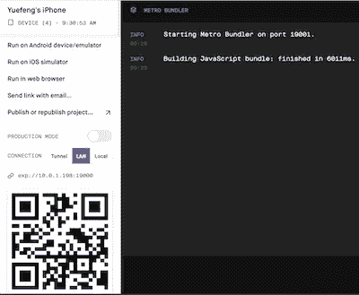
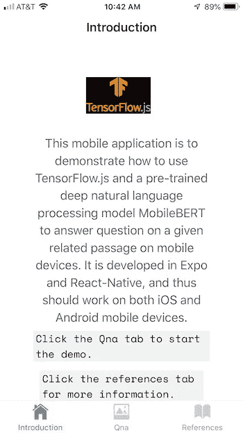
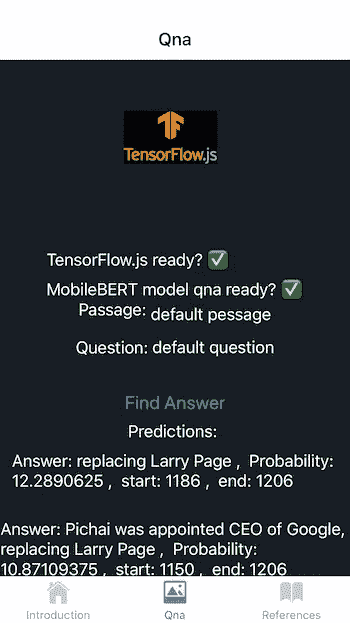
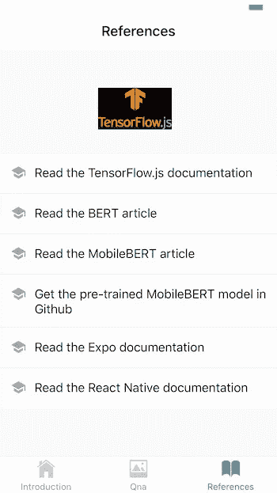

# 移动设备上自然语言处理的深度学习

> 原文：<https://towardsdatascience.com/deep-learning-for-natural-language-processing-on-mobile-devices-3024747a7043?source=collection_archive---------34----------------------->

## 使用 Expo、React-Native、TensorFlow.js 和 MobileBERT 进行阅读理解


作者照片

随着跨平台 Web 和移动开发语言、库以及 React [1]、React Native [2]和 Expo [3]等工具的进步，移动 app 在机器学习和其他领域找到了越来越多的应用。针对 React Native [4]和 TensorFlow Lite [5]发布的 TensorFlow.js 允许我们直接在跨平台移动设备上训练新的机器学习和深度学习模型和/或使用预训练模型进行预测和其他机器学习。

最近我发表了两篇文章【7】来演示如何使用[Expo](https://docs.expo.io/versions/v37.0.0/)【3】、[React](https://reactjs.org/docs/introducing-jsx.html)【1】和[React Native](https://reactnative.dev/docs/getting-started)【2】来开发多页面移动应用程序，这些应用程序利用 TensorFlow.js 进行 React Native【4】和预训练的卷积神经网络模型 [MobileNet](https://github.com/tensorflow/tfjs-models/tree/master/mobilenet) 和 [COCO-SSD](https://github.com/tensorflow/tfjs-models/tree/master/coco-ssd) 分别用于移动设备上的图像分类和对象检测。

如[6][7]所述，[React](https://reactjs.org/docs/introducing-jsx.html)【1】是一种流行的用于构建 Web 用户界面的 JavaScript 框架，而 Reactive Native 继承并扩展了组件框架(如组件、道具、状态、 [JSX](https://reactjs.org/docs/introducing-jsx.html) 等)。)的 React，使用预建的原生组件，如*视图*、*文本*、*可触摸不透明、*等，支持原生 Android 和 iOS 应用的开发。

特定于移动平台的语言(例如 Object-C、Swift、Java 等)中的本机代码。)通常使用 Xcode 或 Android Studio 开发。为了简化移动应用开发，Expo [3]为我们提供了一个围绕 React 原生和移动原生平台构建的框架和平台，允许我们使用 JavaScript/TypeScript 在 iOS、Android 和 web 应用上开发、构建和部署移动应用。因此，任何文本编辑器工具都可以用于编码。

在本文中，与[6][7]类似，我开发了一个多页面移动应用程序，以演示如何使用 TensorFlow.js [5]和一个预先训练好的深度自然语言处理模型 MobileBERT [8][9][10]在移动设备上进行阅读理解。

类似于[6][7]，这个移动应用在 Mac 上开发如下:

*   使用 Expo 生成多页面应用程序模板
*   安装库
*   在 [React JSX](https://reactjs.org/docs/introducing-jsx.html) 开发移动应用代码
*   编译和运行

假设最新的 [node.js](https://nodejs.org/en/download/) 已经安装在你的本地电脑/笔记本电脑上，比如 Mac。

# 1.正在生成项目模板

为了使用 *Expo CLI* 自动生成新的项目模板，首先需要安装 *Expo CLI* :

```
npm install *expo-cli*
```

然后可以生成一个新的 Expo 项目模板，如下所示:

```
expo init *qna
cd qna*
```

本文中的项目名称为 *qna* (即问答)。

如[6][7]所述，我选择世博管理工作流的*标签*模板来自动生成几个示例屏幕和导航标签。TensorFlow logo 图像文件[tfjs.jpg](https://github.com/amandeepmittal/mobilenet-tfjs-expo/blob/master/assets/tfjs.jpg)在本项目中使用，需要存储在生成的。/assets/images 目录。

# 2.安装库

开发阅读理解移动应用程序需要安装以下库:

*   [@tensorflow/tfjs](http://twitter.com/tensorflow/tfjs) ，即 TensorFlow.js，一个用于训练和部署机器学习模型的开源硬件加速 JavaScript 库。
*   [@ tensor flow/tfjs-react-native](http://twitter.com/tensorflow/tfjs-react-native)，TensorFlow.js 在移动设备上新的平台集成和后端。
*   [@ React-Native-community/async-storage](https://github.com/react-native-community/async-storage)，React Native 的异步、未加密、持久、键值存储系统。
*   expo-gl ，提供了一个视图，作为 [OpenGL ES](https://en.wikipedia.org/wiki/OpenGL_ES) 渲染目标，用于渲染 2D 和 3D 图形。
*   [@tensorflow-models/qna](https://github.com/tensorflow/tfjs-models/tree/master/qna) ，预训练的自然语言处理模型 MobileBERT [9][10]，它可以将问题和相关段落作为输入，并返回该问题最可能的答案、它们的置信度以及答案在段落中的位置(答案在段落中的开始和结束索引)的数组。

```
npm install [*@react*](http://twitter.com/react)*-native-community/async-storage* [*@tensorflow/tfjs*](http://twitter.com/tensorflow/tfjs)[*@tensorflow/tfjs-react-native*](http://twitter.com/tensorflow/tfjs-react-native) *expo-gl* [*@tensorflow*](http://twitter.com/tensorflow)*-models/qna*
```

另外，*@ tensor flow/tfjs-react-native/dist/bundle _ resource _ io . js*需要*react-native-fs*(react-native 的一个原生文件系统访问):

```
npm install *react-native-fs*
```

由于在[*@ tensor flow/tfjs-React-native*](http://twitter.com/tensorflow/tfjs-react-native)*/dist/camera/camera _ stream . js*中使用了[*Expo-camera*](https://www.npmjs.com/package/expo-camera)*(一个为设备的前置或后置摄像头渲染预览的 React 组件)也是需要的。*

```
*expo install *expo-camera**
```

# *3.开发阅读理解移动应用程序代码*

*如前所述，首先我使用 *Expo CLI* 自动生成示例屏幕和导航标签。然后我修改了生成的屏幕，增加了一个新的 *Qna* (问答)屏幕，用于阅读理解。以下是生成的屏幕:*

*   *简介屏幕(参见图 2)*
*   *阅读理解( *Qna* )屏幕(见图 3)*
*   *参考屏幕(参见图 4)*

*屏幕底部有三个相应的选项卡用于导航。*

*本文重点介绍用于自然语言阅读理解的 *Qna* screen 类(源代码见【11】)。本节的其余部分将讨论实现细节。*

# *3.1 准备 TensorFlow 和 MobileBERT 模型*

*生命周期方法*componentidmount*()用于初始化 TensorFlow.js，并在 *Qna* 屏幕的用户界面准备就绪后加载预先训练好的 mobile Bert【9】【10】模型。*

```
*async componentDidMount() {
    await tf.ready(); // preparing TensorFlow
    this.setState({ isTfReady: true});    
    this.model = await qna.load();
    this.setState({ isModelReady: true });       
}*
```

# *3.2 选择文章和问题*

*一旦 TensorFlow 库和 MobileBERT 模型准备就绪，移动应用程序用户就可以键入一篇文章和一个与这篇文章相关的问题。*

*为了方便起见,[10]中的段落和问题在本文中作为默认段落和问题重复使用。*

***默认段落:***

```
*Google LLC is an American multinational technology company that specializes in Internet-related services and products, which include online advertising technologies, search engine, cloud computing, software, and hardware. It is considered one of the Big Four technology companies, alongside Amazon, Apple, and Facebook. Google was founded in September 1998 by Larry Page and Sergey Brin while they were Ph.D. students at Stanford University in California. Together they own about 14 percent of its shares and control 56 percent of the stockholder voting power through supervoting stock. They incorporated Google as a California privately held company on September 4, 1998, in California. Google was then reincorporated in Delaware on October 22, 2002\. An initial public offering (IPO) took place on August 19, 2004, and Google moved to its headquarters in Mountain View, California, nicknamed the Googleplex. In August 2015, Google announced plans to reorganize its various interests as a conglomerate called Alphabet Inc. Google is Alphabet's leading subsidiary and will continue to be the umbrella company for Alphabet's Internet interests. Sundar Pichai was appointed CEO of Google, replacing Larry Page who became the CEO of Alphabet."*
```

***默认问题:***

```
*Who is the CEO of Google?*
```

# *3.3 寻找问题的答案*

*一旦在移动设备上提供了一篇文章和一个问题，用户可以点击“查找答案”按钮来调用方法 *findAnswers* ()来查找文章中给定问题的可能答案。*

*在这种方法中，调用准备好的 MobileBERT 模型，以将提供的段落和问题作为输入，并生成问题的可能答案列表及其概率和位置(段落中答案的开始和结束索引)。*

```
*findAnswers = async () => {
    try {
      const question = this.state.default_question;
      const passage  = this.state.default_passage;
      const answers = await this.model.findAnswers(question, passage);console.log('answers: ');
console.log(answers);return answers;} catch (error) {
      console.log('Exception Error: ', error)
    }
}*
```

# *3.4 报告答案*

*阅读理解完成后，调用方法 *renderAnswer* ()在移动设备的屏幕上显示答案。*

```
*renderAnswer = (answer, index) => {
    const text = answer.text;
    const score  = answer.score;
    const startIndex = answer.startIndex;
    const endIndex = answer.endIndex;return (
      <View style={styles.welcomeContainer}>
        <Text  key={answer.text} style={styles.text}>
          Answer: {text} {', '} Probability: {score} {', '} start: {startIndex} {', '} end: {endIndex}
        </Text>
      </View>
    )
}*
```

# *4.编译和运行移动应用程序*

*本文中的移动应用程序由一个 react 本地应用服务器和一个或多个移动客户端组成。移动客户端可以是 iOS 模拟器、Android 模拟器、iOS 设备(例如，iPhone 和 iPad)、Android 设备等。我验证了 Mac 上的移动应用服务器和 iPhone 6+和 iPad 上的移动客户端。*

# *4.1 启动 React 本地应用服务器*

*如[6][7]中所述，在任何移动客户端可以开始运行之前，移动应用服务器需要启动。以下命令可用于编译和运行 react 本地应用服务器:*

```
*npm install
npm start*
```

*如果一切顺利，应该会出现如图 1 所示的 Web 界面。*

**

***图 1:** 反应式应用服务器。*

# *4.2 启动移动客户端*

*一旦移动应用服务器开始运行，我们就可以在移动设备上启动移动客户端。*

*由于我在本文中使用 Expo [3]进行开发，因此在移动设备上需要相应的 Expo 客户端应用程序。iOS 移动设备的 Expo 客户端应用程序在苹果商店免费提供。*

*在 iOS 设备上安装 Expo 客户端应用后，我们可以使用移动设备上的摄像头扫描 react 本地应用服务器的条形码(见图 1)，以使用 Expo 客户端应用运行移动应用。*

*图 2 显示了 iOS 设备(iPhone 和 iPad)上移动应用程序的简介屏幕。*

**

***图 2:**iOS 设备上的介绍画面。*

*图 3 显示了阅读理解的屏幕(段落、问题、“查找答案”按钮和答案)。*

**

***图 3:**iOS 设备上的 Qna 屏幕。*

*以下是 *findAnswers* ()方法调用的输出:*

```
*Array [
  Object {
    "endIndex": 1206,
    "score": 12.2890625,
    "startIndex": 1186,
    "text": "replacing Larry Page",
  },
  Object {
    "endIndex": 1206,
    "score": 10.87109375,
    "startIndex": 1150,
    "text": "Pichai was appointed CEO of Google, replacing Larry Page",
  },
  Object {
    "endIndex": 1206,
    "score": 9.658203125,
    "startIndex": 1196,
    "text": "Larry Page",
  },
  Object {
    "endIndex": 1156,
    "score": 5.2802734375,
    "startIndex": 1150,
    "text": "Pichai",
  },
  ]*
```

*图 4 显示了参考屏幕。*

**

***图 4:**iOS 设备上的参考屏幕。*

# *5.摘要*

*与[6][7]类似，在本文中，我使用 Expo [3]、[React JSX](https://reactjs.org/docs/introducing-jsx.html)、React Native [2]、React Native 的 TensorFlow.js 和预先训练好的深度自然语言处理模型 MobileBERT [9][10]开发了一个用于移动设备上阅读理解(问答)的多页移动应用。*

*我验证了 Mac 上的移动应用服务器和 iOS 移动设备(iPhone 和 iPad)上的移动应用客户端。*

*正如[6][7]和本文所展示的那样，这种移动应用程序有可能被用作开发其他机器学习和深度学习移动应用程序的模板。*

*本文的移动应用程序项目文件可以在 Github [11]中找到。*

# *参考*

1.  *[反应](https://reactjs.org/docs/getting-started.html)*
2.  *[反应土著](https://reactnative.dev/docs/getting-started)*
3.  *[世博会](https://docs.expo.io/versions/v37.0.0/)*
4.  *[tensor flow . js for React Native](https://blog.tensorflow.org/2020/02/tensorflowjs-for-react-native-is-here.html)*
5.  *[TensorFlow Lite](https://www.tensorflow.org/lite)*
6.  *Y.张，[面向移动设备的图像分类深度学习](https://medium.com/p/deep-learning-for-image-classification-on-mobile-devices-f93efac860fd?source=email-80e8f2faf4bc--writer.postDistributed&sk=fdd9218d4f879cda3cc064d20701a939)*
7.  *Y.张，[深度学习在移动设备上检测图像中的物体](/deep-learning-for-detecting-objects-in-an-image-on-mobile-devices-7d5b2e5621f9)*
8.  *J.Devlin，M.W. Chang 等人， [BERT:用于语言理解的深度双向转换器的预训练](https://arxiv.org/abs/1810.04805)*
9.  *Z.孙，于，等， [MobileBERT:一个面向资源受限设备的任务无关的精简 BERT](https://arxiv.org/abs/2004.02984)*
10.  *[tensor flow . js 预训 MobileBERT 问答](https://github.com/tensorflow/tfjs-models/tree/master/qna)*
11.  *Y.张， [Github 中的手机 app 项目文件](https://github.com/yzzhang/machine-learning/tree/master/mobile_apps/mobile_bert)*