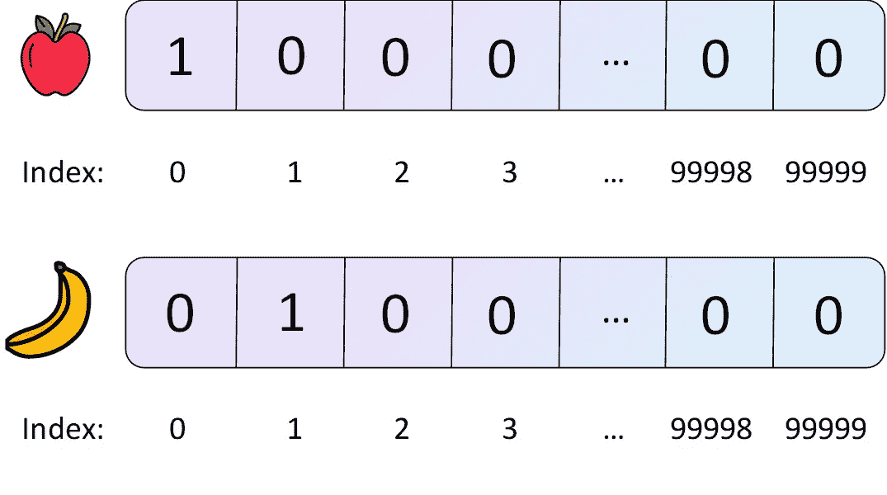
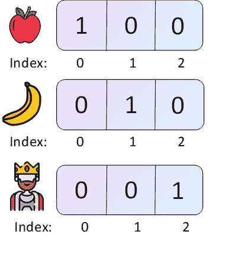
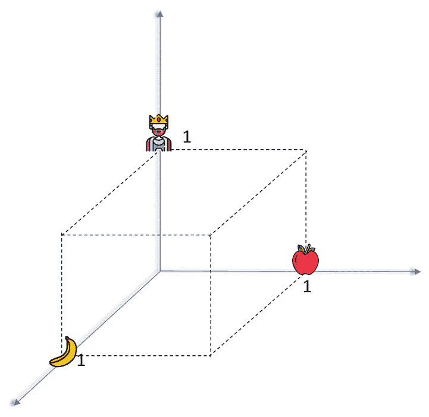
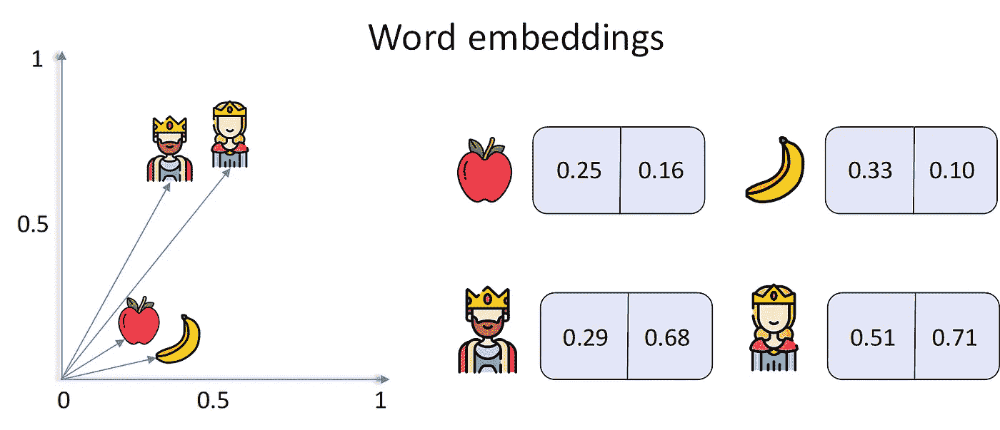
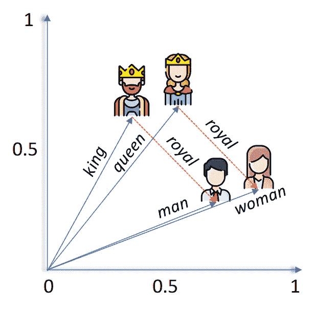
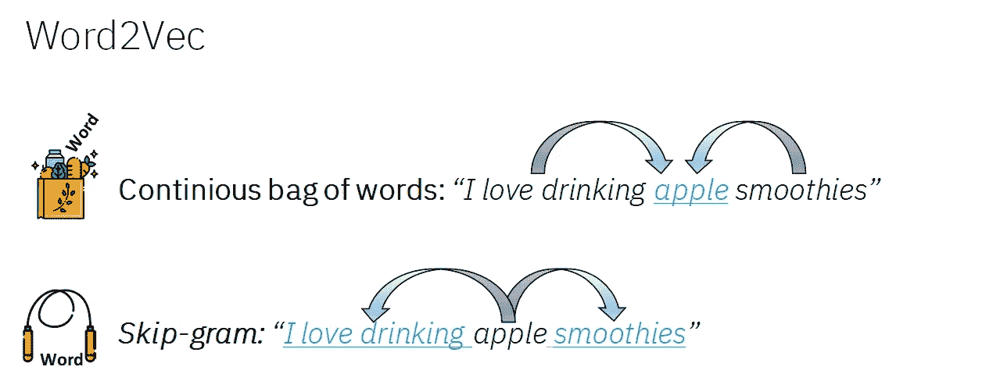
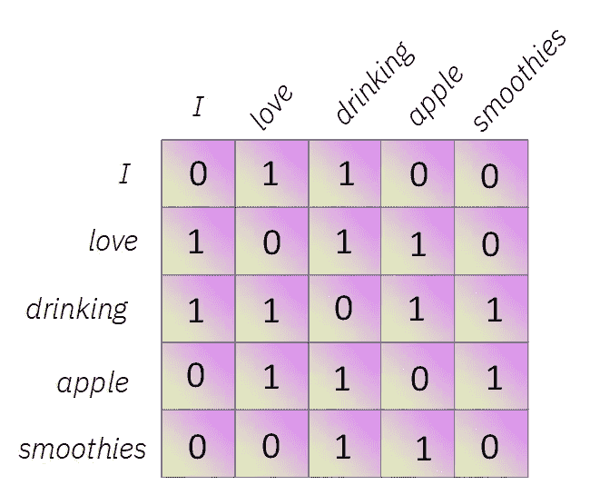

# 自然语言处理的深度学习:单词嵌入

> 原文：<https://towardsdatascience.com/deep-learning-for-nlp-word-embeddings-4f5c90bcdab5?source=collection_archive---------21----------------------->

## 简单直观的单词嵌入

# 介绍

***单词嵌入*** 已经成为最常用的工具之一，也是需要处理语音或文本等自然语言的人工智能任务取得惊人成就的主要驱动力。

**在本帖中，我们将揭开它们背后的神奇**，看看它们是什么，为什么它们成为了**自然语言处理** (NLP 下文)世界中的标准，它们是如何构建的，并探索一些最常用的单词嵌入算法。

一切都将以简单直观的方式进行解释，避免复杂的数学运算，并尽量使帖子的内容易于理解。

这将在以下小节中进行分解:

1.  **什么是单词嵌入？**
2.  **为什么要使用单词嵌入？**
3.  **单词嵌入是如何构建的？**
4.  **最流行的单词嵌入有哪些？**

一旦你准备好了，让我们开始看看什么是单词嵌入。

# 1)什么是单词嵌入？

计算机把一切都分解成数字。更确切地说是比特(零和一)。当计算机内部的软件(例如机器学习算法)必须操作或处理一个单词时会发生什么？很简单，这个**单词需要作为**交给计算机，作为它唯一能理解的:**数字。**

在 NLP 中，最简单的方法是通过**创建一个包含大量单词的词汇表**(比如说 100，000 个单词)**，并为词汇表中的每个单词**分配一个数字。

我们词汇中的第一个词(*苹果*也许)将是数字 0。第二个字(*香蕉*’)将是数字 1，依此类推直到数字 99.998，前一个到最后一个字(*国王*’)和 999.999 被分配给最后一个字(*王后*’)。

然后我们将**每个单词表示为一个长度为 100.000** 的向量，其中每个单项除了其中一项都是零，对应于该单词所关联的数字的索引。

前面段落中一些例子的矢量表示。

这被称为单词的**一键编码**。

**one-hot 编码有各种不同的与效率和上下文相关的问题**，我们马上就会看到。

单词嵌入只是另一种形式**通过向量**表示单词，它通过某种方式抽象每个单词的上下文或高级含义**成功地解决了使用一键编码**带来的许多问题。

这里的主要要点是，单词嵌入**是表示单词的向量，所以意思相似的单词有相似的向量。**

# 2)为什么要使用单词嵌入？

考虑前面的例子，但是我们的词汇中只有三个词:*‘苹果’，【香蕉】，*和*‘国王’。*这些单词的**一个热编码**向量**表示**如下。

我们词汇的一个热门向量表示

如果我们在三维空间**中绘制这些单词向量，我们将得到如下图所示的表示，其中每个轴代表我们拥有的一个维度，图标代表每个单词向量的末端。**

三维空间中我们的一个热编码字向量的表示。

正如我们所看到的，**从任何一个向量**(图标的位置)**到所有其他向量的距离都是相同的**:两个大小为 1 的步长在不同的方向。如果我们将问题扩展到 100.000 维，采取更多的步骤，但在所有单词向量之间保持相同的距离，这将是相同的。

理想情况下，我们希望**具有相似含义或代表相似项目的词的向量靠近在一起，**远离那些具有完全不同含义的词:我们希望*苹果*靠近*香蕉*但远离*国王*。

此外，一个热编码非常**低效**。仔细想想，它们是巨大的空向量，只有一项的值不为零。它们非常稀疏，会大大降低我们的计算速度。

**总之:**一种热编码不考虑单词的上下文或含义，所有单词向量之间的距离相同，效率非常低。

**单词嵌入通过用一个相当小的(150、300、500 维)固定大小的向量表示词汇表中的每个单词来解决这些问题**，这个向量被称为嵌入，它是在训练期间学习的。

这些向量是以这样一种方式创建的，即出现在相似上下文中或者具有相似含义**的**单词靠得很近**，并且它们不像从一键嵌入中导出的那些向量那样是稀疏向量。**

如果我们有一个**二维单词嵌入**表示我们之前的 4 个单词，并将其绘制在 2D 网格上，它看起来会像下图一样。

我们的示例单词的二维单词嵌入表示

从上图中我们可以清楚地看到，单词' *apple* '和' *banana* '之间的单词嵌入表示比单词' *king* '和' *queen* '之间的单词嵌入表示更接近，这适用于相反的情况:当我们使用单词嵌入时，具有相似含义的**单词更接近。**

这个事实也让我们可以做一些非常非常酷的事情。我们可以**操作单词嵌入**，使用单词的表示从一个已知单词到另一个单词。

下图显示了**如果我们从单词 **' *king* '** 的嵌入中减去单词 **' *royal* '** 的嵌入**，我们将到达单词 **' *man* '** 的嵌入附近。以类似的方式，如果我们从皇后的嵌入中减去' *royal'* 的嵌入，我们到达单词 **' *woman* '** 的嵌入附近的某处。**爽吧？**

单词嵌入操作。国王、王后、男人、女人的例子非常流行来说明这一点。

**最后**，正如我们在单词嵌入向量中看到的，它们通常具有较小的尺寸(在我们的例子中是 2，但是大多数时候它们具有 150、200、300 或 500 维)并且不是稀疏的，使得使用它们进行计算**比使用单热点向量**更有效。

# 3)单词嵌入是如何构建的？

你可能已经猜到了，像机器学习生态系统中的许多元素一样，单词嵌入是通过学习建立的。从数据中学习。

有许多算法可以学习单词嵌入，我们将很快看到它们，但总的目标是**构建一个矩阵 E** ，它可以将表示单词的一个热点向量转换为固定大小的向量，即该单词的嵌入。

让我们来看一个非常高级的例子。

想想这句话***我喜欢喝苹果冰沙*’**。如果我**去掉**这个词**’*苹果***’我们就剩下下面这个不完整的句子:‘***我喜欢喝 __ 思慕雪***’。如果我接下来给你这个不完整的句子，并让你猜缺失的单词，你可能会说像' ***香蕉*** '、 **' *草莓*'、**或' ***苹果*** '这样的单词，它们都有相似的意思，并且通常出现在相似的上下文中。

学习单词嵌入的主要方法之一是通过与此非常相似的**过程:算法通过**在巨大的文本句子语料库中猜测缺失单词**来学习在相似上下文中多次出现的单词的相似单词嵌入。**

**嵌入矩阵 E** (将一个热嵌入转换成单词嵌入向量的矩阵)**通过训练类似于语言模型(试图预测句子中缺失单词的模型)**的东西来计算**，使用人工神经网络来预测该缺失单词**，其方式类似于如何计算网络的权重和偏差。

在实践中，你可以避免训练你自己的单词嵌入，因为有从各种语料库构建的**公开可用的单词嵌入(像[维基百科或 Twitter](https://nlp.stanford.edu/projects/glove/) GloVe 单词嵌入)，节省你的时间和精力。**

最后，让我们简单看看一些最流行的单词嵌入算法。

# 4)最流行的单词嵌入有哪些？

最常用的两种单词嵌入算法是 Word2Vec 和 GloVe。让我们看看它们是如何工作的。

*   **word 2 vec:***word 2 vec*是一组相关的模型，它们通过使用两层、浅层的人工神经网络来产生单词嵌入，这些人工神经网络试图使用单词的上下文来预测单词( ***连续的单词包*** — CBOW)，或者仅使用一个单词来预测上下文( ***Skip-gram*** 模型)。这是上一节描述的过程。

CBOW 和 Skipgram Word2Vec 型号。在 CBOW 中，我们试图使用上下文来预测单词 apple，而在 Skip-gram 模型中，我们试图预测单词 apple 的上下文。

*   **GloVe:** 是*全局向量的缩写，***GloVe 算法通过在单词之间使用**共现矩阵**来计算单词嵌入。这个矩阵是**通过阅读一个巨大的句子语料库**并为它找到的每个独特的单词创建一列和一行而构建的。对于每个单词，它使用特定的窗口大小记录它与其他单词在同一个句子中出现的次数，因此它也可以测量两个单词在一个句子中的接近程度。**

****

**窗口大小为 2 的句子“我喜欢喝苹果冰沙”的同现矩阵**

# **结论和额外资源**

**就是这样！一如既往，我希望你喜欢这篇文章，并且我设法帮助你理解了什么是单词嵌入，它们是如何工作的，以及它们为什么如此强大。**

**如果您想了解有关该主题的更多信息，您可以在这里找到一些附加资源:**

*   **[*一种神经概率模型。*](http://www.jmlr.org/papers/volume3/bengio03a/bengio03a.pdf) [*本吉奥等*。](http://www.jmlr.org/papers/volume3/bengio03a/bengio03a.pdf)**
*   **吴恩达教授关于学习单词嵌入的讲座。**
*   **[机器学习掌握单词嵌入的帖子。](https://machinelearningmastery.com/what-are-word-embeddings/)**
*   **[单词嵌入及其在语义模型中的应用概述。](https://blog.aylien.com/overview-word-embeddings-history-word2vec-cbow-glove/)**

***如果你喜欢这篇文章，那么请随时关注我的推特@jaimezorno* *。还有，你可以看看我其他关于数据科学和机器学习的帖子* [*这里*](https://medium.com/@jaimezornoza?source=post_page---------------------------) *。好好读！***

***如果你想了解更多关于机器学习和人工智能的知识* [***在 Medium 上关注我***](https://medium.com/@jaimezornoza) *，敬请关注我的下一篇帖子！另外，你可以查看* [***这个资源库***](https://howtolearnmachinelearning.com/) *获取更多关于机器学习和人工智能的资源！***

**最后，看看我关于 NLP 深度学习的其他帖子:**

** [## NLP 的深度学习:ann，RNNs 和 LSTMs 解释！

### 了解人工神经网络，深度学习，循环神经网络和 LSTMs 前所未有地使用…

towardsdatascience.com](/deep-learning-for-nlp-anns-rnns-and-lstms-explained-95866c1db2e4)  [## NLP 的深度学习:用 Keras 创建聊天机器人！

### 了解如何使用 Keras 构建递归神经网络并创建聊天机器人！谁不喜欢友好的机器人…

towardsdatascience.com](/deep-learning-for-nlp-creating-a-chatbot-with-keras-da5ca051e051) 

*   封面图片来自*。*
*   *图标来自 [***平面图标***](https://www.flaticon.com/) 。*
*   *所有其他图像都是自己制作的。***