# 语义文本匹配的深度学习

> 原文：<https://towardsdatascience.com/deep-learning-for-semantic-text-matching-d4df6c2cf4c5?source=collection_archive---------5----------------------->

由[卡韦蒂·纳文库马尔](https://medium.com/u/d7c6886bcdf2?source=post_page-----d4df6c2cf4c5--------------------------------)和[舒拉滕德拉·哈索拉](https://medium.com/u/9b1389dd6cc2?source=post_page-----d4df6c2cf4c5--------------------------------)撰写

在本文中，我们将讨论**语义文本匹配问题**，它在信息检索(网络搜索)、问题回答、推荐系统等领域都有应用。

**语义文本匹配是估计源文本和目标文本之间语义相似度的任务**。让我们用下面这个寻找最接近问题的例子来理解这一点。**我们得到了一个大的问题语料库，对于任何提出或搜索的新问题，目标是从这个语料库中找到最相似的问题**。语义是这项任务的一个重要方面。例如，在给定的图中，问题“投资房地产市场的逐步指南是什么”与源问题并不十分相关，但仍然与源问题有很高的句法重叠。而这里的句法重叠指的是两者之间的常用词数量。

我们将讨论如何为这样的任务建立一个机器学习系统。

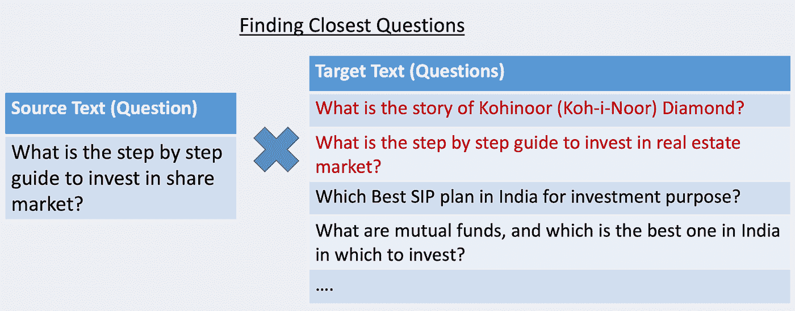

来源:作者图片

下表列出了语义文本匹配在网络搜索、赞助搜索、问题回答和产品推荐领域的一些应用。

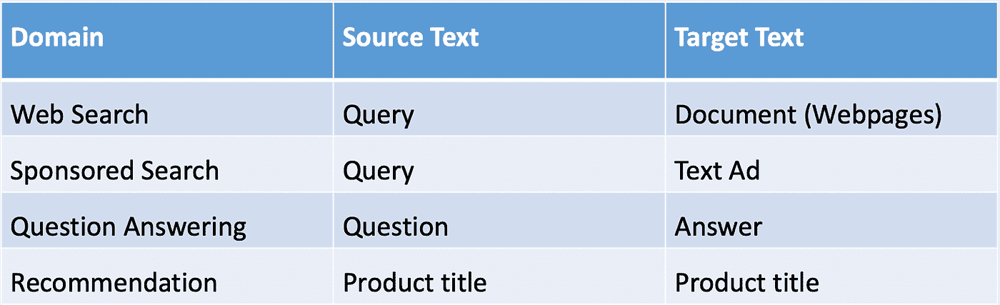

来源:作者图片

在本文的剩余部分中，我们将把重点放在新闻搜索上，作为一个说明性的例子，目标是为给定的输入查询找到相关的新闻文章。尽管我们将要讨论的技术适用于任何语义文本匹配任务。

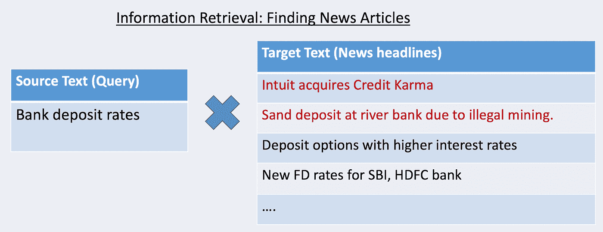

来源:作者图片

下图描述了新闻搜索 IR 系统的高级流程:

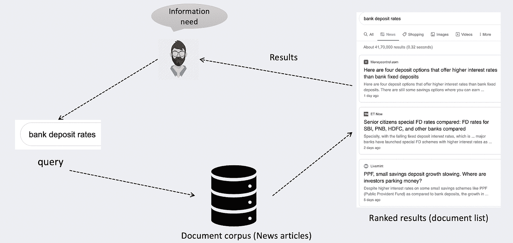

IR 系统(新闻搜索)(来源:作者图片)

# 基线方法

首先，让我们看一个简单的二进制分类方法来构建这样一个检索和排序系统。本质上，我们希望建立一个模型，该模型将查询和文档作为输入，并预测文档与查询相关的概率。

为了训练这个模型，首先我们需要生成带有查询和文档对以及 0/1 标签的训练数据。这种训练数据可以基于人类标记来收集。但是人工标记非常昂贵，而且只能产生有限的数据。这就是为什么通常使用基于历史点击数据的代理标签生成方法。

因此，如果对于给定的查询，当向用户显示文档时，该文档已经接收了最小数量的点击和最小点击率，则查询-文档对被标记为 1。并且对于同一查询，从语料库中随机采样的少量文档被标记为 0，并用于训练模型。

一旦我们收集了这些数据，我们就可以从查询和文档中提取一些特征，并训练一个二元分类模型(SVM/提升树/神经网络)，然后将其用于我们的 IR 系统。

对于任何类似“银行存款利率”的查询，我们都会根据语料库中的文档逐一进行评估。首先，我们将查询和文档 1 传递给模型，这将给出该文档与查询相关的概率。然后，我们将传递查询和文档 2，并获得文档 2 的概率，我们将对语料库中的所有文档进行预测。一旦我们有了所有文档的概率，我们就可以根据概率对它们进行排序，并将排名靠前的文档返回给用户。

但是正如您可能已经观察到的，这种方法是不可伸缩的，因为文档语料库可能非常庞大，并且逐个对文档进行评分是不可行的。

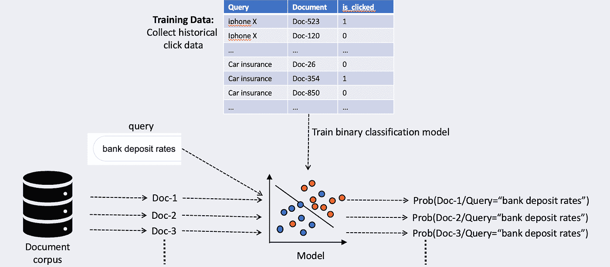

来源:作者图片

# 大规模系统的两步法；

为了平衡规模和质量，大规模语义文本匹配系统通常遵循两步方法:

# 步骤 1 —候选人生成:

第一步是候选人生成。候选生成步骤的目标是快速检索与输入查询相关的文档子集。这一步有一些假阳性是可以的，如果这有助于使这一步更快。有多种方法可以构建候选生成模块。我们将在本文中讨论两种方法。

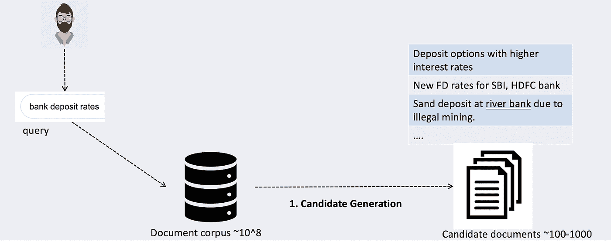

候选人生成(来源:作者图片)

# 步骤 2 —重新分级:

一旦我们有了 100 个候选文档，下一步就是重新排序。重新排序步骤的目标是相对于输入查询对候选文档进行排序，从而可以向用户显示排名靠前的文档。有多种方法可以构建重新排序模块。我们将在本文中讨论两个模型。

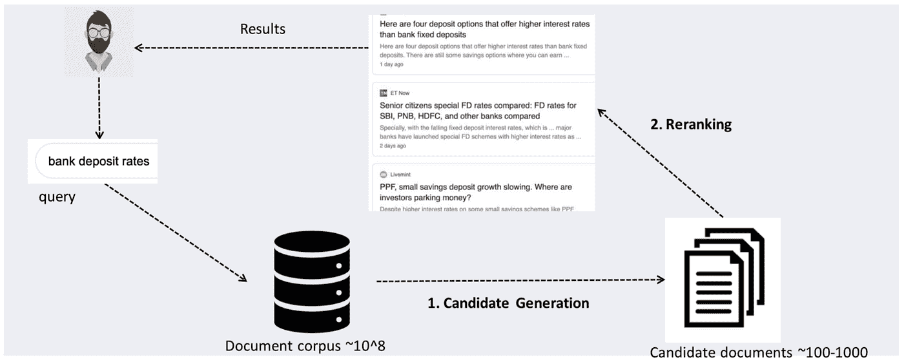

重新排名(来源:作者图片)

# 候选人生成:

## 基于倒排索引的候选生成:

传统上，基于令牌的倒排索引用于候选生成。倒排索引本质上是一个哈希映射，它将标记或单词映射到包含该标记的文档列表。这种索引构建可以离线完成。

然后，当查询到来时，首先我们将把查询分成标记，然后对于每个标记，我们将查找索引以获得包含该标记的文档列表。这些单个列表与 [BM25](https://en.wikipedia.org/wiki/Okapi_BM25#:~:text=BM25%20is%20a%20bag%2Dof,slightly%20different%20components%20and%20parameters.) 得分的联合可用作下一步重新分级的候选文档。

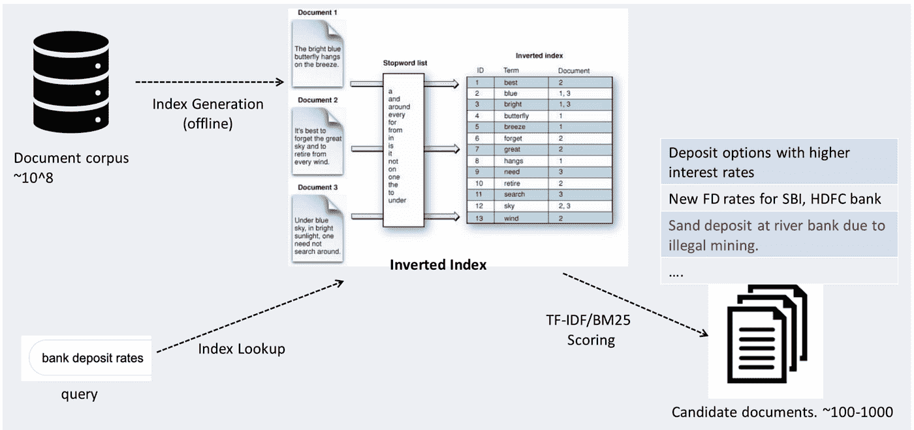

基于倒排索引的候选生成(来源:作者图片)

但是这种基于标记的检索具有局限性，因为它不能捕获单词之间的语义关系。例如，该方法为查询“银行存款利率”检索新闻文章“由于非法采矿在河岸沉积沙子”,因为没有办法区分“金融”银行和“河流”银行。

# 基于嵌入的候选生成:

最近，使用 DNN 嵌入的候选生成变得流行，因为它们可以更好地捕获查询和文档语义。在深入研究嵌入如何用于候选生成之前，让我们先简要介绍一下嵌入

**单词嵌入:**文献中提出了许多密集嵌入技术，如 word2vec、Glove、fasttext 等。这些技术的目的是通过几个 100 维实数密集向量来表示单词，使得语义相似单词的向量在 n 维空间中是邻近的。预先训练的单词嵌入可从各种 NLP 组下载。

[Word2vec](https://arxiv.org/pdf/1301.3781v3.pdf) CBoW 和 Skip-gram 是两个早期的单词嵌入模型，它们围绕密集单词嵌入产生了很多兴趣。CBoW 将单词周围的上下文作为输入，并试图预测单词，而 skip-gram 将单词作为输入，并试图预测世界各地的上下文。这两种架构的目标都是提取单词共现模式，从而捕获单词之间的语义关系

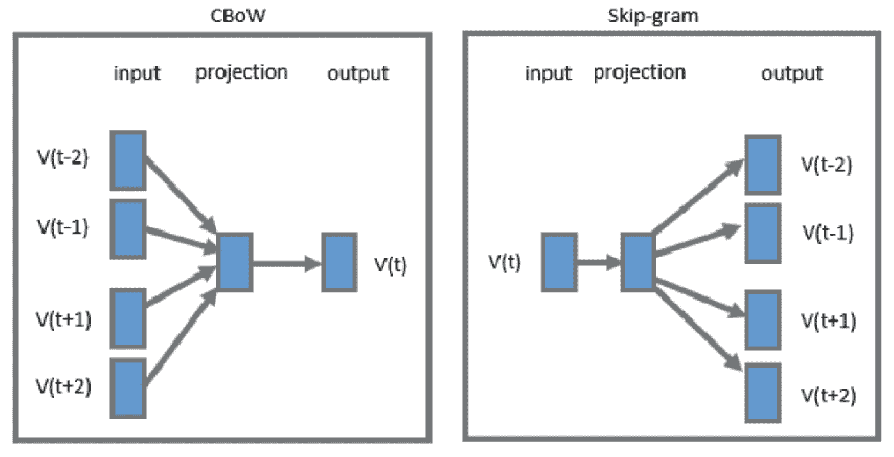

来源:【word 2 矢量模型的 CBoW 和 Skip-gram 架构

**句子嵌入:**一种生成句子嵌入的方法可以是直接对句子中的单词向量进行平均，但是这种平均嵌入对于像语义匹配这样的下游任务来说执行得不是很好。已经提出了许多模型来学习更好的句子嵌入。BERT 就是这样一个基于 transformer 架构的流行深度学习模型。各种 NLP 小组都提供了在大量文本数据(如维基百科和图书语料库)上训练的预训练 BERT 模型。这些预先训练的模型可以用于为语料库中的文档生成嵌入

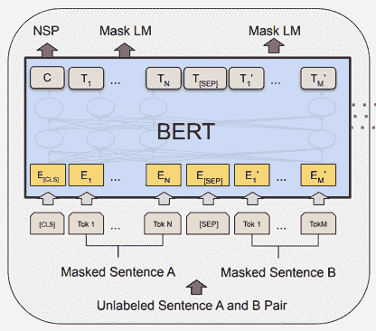

来源: [BERT:用于语言理解的深度双向转换器的预训练](https://arxiv.org/abs/1810.04805)

有了这个关于嵌入的快速背景，让我们看看如何使用嵌入来生成候选项。首先，我们可以使用像 BERT 这样的技术生成语料库中所有文档的嵌入。现在，当新的查询出现时，我们可以使用相同的 BERT 预训练模型将其转换为数字向量。然后可以基于查询嵌入和每个文档嵌入之间的余弦相似性来检索候选文档。

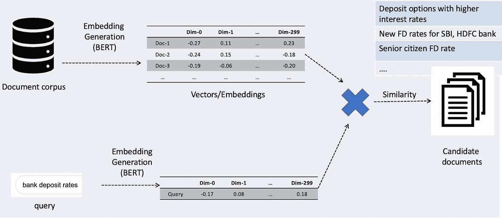

来源:作者图片

但是计算所有文档嵌入的查询嵌入的余弦相似度是非常昂贵的。这就是类似 FAISS 的相似性搜索库发挥作用的地方。这些库允许在嵌入空间中非常有效的 top-k 检索。本质上，文档向量可以使用像 FAISS 这样的库进行离线索引。现在，当新的查询出现时，我们可以使用相同的 BERT 预训练模型将其转换为数字向量。然后，使用查询嵌入对文档的向量索引运行最近邻搜索，并在嵌入空间中检索前 k 个最近的文档。

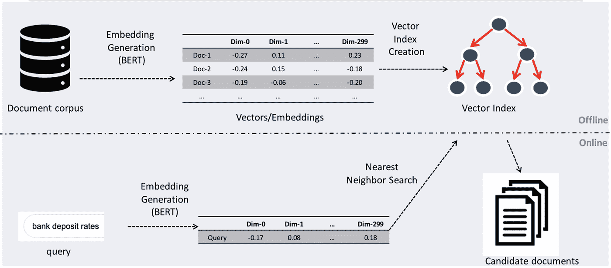

密集向量的高效相似性搜索(来源:作者图片)

# 重新分级:

一旦我们检索到前 k 个候选文档，下一步就是根据查询对这些文档进行排序，这样就可以向用户呈现排名靠前的结果。

# 为什么我们需要重新排名？

一种方法可以是完全取消重新排序步骤，直接使用由候选生成步骤提供的排序来选择最高的结果。但是这种方法不是最佳的，因为候选生成具有局限性:

*   首先，对于候选生成步骤，需要离线预计算文档嵌入，这意味着只能使用独立于查询和基于嵌入的模型。此外，任何在查询和文档之间使用交叉特征的模型都不能用于候选生成步骤。
*   第二，重新排序模型可用于优化特定任务目标，如赞助搜索中的点击率或产品推荐中的转化率，而通用预训练模型可用于候选生成。

让我们来看看重新排序任务的几个深度学习模型。

# 二重奏模型

巴斯卡尔·米特拉等人。艾尔。提出了深度学习模型 Duet 用于重排序任务。该模型将查询和文档对中的单词嵌入作为输入，然后是交互层和密集层，以计算给定查询的文档的概率。这个模型可以在查询文档训练数据上进行训练，如基线方法一节中所讨论的。

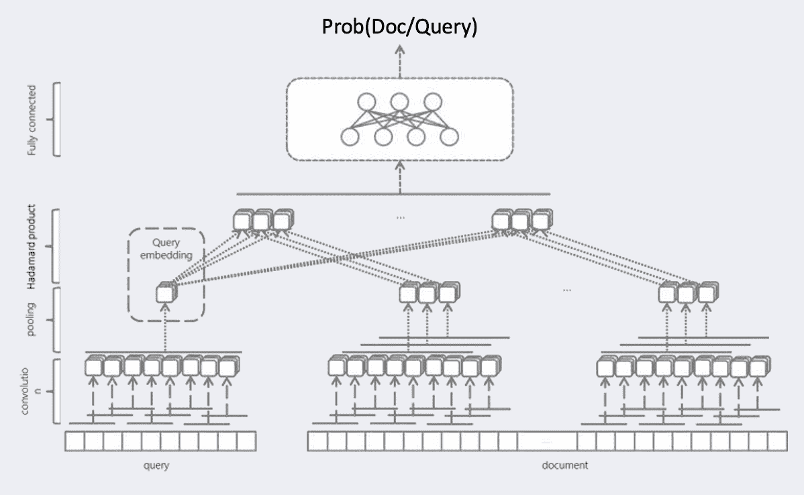

来源:[学习使用本地和分布式文本表示进行网络搜索](https://arxiv.org/abs/1610.08136)

# 伯特为排名

戴等。艾尔。提出扩展 BERT 模型进行任务重排序。它建议采用预先训练的 BERT 模型，并在查询文档训练数据上微调该模型。此微调模型可用于重新分级任务。

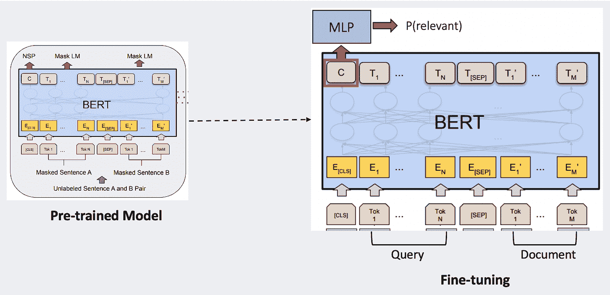

来源:[使用上下文神经语言建模进行更深入的文本理解](https://arxiv.org/abs/1905.09217)

# 结论

我们讨论了一种用于处理大规模语义文本匹配问题的端到端深度学习方法。我们还使用了 Kaggle 的[识别 Quora 重复问题](https://www.kaggle.com/c/quora-question-pairs)问题来说明本文讨论的技术的样本代码。

带代码的笔记本在 [GitHub](https://github.com/kavetinaveen/Deep-Learning-for-Semantic-Text-Matching/blob/main/NLP%20using%20Deep%20Learning%20in%20Python.ipynb) 有售。

我们还就此主题举办了一场网络研讨会。同样的录像可以在 youtube 上观看