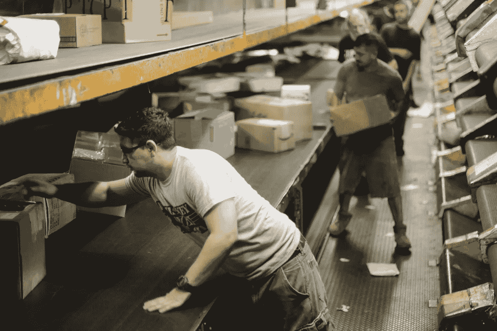
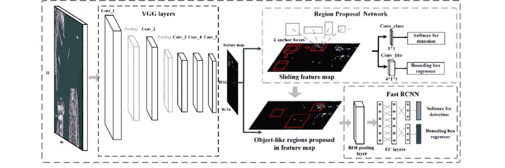
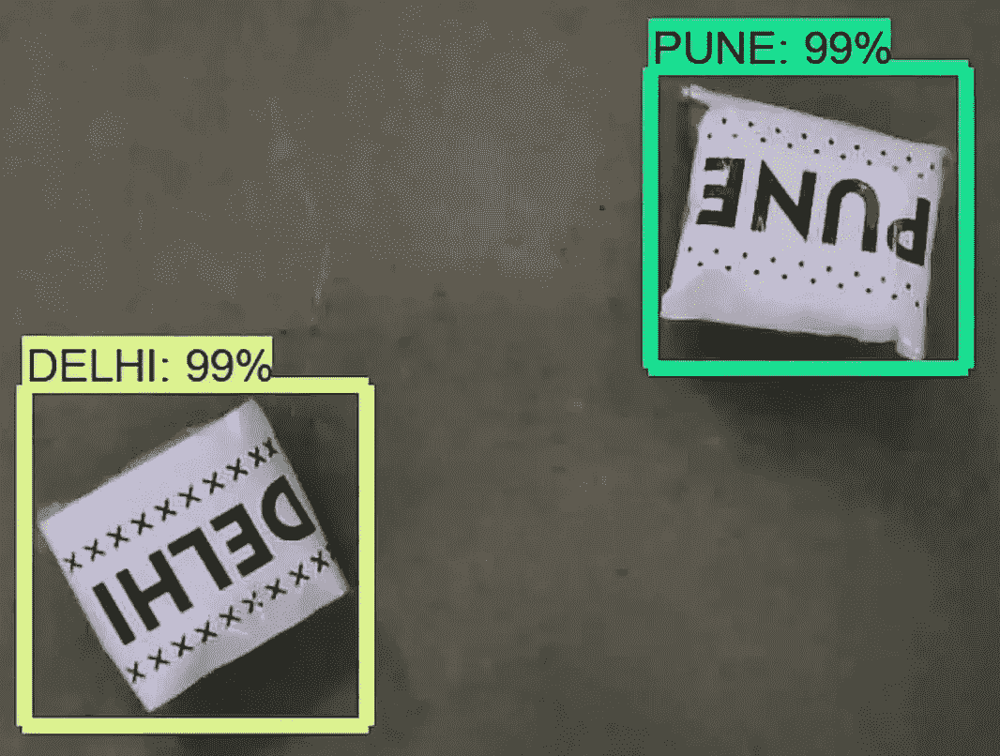
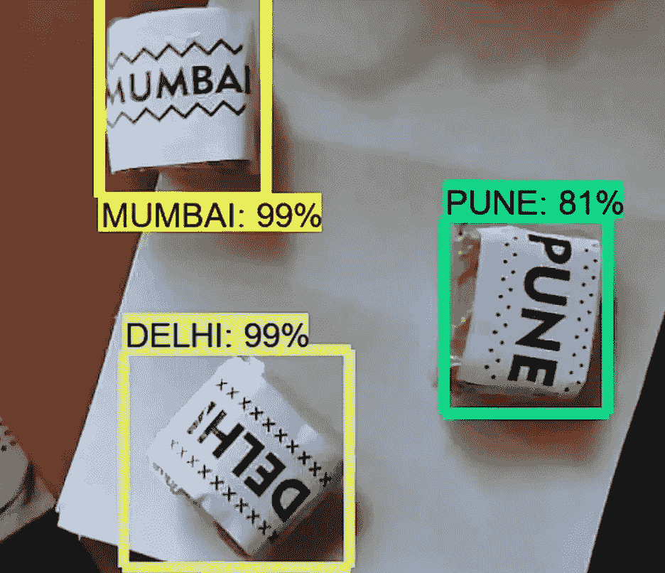
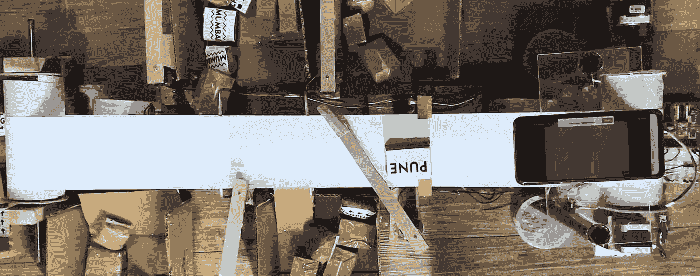

# 供应链优化的深度学习|使用自动化机器人分拣包裹

> 原文：<https://towardsdatascience.com/deep-learning-for-supply-chain-optimization-using-automated-robots-to-sort-packages-f29123d889de?source=collection_archive---------37----------------------->

## 我是如何制造一个自主机器人来帮助你更快地获得在线订单的

自动化是过去几年的主要趋势。现在，随着电子商务需求的不断增长，亚马逊每天处理 576 万份订单(仅在美国！)，供应链行业面临一个新的优化问题。

分拣是交付过程中的一个重要步骤，传统上，这一过程是手工进行的。在谷歌上简单搜索“*包裹分拣工作*，你会看到成千上万家公司为此招聘人力。不用说，手工分拣速度慢，效率低，还会导致延误。在像供应链这样快节奏的行业中，每一分钟的延迟都会导致公司收入的损失。

来源:“ [UPS 的 200 亿美元问题:运营停滞在 20 世纪](https://outline.com/xD5B8c)”

因此，公司正在寻找更快、更有效和更可靠的系统。这个问题可以用**机器学习来解决。**

因此，在冠状病毒封锁期间，我无法进入电子产品和五金店，我决定用我在家里能找到的任何废料制作自己的“自动分拣机”。这台机器能够根据包裹的最终目的地将它们分类。

**该视频展示了项目的运作。**

# 它是如何工作的！

*   传送带上方放置了一个摄像头。
*   照相机将包裹的快照发送到计算机。
*   计算机处理输入，并对图像运行深度学习算法(更快的 RCNN)。
*   深度学习模型确定包裹的合适目的地，并自动分拣。

# 技术方面的东西

*   我用 Tensorflow 对象检测 API 训练了一个基于**更快 RCNN** 架构的深度学习模型。

更快的 RCNN 架构

*   我在自己的数据集上通过点击数百张要分类的包裹照片来训练它。
*   在使用 Tensorflow 对象检测 API 训练模型之后，OpenCV 使用训练期间生成的推理图和 labelmap 执行分类任务。

从网络摄像头获取视频输入的 OpenCV 脚本

作者照片-深度学习模型对包的分类

*   这就是模型对包进行分类的方式。
*   一旦被识别，算法就向 Arduino 微控制器发送信号。
*   微控制器向适当的伺服电机发出信号，使其迅速进入，并将包裹分拣到所需的目的地。

# 结论

为了提高速度和效率，减少对手工劳动的依赖并最大限度地提高利润，各行业都在寻求供应链中每一步的自动化。随着世界变得越来越依赖在线服务，机器人，自动驾驶卡车，增强现实，仓库自动化，只是未来技术的一部分，这些技术将改变我们所知的电子商务的面貌。

参考资料:

[Tensorflow 对象检测 API](https://github.com/tensorflow/models/tree/master/research/object_detection)