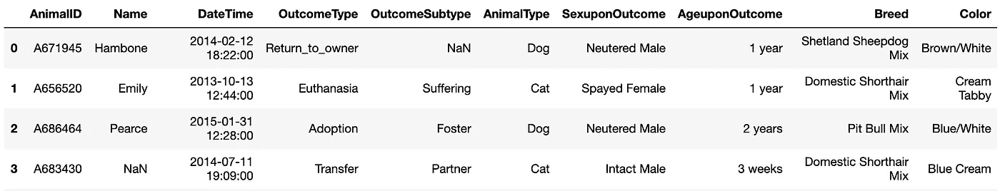
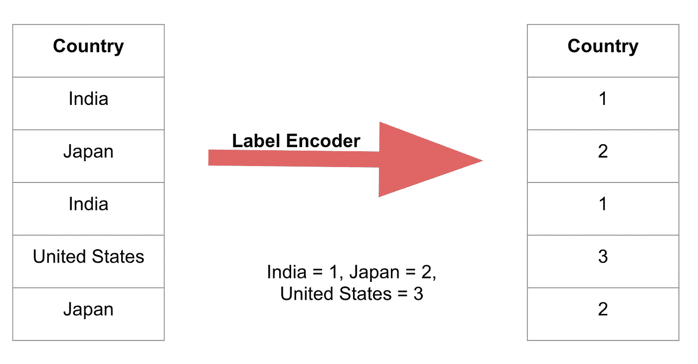
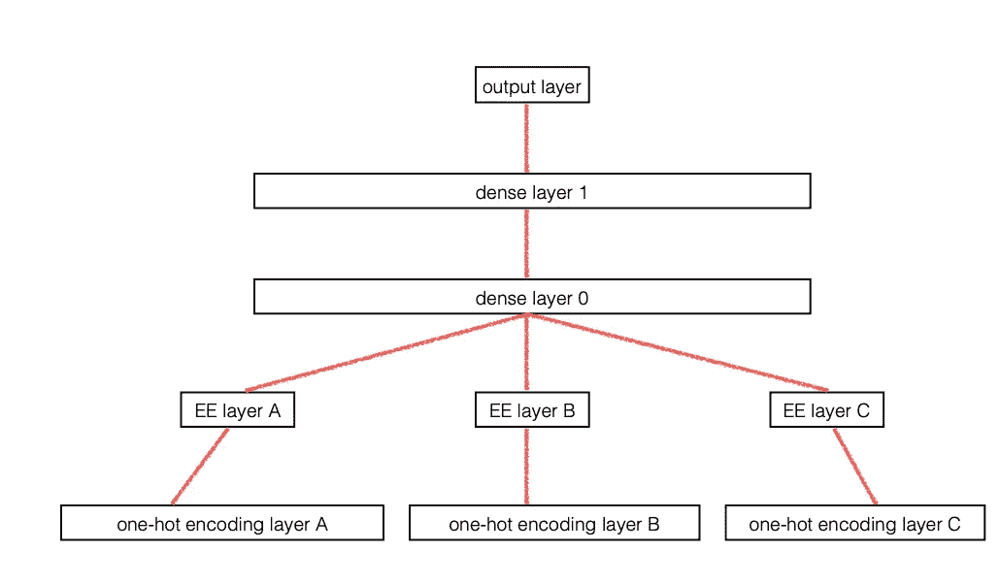
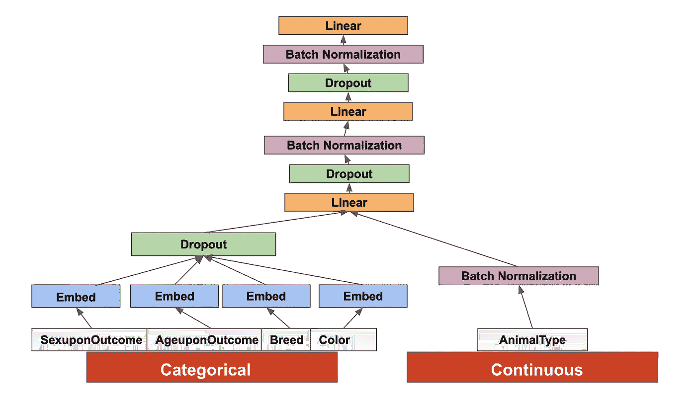
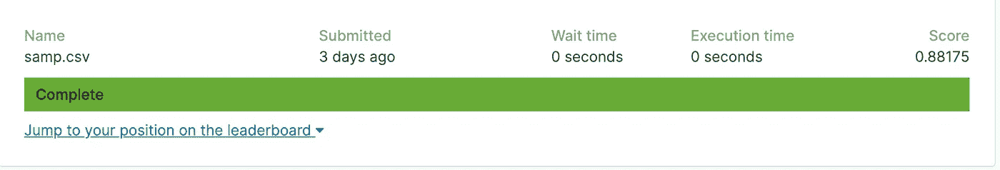

# 使用 PyTorch 对表格数据进行深度学习

> 原文：<https://towardsdatascience.com/deep-learning-for-tabular-data-using-pytorch-1807f2858320?source=collection_archive---------3----------------------->

## 关于多类分类问题

[信号源](https://design-nation.icons8.com/intro-to-data-tables-design-349f55861803)

深度学习已被证明在计算机视觉、自然语言处理、信号处理等许多领域具有开创性。然而，当涉及到由分类或数字变量组成的更结构化的表格数据时，传统的机器学习方法(如随机森林，XGBoost)被认为表现更好。正如所料，神经网络已经赶上来了，并且在许多情况下表现得一样好，有时甚至更好。

用表格数据执行深度学习的最简单方法是通过 [fast-ai 库](https://docs.fast.ai/tabular.html)，它给出了非常好的结果，但对于试图了解幕后真正发生了什么的人来说，它可能有点太抽象了。因此，在本文中，我介绍了如何构建一个简单的深度学习模型来处理 Pytorch 中关于多类分类问题的表格数据。

# Pytorch 的一点背景

Pytorch 是一个流行的开源机器库。它和 Python 一样使用和学习简单。使用 PyTorch 的其他一些优势是它的多 GPU 支持和自定义数据加载器。如果你对基础知识不熟悉或者需要复习，这里是一个很好的起点:

# 密码

如果你想遵循代码，这是我的 Jupyter 笔记本:

 [## 动物 _ 庇护所 _ 结果

使用 jovian.ml 共享](https://jovian.ml/aakanksha-ns/shelter-outcome) 

# 资料组

我使用了收容所动物结果 Kaggle 竞赛数据:

 [## 收容所动物结果

### 帮助改善收容所动物的结果

www.kaggle.com](https://www.kaggle.com/c/shelter-animal-outcomes/data) 

这是一个表格数据集，在训练集中包含大约 26k 行和 10 列。除了`DateTime`之外的所有列都是分类的。

来自训练集的样本数据

# 问题陈述

给定庇护所动物的某些特征(如年龄、性别、颜色、品种)，预测其结果。

有 5 种可能的结果:`Return_to_owner, Euthanasia, Adoption, Transfer, Died`。我们期望找到一个动物的结果属于 5 个类别中的每一个的概率。

# 数据预处理

尽管这一步骤很大程度上取决于特定的数据和问题，但仍有两个必要的步骤需要遵循:

## 摆脱`Nan`价值观:

`Nan`(非数字)表示数据集中缺少值。该模型不接受`Nan`值，因此它们必须被删除或替换。

对于数字列，处理这些值的一种流行方法是用 0、均值、中值、众数或其他剩余数据的函数来估算它们。缺失值有时可能表示数据集中的基础要素，因此人们通常会创建一个与缺失值列相对应的新二进制列来记录数据是否缺失。

对于分类列，`Nan`值可以认为是自己的类别！

## 编码所有分类列的标签:

因为我们的模型只能接受数字输入，所以我们将所有的分类元素转换成数字。这意味着我们不用字符串来表示类别，而是用数字。选择代表类别的数字应在 0 到该列中不同类别总数(包括`Nan`)的范围内。这是为了当我们为该列创建分类嵌入时，我们希望能够索引到我们的嵌入矩阵中，该矩阵对于每个类别都有一个条目。下面是一个简单的标签编码示例:

我使用了 scikit-learn 库中的`[LabelEncoder](https://scikit-learn.org/stable/modules/generated/sklearn.preprocessing.LabelEncoder.html)`类来编码分类列。您可以定义一个定制的类来完成这项工作，并跟踪类别标签，因为您也需要它们来编码测试数据。

## 编码目标的标签:

如果目标有字符串条目，我们还需要对其进行标签编码。此外，确保维护一个将编码映射到原始值的字典，因为您将需要它来计算模型的最终输出。

## 庇护所结果问题的特殊数据处理:

除了上述步骤，我还对示例问题做了一些处理。

1.  删除了`AnimalID`栏，因为它很独特，对训练没有帮助。
2.  删除了`OutcomeSubtype`列，因为它是目标的一部分，但我们没有被要求预测它。
3.  删除了`DateTime`列，因为记录输入时的确切时间戳似乎不是一个重要的特性。事实上，我最初试图将它拆分成单独的月和年列，但后来意识到将该列一起删除会得到更好的结果！
4.  删除了`Name`列，因为它有太多的`Nan`值(缺少 10k 以上)。此外，它似乎不是决定动物结果的一个非常重要的特征。

**注意**:在我的笔记本中，我堆叠了训练和测试列，然后进行了预处理，以避免必须根据测试集上的训练集标签进行标签编码(因为这将涉及到维护一个编码标签到实际值的字典)。在这里进行堆叠和处理是没问题的，因为没有数字列(因此没有进行输入),并且每列的类别数量是固定的。在实践中，我们绝不能这样做，因为这可能会将测试/验证集中的一些数据泄露给训练数据，并导致对模型的不准确评估。例如，如果您在类似`age`的数字列中有缺失值，并决定用平均值对其进行估算，则平均值应仅在训练集(非堆叠训练-测试-有效集)上计算，并且该值也应用于估算验证和测试集中的缺失值。

# 范畴嵌入

[分类嵌入](https://arxiv.org/pdf/1604.06737.pdf)与自然语言处理中常用的单词嵌入非常相似。基本思想是让列中的每个类别都有一个固定长度的向量表示。这与一次性编码的不同之处在于，我们不是使用稀疏矩阵，而是使用嵌入，为每个类别获得密集矩阵，其中相似类别在嵌入空间中具有彼此接近的值。因此，这个过程不仅节省了内存(因为对包含太多类别的列进行一键编码确实会破坏输入矩阵，而且它是一个非常稀疏的矩阵)，而且还揭示了分类变量的内在属性。

例如，如果我们有一列颜色，我们为它找到嵌入，我们可以期望`red`和`pink`在嵌入空间中比`red`和`blue`更近

分类嵌入层相当于每个独热编码输入之上的额外层:

来源:[分类变量的实体嵌入](https://arxiv.org/pdf/1604.06737.pdf)研究论文

对于我们的 shelter outcome 问题，我们只有分类列，但我会将值少于 3 的列视为连续列。为了决定每列嵌入向量的长度，我从 fast-ai 库中取了一个简单的函数:

# Pytorch 数据集和数据加载器

我们扩展了 Pytorch 提供的`[Dataset](https://pytorch.org/docs/stable/_modules/torch/utils/data/dataset.html#TensorDataset)`(抽象)类，以便在训练时更容易访问我们的数据集，并有效地使用`DataLoader`模块来管理批处理。这包括根据我们的特定数据集覆盖`__len__`和`__getitem__`方法。

因为我们只需要嵌入分类列，所以我们将输入分成两部分:数字和分类。

然后，我们选择批量大小，并将其与数据集一起提供给数据加载器。深度学习一般是批量进行的。`DataLoader`帮助我们有效地管理这些批次，并在训练前重组数据。

要进行健全性检查，您可以遍历创建的数据加载器来查看每个批处理:

# 模型

我们的数据被分成连续的和分类的部分。我们首先根据之前确定的大小将分类部分转换为嵌入向量，并将它们与连续部分连接起来，以馈送到网络的其余部分。这张图片展示了我使用的模型:

住房结果模型

# 培养

现在我们在训练集上训练模型。我已经使用了 Adam 优化器来优化交叉熵损失。训练非常简单:迭代每一批，向前传递，计算梯度，梯度下降，根据需要重复这个过程。可以看看[我的笔记本](https://jovian.ml/aakanksha-ns/shelter-outcome)了解代码。

# 测试输出

由于我们对找到测试输入的每个类的概率感兴趣，所以我们对模型输出应用了 Softmax 函数。我还提交了一个 Kaggle 来看看这个模型的表现如何:

我们做了很少的功能工程和数据探索，并使用了非常基本的深度学习架构，但我们的模型比大约 50%的解决方案做得更好。这表明这种使用神经网络对表格数据建模的方法非常强大！

**参考文献:**

1.  https://www . usfca . edu/data-institute/certificates/fundamentals-deep-learning—第 2 课
2.  [https://jovian.ml/aakashns/04-feedforward-nn](https://jovian.ml/aakashns/04-feedforward-nn)