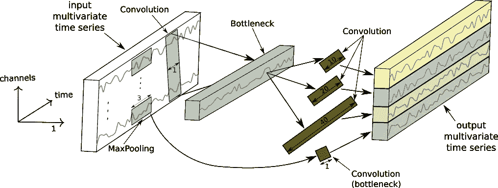
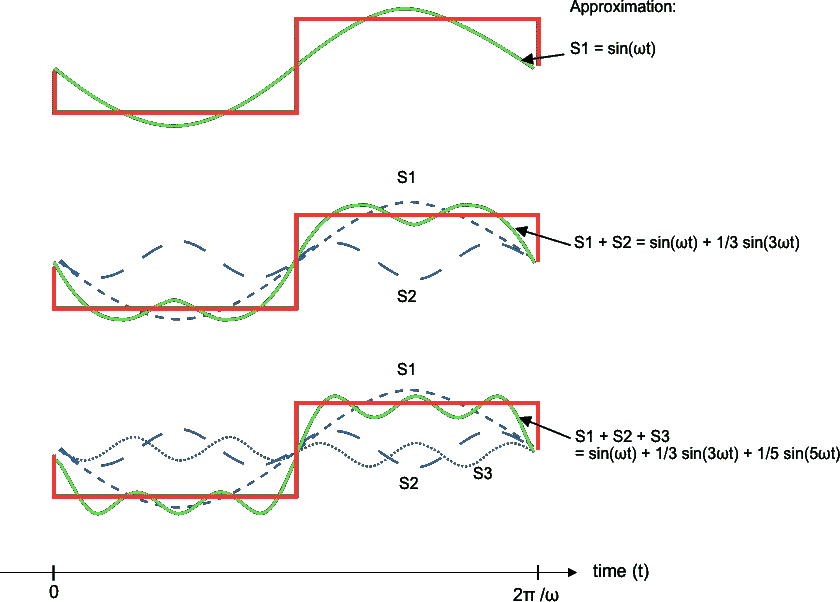
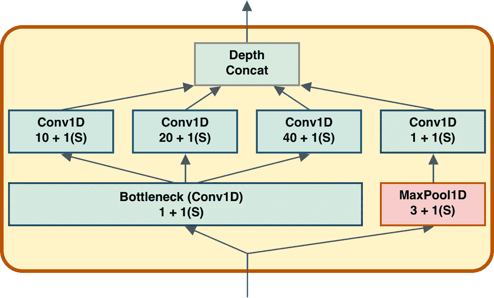
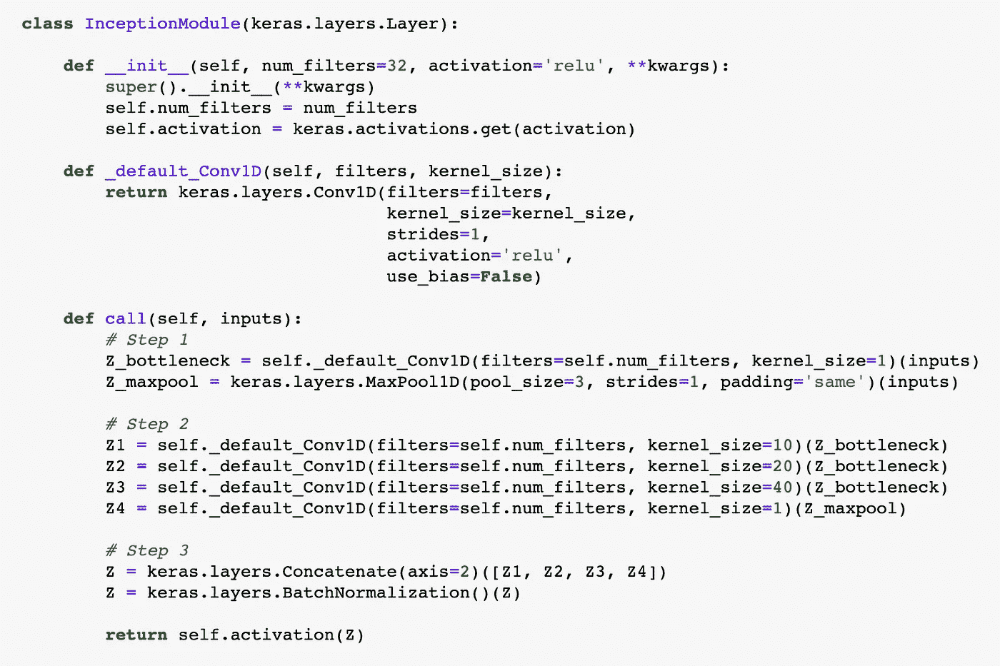
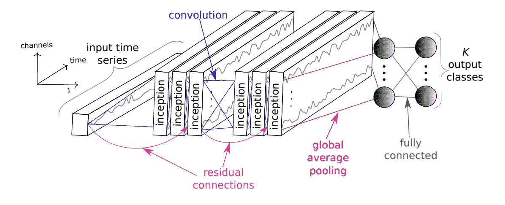
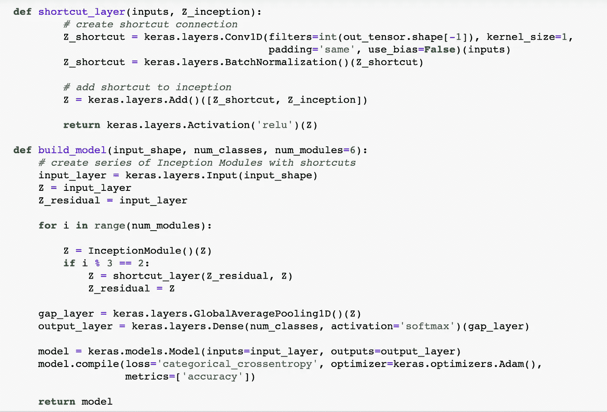
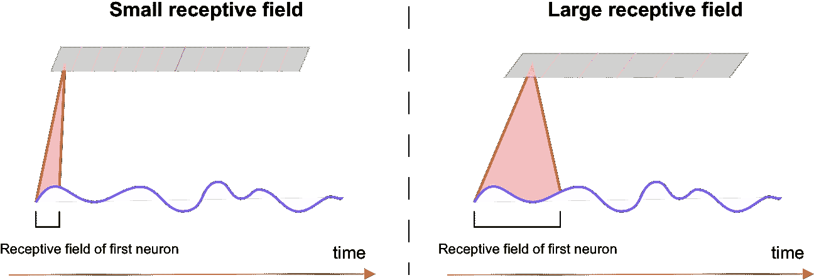

# 时间序列分类的深度学习(InceptionTime)

> 原文：<https://towardsdatascience.com/deep-learning-for-time-series-classification-inceptiontime-245703f422db?source=collection_archive---------1----------------------->

## 用于时间序列分类的新深度学习(类 GoogleNet)模型。

图 InceptionTime 的初始模块。

# 索引

1.  动机
2.  用于时间序列分类的机器学习
3.  时间序列分类的最佳深度学习实践:InceptionTime
4.  了解初始时间
5.  结论

# **1。动机**

时间序列数据一直是金融服务的主要兴趣，现在随着实时应用的兴起，零售和编程广告等其他领域正在将注意力转向时间序列数据驱动的应用。在过去几年中，云服务的几个主要参与者，如 Apache Kafka 和 Apache Spark，已经发布了处理时间序列数据的新产品。因此，理解机器学习(ML)在这个新兴领域中的作用和潜力是非常有趣的。

在这篇文章中，我通过跟踪[ [2](https://arxiv.org/abs/1809.04356) 作者的一系列出版物，讨论了关于深度学习的时间序列分类(TSC)的(非常)最新发现。

# **2。**用于时间序列分类的机器学习

**定义问题:**

TSC 是 ML 对学习如何给时间序列分配标签感兴趣的领域。更具体地说，我们对训练 ML 模型感兴趣，当输入一系列按时间顺序索引的数据点(例如，金融资产的历史数据)时，它输出标签(例如，资产的行业部门)。

更正式的说法是，让【t8(x，y)】成为一个训练实例，带有 *T* 观察值 *(X，… ,Xᵀ)≡ X* (时间序列)和一个离散类变量 *y* ，它取 *k* 个可能值(标签)。一个数据集 *S* 就是一组 *n* 这样的训练实例: *S=* *{ (X₍₁₎，y₍₁₎)，…，(X₍ n₎，y₍ n₎)) }* 。对时间序列数据进行分类的任务包括在 *S* 上学习分类器，以便从可能的输入空间 *{X}* 映射到标签 *{y，…，yᵏ}* 上的概率分布。

我们真的需要 DL 吗？

提醒我们自己 DL 只不过是一套解决问题的工具，这一点很重要，尽管 DL 可能非常强大，但这并不意味着我们应该盲目地将 DL 技术应用于每一个问题。毕竟，训练和调整神经网络可能非常耗时，所以测试其他 ML 模型的性能，然后寻找任何潜在的缺点总是一个好的做法。

通常，问题的性质是由数据本身决定的；在我们的例子中，选择处理和分类时间序列的方式高度依赖于数据的长度和统计。也就是说，让我们运行一个快速量纲分析来估计我们问题的复杂性。

假设我们希望为我们的 TSC 问题学习一个最近邻分类器(这在文献中很常见)。现在给定一个长度为 *T* 的 *n* 时间序列的数据集，我们必须为 *ⁿC₂=n(n-1)/2* 唯一对计算某种距离度量。此外，为了找到两个时间序列 *X₍₁₎* 和 *X₍₂₎* 之间的“最佳距离”，我们必须为每一对唯一的训练实例计算 *T×T* 逐点距离矩阵*mʲᵏ=*(*x₍₁₎ʲ-x₍₂₎ᵏ)*，然后寻找优化我们的目标函数的路径。正如在[ [3](https://arxiv.org/pdf/1602.01711.pdf) 中所解释的，文献中有几种针对这种设置的优化算法，它们都具有复杂度 *O(n ⋅ Tᶜ)* ，其中 *c=3 或 4* 。显然，**时间序列的长度真的会损害计算速度。然而，对于某些类型的数据，这个问题可以在不挖掘复杂的机器学习模型(如深度神经网络)的情况下得到缓解。**

在信号处理中，通过将信号分解成一系列“基本”信号来分析复杂信号，称为*傅立叶模式*。例如，下面的方波可以用三个不同频率的正弦信号 *(f₁、f₂、f₃)=(ω、3ω、5ω)* 来近似，对于某个恒定角频率 *ω* 。

图 2:方波的傅立叶级数展开(红线)。这里我只介绍前三种模式(蓝色虚线)和它们的加法(绿线)。希望不难看出，通过增加下一个模式，级数很快收敛到方波。

通过对这些信号进行线性求和，我们可以重建原始信号:

*方波(t)= w⋅sin(f₁t)+w⋅sin(f₂t)+w⋅sin(f₃t)+…*

其中系数 *(W，W，W ) = (1，1/3，1/5)* 指定每个模式对方波贡献的*权重*。

现在考虑一个数据集，在该数据集内，最初由一系列 *T* 时间有序数据点表示的任何时间序列也可以由三个基本频率模式所跨越的空间中的权重向量来表示:

*X=(X，…，Xᵀ )* → *W* = *(W，w，w，…)。*

从我们的时间序列数据的“时间”表示到“频率”表示被称为*傅立叶变换*，虽然傅立叶空间在理论上是无限维的(而不是三维的)，但我们可以应用各种近似技术将傅立叶级数截断到有限维。最重要的是，**我们可以将时间序列数据的 *T* 维表示减少到多个维度(在傅立叶空间)，这使得我们的分类问题在计算上是可跟踪的**。总的来说，我们可以在数据预处理阶段应用傅立叶变换，以将输入时间序列转换成权重向量，然后继续构建我们的分类模型(例如，1-最近邻分类器)。使用这种“行为良好”的时间序列，我们可以在不使用 DL 的情况下实现高性能。

现在，前述处理方法**假设**任何输入信号都可以用基本(谐波)函数的傅立叶级数来近似。然而，许多现实世界的时间序列数据是如此嘈杂(如金融数据)，不允许这样一个优雅的分解(或任何形式的数学预处理)。正是针对这种类型的数据，DL 前来救援:**在处理非结构化噪声数据时，让模型自己学习如何处理时间序列数据是一个更有前途的解决方案。**

# **3。TSC 的最佳 DL 实践:开始时间**

迄今为止，TSC 有两种最先进的 DL 型号。最古老的模型称为 HIVE-COTE [ [4](https://core.ac.uk/download/pdf/77027925.pdf) ]，它基于最近邻算法和动态时间弯曲相似性度量。尽管该算法在基准数据集[ [5](https://www.cs.ucr.edu/~eamonn/time_series_data/) ]上取得了优异的性能，但其时间复杂度为 *O(n ⋅ T ⁴)* 。最近[ [6](https://arxiv.org/abs/1909.04939) ]的作者介绍了一种深度卷积神经网络(CNN)，称为 InceptionTime，它不仅比 HIVE-COTE 的精度更高，而且速度也快得多。InceptionTime 的高精度及其可扩展性使其成为产品开发的完美候选！

为此，让我们介绍一下 InceptionTime 最重要的组件，以及这些组件是如何在 Keras 中实现的。

**3.1 输入层**

一般来说，时间序列 *X* 的每个数据观测值 *Xʲ (j=1，…，T)* 可以是一个或多个数据测量值的列表，即 *Xʲ = ( X₁ʲ，…，X_m ʲ )* 对于 *m* 数据测量值，都是在第 *j* 时刻进行的。例如，一个质点在三维空间中运动的速度由三个空间分量组成: ***V*** *=(V₁，V₂，V₃)* 。跟踪粒子的速度达 *T* 秒，每秒一次观测，相当于收集一系列数据:( ***V*** *，…，****v****ᵀ)。*

**定义 1:** 安*米*-维*多元*时间序列【MTS】*x =(****x****，…，****x****【ᵀ】*由 *T* 有序元素 ***X***

***定义二:**一个长度为 *T 的单变量*时间序列 *X* 简单来说就是一个 *m=1* 的 MTS，即***x****ʲ*→*xʲ*∈ℝ和 *X****

就像在图像分类问题中一样，我们可以将输入 MTS 视为一个形状数组( *1，T，m)* ，其中 *m* 表示通道的数量(深度)。事实上，抑制输入的宽度并直接使用 *input_shape = (T，m)是很方便的。*

**3.2 初始模块**

InceptionTime 的主要构件是*初始模块*，如下图所示:

图 InceptionTime 的初始模块。框中的第一个数字表示内核大小，而第二个数字表示步幅大小。“(S)”指定填充类型，即“相同”。

这包括以下几层:

*   一个*瓶颈层*，用于减少输入的维度(即深度)。这减少了计算成本和参数数量，加快了训练速度，提高了泛化能力。
*   瓶颈的输出被馈送到核大小为 10、20 和 40 的三个*一维卷积层*。
*   初始模块的输入也通过大小为 3 的*最大池层*，并依次通过*瓶颈层*。
*   最后一层是*深度级联层*，其中步骤 2 的四个卷积层的输出沿着深度维度被级联。

所有层(不包括连接层)都有*步距* 1 和【相同】*填充*。此外，所有的卷积层都有 32 个 T4 过滤器。

**Keras 实现**

**3.3 盗梦空间网络**

InceptionTime 的网络架构与 GoogleNet 的[ [7](https://arxiv.org/pdf/1409.4842.pdf) ]高度相似。具体而言，该网络由一系列初始模块组成，其后是一个全局平均池层和一个具有 softmax 激活功能的密集层。

图 4:用于时间序列分类的初始网络。

然而，InceptionTime 在其网络层中引入了一个额外的元素:*剩余连接*在每三个初始模块中。

图 5:初始网络中的剩余连接。

**Keras 实施**

**3.4 初始时间:用于 TSC 的神经网络集成**

正如[ [6](https://arxiv.org/abs/1909.04939) ]中所解释的，事实证明，单个初始网络在准确性方面表现出很大的差异。这可能是因为与随机权重初始化以及随机优化过程本身相关联的可变性。为了克服这种不稳定性，提出的最先进的 InceptionTime 模型实际上是由 5 个初始网络组成的**，每个预测都被赋予一个均匀的权重(有关 TSC 的深度神经网络集成的更多信息，请参见[ [8](https://arxiv.org/abs/1903.06602) )。模型的完整实现可以在 [**Github**](https://github.com/hfawaz/InceptionTime) 上找到。**

# **4。了解开始时间**

正如前面提到的，InceptionTime 主要是受计算机视觉问题的 CNN 的启发，因此，我们希望我们的模型以类似的方式学习功能。例如，在图像分类中，底层的神经元学习识别低级(局部)特征，如线条，而高层的神经元学习检测高级(全局)特征，如形状(如眼睛)。同样，我们期望 InceptionTime 的底层神经元能够捕捉到一个时间序列的局部结构，比如直线和曲线，顶层神经元能够识别各种形状模式，比如“山谷”和“山丘”。

图 6:过滤器中神经元的感受野。

神经元所依赖的输入信号区域被称为该特定神经元的**感受野**。在物体识别中，更大的感受野用于捕捉更多的上下文。因此，在处理非常长的时间序列数据时，选择更大的感受域是很自然的，这样我们的认知时间将学会检测更大的模式。

# 5.结论

TSC 的一个重要方面是时间序列的长度，因为这可能会降低训练速度。虽然有各种数学处理方案可以用来解决这样的问题，但 InceptionTime 是 TSC 的主要算法，特别是对于长时间的噪声时间序列数据。

InceptionTime 是一组 CNN，它学习识别时间序列数据集中的局部和全局形状模式(即低级和高级特征)。不同的实验 [6](https://arxiv.org/abs/1909.04939) 表明 **InceptionTime 的时间复杂度与训练集大小和时间序列长度**均呈线性增长，即 *O(n ⋅ T)！*总的来说，InceptionTime 将 TSC 问题与图像分类问题放在了同一立足点上，因此探索其在工业领域的不同应用是令人兴奋的。

在接下来的一篇文章中，我将讨论我如何使用 InceptionTime 根据不同的属性(如行业/类别、位置和绩效)对金融资产进行分类和聚类。

# 参考

[ [1](https://apps.dtic.mil/docs/citations/ADA164453) ] *通过错误传播学习内部表示*

[2](https://arxiv.org/abs/1809.04356)*时间序列分类的深度学习:综述*

[ [3](https://arxiv.org/pdf/1602.01711.pdf) ] *伟大的时间序列分类烘焙:对最近提出的算法的实验评估。扩展版*

[ [4](https://core.ac.uk/download/pdf/77027925.pdf) ] *HIVE-COTE:用于时间序列分类的基于变换的集成的层次投票集合*

【[5](https://www.cs.ucr.edu/~eamonn/time_series_data/)】*UCR 时间序列分类存档*

[ [6](https://arxiv.org/abs/1909.04939) ] *开始时间:寻找 AlexNet 进行时间序列分类*

[ [7](https://arxiv.org/pdf/1409.4842.pdf) ] *用卷积更深入(GoogleNet)*

[ [8](https://arxiv.org/abs/1903.06602) ] *用于时间序列分类的深度神经网络集成*