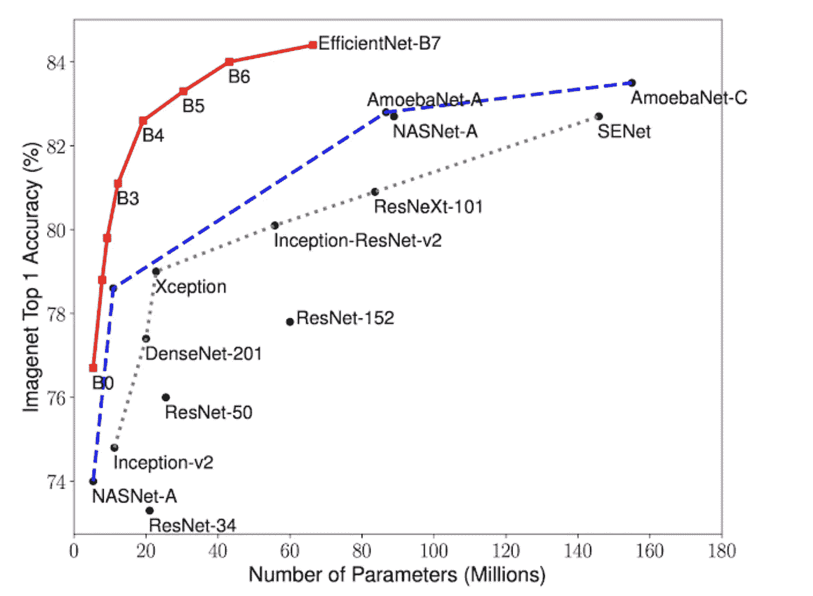
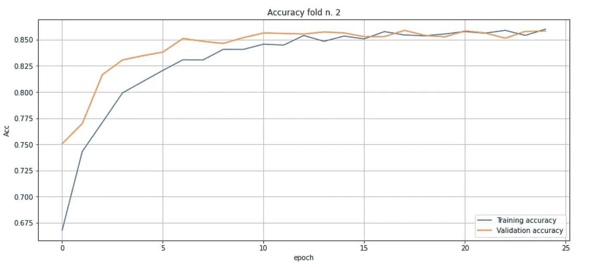
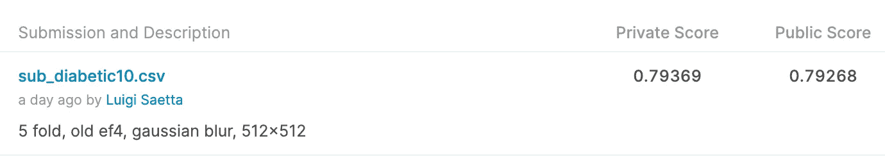
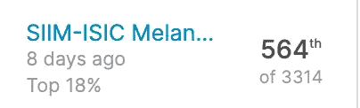

# (深入)从 Kaggle 竞赛中学习

> 原文：<https://towardsdatascience.com/deep-learning-from-kaggle-competitions-e0992fd4352e?source=collection_archive---------56----------------------->

# 为什么是 Kaggle？

几个月前，当我参加 [SIIM-ISIC 黑素瘤分类竞赛](https://www.kaggle.com/c/siim-isic-melanoma-classification)时，我开始认真使用 [Kaggle](https://www.kaggle.com/luigisaetta) 。

我认为，最初的原因是我想要一种严肃的方式来测试我的**机器学习(ML)和深度学习(DL)技能**。当时，我正在为 Coursera 医学专业学习，我对将 DL 应用于医学能够实现什么很感兴趣(现在仍然如此)。我还在读埃里克·托普写的美丽的书:《深度医学》，书中充满了有趣的想法。

几年前，我开了一个 Kaggle 账户，但还没做过什么大事。然后，我发现了**黑色素瘤挑战**，这似乎是一个用真实数据开始一项艰巨任务的好方法。

因此，我开始致力于比赛，我陷入了比赛。我认为这更容易。

# 我所学内容的总结。

**我学会掌握的第一件事**是如何**高效地读取许多图像，**而不需要 GPU(或 TPU)等待。

事实上，在一开始，我试图在 2-GPU 机器上训练我的第一个模型，训练似乎太**慢**。GPU 利用率非常低，大约 20%。为什么？

因为我正在使用 Keras [ImageDataGenerator](https://keras.io/api/preprocessing/image/#imagedatagenerator-class) ，从目录中读取图像。看了 Kaggle 上的几个讨论(是的，这是一个重要的建议:看讨论)我发现一个非常有效的方法是将图片(最终经过预处理，调整大小)打包成 [TFRecord 格式](https://www.tensorflow.org/tutorials/load_data/tfrecord) **的文件。**通过这种方式，我已经能够**将 GPU 利用率提高到 90%以上。**

是的，我知道随着 TF 2.3 的到来，预处理和数据加载功能将会有所改进(参见:[imagedatasetfromdirect](https://keras.io/api/preprocessing/image/#imagedatasetfromdirectory-function))，但是如果您需要进行大量的图像(或数据)预处理，那么您应该考虑将结果打包成 TFRecord 格式。

**第二件重要的事情**是使用一个**现代预训练的 ConvNet** 。

再次，从 Kaggle 的讨论中，我发现了效率网家族。这些是卷积网络，在 Imagenet 上预先训练，由谷歌研究人员在 2019 年提出。这些 CNN 非常高效，如果与旧 CNN 相比，你可以用更少的计算能力获得更高的精确度。令人惊讶的是，你可以简单地使用一个高效网络作为卷积层(特征提取器)来提高精确度。

(来源:谷歌 AI 博客，[https://AI . Google blog . com/2019/05/efficient net-improving-accuracy-and . html](https://ai.googleblog.com/2019/05/efficientnet-improving-accuracy-and.html))

**第三件事**是开发一种**健壮的交叉验证方法**。像往常一样，你希望有一个尽可能大的训练集。但是，与此同时，您需要足够大的验证集，以便对训练模型在看不见的数据上的性能(准确性、AUC 等)有一个公平的想法。如果验证集太小，您对分数的估计很大程度上取决于您在训练集和验证集之间划分的方式。唯一可行的方法是采用健壮的交叉验证(CV)模式。例如，我经常使用具有 5 个折叠的 CV:训练集被分成 5 个折叠，并且我重复训练(对于整个历元数)五次，每次取训练集的五分之一进行验证。对于每一次折叠，我估计最终的准确度(或者你选择的任何度量标准),最好的估计(在验证阶段)是平均值。如果训练集和测试集中的分布是相同的，你应该得到一个 CV 分数，这是对公开分数 LB 的一个很好的估计(你也希望得到最终的私有 LB 分数)。

**第四:学会使用 TPU** 。TPU 是由 Google 专门设计和开发的专用(ASIC)处理器，用于处理神经网络。如果你知道怎么做，你可以在 TPU 上使用 Tensorflow，以比使用 2-GPU 机器快十倍的速度训练你的模型。更好的是能够在 1/10 的时间内测试模型中的变化，以及它们在准确性方面的结果。这样你就不会因为等太久而感到无聊，也可以做更多的检查。在 Kaggle 上，你每周有 30 个小时的 TPU 时间是免费的(目前唯一的缺点是他们还不支持 TF 2.3，但我相信不会花太长时间来支持它)。

一般来说，你应该知道如何在多 GPU 和 TPU 机器上训练。这并不困难，即使乍一看配置代码看起来有点晦涩。

**第五**:温柔对待自己的学习速度。

学习率(LR)可能是最重要的超参数。但是，如果你阅读一本关于深度学习的介绍性书籍，你不会找到任何关于你可以采用的策略的详细描述，以使用 LR 来充分利用你的数据。

一些快速的考虑:如果你正在进行迁移学习(参见 EfficientNet ),你可以在不冻结卷积层的情况下开始训练，但之后你应该非常小心地采用非常小的学习速率，以避免来自“未训练的”分类尾部的梯度破坏预训练卷积头的权重。然后你应该随着时代逐渐提高学习速度。但是，当损失的改善开始减少时，你应该开始降低学习率。很难把它做好。通常，在 Kaggle 比赛中，我看到它采用了时变学习率，使用 Keras LearningRateScheduler。

更多细节请见[https://www.jeremyjordan.me/nn-learning-rate/](https://www.jeremyjordan.me/nn-learning-rate/)

我一直在使用的代码示例可以在这里找到:

[https://github . com/luigisaetta/Diabetic-Retinopathy/blob/master/Diabetic-Retinopathy-512-Classification-copy 6 . ipynb](https://github.com/luigisaetta/diabetic-retinopathy/blob/master/Diabetic-Retinopathy-512-Classification-Copy6.ipynb)

# 完整的例子。

我已经准备了一个相当完整的例子，使用的数据来自一个旧的竞争:[糖尿病视网膜病变检测。](https://www.kaggle.com/c/diabetic-retinopathy-detection)你可以在我的 Github 仓库中找到代码:[https://github.com/luigisaetta/diabetic-retinopathy](https://github.com/luigisaetta/diabetic-retinopathy)。

我有:

*   预处理所有图像，将尺寸缩小到 512x512
*   应用一个过滤器，高斯模糊，增强细节显示博士的迹象
*   将处理后的图像打包到 TFRecord 文件中
*   开发了一个 CNN 模型，使用高效的网络 B4 进行五级分类(根据比赛要求)
*   应用前面详述的所有内容

您可以在 Github 存储库中找到重现结果的所有细节，数据集(带有 TFRecord 文件)可在 ka ggle:[https://www.kaggle.com/luigisaetta/tfrecord512](https://www.kaggle.com/luigisaetta/tfrecord512)上找到。

# 一些结论。

经过大约 24 小时的训练，我的最佳模型显示出了 0.856 的 **CV 精度。**

下图显示了其中一个 CV 折叠的准确度随着时期的增加而增加(对于其他折叠，情况类似)。

图:acc。vs 时代(按作者)。

但是，有趣的是，最终的提交(你可以在 Kaggle 的封闭比赛中使用延迟提交)获得了 0.79369 的私人 LB 分数**。这个分数会让我排在第 14 位。**

(作者)。

嗯，这并不意味着我已经是一个大师，但可以肯定的是，这是一个证明，与今天的技术和技巧，这是更容易得到的结果，需要几个月的辛勤工作五年前。关于这一说法，仅给出一个细节:五年前，效率网不可用(它们已在 2019 年发表)。

这就是我们所说的:进步。

# ai4 医学。

我真的认为**人工智能和人工智能可以为发展一个更美好的世界做出巨大贡献的一个领域是医学**。它不仅应用了计算机视觉领域的结果(人工智能支持的诊断)。特别是在最不发达国家，那里仍然有太多的人遭受疾病之苦，如果及时正确诊断，这些疾病是可以治愈的。

正如我所说，这并不容易。超过 3000 名参与者，最后一个惊喜是:私立学校与公立学校非常不同。

我以前 20%的成绩结束了比赛，这对于一个 Kaggle 初学者来说已经不错了。

*原载于 2020 年 8 月 24 日*[*https://luigisaeta . it*](https://luigisaetta.it/index.php/deep-learning-ai/43-learning-from-kaggle-competitions)*。*