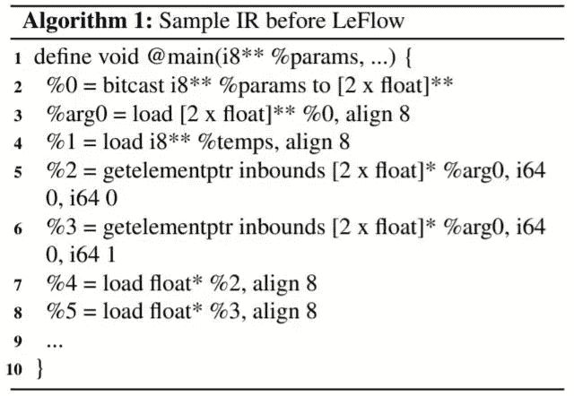

# 深度学习的硬件:了解你的选择

> 原文：<https://towardsdatascience.com/deep-learning-hardware-know-your-options-9e95026b5d5e?source=collection_archive---------1----------------------->

在部署神经网络时，GPU(图形处理单元)之外还有**选项，即 **FPGA** (现场可编程门阵列)。在深入研究 FPGAs 及其实现之前，最好先了解一下 GPU 架构，以及为什么 GPU 是神经网络的主要组成部分。**

Tensorflow 等流行的库使用 CUDA(计算统一设备架构)在 GPU 上处理数据，利用它们的**并行计算能力**。这项工作被称为 GPGPU(通用 GPU)编程。它已经适应了需要至少数千次算术运算的深度学习模型。

如下所示，深度卷积神经网络要求滤波器在像素区域上滑动，同时在每次迭代时输出加权和。对于每一层，这一过程重复数千次，不同的过滤器大小相同。从逻辑上讲，**深度模型计算量变大**，GPU 派上了用场。


来源:Hinton G.E .等人通过[研究论文](https://papers.nips.cc/paper/4824-imagenet-classification-with-deep-convolutional-neural-networks.pdf)；第一层包含 253，440 个权重，因此至少有那么多计算

Tensorflow 可以构建在 CUDA 的基础上，**这使得最终用户无需实施并行代码和理解其芯片的架构**。它的便利性和高度优化使它非常适合广泛使用。

FPGAs 早期没有提供这样一个方便的解决方案，使用它们需要对硬件如何工作有深入的理解。但是最近的进展使它们变得更容易接近，以后还会有更多的进展。

# 概观

本文的内容假设对不同的硬件模型如何工作知之甚少或一无所知。它包括以下内容:

*   GPU、CPU 和 CUDA
*   FPGAs 的优势与设计
*   HDL 作为一种 FPGA 部署方法
*   HLS 作为一种 FPGA 部署方法
*   使用 LeFlow 的 FPGA 部署
*   LeFlow 的优化特性

# 为什么 GPU 有时候比 CPU 好？

**CPU**(中央处理器)**设计用于串行操作**并支持高级逻辑。这反映在他们的设计中，包含**更少的内核**和更多的高速缓存以快速获取复杂的指令。


资料来源:Elkaduwe 等人。via [研究论文](https://www.researchgate.net/publication/270222593_To_Use_or_Not_to_Use_Graphics_Processing_Units_for_Pattern_Matching_Algorithms)；一个字母决定一切

**GPU、**拥有**数百个更小的内核**用于简单计算，因此与 CPU 相比具有更高的吞吐量。


来源:[自我](https://github.com/Ashwins9001/Cuda_Examples/blob/master/julia_set.cu)；**内核< < <网格，1 > > > ()** 符号表示并行进程运行的数量，等于变量网格的大小。运行名为**内核**的函数。

CUDA 通过将 GPU 的众多内核抽象成块来访问它们。每个块包含多达 512 个可访问的线程，可能有 65 535 个块能够同时运行。每个线程执行一个短程序，问题是它可以与其他线程并行运行。 **Tensorflow** 利用这种模式来提高处理能力，通常**会同时运行数百到数千个线程**。

要了解更多关于使用 CUDA 的信息，请访问 Nvidia 的开发者博客 或查阅《CUDA 示例[](https://developer.nvidia.com/cuda-example)*》一书。*

# *神经网络硬件*

*Tensorflow 分为两个部分:库和运行时。*

*库是计算图(神经网络)的创建，运行时是它在某个硬件平台上的执行。*

*首选平台是 GPU，但也有一个替代方案:FPGAs。*

# *为什么要用 FPGAs？*

*FPGAs 可以产生具有数千个存储单元的电路来进行计算，因此它们的工作方式类似于 CUDA 中的 GPU 及其线程。FPGAs 具有自适应架构，支持额外优化以提高吞吐量。因此，可能的计算量使 FPGAs 成为 GPU 的可行解决方案。*

*相比之下，FPGAs 功耗较低，最适合嵌入式应用。它们也是汽车 ADAS(高级驾驶辅助系统)等安全关键操作的公认标准。*

**

*来源:福特汽车公司 via [维基媒体](https://commons.wikimedia.org/wiki/File:Collision_Warning_Brake_Support.jpg)(CC)；FPGAs 安全关键任务的理想应用:碰撞报警系统*

*此外，FPGAs 可以实现自定义数据类型，而 GPU 受到架构的限制。随着神经网络以多种方式转变并延伸到更多行业，FPGAs 提供的自适应能力非常有用。*

# *现在你一定想知道，什么是 FPGAs？*

*FPGA(现场可编程门阵列)是一种可定制的硬件设备。它可以被认为是浮动逻辑门的**海洋。一个设计师走过来，用一种**硬件描述语言** (HDL)，比如 Verilog 或 VHDL，写下一个程序。该程序规定了连接方式以及如何使用数字元件实现连接。HDL 的另一个词是 **RTL** (寄存器传输级)语言。***

*FPGAs 很容易被发现，找一个超大的 Arduino。*

**

*来源:保罗马蒂亚斯 via [维基媒体](https://commons.wikimedia.org/wiki/File:ALTERA_DE2_FPGA_Board.jpg)(CC)；altera DE2–115 板，可使用的众多 FPGAs 之一*

*开玩笑，它们有各种形状和大小。*

*使用类似于编译器的软件，HDL 被合成(找出使用什么门)，然后被路由(将部件连接在一起)以形成优化的数字电路。这些工具(HDL、综合、路由、时序分析、测试)都包含在一个软件套件中，有些包括 Xilinx 设计工具和 Quartus Prime。*

*目前，模型使用 GPU 进行训练，但随后**部署在 FPGA 上进行实时处理**。*

# ***那我们为什么不用 FPGAs 来代替呢？***

*对于 FPGAs 来说，棘手的部分是实现用 Python 等高级语言编写的 ML 框架。 **HDL 本身并不是一个编程平台**，它是用来定义硬件组件(如寄存器和计数器)的代码。一些 HDL 语言包括:Verilog，VHDL。*

*下面显示的是用于创建串行位检测器的一些代码片段。*

*如果你不熟悉它，试着猜猜它是做什么的。*

*来源:Self*

*完成了吗？即使你盯着它看一会儿，它也不明显。*

*大多数情况下，FSM(有限状态机)用于**将任务分解成具有输入相关转换的状态**。所有这些都是在编程之前完成的，以确定每个时钟周期电路将如何工作。然后这个图，如下所示，被转换成 HDL 代码块。*

**

*来源:Maggyero via [维基媒体](https://commons.wikimedia.org/wiki/File:Finite-state_machine_state-diagram.png)(CC)；可能的 FSM 图*

*回到主题:主要的一点是，没有直接的翻译将 Python 中的一个循环转换成 Verilog 中的一束电线。*

*考虑到设计的复杂性，很难对其进行进一步的优化调试。没有像 CUDA 中那样的抽象来简化过程，在 CUDA 中可以选择和修改线程。*

# *那么我们应该坚持使用 GPU 吗？*

> *不，FPGAs 并非一无是处。*

*解决编程问题的一种方法是使用 **HLS** (高级综合)工具，如 **LegUp** 来在 Verilog 中生成程序进行部署。HLS 工具允许设计者**避免从头开始编写 HDL**，而是使用更加**直观的算法式**编程语言**(C)。***

***HLS 工具**抽象出硬件级设计；**类似于模型运行时 CUDA 如何自动设置并发块和线程。***

***HLS 工具需要 **C** 代码作为**输入**，该输入将**映射**到 **LLVM IR** (中间表示)以供执行。这些工具用于将程序描述转换成硬件实现。***

***它们在 FPGA 设计中的作用如下所示。***

******

***来源:Greg S. via [佛罗里达大学幻灯片](https://slideplayer.com/slide/8711464/)； **HLS** 工具**产生 HDL** ，允许**寄存器传输(RT)合成**成数字电路，最终部署在 FPGA 上***

# ***关于 LLVM IRs 的更多信息***

*****LLVM** 不是首字母缩写，是**构造** **类汇编指令** (IRs)的**库**。这些程序对于 HLS 工具来说更容易处理，并可用于为 FPGA 创建可综合的代码。***

*****IRs** 用于**以**通用格式**描述源代码**，允许各种程序使用。***

***要了解更多关于 LLVM 和 IRs 的信息，请参考[*Chisnall 博士的幻灯片*](https://llvm.org/devmtg/2017-06/1-Davis-Chisnall-LLVM-2017.pdf) 。***

******

***来源:戴维斯·奇斯纳尔博士 via [讲稿](https://llvm.org/devmtg/2017-06/1-Davis-Chisnall-LLVM-2017.pdf)；从 LLVM IR 到 x86 架构汇编指令的转换，显然两种格式非常相似**证明 IR 的适应性*****

# ***回到 FPGAs 的问题***

***主要的问题是将程序和为 Python 编写的库转换成 C 语言，以便 HLS 工具运行。目前 C 语言不支持 Tensorflow，所以这个解决方案非常困难。显然，布局和创建硬件的**要求是在深度学习中使用 FPGAs 的一大障碍**。***

# ***我们的英雄勒弗洛***

******

***来源:Daniel H.N .等人通过[研究论文](https://arxiv.org/ftp/arxiv/papers/1807/1807.05317.pdf)； **LeFlow pipeline** 显示它是 LLVM IR 和 HLS 之间的中介***

***[*LeFlow Toolkit*](https://arxiv.org/ftp/arxiv/papers/1807/1807.05317.pdf) 允许工程师使用 Python 设计、训练和测试他们的模型，然后将其直接部署到 FPGA 中使用。 **LeFlow** 通过允许 **HLS** 工具与 **Python** 和 **Tensorflow** 兼容**来简化设计过程，充当**适配器**。*****

***该软件由不列颠哥伦比亚大学 ECE(电气和计算机工程)系的研究人员 T21 设计，他们是丹尼尔·h·诺罗尼亚和史蒂文 J.E 威尔逊。***

***以下部分详细介绍了 LeFlow 如何与 Tensorflow 和 FPGA 集成，如果您只对****实现中的感兴趣，请跳过到:*调优时间*。*******

# *****LeFlow 工具包如何与 Tensorflow 一起工作*****

*****为 Tensorflow **设计的 XLA(加速线性代数)编译器输出**一个 LLVM IR。LeFlow **重组**IR 和**优化**与 HLS 工具配合使用。*****

*****在此基础上，HLS 工具完成了将 IR 转换为部署到 FPGAs 上的程序的所有工作，如*部分所述:我们应该坚持使用 GPU 吗？******

# *****勒弗洛投入产出模型*****

*****LeFlow 将 IR 作为输入。算法 1 是 Tensorflow 加载两个浮点数的 IR。*****

**********

*****来源:Daniel H.N .等人通过[研究论文](https://arxiv.org/ftp/arxiv/papers/1807/1807.05317.pdf)；输入到 LeFlow，需要重组。获取指向每个 float 的元素指针(第 5、6 行)，解引用它们并加载(第 7、8 行)。*****

*****这个节目很难跟上，而且看起来很乱。勒弗洛会把它清理干净，然后换掉。*****

*****它的目标是创建全局变量，然后**将它们映射为硬件接口**的输入和输出。下图概述了 LeFlow 重新格式化并将 IR 通过 LegUp 后的合成电路。*****

**********

*****来源:Daniel H.N .等人通过[研究论文](https://arxiv.org/ftp/arxiv/papers/1807/1807.05317.pdf)；硬件实施所需的变量和设置由 LegUp、LeFlow 生产，必须易于识别变量*****

*****显然，**硬件接口**需要**额外的**模块和信号，如时钟、复位、内存和内存控制器。 **LegUp** 处理这些部件的**创建**，包括时钟的计时规范。*****

# *****转换 IR 以实现最佳执行*****

*****LeFlow 为 FPGA 寄存器设置了一个可变负载。这允许变量访问，以及当高级代码改变时**自动电路修改**。**变化**主要在**线 1、6、7** 明显。*****

**********

*****来源:Daniel H.N .等人通过[研究论文](https://arxiv.org/ftp/arxiv/papers/1807/1807.05317.pdf)；**重组 LLVM IR** ，为 HLS 合成做准备*****

*****如算法 2 的改进 IR 所示，LeFlow 完成了它的工作，剩下的由 HLS 工具处理！*****

# *****调音时间！*****

*****LeFlow 的一个有趣的特性是可以更换硬件。LeFlow 提供了**展开和内存分区**参数，这些参数在正确使用时**会加速计算**。这与 FPGAs 固有的低延迟相结合，使它们能够以极高的效率工作。*****

*****最棒的是，这些参数可以在 Python 中指定，指令可以直接传递到电路级。*****

# *****展开还是不展开*****

*****展开用于循环，是一种小心的平衡行为。想法是在每次迭代中进行多次计算(或复制)并采取更大的步骤。*****

*****这看起来与常规的 for 循环相同，但在硬件级别添加了更多组件，以在每个时钟周期(或循环迭代)执行更多计算。有关展开的更多信息，请参见 [*Keil 的用户指南*](http://www.keil.com/support/man/docs/armcc/armcc_chr1359124222660.htm) 。*****

```
*****int sum = 0;for(int i = 0; i < 10; i+=2) sum += a[i]; sum += a[i+1];*****
```

*****从上面看，我们可以展开两倍，这意味着一次进行两次迭代，循环增加两步。*****

**********

*****来源:Daniel H.N .等人通过[研究论文](https://arxiv.org/ftp/arxiv/papers/1807/1807.05317.pdf)；**将 32×32 输入图像上的 3×3 卷积的简化循环**展开为 5 个 32×32 输出*****

*****这利用了 **FPGA 的并行性，工作起来更像 GPU** ，显然每个示例的周期减少了 13%。*****

*****请记住，额外添加的硬件可能会导致效率低下或尺寸受限。*****

# *****用内存分区分割它*****

*****LeFlow 管道中使用的 HLS 需要一个双端口 RAM(随机存取存储器)来存储值。*****

*****这是有问题的，因为 RAM 被设计成存储大量数据，但代价是非常慢。从其中提取值可能需要十倍的时钟周期。*****

*****幸运的是，FPGAs 包含许多其他独立的存储单元，因此 **LeFlow 可以将其数据划分到多个唯一的存储点**。在某种意义上，这类似于在处理器中添加更多的内核。它**通过允许更多的指令同时执行来减少时钟周期**。*****

*****假设任务是将两个大小为 8 的数组的元素相乘。在[并行计算](https://www.youtube.com/watch?v=JkbgMnL4xO0)中，任务被分成组同时执行。**循环分解**意味着某一组步骤同时重复。*****

*****使用内存分区可以提高 FPGAs 的运行效率。以下计划已经运行了八个时钟周期。*****

**********

*****来源:Daniel H.N .等人通过[研究论文](https://arxiv.org/ftp/arxiv/papers/1807/1807.05317.pdf)；**加载两个数组的时钟周期分解*******

*****在(a)中，没有内存分区，所以每个周期从每个数组中**加载、相乘并存储一个元素。该过程继续，并花费**八个周期**直到完成。*******

***在(b)中，数组被循环划分到两个独立的存储器中。**每个数组**中的两个元素在每个周期被加载、相乘并存储。较大的块表示进程同时发生，尽管是在硬件的不同部分。这将其减少到六个周期**。*****

***在 c)中，数组被循环划分到四个独立的存储器中，并且减少到**五个周期。每个周期加载、相乘并存储来自每个数组的四个元素**。***

# ***在 Python 中使用 LeFlow***

******

***来源:Daniel H.N .等人通过[研究论文](https://arxiv.org/ftp/arxiv/papers/1807/1807.05317.pdf)；**实现一个 CNN** 。输入被分配为单个 32×32 图像(第 4 行)，并且网络输出五个图像(每个图像应用了 3×3 滤波器；第 5 行)。***

***一旦 LeFlow 设置正确，它只需运行一个设备选择行，无需任何额外的配置(如展开):***

```
***with tf.device("device:XLA_CPU:0")***
```

***它表示 XLA 编译器将用于生成 LLVM 并启动 LeFlow 转换过程。***

# ***尝试一下！***

***现在你是了解 LeFlow 工作原理的专家，也许 FPGAs 适合你。***

***在 [Github](https://github.com/danielholanda/LeFlow) 上有很多 LeFlow 及其具体安装的例子。丹尼尔·霍兰达(合著者之一)有关于 [**MNIST 数字识别**](https://github.com/danielholanda/LeFlow/tree/master/examples/classificationMNIST) 的**源代码，所以拿起 FPGA 试一试吧！*****