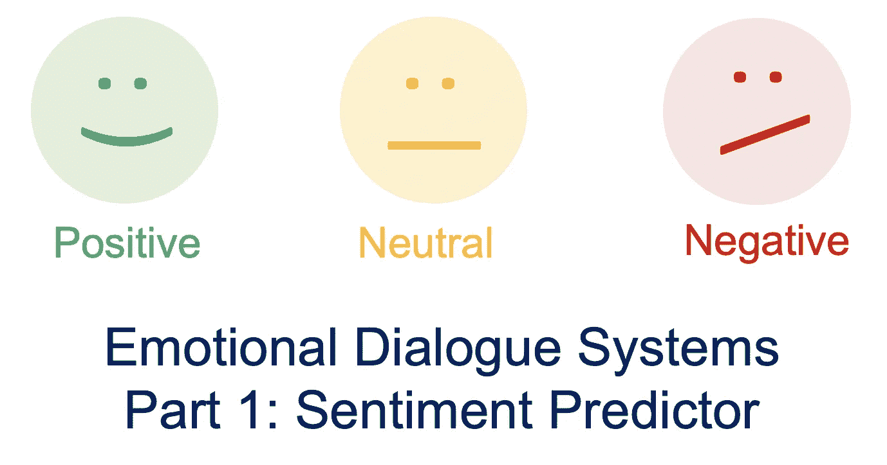
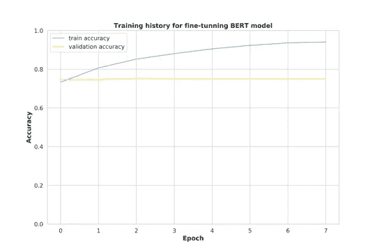
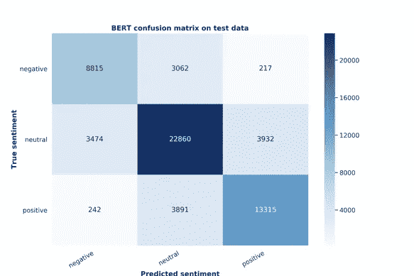
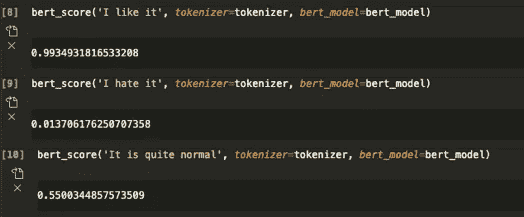

# 【深度学习】如何建立一个有情感的聊天机器人

> 原文：<https://towardsdatascience.com/deep-learning-how-to-build-an-emotional-chatbot-part-1-bert-sentiment-predictor-3deebdb7ea30?source=collection_archive---------26----------------------->

## [实践教程](https://towardsdatascience.com/tagged/hands-on-tutorials)

## 第 1 部分:伯特情绪预测器

[《卫报》:一个机器人写了整篇文章。你害怕了吗，人类？](https://www.theguardian.com/commentisfree/2020/sep/08/robot-wrote-this-article-gpt-3)

随着如今对话系统的成熟，我们可以下载并应用经过高级训练的聊天机器人，如 [GPT-3](https://github.com/openai/gpt-3) 、 [DialoGPT](https://github.com/microsoft/DialoGPT) 、 [Plato](https://github.com/uber-research/plato-research-dialogue-system) 和 [OpenNMT](https://opennmt.net/) 等。然而，与传统的聊天机器人不同，建立一个能够产生情感和积极反应的聊天机器人仍然是一个热门的研究领域。(类似于新闻中提到的人工智能，我们希望人工智能说一些积极的东西(例如，我的创造者告诉我说‘我为和平而来’))

此外，一个有情感的聊天机器人在商业中是非常可取的，例如改善客户服务。

在这两篇文章中，我将基于 HKUST 的论文 [HappyBot:通过改善用户体验前瞻](https://arxiv.org/pdf/1906.08487.pdf)生成移情对话响应和我的尝试，介绍如何构建一个情感聊天机器人(基于深度神经网络的对话系统)。

> 这个想法是建立一个结合强化学习的对话系统，奖励积极的反应，惩罚消极的反应。

从技术上来说，这个任务涉及到建立深度学习模型，迁移学习(BERT)，情感分析，强化学习，以及它们的实现(在 PyTorch 中)，这些都是机器学习的热门话题。

# 用于情感分析的微调预训练 BERT 模型

在第 1 部分中，我们将以一种现代的方式构建一个情感预测器(使用来自预训练的 BERT 模型的迁移学习)。

*回想一下，我们的目标是:建立一个结合强化学习的对话系统，奖励产生的积极响应，惩罚产生的消极响应。* ***有些我们需要一个“判官”来决定每个生成的句子的一个情感得分。*** *(* ***感情分析*** *)*

[BERT](https://arxiv.org/pdf/1810.04805.pdf) 目前是 Google 在 2018 年发布的 NLP 任务中的显著模型之一。BERT 的关键思想是通过使用具有变换器架构的双向深度神经网络来构建自然语言的表示。BERT 模型经常被用作其他 NLP 任务的预训练模型。

要构建一个 BERT 情感预测器(PyTorch ),可以遵循这里的文章:[第 2 部分:在语言可接受性(COLA)数据集的语料库上使用 PyTorch 进行文本分类的 BERT 微调教程。](https://medium.com/@aniruddha.choudhury94/part-2-bert-fine-tuning-tutorial-with-pytorch-for-text-classification-on-the-corpus-of-linguistic-18057ce330e1)

# 斯坦福情感树库 v2 (SST2)

我们在任务中使用了**斯坦福情感树库 v2 (SST2)数据集，可以在这里下载[。SST2 数据集提供了 239，232 个句子，其中每个句子包含从 1 到 25(从最负面到最正面)的最多 6 个情感标签。我们计算了每个句子的平均情绪得分，并将其分为“负面”(得分≤10)、“中性”(得分≤10<和“正面”(得分> 16)。最终的训练/验证/试验数据分成 50/25/25。](https://www.kaggle.com/atulanandjha/stanford-sentiment-treebank-v2-sst2)**

# 构建 BERT 情感分类器

每个句子都将被分词，长度大于 160 个单词的句子将被删减。我们使用包装[变压器](https://huggingface.co/transformers/main_classes/tokenizer.html)中准备好的记号赋予器。

然后，我们从预训练的 BERT 模型建立多类(正面、中性和负面)分类模型(softmax 函数),损失函数作为交叉熵。注意，我们采用[渐变裁剪](/what-is-gradient-clipping-b8e815cdfb48)来避免渐变爆炸。以下是训练/有效数据的结果:

模型训练表明一个历元已经足够，而更多的历元仅提高训练精度，但有效精度保持不变。

在模型训练之后，我们将我们的模型应用于具有 75.2%准确度的测试数据(类似于我们的模型训练) :

因为我们的预测是获得“正面”、“自然”和“负面”标签的概率，所以我们需要将其转换为 0-1 的情感分数作为奖励:

情绪得分= 1*P(正)+ 0.5*P(自然)+ 0*P(负)

其中输出 1 =高度正，0 =高度负)

以下是一些例子:

这一结果将在下一部分的情感对话系统中得到应用。

# 参考

*   Devlin，j .，Chang，M. W .，Lee，k .，& Toutanova，K. (2018 年)。Bert:用于语言理解的深度双向转换器的预训练。arXiv 预印本 arXiv:1810.04805。
*   申洁敏、徐鹏、安德里亚·马多托和帕斯卡尔·冯。Happybot:通过提高用户体验前瞻性来产生移情对话响应。arXiv 预印本 arXiv:1906.08487，2019。
*   理查德·索彻、亚历克斯·佩雷金、让·吴、贾森·庄、克里斯托弗·曼宁、和克里斯托弗·波茨。2013.情感树库语义合成的递归深度模型。2013 年自然语言处理经验方法会议论文集，第 1631-1642 页。