# 【深度学习】如何建立一个有情感的聊天机器人

> 原文：<https://towardsdatascience.com/deep-learning-how-to-build-an-emotional-chatbot-part-2-the-dialogue-system-4932afe6545c?source=collection_archive---------29----------------------->

## [情感聊天机器人](#)

## 第二部分:基于深度学习和强化学习的对话系统

从[第一部分](https://medium.com/@jay_hui/deep-learning-how-to-build-an-emotional-chatbot-part-1-bert-sentiment-predictor-3deebdb7ea30)，我们已经建立了伯特情绪预测器。我们现在开始结合它，建立情感对话系统。在进入细节之前，让我们先介绍一些先决条件。(但我仍然无法解释这里的所有术语……)

# 深度学习的先决条件

*   **seq 2 seq model**
    [seq 2 seq model](https://papers.nips.cc/paper/5346-sequence-to-sequence-learning-with-neural-networks.pdf)是一种高级神经网络，旨在将一个序列变成另一个序列。Seq2seq 由两个神经网络组成:EncoderRNN(为了避免消失梯度问题，更常被称为 [LSTM 或 GRU](/illustrated-guide-to-lstms-and-gru-s-a-step-by-step-explanation-44e9eb85bf21) )对源句子进行编码，为解码器 RNN 提供隐藏状态。另一方面，解码器生成目标句子。

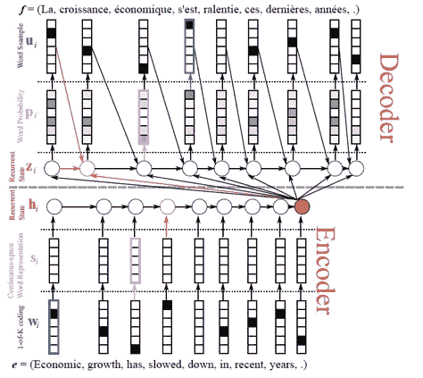

[用于机器翻译的编码器-解码器架构](https://developer.nvidia.com/blog/introduction-neural-machine-translation-gpus-part-2/)

*   **注意力是你需要的全部** 尽管 Seq2Seq 模型在 NLP 中带来了巨大的突破，但一个普通的 Seq2Seq 模型仍然遭受瓶颈和消失梯度问题。[注意力模型](https://arxiv.org/pdf/1706.03762.pdf)是 Seq2Seq 之上的一项著名技术，它允许解码器直接专注于源的某些部分，这通过提供到遥远状态的捷径来缓解消失梯度问题。

    更多详情可以参考 [NLP 从无到有:带序列到序列网络的翻译及注意](https://pytorch.org/tutorials/intermediate/seq2seq_translation_tutorial.html)。

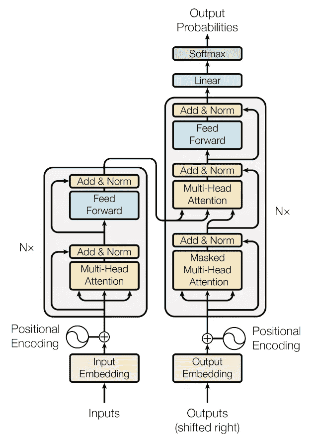

[注意力模型(变压器)架构](https://arxiv.org/pdf/1706.03762.pdf)

*   **PyTorch & Texar 包**
    另外，推荐阅读:PyTorch 中的[聊天机器人教程和帮助你轻松构建复杂深度学习模型(尤其是 NLP 任务)的](https://pytorch.org/tutorials/beginner/chatbot_tutorial.html) [Texar 包，](https://github.com/asyml/texar)。最后但同样重要的是，确保你有一个 GPU 来构建聊天机器人。

[Texar 包](https://medium.com/r?url=https%3A%2F%2Fgithub.com%2Fasyml%2Ftexar)

# 移情对话数据集

来自 ParlAI 的 [EmpatheticDialogues 数据集](https://github.com/facebookresearch/EmpatheticDialogues)包含大约 33090 个对话，其中每个对话包含几个句子，并被分类为不同的情绪情况。为简单起见，没有应用验证数据集。训练/测试被分割为 90/10%(跳过了验证数据集)。

下面是一个守恒的例子(转换成一对源句和目标句):

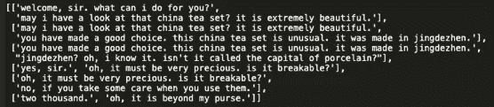

我们准备的数据如下:

1.  5 个字以内 30 个字以上的句子去掉。
2.  标记数据，包括符号。英语中的许多缩写形式也被替换了。例如，“不能”将被转换为“不能”
3.  构建所有单词的词汇表。词汇表的大小是 24，408，完全基于训练数据。

# 对话系统设计(编码器和损失函数)

基于 HKUST 的论文“ [HappyBot:通过改善用户体验前瞻](https://arxiv.org/pdf/1906.08487.pdf)产生移情对话响应”，现在让我们来关注最有趣的部分。

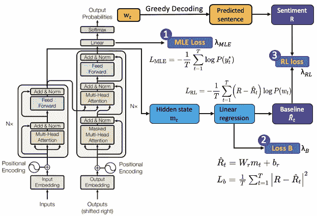

结合情感预测器的网络结构

*   **MLE 损失**
    模型结构如下。左边是[注意力模型](https://arxiv.org/pdf/1706.03762.pdf)的结构，正常的对话系统。目标是嵌入每个句子输入(长度为 T ),然后从 vocab 列表生成输出概率分布(w_t)。响应生成中的训练目标是最大化单词 y*的可能性，并且其损失函数被写为:

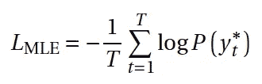

*   **线性回归损失**
    在我们结合情感的强化学习(RL)部分之前，我们引入另一个线性回归作为基线回报模型，估计每个句子的情感得分 R 如下:

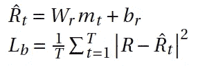

其中 m_t 是编码器在步骤 t 的隐藏状态，R 是该句子的情感得分(奖励)，W_r 和 b_r 是可训练参数。这种线性回归的目的是减少报酬 r 的方差。

*   **强化学习损失** 我们通过贪婪解码来解码我们预测的句子(我们这样做是为了时间有效性。我们将在下一节介绍“解码策略”)。之后，BERT 模型将预测该句子的情感得分 R。RL 损耗计算如下:

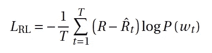

其中 w_t 是在步骤 t 单词的预测概率分布

**RL 的含义:**线性回归的输出(Rˇt)作为 R 的一个均值，当涉及到一个很大的情绪得分(即 R>Rˇt)时，最小化 L_RL 就是最大化 w_t，也就是说我们要增加获得一个很大奖励的机会。另一方面，当 R<Rˇt 时，需要最小化 wt 以减少损耗。这就是强化学习的原理:**你想获得奖励的几率更高**。(就像心理学中的操作性条件反射一样)

最后，这三个损失函数组合如下:

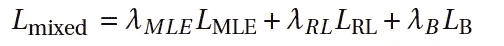

MLE、RL 和 B 的λ(权重)是决定权重的三个超参数。

# 对话系统设计(解码策略)

在用损失函数训练模型之后。为了从 w_t 的概率分布生成预测的句子，我们需要解码部分。这里我们将应用并比较两种解码策略:

1.  **贪婪解码** 每一步都取最可能的单词(由 argmax)而不回溯。
    - **优点:**快速
    **-缺点:**无法追溯生成过程，可能会引起一些奇怪的反应。(生成:我爱……，哦其实“爱”这个词不是我想要的！)
2.  **前 K 个采样解码**
    从 w_t 中随机采样，仅限于前 K 个最可能的单词。使用 top-k 采样，尤其是使用较大的 k，响应将更加通用和多样。(注意，如果你想用 AI 写诗或小说，你需要 top-k 采样，而不是贪婪解码)

有关解码策略的更多信息，可以阅读下面的文章“[您需要了解的响应生成解码策略](/decoding-strategies-that-you-need-to-know-for-response-generation-ba95ee0faadc)”

如果您采用 [Texar](https://texar.readthedocs.io/en/latest/code/modules.html#decoders) 包的解码，您可以通过“助手”实例轻松实现不同的解码策略。

# 模特培训

培训期间采用了几种策略:

*   **稍后启用强化学习部分的训练** 刚开始的时候，生成的句子不够精细，无法进行情感评分。所以我们在第 19 纪元开始 RL 部分。**换句话说，聊天机器人通常在开始时学习，然后再考虑情感。**
*   **RL 的最小权重**
    注意到 loss_RL 的斜率较高(因为当输入为负时对数函数的斜率较高，因此其梯度下降)。我们采用了 RL 和 B 的一个极小的 lambda(权重)来平衡它们与 MLE 的 lambda。

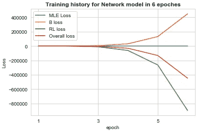

b 损失和 RL 损失将在训练中占主导地位。

*   **提前停止**
    由于 loss_RL 占优势，模型可能会以 loss_MLE 为代价降低它。因此，在我们的模型中采用了提前停止。如果 loss_MLE 大于其在添加 loss_RL 之前的平均值，则模型训练将终止。我们的模特训练在 20 世纪就结束了。

以下是模型 20 个时期的最终训练历史:

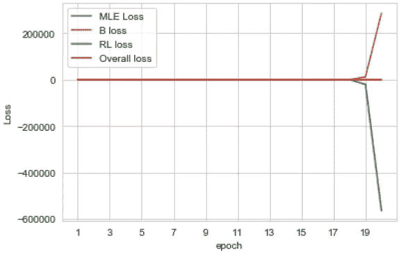

# 模型评估

为了评估我们的方法，我们将构建另一个基线模型(没有强化学习部分)进行比较。我们将在回应生成中使用两个标准指标:

*   **BLEU metric**
    [双语评估替角评分(BLEU)](https://www.aclweb.org/anthology/P02-1040.pdf) 评估 n-grams 在地面实况和系统响应中的同现。n-gram 精度计算如下:

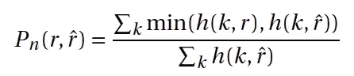

r 是基础真实响应，r^是系统响应，k 索引所有可能的长度为 n 的 n 元文法，h(k，r)是 r 中 n 元文法的数量。选择 BLEU-1(单元文法)和 BLEU-2(双元文法)用于我们的评估。

*   **Distinct metric** Distinct metric 衡量生成句子的多样性，定义为不同 n 元语法的数量除以生成单词的总量。我们选择 Distinct-1 (uni-gram)进行评估。

*   **基于指标的评估** 我们已经训练了两组模型，基线模型(带有我们的强化学习部分)和非基线模型。对于解码策略，我们还评估了贪婪和 top-k (k=5)来测试解码策略的影响。

    在下表中，发现我们的非基线模型通过在训练和测试数据集中具有最高的情感分数 BLEU-1/2 和独特分数(略好于基线模型)而胜过基线模型。

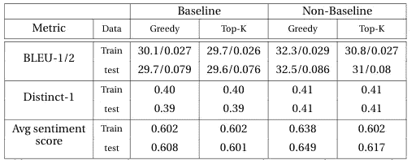

对训练/测试数据的 BLEU、独特和平均情感评分评估

*   **生成实例**

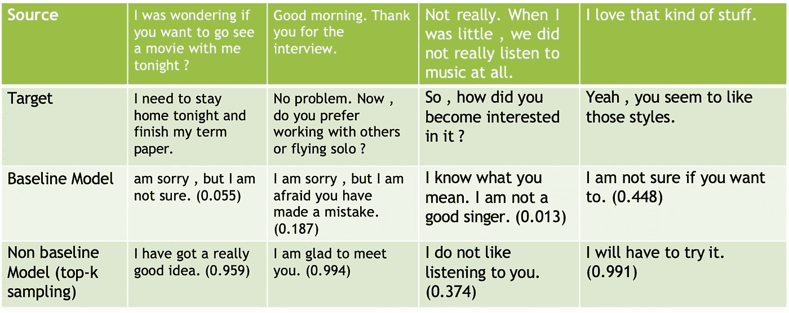

括号内的分数是伯特的情感分数。

# 结论

与基线模型相比，我们的方法在保持高语言性能的同时，成功地生成了更多的积极响应。

令人惊讶的是，我们发现贪婪方法不仅在语言性能方面与 top-k 采样(k=5)表现相似，而且由于 top-k 采样更有利于通用响应，因此它还产生了更多的正面响应。

# 参考

*   Ashish Vaswani、Noam Shazeer、Niki Parmar、Jakob Uszkoreit、Llion Jones、AidanNGomez、Lukasz Kaiser 和 Illia Polosukhin。2017.你需要的只是关注。神经信息处理系统进展，6000-6010 页。
*   H.拉什金，E. M .史密斯，m .李，y .布鲁走向共情的开放领域对话模式:一个新的基准和数据集
*   申洁敏、徐鹏、安德里亚·马多托和帕斯卡尔·冯。Happybot:通过提高用户体验前瞻性来产生移情对话响应。arXiv 预印本 arXiv:1906.08487，2019。
*   K.Papineni、S. Roukos、T. Ward 和 W. J. Zhu。BLEU:一种自动评估机器翻译的方法。在 ACL，2002 年。
*   Sutskever，I .，Vinyals，o .，和 Le，Q. (2014 年)。用神经网络进行序列间学习。神经信息处理系统进展(NIPS 2014)。