# 基于 Fastai 的深度学习图像分类

> 原文：<https://towardsdatascience.com/deep-learning-image-classification-with-fast-ai-fc4dc9052106?source=collection_archive---------10----------------------->

## 精疲力尽地学习复杂的机器学习概念和复杂的术语？通过构建一个简单的图像分类器来检测 x 射线中的肺炎，重新点燃您的热情！


瓦迪姆·萨多夫斯基在 [Unsplash](https://unsplash.com/s/photos/flame?utm_source=unsplash&utm_medium=referral&utm_content=creditCopyText) 上拍摄的照片

# TL；速度三角形定位法(dead reckoning)

如果你开始对学习一门学科感到筋疲力尽，走出杂草通常是有益的。我喜欢做一些有趣又容易的事情，以便在我的学习旅程中重新获得积极的动力。这个项目让我的创造力再次迸发。将我的笔记本从我的 [GitHub 库](https://github.com/bsamaha/Chest-Xray-FastAI)加载到 Google Colab，并上传 [Kaggle 数据集](https://www.kaggle.com/paultimothymooney/chest-xray-pneumonia)来学习如何使用 fastai 软件构建图像分类器！别忘了把硬件加速器设置成 GPU！

P.S .进入文件→上传笔记本→GitHub Tab→BSA maha/Chest-x ray-FastAI 直接上传笔记本到 Colab

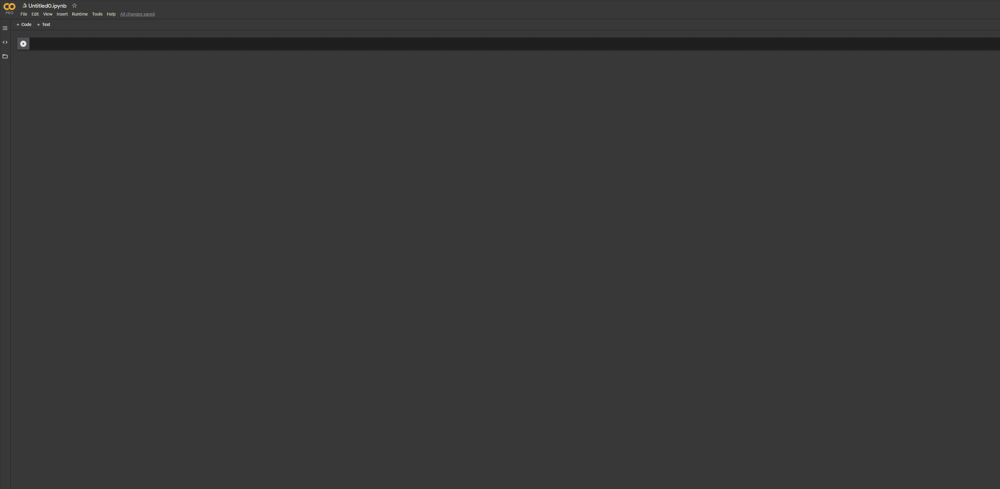

如何轻松将 GitHub 笔记本上传到 Google Colab

# 介绍

## 邓宁-克鲁格效应

你设定了一个目标，比如想成为一名数据科学家或数据工程师。当你浏览你能找到的关于这个主题的所有材料时，你的热情和精力会达到顶点。也许你甚至开办了一个编码训练营或 Coursera 课程，作为你掌握数据之路的向导。当你快速赢得胜利时，你的大脑会充满多巴胺。首先，这是基本的 python 编程。然后你用 sci-kit learn 做了你的第一个线性回归——机器学习毕竟没那么差！你很快吸收了扔给你的所有信息。没有什么能阻止你。

我去过那里，现在仍然去那里。*我毕竟是人*。我指的是邓宁-克鲁格效应中“愚笨山”的顶峰。有了完美的数据集合，线性回归很容易，但这并不现实。最后，在轻松地浏览了一两个月之后，你碰到了一堵名为统计的墙。你苦苦思索，几乎无法理解——除非你觉得自己没有保留任何东西。人们还记得所有这些分发的东西吗？剧透警告:是的，你会被问到关于他们的问题。当你继续学习的时候，你会意识到你的 python 技能远没有达到应有的水平。你决定看几个招聘启事，然后突然想到。你没有计算机科学的高级研究生学位，你不知道该工作的一些要求如何发音，更不知道它们是什么——Hadoop？欢迎来到绝望之谷。你想退出，继续你的生活。

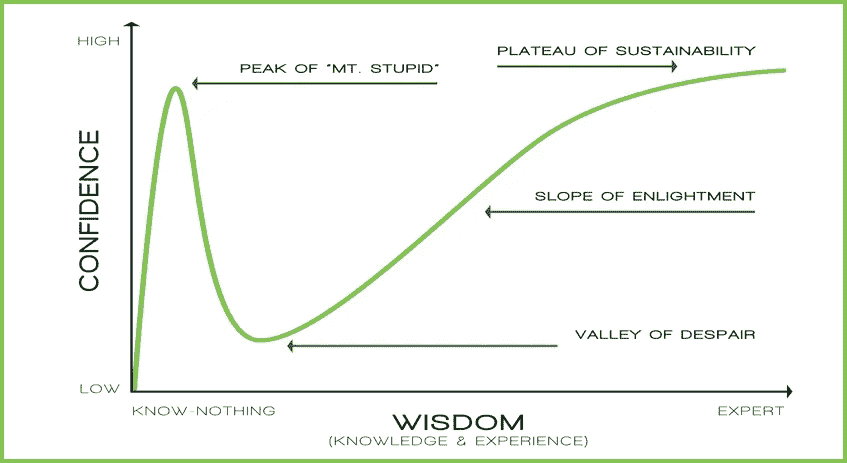

邓宁-克鲁格效应

## 解药

我的教官，上士·里维拉，在 T2 的海军陆战队新兵训练营——曾经说过，

> “动力就像咖啡因一样，最终会消失。你真正寻找的是灵感。”

每当我发现自己在新的学习旅程中走向绝望之谷时，我都会记得这句话。回到游戏中的最好方法是记住最初是什么让你兴奋。给自己找一个速战速决的机会，重新获得一些积极的动力。

这个项目是我的速赢之作。它让我重新认识到机器学习*的惊人力量，以及它可以多么简单*。我的想象力开始变得天马行空，想到了我可以制造的所有工具来帮助世界上的其他人。我再次找到了灵感，激情重燃。我希望这对你也一样。

# 是时候建造了

这篇博文的目标并不是高度技术性的，并教你关于深度学习的一切。我希望你去跟大师本人学习，杰瑞米·霍华德在 Fast.ai。我目前正在学习这门课程，我怎么推荐都不为过。我喜欢他自上而下的教学理念和他让深度学习对每个人都可用的目标。最棒的是它是免费的！

[](https://course.fast.ai/) [## 程序员实用深度学习，v3

### 欢迎光临！如果你是所有这些深度学习的新手，那么不要担心-我们将带你一步一步地完成它…

course.fast.ai](https://course.fast.ai/) 

这篇文章的目标是通过快速构建一个具有非常明显的用例的深度学习模型来激励你。这个项目将需要大约 10 分钟的编码。 ***然而，由于数据集较大以及您的硬件，我们的卷积神经网络(CNN)学习器的训练可能需要 30 分钟。***

## 平台:Google Colab

我强烈推荐 [Google Colab](https://colab.research.google.com/notebooks/intro.ipynb) 用于所有需要 GPU 的任务——这就是其中一个例子。如果你熟悉 Jupyter 笔记本，那么你会很快意识到它几乎是一个复制品。如果你不熟悉这些，那么请做谷歌 Colab 的教程。

[](https://colab.research.google.com/notebooks/welcome.ipynb) [## 谷歌联合实验室

### 编辑描述

colab.research.google.com](https://colab.research.google.com/notebooks/welcome.ipynb) 

在 Colab 中，确保进入运行时→更改运行时类型→将硬件加速器设置为 GPU。

## 数据集:Kaggle 胸部 x 光肺炎数据集

我在这个项目中使用的数据集是在 Kaggle 上找到的[。它有 1 GB 多一点，所以我把它下载到我的本地驱动器，然后上传到我的谷歌驱动器。这允许我从本地硬盘上删除文件。](https://www.kaggle.com/paultimothymooney/chest-xray-pneumonia)

[](https://www.kaggle.com/paultimothymooney/chest-xray-pneumonia) [## 胸部 x 光图像(肺炎)

### 5，863 张图片，2 个类别

www.kaggle.com](https://www.kaggle.com/paultimothymooney/chest-xray-pneumonia) 

数据集是超过 5,800 JPGs 的胸部 x 光片。这些照片由文件夹标注，分别是“肺炎”和“正常”。这将在以后证明是有益的。

这个数据集有点独特。通常，对于 Kaggle 比赛，一个验证数据集测量你的模型在整个训练中的表现。当你准备好了，你就可以使用测试数据集来做出你的预测，并提交给竞赛评分。**对于这个特例，我们将使用我们的测试数据集作为我们的验证数据集来衡量我们的模型表现如何。**该数据集没有竞争，验证集只有 16 幅图像，太小了。

## 密码

首先，你可能需要在谷歌 Colab 笔记本中安装 fastai 软件。在第一个单元格中运行下面的代码，如果它说已经安装了，我们就可以开始了。

```
!pip install fastai
```

现在我们需要导入所有必要的库和一些附加功能。下面的代码将导入运行代码所需的所有库。最后两行是可选的。

如果你已经将数据集上传到 Google drive 文件夹中，我推荐你只运行最后两行。您必须执行一个身份验证操作，才能将您的 Google Drive 安装到 Colab。

```
from fastai.vision import *
from fastai.metrics import error_rate, accuracyimport warnings
warnings.filterwarnings('ignore')from google.colab import drive
drive.mount('/content/drive')
```

数据集应该是一组父文件夹和子文件夹，如下图所示。非常重要的是，你的文件结构反映了我的。整个项目最困难的部分是组织你的数据。我假设从现在开始你已经把数据上传到 Google Colab 了。

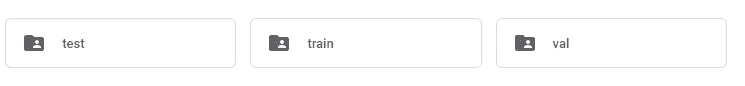

我的项目 Google Drive 根目录中的数据集文件夹


每个测试、训练和评估文件夹子文件夹

一旦你把所有的数据组织好了，乐趣就可以开始了。我们将设置存储您数据的根目录。这是 test、train 和 val 文件夹所在的文件夹路径。当我们稍后保存我们的训练模型时，它们将被保存在这个目录中。

```
# Set path to root directory
path = Path('/content/drive/My Drive/Colab Notebooks/chest_xray')# View all files in directory
path.ls()
```

然后我们必须创建一个针对 fastai 软件的 **"ImageDataBunch"** 对象。**这个对象汇集了我们所有的训练数据、测试数据和验证数据，并对图像执行必要的转换。**ds _ tfms 正在指定超出本博客范围的转换，要了解更多相关信息，我建议完成 Fast.ai 课程。

```
# We are creating a fastai DataBunch from our dataset
# Preprocessing takes place when creating the databunch
# May need to decrease batch size and num_workers depending on GPUdata = ImageDataBunch.from_folder(path, train='train', valid='test', ds_tfms=get_transforms(do_flip=False), size=224, bs=64, num_workers=8)
```

现在你可以明白为什么像我们之前做的那样组织文件夹是重要的。这允许我们使用 from_folder 方法来正确标记所有的图像，同时保持我们的数据集分离[，因此没有数据泄漏](https://machinelearningmastery.com/data-leakage-machine-learning/)。**所有图像都被标准化为 224 像素乘 224 像素的大小。**“bs”代表批量大小，即同时向模型显示的图像数量。**如果您的 GPU 没有足够的内存，您可能需要减少“bs”——尝试 32 或 16。**

使用下面的代码块来查看图像，并了解 ImageDataBunch 是如何对它们进行更改的。

```
# Show what the data looks like after being transformed
data.show_batch()# See the classes and count of classes in your dataset
print(data.classes,data.c)# See the number of images in each data set
print(len(data.train_ds), len(data.valid_ds)
```

上面代码的输出应该类似于我下面的输出。

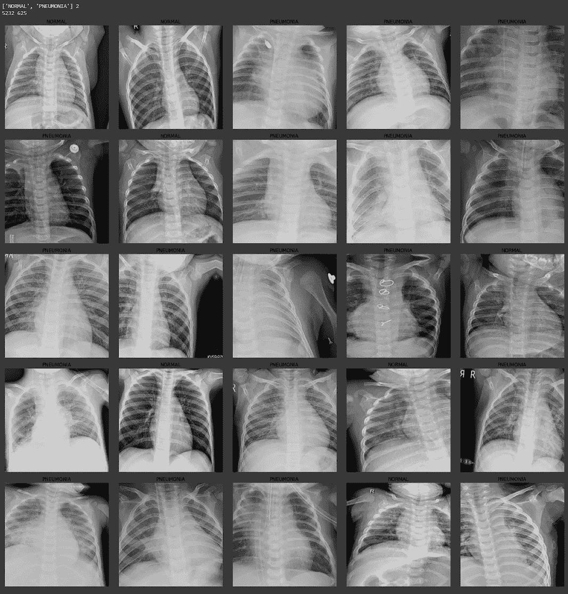

show_batch 代码单元格的输出

现在我们将建立我们的神经网络。在 fastai 中，被训练的模型被称为“学习者”。学习者是一个可以学习适应模型的一般概念。我们正在使用 cnn_learner，它将使用 ResNet34 架构。如果你好奇，这里有一篇描述 ResNet34 的好文章。

[](/understanding-and-visualizing-resnets-442284831be8) [## 理解和可视化资源

### 这个帖子可以在这里找到 PDF 格式。

towardsdatascience.com](/understanding-and-visualizing-resnets-442284831be8) 

创建我们的学习器的代码是一个简单的一行程序。一旦我们创建了学习者，我们将使用 fit_one_cycle 方法在我们的数据集上训练模型。**resnet 34 模型是一个预先训练好的模型，我们正在对其数据进行微调。这被称为迁移学习，也是 fastai 建立的前提。**

```
# Build the CNN model with the pretrained resnet34
# Error rate = 1 - accuracy
learn = cnn_learner(data, models.resnet34, metrics = [accuracy])# Train the model on 4 epochs of data at the default learning rate
learn.fit_one_cycle(4)
```

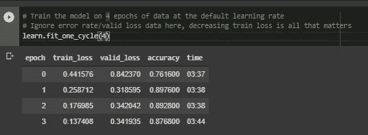

学习者的培训结果

因为我们用我们的测试数据集替换了我们的验证数据集，所以我们可以确切地看到我们的模型在每个时期结束时有多精确。结果显示，我们可能在 2 个时期后停止训练。在第二个历元之后，您可以看到有效损失增加，精度降低。然而，列车损失在每个时期都在减少。这是过度拟合训练数据的一个很好的例子。我们的结果显示准确率为 87.6%！更令人惊奇的是，这里的编码是如此简单！

```
# Save the model
learn.save('stage-1')# Load the Model
learn.load('stage-1')
```

不要忘记保存您的模型。这样，如果你在不影响模型的“第一阶段”部分的情况下进行修正，你可以重新加载它，而不用浪费时间重新训练它。当你重新加载你的模型时，你会看到一个很长的输出，详细描述了 CNN 的内部工作，这是正常的。

现在，除了最后一层，所有的层都被冻结了。**当我们在这些冻结层上调用 fit_one_cycle 时，我们只训练了最后一层，这是将 x 射线图像分类为“正常”或“肺炎”的部分。**

现在我们将解冻 CNN 中的所有图层，并对其进行更多的重新训练。这将改变模型评估图像的方式，而不仅仅是分类图像的方式。在我们进行更多的训练之前，让我们来看看什么是好的训练学习率。

```
# Unfreeze all layers of the CNN
learn.unfreeze()# Find the optimal learning rate and plot a visual
learn.lr_find()
learn.recorder.plot(suggestion=True)
```

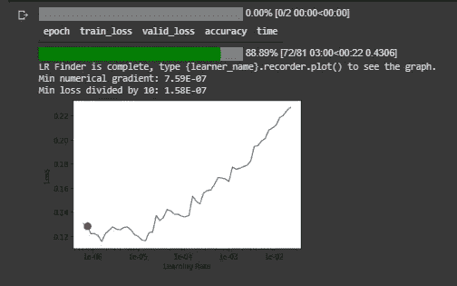

学习与损失函数图

该图显示了学习率如何影响模型的准确性。我们可以看到，随着学习率的增加，我们的模型的损失也在增加。现在，我们已经解冻了学习者中的所有层，我们将使用这些最佳学习率进行重新培训。我们使用[的 slice()函数](https://www.w3schools.com/python/ref_func_slice.asp)输入学习率。**选择一个好的学习率似乎是一门艺术而不是科学，Fastai 课程帮助你学习经验法则。**

既然我们对自己的学习速度有了一个概念，让我们根据我们的数据再次训练我们学习者的所有层次。

```
# Fit the model over 2 epochs
learn.fit_one_cycle(2, max_lr=slice(3e-7, 3e-6))
```

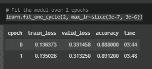

阶段 2 的模型输出

**我们现在已经将准确率提高到了 89.1%** 。换句话说，我们每检查 10 次，只能预测 1 次不正确的 x 射线。它并不完美，但对于我们投入的工作量来说已经很不错了！我们再多训练几次，看看能不能多挤出几个百分点。

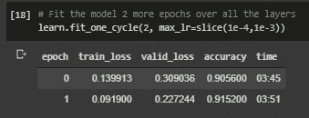

第三阶段的模型输出

太好了！我们从模型中又挤出了 2%的精确度！现在，让我们来探究一下这个模型出了什么问题。在许多情况下，这允许您更好地理解您的数据，这可能导致使用不同的预处理技术或架构。

## 解释

首先，我们需要创建一个解释器对象。从这个“interp”对象，我们可以调用 plot_confusion_matrix 和 plot _ top _ losses 等方法。

```
# Rebuild interpreter and replot confusion matrix
interp = ClassificationInterpretation.from_learner(learn)interp.plot_confusion_matrix(figsize=(12,12), dpi=60)
```

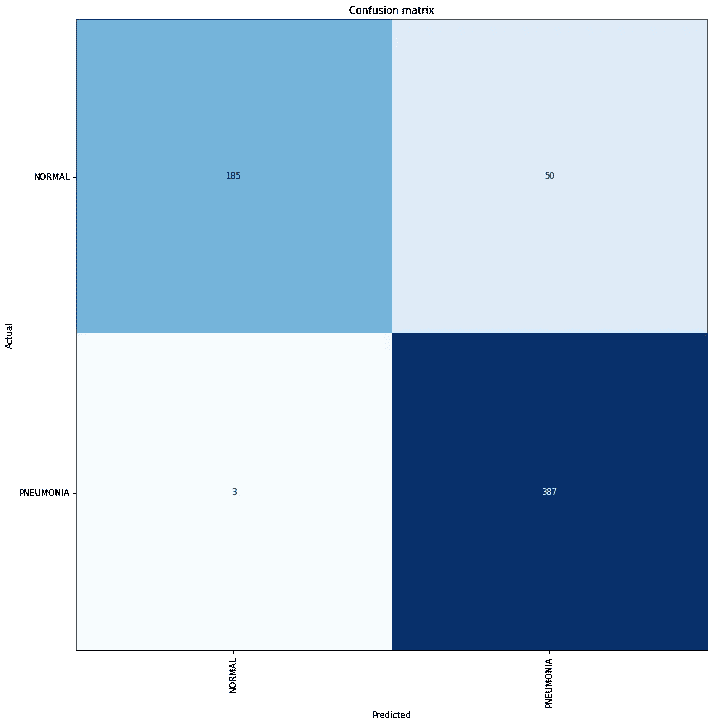

上面的混淆矩阵显示我们错误地预测了总共 53 幅图像。50 个图像我们错误地预测为肺炎，3 个图像我们预测正常有肺炎。他的图也适用于多标签分类。如果你有很多职业，混淆矩阵通常很难解释。幸运的是，fastai 有一个混淆矩阵的文本版本，可以使用 most_confused 方法访问**。**

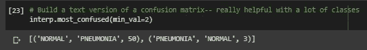

most _ 混淆方法输出(预测/实际/总和)

另一个非常有用的方法是 plot _ top _ losses。这允许您检查您的模型最有信心预测正确，但模型是错误的图像。这通常可以显示数据集中的错误。例如，如果图像被错误地贴错标签，您应该正确地给图像贴标签。

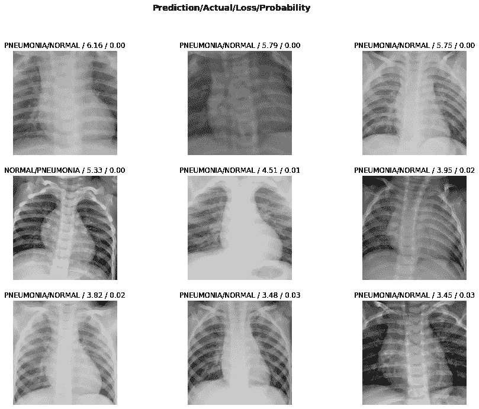

show _ top _ losses 方法的输出

现在你有了如何使用强大的 fastai 软件构建图像分类器的框架！我希望这个模型能启发你使用这些技术来创建各种工具。Fast.ai 小组正在整理一个很棒的程序，我强烈建议你去看看！

现在，将这个模型部署为一个 web 应用程序，允许人们为您的模型上传 x 光片，以预测诊断结果！如果有，当然请不要用这种模式代替咨询医生。**如果你有兴趣了解如何将这个模型部署为一个 web 应用程序，请告诉我！**如果有人对关于部署的后续帖子感兴趣，我会试一试！

谢谢你花时间阅读我的博客。如果您有任何问题或有建设性的批评，请随时联系我！

*领英:*

[*www.linkedin.com/in/blakesamaha*](http://www.linkedin.com/in/blakesamaha)

*个人网站:*

[*aggressiontothemean.com*](http://www.aggressiontothemean.com)

*推特:*

[*@ Mean _ Agression*](https://twitter.com/Mean_Agression)