# 深度学习图像增强对损失函数工程的见解

> 原文：<https://towardsdatascience.com/deep-learning-image-enhancement-insights-on-loss-function-engineering-f57ccbb585d7?source=collection_archive---------3----------------------->

## 对超分辨率、色彩和风格转换的技术和损失函数工程的见解。

这些是我从使用深度学习进行各种图像处理技术的实验中获得的关于损失函数工程和深度神经网络架构的一些见解，这些技术包括超分辨率、着色(将颜色修补到黑白图像中)和风格转换。

这篇文章扩展了我的文章[中描述的损失函数基于特征激活和风格损失的损失函数](/loss-functions-based-on-feature-activation-and-style-loss-2f0b72fd32a9)，我在我的研究中使用了基于深度学习的图像增强，用于[超分辨率](/loss-functions-based-on-feature-activation-and-style-loss-2f0b72fd32a9)和黑白图像的[着色](/u-net-deep-learning-colourisation-of-greyscale-images-ee6c1c61aabe)。事实证明，这些文章比我预想的要受欢迎得多，尤其是在过去的几个月里，我的文章在谷歌搜索“超级分辨率”的结果中名列前茅。

我在过去一年的研究中发现了一些有趣的发现和见解。有效损失函数在训练有效模型中是重要的，在某些情况下，它们可能比模型的架构更重要。

理论上，损失函数也可以申请专利。随着深度学习的成长和兴起，未来看到损失函数工程师这样的工作成为角色也就不足为奇了。

在本文的后半部分，有一些使用这些损失函数技术生成图像的例子，用于超分辨率、着色和风格转换。

# 用于训练图像增强的深度学习模型的损失函数中的常见评估度量

对于图像增强，损失函数旨在评估模型的预测/生成输出离目标/地面真实图像有多远，以训练模型来最小化该损失。

传统上，在学术和研究论文中，通常使用基于均方误差(MSE)、均方根误差(RMSE)或峰值信噪比(PSNR)的像素损失来对此进行评估。

像素损失本质上是目标图像的像素距离预测/生成图像的像素有多远的度量。

## 峰值信噪比(PSNR)

来自维基百科:PSNR 最容易通过均方差(MSE)来定义。给定无噪声的 m×n 单色图像 I 及其有噪声的近似 K，MSE 定义如下。

## 均方差(MSE)/ L2 损耗

这里的数学让这比看起来更复杂。

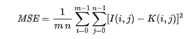

均方误差

这是在 RGB 图像中的三个通道之间进行比较。MSE 用于比较目标图像的像素距离预测/生成图像的像素有多远。取每个像素差值的平均值，然后平方。

对于 L2 损失，目标是最小平方偏差，以最小化地面真实和预测/生成图像之间的平方差之和。

如果取均方误差的平方根，这允许考虑所生成的图像和待评估的地面真实图像之间的距离。

## 峰值信噪比定义(PSNR)

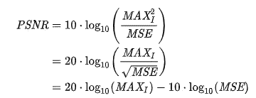

峰值信噪比

峰值信噪比定义(PSNR)最常用于对不同编解码器和图像压缩造成的质量损失进行质量评估，其中信号是原始图像，噪声是压缩图像产生的误差。

PSNR 非常常用于评估图像增强技术，例如超分辨率，其中信号是原始/地面真实图像，噪声是模型无法恢复的误差。

尽管 PSNR 是基于对数的指标，但它是基于 MSE 的。

## MSE 不是图像增强质量的良好指示。

为什么均方误差(MSE)不是图像增强质量的良好指标。

使用 MSE 或基于 MSE 的度量可能导致训练找到基于深度学习的模糊滤波器，因为这可能具有最低的损失和最容易收敛到最小化损失的解决方案。

最小化 MSE 的损失函数鼓励寻找通常过度平滑的似乎合理的解决方案的像素平均值，并且尽管最小化了损失，但是从吸引人类观察者的角度来看，所生成的图像将具有较差的感知质量。

考虑具有盐和胡椒噪声的图像将导致比许多其他可能生成的图像更低的损失，这些图像从人类感知来看将更接近地面真实。

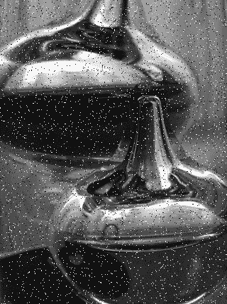

椒盐噪声。来源:维基百科

# 平均绝对误差/ L1 损耗

对于 L1 损失，目标是最小绝对偏差(LAD ),以最小化地面真实和预测/生成图像之间的绝对差异之和。

MAE 减少了平均误差，而 MSE 没有。相反，MSE 非常容易受到异常值的影响。

对于图像增强，MAE 将可能产生从人类观察者的角度看起来质量更高的图像。

# PSNR 基于 MAE 而非 MSE

如果使用 MSE 的上述 PSNR 的类似等式被改变为使用 MAE，则在我的实验中，这产生了比 PSNR 更吸引人的增强图像，尽管不如以下度量有效。

# 结构相似指数(SSIM)

结构相似性指数(SSIM)是一个感知指标。SSIM 是基于图像中可见的结构。使用 SSIM 进行图像增强评估是因为对于一些研究人员来说，PSNR 不再被认为是图像质量退化的可靠指标。这是一个感知指标，用于量化由处理导致的图像质量下降。

我的实验再次使用 SSIM 作为损失函数的度量，结果得到比 PSNR 更吸引人的增强图像

# 特征损失(感知损失)

如果使用差异固定的预训练模型，则通过在模型内放置回调，可以在感兴趣的层在地面真实图像和预测图像之间比较来自该模型的激活。感兴趣的图层是那些紧接在提取信息的平均或最大池图层之前的图层。

这些有趣的层是模型对特征的感知。

可以比较来自这些感兴趣层的激活的平均绝对误差(MAE ),然后这可以是构成损失函数一部分的度量。

如果生成的图像可以具有更清晰的特征，则从人类观察者对图像质量的观点来看，其余的像素通常不太重要。

这在我的文章[基于特征激活和风格损失的损失函数](/loss-functions-based-on-feature-activation-and-style-loss-2f0b72fd32a9)中有更详细的描述

对于超分辨率，我相信这是感知图像质量最重要的指标。然而，这种类型的损失度量在许多研究论文中并不流行，因为它不容易与其他研究进行比较。

# 克矩阵损失

很少使用的是 Gram 矩阵损失，它本质上是一种风格损失的评估形式。

向量集的格拉姆矩阵是这些向量所有可能的内积的矩阵。

可以获取来自每个通道的激活，将每个激活展平成一维向量，然后获取这些向量彼此的点积以形成格拉姆矩阵。点积表示每个通道组合的相关程度。如果一个通道指示纹理，而另一个通道指示明亮的颜色，则高点积将指示具有纹理的单元也倾向于具有明亮的颜色。

这已被有效地用于评估风格损失。如果两幅图像具有相同的风格，那么它们将具有相似的 gram 矩阵。激活的展平从比较中移除了它们的空间信息。这是克矩阵损失对风格转移如此有效的原因之一。

如果损失函数使用不同的固定预训练模型，来自该预训练模型的激活可以在地面真实图像和感兴趣层的预测图像之间进行比较。同样，感兴趣的图层是那些位于平均或最大汇集图层之前的图层，在这些图层中提取信息。不是查看特征/感知损失，而是可以比较激活的 gram 矩阵的平均绝对误差(MAE ),然后构成作为损失函数一部分的度量。

同样，与前面提到的特征损失一样，这种损失度量在许多研究论文中并不流行，因为它不容易与其他研究进行比较。

如果与损失函数中的其他损失指标一起使用，则需要一个适当的乘数，以将其作为一个类似或适当的尺度。

进一步在下面，这种损失度量在着色中的有效性被显示为非常令人印象深刻。

# 重量标准化与批次标准化

批量归一化是用于训练深度神经网络的常见实践，包括用于图像生成的深度神经网络，包括生成对抗网络(GANs)。

在论文 [*关于生成对抗网络*](https://arxiv.org/abs/1704.03971) *【司涛祥，郝丽】*中批量和权重归一化的影响中，发现批量归一化会对训练模型的质量和训练过程的稳定性产生负面影响。最近的技术，重量标准化，被发现可以改善重建，训练速度，特别是 GANs 的稳定性。

在我的实验中，我发现在训练超分辨率和着色的两个模型的情况下，权重归一化是有效的，不限于使用 GANs 进行训练。

# 自我关注

在论文 [*自我注意生成对抗网络*](https://arxiv.org/abs/1805.08318) *(张寒、伊恩·古德菲勒、迪米特里斯·梅塔克萨斯、奥登纳)*中，自我注意的思想是基于自然语言处理中用于图像生成的注意机制来实现的

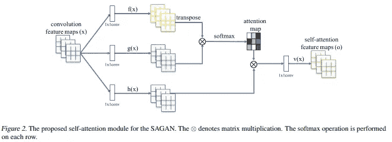

自我关注模块。来源:https://arxiv.org/pdf/1805.08318.pdf

自我注意允许使用来自所有特征位置的线索来生成细节。它有助于确保图像的远处部分彼此一致，而传统上这是卷积神经网络(CNN)的一个缺点。

在我的没有 GANs 的深度学习超分辨率和着色的实验中，我发现自我关注提高了模型基于损失标准和从人类评估角度生成图像的性能。这在着色时更加明显，图像不同部分的相似特征具有更好的一致性。

# 超分辨率

## 光谱归一化

在论文**(Takeru Miyato，Toshiki Kataoka，Masanori Koyama，Yuichi Yoshida)* 中，提出了一种称为谱归一化的新的权重归一化技术来稳定鉴别器的训练。克里斯蒂安·科斯格罗维的一篇文章[解释了什么是光谱归一化，通过限制权重的李普希兹常数来控制梯度。](https://christiancosgrove.com/blog/2018/01/04/spectral-normalization-explained.html)*

*在论文**(张寒，伊恩·古德菲勒，迪米特里斯·梅塔克萨斯，奥登纳)*中，鉴别器和生成器都使用了谱归一化。**

**在我最近对基于深度学习的超分辨率进行的实验(没有 GANs)中，我发现光谱归一化比重量归一化和批量归一化更有效地提高了模型生成图像的性能——基于损失标准和从人类评估的角度。**

**在我对黑白图像进行基于深度学习的着色(颜色修复)的实验中(同样没有 GANs)，我发现光谱归一化 ***不如*** 批量归一化有效。**

## **2 倍超分辨率:基于 ResNet 34 的编码器和基于 U-Net 架构的解码器的改进型号**

**该模型的目标是生成更大的高保真图像，其高度和宽度是输入图像的两倍，像素是输入图像的四倍。对于一个训练有素的模特来说，这是一项艰巨的任务。**

**生成这些超分辨率图像的模型在 U-Net 架构中具有基于 ResNet34 的编码器和解码器。在我过去的实验中，这个改进的模型被训练用于使用损失函数的超分辨率，该损失函数组合了 SSIM(结构相似性指数)、来自固定预训练的 VGG16 模型的特征/感知损失和来自固定预训练的 VGG16 模型的 gram 矩阵(风格)损失，以及小部分 MAE(平均绝对误差)损失。**

**这也在模型的训练中使用了光谱归一化和自我注意。**

**在下面的例子中，低分辨率输入图像在左边，生成的预测在中间，地面真实/目标图像在右边。**

**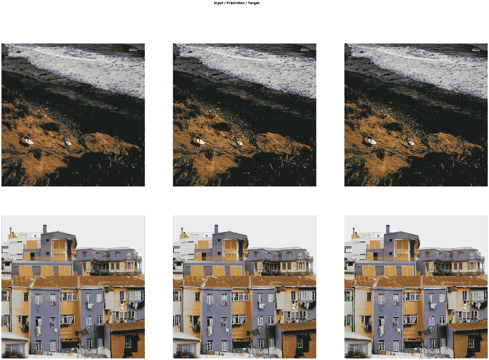**

**2 倍的超分辨率源于一个改进的超分辨率模型，该模型采用 U-Net 架构和基于 ResNet34 的编码器/解码器。低分辨率图像(左)，生成的预测(中)，地面实况(右)**

**如果你仔细观察第一排冲浪板上的岩石和手臂，这些特征清晰而鲜明。如果你仔细观察屋顶、窗户和悬挂在上面的纺织品，同样的情况也可以在最下面一排的图片中看到——房屋。图像底部中心的栅栏线清晰可见。**

# **着色/将颜色修补成黑白图像。**

**这里的着色实验使用了比我之前的实验小得多的 U-Net 架构，基于基于 ResNet18 的编码器和解码器，而不是使用基于 ResNet34 的编码器和解码器。**

## **改进的基于 ResNet18 的编码器和解码器 U-Net。**

**与我过去的实验相比，这个改进的模型被训练用于使用损失函数的图像着色，该损失函数结合了 SSIM(结构相似性指数)、来自固定的预训练 VGG16 模型的少量特征/感知损失和来自固定的预训练 VGG16 模型的 gram 矩阵(风格)损失，以及非常小比例的 MAE(平均绝对误差)损失。**

**这个模型的训练使用了体重标准化和自我关注。此外，以 16 位浮点精度进行训练有助于进一步减少损失。与此结合的组合或混合损失函数允许模型最小化不同因素的损失，从而产生有吸引力的结果。**

**在下面的例子中，低分辨率输入图像在左边，生成的预测在中间，地面真实/目标图像在右边。**

**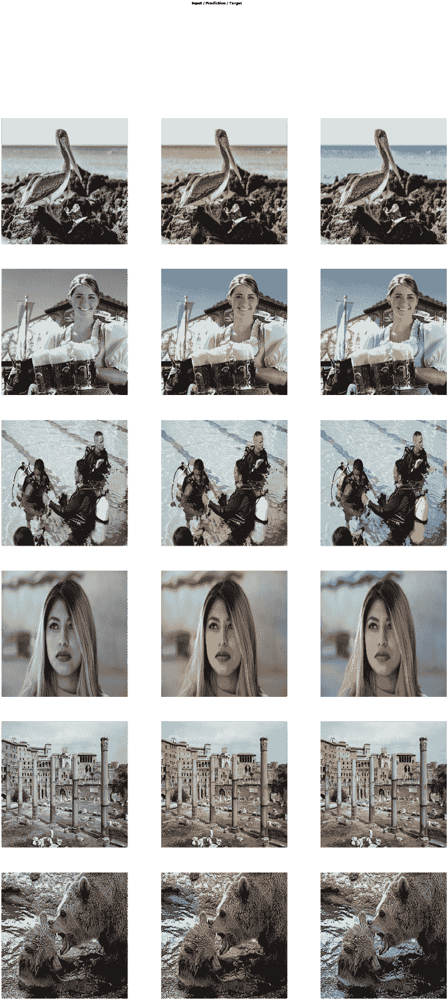**

**色彩化产生于具有 U-Net 架构的模型，该 U-Net 架构具有利用混合损失函数训练的基于 ResNet18 的编码器/解码器。低分辨率图像(左)，生成的预测(中)，地面实况(右)**

**在最后一个例子中，生成的熊的图像比地面的真实情况更具视觉吸引力。**

## **Gram (style)损失函数用于训练具有基于 ResNet18 的编码器和解码器 U-Net 架构的模型**

**这一模型的结果令人惊讶地有效。用于训练该模型的损失函数不使用 MSE 或 MAE 像素损失。损失函数也没有使用 PSNR、SSIM 或特征损失。损失函数仅将感兴趣特征的 gram 矩阵与 ImageNet 预先训练的固定模型进行比较。**

**结果，虽然不如一个模型训练有素的其他损失，在我看来，是相当了不起的，修复了纯粹来自训练的颜色，以尽量减少风格的损失。**

**在下面的例子中，低分辨率输入图像在左边，生成的预测在中间，地面真实/目标图像在右边。**

****

**在我看来，一部分生成的图像看起来比真实的地面更具视觉吸引力。**

# **4 倍超分辨率实验**

**该模型的目标是生成更大的高保真图像，其高度和宽度是输入图像的四倍，像素是输入图像的 16 倍。对于一个模特来说，这是一个很难完成的任务。**

**训练使用了与本文前面描述的 2x 超分辨率实验相似的损失函数度量。**

**在下图中，低分辨率输入图像位于左侧，生成的预测位于中间，地面真实/目标图像位于右侧。考虑到输入图像的低质量，该模型正在执行一项令人印象深刻的任务来提高图像的质量。**

**在上面的图像中，灌木、波浪和岩石明显更清晰，图像中的两个人也是如此。在下图中，建筑线条和屋顶的质量再次明显提高。**

**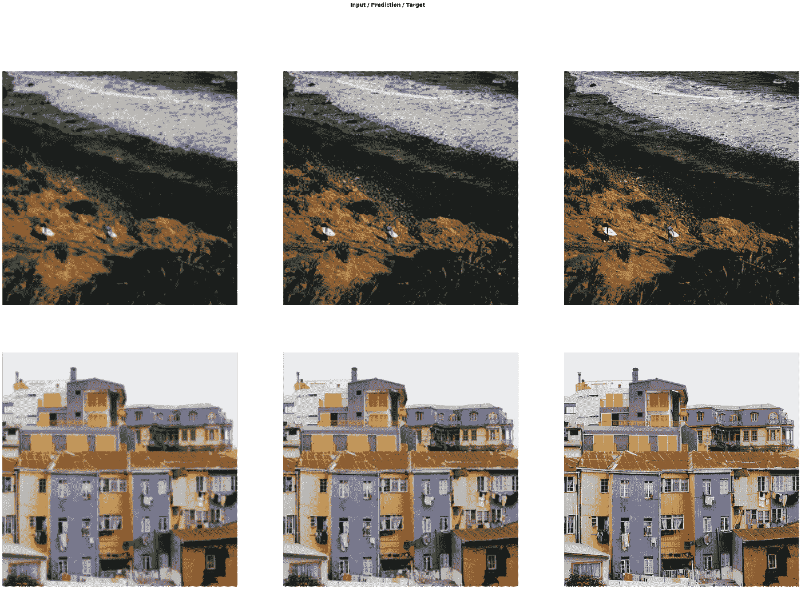**

**4 倍超分辨率源于采用 U-Net 架构和基于 ResNet34 的编码器/解码器的超分辨率模型。低分辨率图像(左)，生成的预测(中)，地面实况(右)**

# **基于 U-Net 的风格迁移实验**

**我最近做了一些实验，试图评估上述技术是否可以应用于风格转换。这些实验给出了一些有趣的结果，使用了 U-Net 架构、特征损失和风格损失度量。**

**风格转移是一个有趣的、不同的并且难以解决的问题，因为与其他图像增强训练不同，在训练期间没有单一的基础事实/目标可以用来与生成的模型进行比较。**

**这些实验训练了基于 ResNet34 编码器和解码器的具有 U-Net 架构的模型。网络的编码器部分基于在 ImageNet 上预先训练的模型。**

**损失函数使用特征损失和 gram 矩阵损失的度量的组合，比较原始和生成/风格化图像的固定预训练 VGG-16 模型内感兴趣层的激活。**

**我一直在试验的 U-Net 架构的身份/跳过连接可以允许学习一种不寻常的算法，该算法使用图像的一组高度样式化的部分，而图像的大部分保持不样式化。这是模型发现在损失函数度量中最有效地最小化误差。与特征/感知损失相比，需要对 gram 矩阵/风格损失进行仔细加权，以产生吸引人的结果。**

## **风格转移实验——好结果**

**这些风格转移实验的例子试图转移文森特·梵高的[疯人院花园](https://www.vangoghmuseum.nl/en/collection/s0196V1962)的风格，这是我最喜欢的画作之一，我今年早些时候在阿姆斯特丹有幸看到过。**

**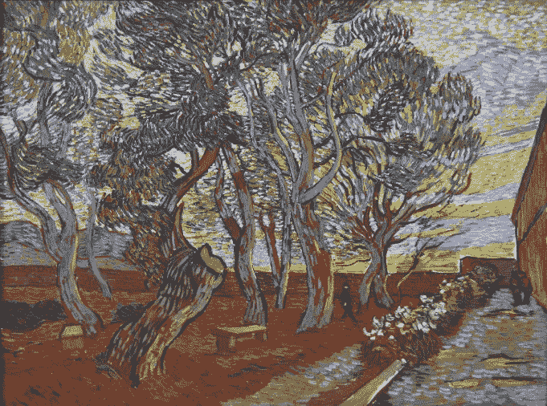**

**文森特·梵高的[疯人院花园](https://www.vangoghmuseum.nl/en/collection/s0196V1962)**

**在花了相当多的时间调整损失函数并对其进行微调后，经过训练的模型学会了生成有趣的图像，并将梵高画作的风格转移到这些图像上。**

**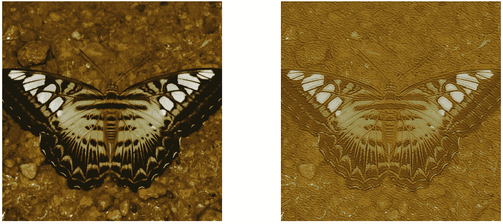**

**基于文森特·梵高的[疯人院花园](https://www.vangoghmuseum.nl/en/collection/s0196V1962)的风格转变的一个较好的例子。原始图像在左侧，样式化/生成的图像在右侧**

**来自同一个训练过的模型的另一个非常有趣的例子是这个生成的狼的图像，模型决定给它发光的眼睛，我认为这可能总结了原画中的情绪，它的不祥的人潜伏在树上。发光的眼睛是模型特征检测的结果。**

**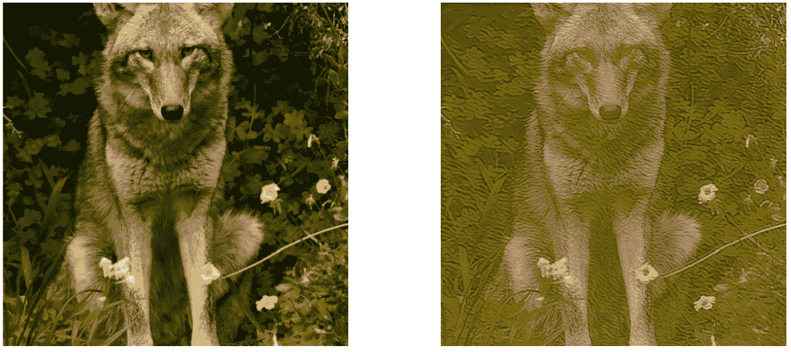**

**另一个更好的风格转变的例子基于文森特·梵高的[疯人院花园](https://www.vangoghmuseum.nl/en/collection/s0196V1962)——一只眼睛发光的狼。原始图像在左侧，样式化/生成的图像在右侧**

## **风格转移实验—其他结果**

**这些例子试图传达文森特·梵高的《星夜》的风格。**

**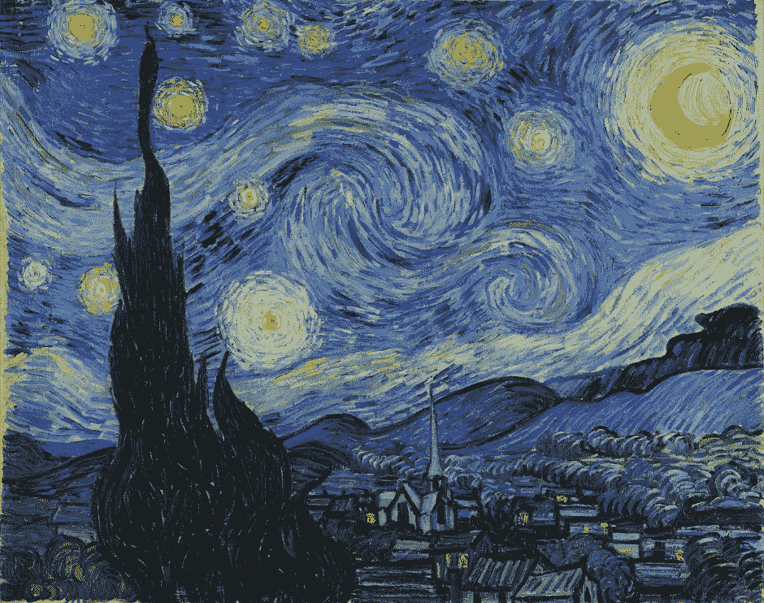**

**文森特·梵高的《星夜》**

**来自训练模型的风格化生成的图像具有绘画的风格和图像，尽管结果似乎过度使用了某些风格。如果对损失函数进行调整，我敢肯定会发现不同的更有吸引力的结果。我怀疑这种风格的图像是 U-Net 的跳过/身份连接的结果。**

**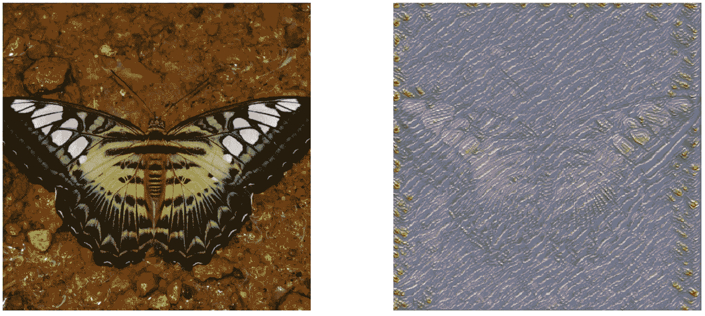**

**基于文森特·梵高的[疯人院花园](https://www.vangoghmuseum.nl/en/collection/s0196V1962)的风格转换示例。原始图像在左侧，样式化/生成的图像在右侧**

**同样，从训练模型生成的风格化图像既有绘画风格也有图像。风格化的效果非常有趣，如果对损失函数进行更多的调整和重新训练，我相信会产生更吸引人的结果。**

**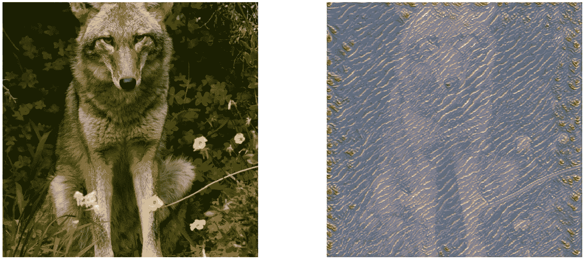**

**基于文森特·梵高[疯人院花园](https://www.vangoghmuseum.nl/en/collection/s0196V1962)的风格转移示例。原始图像在左侧，样式化/生成的图像在右侧**

## **风格转移实验——最糟糕的结果**

**这些实验部分是由于损失函数的风格损失部分权重太大。我也相信这个模型被训练了太长时间和/或学习率太高。**

**如果你仔细观察，你仍然可以在图像中看到蝴蝶的轮廓，尽管它和它的特征已经大部分丢失了。左侧和顶部有丰富的样式信息。**

**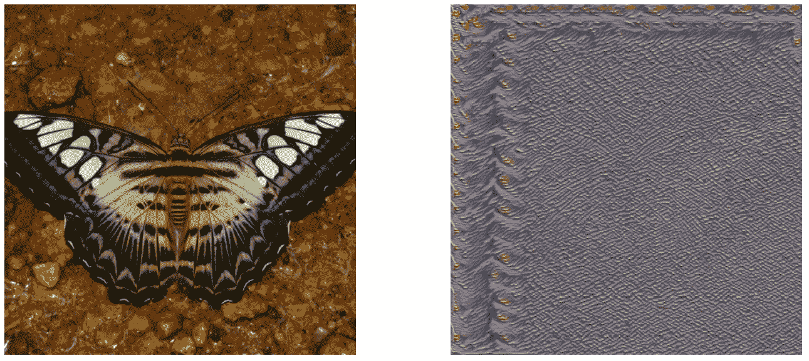**

**基于文森特·梵高的[疯人院花园](https://www.vangoghmuseum.nl/en/collection/s0196V1962)的风格转移的失败例子。原始图像在左侧，样式化/生成的图像在右侧**

**如果你非常仔细地看，你仍然可以看到图像中一些特征的轮廓，尽管几乎看不到。同样，左侧和顶部生成了丰富的样式信息。**

**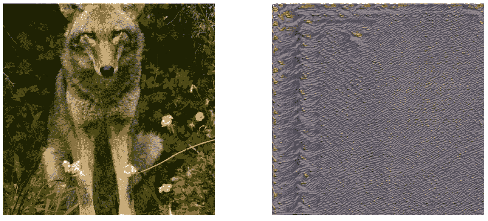**

**基于文森特·梵高的[疯人院花园](https://www.vangoghmuseum.nl/en/collection/s0196V1962)的风格转移的失败例子。原始图像在左侧，样式化/生成的图像在右侧**

**这些例子说明了训练一个有效的模型有多困难，尤其是当没有单一目标或基础事实来评估每个训练图像的模型时。**

# **结论**

**与深度学习图像增强研究中传统使用的度量相比，存在可以产生视觉上更吸引人的生成图像的损失函数。作为损失函数度量的一部分，使用和比较来自单独的固定预训练模型的激活非常有效。**

**我希望有更多的时间来重温这篇文章，以提供更好的图像生成结果，更多的例子和这里概述的技术和结果的扩展解释。此外，当时间允许时，我会将这些模型中最好的放入生产环境中使用。**

**我也希望能找到一个我能与之合作的出版物或学术机构，来撰写和发表一篇详细介绍这些实验和结果的论文。**

**最后，我要感谢杰瑞米·霍华德和杰森·安蒂奇的灵感，他们试图训练基于深度学习的模型来执行这些超级分辨率和着色任务。**