# 云中的深度学习。如何入门 Google Colab，为什么？

> 原文：<https://towardsdatascience.com/deep-learning-in-a-cloud-how-to-get-started-with-google-colab-and-why-d07874c5e833?source=collection_archive---------37----------------------->

## 如何开始使用 Google Colab……


图片由[皮克斯巴伊](https://pixabay.com/?utm_source=link-attribution&utm_medium=referral&utm_campaign=image&utm_content=3625405)的[费利克斯米特迈尔](https://pixabay.com/users/FelixMittermeier-4397258/?utm_source=link-attribution&utm_medium=referral&utm_campaign=image&utm_content=3625405)拍摄

**简介**

在本文中，我将向您介绍 Google Colab，它是一个类似于 Jupyter notebook 的工具，允许您在云端运行代码。我将向您介绍:

> Google Colab 是什么，为什么你应该开始使用它？
> 
> 如何安装 Google Colab？
> 
> 在 Google Colab 中编写你的第一个函数。
> 
> 在 Google Colab 中加载数据文件。
> 
> 如何在 Google Colab 中打开 GPU 和 TPU，以及如何使用它进行深度学习。

阅读完本文后，您应该已经准备好开始将 Google Colab 用于您的数据科学项目，利用在云中运行代码的优势，并使用该工具提供的免费 GPU /TPU。

我们开始吧！

**Google Colab 是什么，为什么你应该开始使用它？**

> 轻松协作

顾名思义，Google Colab 是由 Google 发布的一个工具，与其他 Google 产品类似，它可以在云中使用，并允许协作编辑。这意味着您可以轻松地与其他人共享笔记本，允许他们查看代码，或者使他们成为协作者。

> 预装的数据科学库

Google Colab 允许你像 Jupyter Notebook 一样交互式地编写和运行 python 代码。此外，它预装了大多数数据科学库，这使它成为想要立即开始机器学习项目的初学者的理想工具。像 pandas，numpy，Tensorflow，Keras，OpenCV 这样的库已经安装好了，所以不需要运行‘pip install’和本地环境安装。

> 自由图形处理器/ TPU

此外，它还提供免费的 GPU /TPU！这意味着训练神经网络将更快，并且可以由没有非常强大的机器的人访问。即使你有一台强大的机器，Google Colab 也能让你把机器从繁重的工作中解放出来，并把它委托给云。

**如何安装 Google Colab？**

为了开始使用 Google Colab，请遵循以下简单步骤。

1.  导航至您的 [Google Drive 页面](https://drive.google.com/drive/u/0/my-drive)。

2.在 Google Drive 中，点击*’+New*按钮。

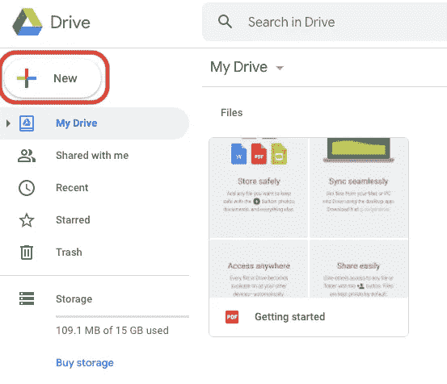

3.从 *'+新建*'下拉菜单中选择*'更多*'，然后从附加下拉菜单中选择“ *+连接更多应用*”。

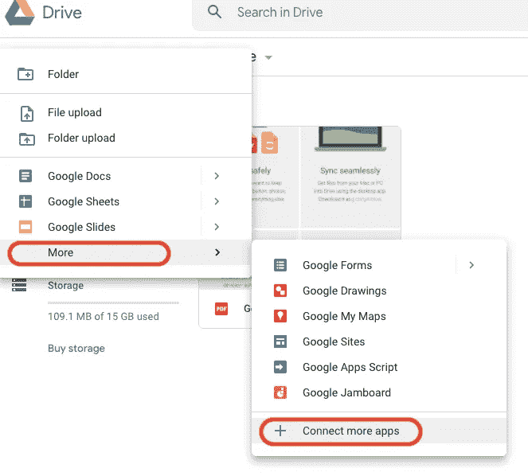

4.现在你应该可以看到一个带有 *G Suite Marketplace* 的窗口。在搜索框中输入*合作实验室*并按回车键确认选择。

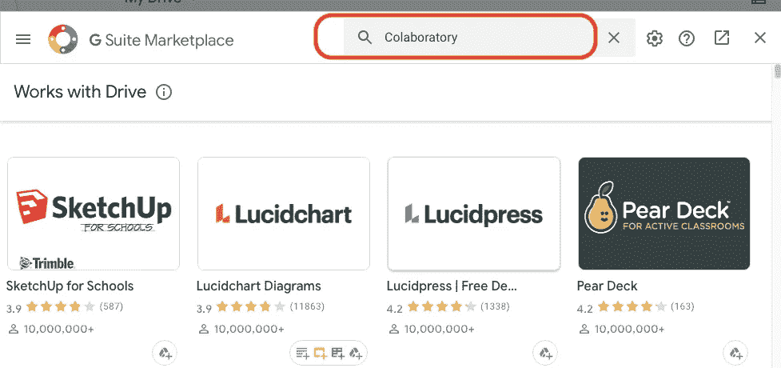

5.现在，您应该能够看到 Google Colab 程序作为一个可能的选择。

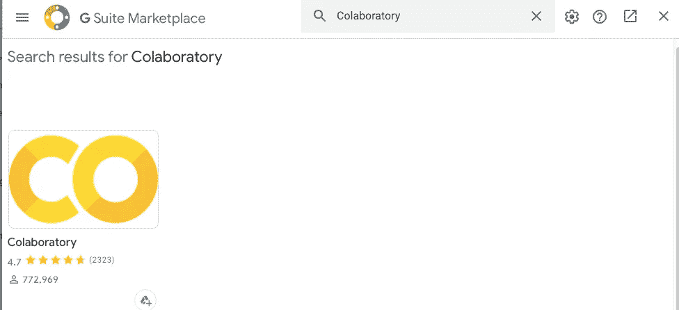

6.现在点击图标选择*的【合作实验室】*，系统会提示您安装按钮。按照屏幕上显示的安装指南操作，之后你就可以使用 Google Colab 了。

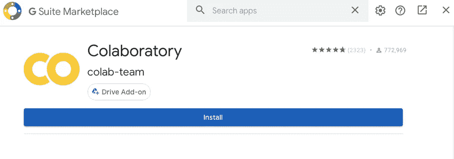

在 Google Colab 中编写你的第一个函数

一旦您安装了 Google Colab，当您从 Google Drive 中选择“+ New”按钮时，它将出现在您的下拉列表中。

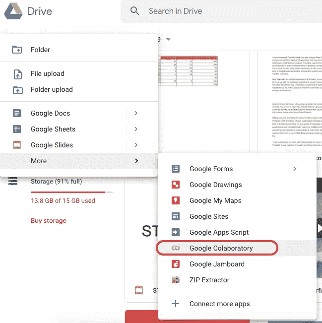

通过点击“谷歌实验室”,系统将在一个新窗口中打开一个谷歌实验室文件。现在，您可以像使用普通 Jupyter 笔记本一样使用该文件了。你可以用一个简单的 hello world 函数来测试它。

```
def hello_world(): print ('hello world')
```

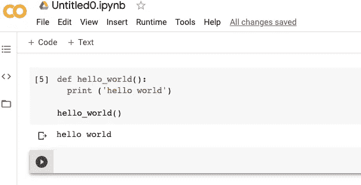

经过测试后，您可以像使用 Jupyter 笔记本一样开始使用。您可以使用普通导入来导入库，运行 python 代码，并添加带文本的 markdown，就像它是普通的 Jupyter 笔记本文件一样。

现在我将向您展示如何在 Google Colab 中加载数据文件，因为它与您在 Jupyter Notebook 中使用的略有不同。

**在 Google Colab 中加载数据文件**

从 Google Colab 加载文件有两个选项。您可以从本地文件系统加载它，或者将文件添加到 Google Drive 并连接 Google Colab 以使用存储在驱动器中的文件。我建议你做后者。

为了连接 Google Drives 和 Colab，请在其中一个 Colab 文件中运行此代码。

```
from google.colab import drivedrive.mount('/content/drive')
```

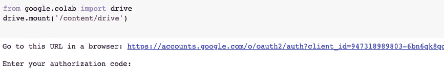

您将被提示打开链接，在那里您将被要求允许 Google Drive 文件流。

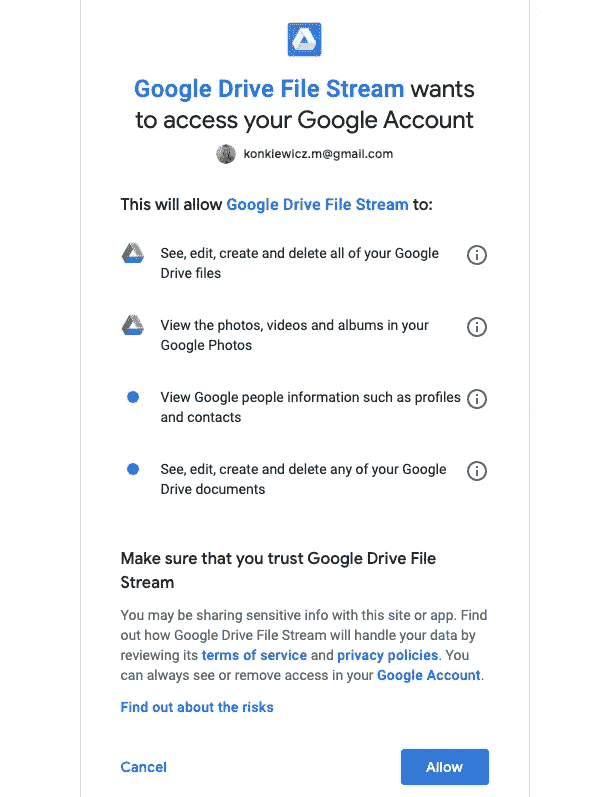

点击*“允许”*按钮，您将获得授权码。使用此代码，并将其粘贴到 Google Colab 文件中您已经安装驱动器的位置。这需要一段时间，你的 Google Drive 应该可以使用了。您应该能够看到“*安装在/content/drive* ”消息。

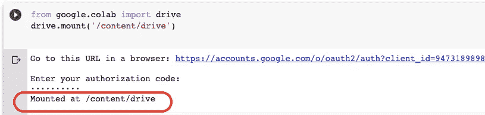

现在你可以从你的硬盘上开始使用你的 Google Colab 笔记本中的文件了。让我们看一个例子。我的谷歌硬盘里有一个名为“数字”的文件。我可以使用下面的代码将它加载到 pandas 数据框中。

```
import pandas as pddf = pd.read_csv('/content/drive/My Drive/numbers.csv')
```

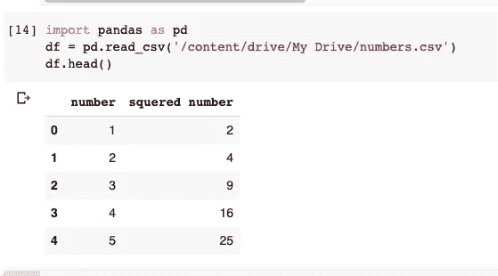

为了访问 Google Drive 中的任何文件，您只需使用“/content/Drive/My Drive/”+filename 作为路径。

**如何开启 GPU / TPU 并用于深度学习**

让我们以我认为的谷歌协作工具的最大优势来结束本教程:使用免费的 GPU 或 TPU。此外，这不会比使用另一个下拉菜单更简单。

导航至'*运行时'*,并选择“更改运行时类型”。

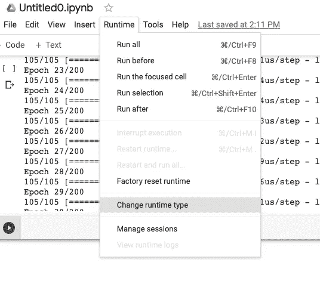

现在你会看到一个对话框，里面有三个选项:无、TPU 和 GPU。选择您希望用于神经网络训练的一个。

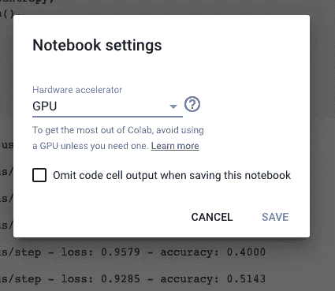

一旦你选择了这个选项，就像平常一样运行你的 Keras 或者 Tensorflow 代码。如果你的人工神经网络和数据集足够大，当使用 GPU 或 TPU 时，你应该会看到每个历元训练时间的显著减少。

**总结**

您已经准备好开始使用 Google Colab 进行您的数据科学项目。我希望你会喜欢它的功能，并利用它的协作性质和免费的 GPU。如果您正在寻找一些项目想法，请查看我在本文中列出的数据资源:

[](/machine-learning-data-sets-8c73825a17f9) [## 机器学习数据集

### 为数据科学项目寻找第一批数据的最佳资源

towardsdatascience.com](/machine-learning-data-sets-8c73825a17f9) 

*原载于 aboutdatablog.com:* [云端深度学习。如何入门 Google Colab，为什么？](https://www.aboutdatablog.com/post/deep-learning-in-a-cloud-how-to-get-started-with-google-colab-and-why)，*2020 年 4 月 22 日。*

*PS:我正在 Medium 和*[***aboutdatablog.com***](https://www.aboutdatablog.com/)*上写文章，深入浅出地解释基本的数据科学概念。你可以订阅我的* [***邮件列表***](https://medium.com/subscribe/@konkiewicz.m) *在我每次写新文章的时候得到通知。如果你还不是中等会员，你可以在这里加入*[](https://medium.com/@konkiewicz.m/membership)**。**

*下面还有一些你可能喜欢的帖子*

*[](/what-are-lambda-functions-in-python-and-why-you-should-start-using-them-right-now-75ab85655dc6) [## python 中的 lambda 函数是什么，为什么你现在就应该开始使用它们

### 初学者在 python 和 pandas 中开始使用 lambda 函数的快速指南。

towardsdatascience.com](/what-are-lambda-functions-in-python-and-why-you-should-start-using-them-right-now-75ab85655dc6) [](/jupyter-notebook-autocompletion-f291008c66c) [## Jupyter 笔记本自动完成

### 数据科学家的最佳生产力工具，如果您还没有使用它，您应该使用它…

towardsdatascience.com](/jupyter-notebook-autocompletion-f291008c66c) [](/7-practical-pandas-tips-when-you-start-working-with-the-library-e4a9205eb443) [## 当你开始与图书馆合作时，7 个实用的熊猫提示

### 解释一些乍一看不那么明显的东西…

towardsdatascience.com](/7-practical-pandas-tips-when-you-start-working-with-the-library-e4a9205eb443)*