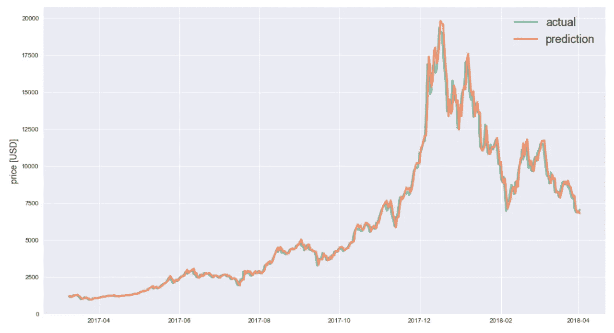
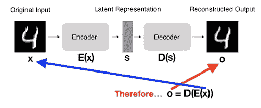

# 金融深度学习:这是金融业的未来吗？

> 原文：<https://towardsdatascience.com/deep-learning-in-finance-is-this-the-future-of-the-financial-industry-a29b561031e9?source=collection_archive---------13----------------------->

## 使用深度学习加速金融行业的增长

[深度学习](https://blog.exxactcorp.com/category/deep-learning/)现在引领着金融创新的潮流吗？计算金融、机器学习和深度学习多年来一直是金融部门的重要组成部分。这些技巧、技术和技能的发展使得金融业在过去几十年里实现了爆炸性增长，并变得更加高效、敏锐，对其参与者来说利润丰厚。这将继续成为金融业未来的驱动力吗？

[***来源***](https://chatbotslife.com/deep-learning-in-finance-learning-to-trade-with-q-rl-and-dqns-6c6cff4a1429)

# 深度学习怎么用在金融上？

金融深度学习是在金融部门的各个部分使用神经网络方法的艺术，例如:

*   客户服务
*   价格预测
*   证券管理
*   欺诈检测
*   算法交易
*   高性能计算
*   风险管理
*   信用评估
*   和操作

随着新的深度学习焦点的出现，推动金融行业的人们不得不通过从理论金融知识的理解中分支出来适应。他们现在被迫学习如何使用 Python、云计算、数学和统计学，还采用了 GPU(图形处理单元)的使用，以便更快地处理数据。

在本帖中，我们将重点介绍:

*   金融中的算法交易
*   金融中的价格预测
*   金融领域的欺诈检测

每个部分还包括一个有用的教程链接。

# 金融中的算法交易

算法交易是创建一个计算模型来实现金融市场中的买卖决策的过程。除了基于数学模型，交易者还可以使用深度学习技术，使用近似模型来实现买卖交易。

[***来源***](https://medium.com/@CapitalCio/top-algo-trading-solution-companies-2020-1dc6dcd0cbe3)

# 算法交易策略

*   **趋势跟随**
*   这是最常见的策略类型，投资者将跟踪价格变动、移动平均线、突破等模式。没有对价格的预测，相反，目标是根据投资者提供的逻辑指令执行买卖策略。
*   **套利机会**
*   从金融资产的差价中获利被称为“金融套利”。这基本上是当你购买一个更便宜的资产，并在不同的市场以更高的价格出售，从而在没有任何净现金流的情况下获利。如果投资者能够成功执行利用差价的策略，就有机会进行有利可图的交易。
*   **数学建模**
*   *均值回归*——这是基于一种观点，即资产的高低价格将回归到其平均价值。一旦价格低于平均值，就被视为买入资产的机会，希望价格高于平均值。资产的平均价值不断变化，因此需要持续监控。
*   *成交量加权平均价格(VWAP)* —该策略分解大订单，并使用特定股票的历史成交量曲线向市场发布动态确定的较小订单块。目的是在 VWAP 附近执行订单，从而从平均价格中获益。
*   *时间加权平均价格(TWAP)* —时间加权平均价格策略分解一个大订单，并使用在开始和结束时间之间平均划分的时间段向市场发布动态确定的较小订单块。目标是在开始和结束时间之间以接近平均价格的价格执行订单，从而将市场影响降至最低。

参见本教程[用 Python Python、Zipline 和 Quantopian](https://pythonprogramming.net/finance-programming-python-zipline-quantopian-intro/) 进行金融编程，学习如何用 Python 进行量化交易。

# 金融中的价格预测

几十年来，金融行业的交易员和专家一直严重依赖计算机，但借助运行 GPU 的高性能计算(HPC ),他们已经能够将计算机提升到一个新的水平。这些新的[工作站和服务器](https://www.exxactcorp.com/Deep-Learning-NVIDIA-GPU-Solutions)为海量数据集提供了大量存储选项。这些系统还允许人们执行复杂的、占用大量内存的算法，这些算法需要在本地机器上使用数百万甚至数十亿个数据点来执行金融交易策略，以及使用深度学习技术进行价格预测。

[***来源***](https://hackernoon.com/dont-be-fooled-deceptive-cryptocurrency-price-predictions-using-deep-learning-bf27e4837151)

# 用于深度学习价格预测的技术

*   递归神经网络(RNN) —短时间范围
*   RNN 用于具有连续顺序的数据，如时序数据库。
*   长短期记忆模型(LSTM)——与 RNN 相比，时间跨度更长
*   LSTM 是 RNN 的变体，增加了参数以支持更长的记忆，因此预测的时间范围可以更长。
*   多层感知器(MLP)
*   MLP 是一类前馈神经网络，由输入层、隐含层和输出层组成。这也适用于时间序列预测，因为它:
*   对异常值、噪声数据和缺失值具有鲁棒性
*   非线性建模
*   支持多元预测
*   多步预测

本教程可以带你通过[使用 Python 和 TensorFlow 2 和 Keras](https://www.thepythoncode.com/article/stock-price-prediction-in-python-using-tensorflow-2-and-keras) 进行金融资产价格预测

# 金融领域的欺诈检测

金融界充斥着欺诈和欺骗。黑客和骗子总是试图窃取机密的个人信息和公司内部信息来出售。世界各地的政府都在对公司进行严格审查，以升级他们的网络安全和欺诈检测系统。网络安全也是[2020 年就业市场上最受欢迎的职位之一。](https://www.cybersecurityintelligence.com/blog/the-cyber-security-employment-outlook-in-2020-4739.html)

机器学习和深度学习现在被用于自动化搜索数据流以发现可能是安全威胁的异常的过程。

# 自动编码器

用于异常检测的深度学习算法是自动编码器。自动编码器神经网络是一种无监督的学习算法，它应用反向传播，将目标值设置为等于输入值，这实质上是对数据进行编码和压缩，并将数据重构为尽可能接近原始数据的表示。

自动编码器由两部分组成:

*   **编码器** —获取输入数据并将其压缩成一个数量向量。
*   **解码器** —从编码器获取数据并重建原始输入。

[*来源*](https://www.pyimagesearch.com/2020/02/17/autoencoders-with-keras-tensorflow-and-deep-learning/)

本教程将带您了解带有 Keras、TensorFlow 和深度学习的[自动编码器](https://www.pyimagesearch.com/2020/02/17/autoencoders-with-keras-tensorflow-and-deep-learning/)

# 对深度学习在金融领域的潜力略知一二

金融行业是受 AI(人工智能)新发现影响最大的行业之一。由于近年来市场波动性增加和网络犯罪威胁增加，预测增加回报的机会和使用人工智能保护数据是两个增长的领域。

该行业产生了数万亿个数据点，需要创新的解决方案来处理和分析这些数据。更严格的监管以及来自政府、行业和消费者的越来越大的压力迫使金融行业的参与者在保护数据的同时仍然增加投资者的回报。

# 谁来运营你的深度学习项目？

金融行业曾经被世界上最著名学校的 MBA 们所主宰。现在，焦点转移到了拥有编程语言知识的技术人才身上，如 [Python、](https://blog.exxactcorp.com/the-most-important-fundamentals-of-pytorch-you-should-know/)以及云计算和深度学习。

工程师在设置和管理 GPU 驱动的硬件以应对新挑战方面也发挥着重要作用。了解你在处理什么数据，你需要使用的深度学习应用和框架，你想要得到的结果，这些都需要大家共同努力。如果您的团队中缺少工程师，寻找像 Exxact 这样的公司可以帮助您了解您的需求，并提供预先配置、设置好的解决方案，一插上电源即可投入使用。你只需要确保你手头有技术人员来使用它，或者获得必要的知识来自己运行它。