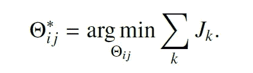

# 几何中的深度学习:弧长学习

> 原文：<https://towardsdatascience.com/deep-learning-in-geomtry-arclentgh-learning-119d347231ce?source=collection_archive---------23----------------------->

## [入门](https://towardsdatascience.com/tagged/getting-started)

## 使用深度神经网络(DNN)解决了几何中的一个基本问题。我们从监督学习方法的例子中学到了一个几何性质。由于最简单的几何对象是曲线，我们重点学习平面曲线的长度。为此，重构了基本长度公理，建立了**弧长网**。

# 介绍

曲线长度的计算是许多现代和古典问题中最主要的组成部分之一。例如，手写签名涉及计算沿曲线的长度(Ooi 等人)。当一个人在现实生活中处理长度计算的挑战时，他面临着几个约束，如加性噪声、离散化误差和部分信息。在本帖中，我们回顾了我们的工作，预印本可在线获得:

> [https://www . researchgate . net/publication/345435009 _ Length _ Learning _ for _ Planar _ Euclidean _ Curves](https://www.researchgate.net/publication/345435009_Length_Learning_for_Planar_Euclidean_Curves)

在目前的工作中，我们解决了几何领域中的一个基本问题，我们的目标是使用 DNN 重建一个基本属性。最简单的几何对象是曲线，评估曲线的简单度量是长度。在经典文献(Kimmel，2003)中有许多用于计算长度和其他几何性质的封闭形式的表达式。然而，由于我们知道 DNN 的强大功能，我们非常有动力通过设计 DNN 来重构曲线长度(弧长)属性。为简单起见，我们将重点放在二维欧几里得域上。

# 一点几何学

因此，在我们深入研究机器学习公式之前，让我们简要回顾一下长度属性。2D 曲线的欧几里德长度的一般方程由下式给出

(1)

主长度的公理是可加性、不变性、单调性和非负性。关于连接的长度相加，关于旋转和平移不变，它是单调的，并且根据定义，任何曲线的长度都是非负的。

为了求一条连续曲线的长度，应该把它离散化。离散化过程包含误差。例如，让我们看看蓝色曲线。该曲线的粗略离散化可以导致橙色离散化曲线。显然，将曲线划分成许多无穷小的线可以使离散化误差最小化。

作者图片

在离散化误差中，我们可以发现由于长度方程(1)中涉及的非线性和导数而出现的附加噪声、部分信息和许多其他误差。

那么，我们如何把它表述为一项学习任务呢？

# 学习方法

我们用一种监督学习方法解决了这个问题，该方法具有满足长度公理的独特损失函数。得到的训练模型称为 ArcLengthNet。它获得一个 2D 向量作为输入，表示平面欧几里得采样曲线，并输出它们各自的长度。我们创建了一个包含 20，000 个示例的数据集，以完全支持 DNN 培训。这些大量的例子旨在涵盖曲线转换并满足不同的模式。我们数据中的一般曲线如下所示

其中 **R** 为旋转矩阵， **T** 为平移向量， **a** 为振幅，**φ**为相位。

按作者分列的数字

设计了一个独特的损失函数:

其中 *s1、s2* 和 *s3* 是保持等式****L****(S1)=****L****(S2)+****L****(S3)****O***是通过模型传递示例可以调整权重:*

**

*架构:设计了一个简化的基于 CNN 的架构。它包括一个卷积层和两个只有一个激活功能的全连接层。每条曲线由 N = 200 个点表示。该表示被插入到具有大小为 3 的小内核的卷积层中。它被处理成一个全连接层，该层通过一个整流线性单元(ReLU)激活函数向另一个最终输出长度的全连接层仅输出 10 个权重。*

*通过用反向传播方法小批量传递许多示例来训练 DNN。训练过程以 200 个样本为一批进行 100 个时期。我们使用的优化器是动量和重量衰减的随机梯度下降(SGD)。*

**

*作者图片*

**

*作者图片*

*经过 100 个时代后，模型得到了很好的训练。定义了一个维持集来测试这些体系结构在看不见的数据上的性能。该集合包含 5，000 个没有在训练集或测试集中使用的示例。ArcLengthNet 获得的最小均方误差为 0.17。在此维持集上测试了 ArcLengthNet 的单调属性，其中在真实长度和 ArcLengthNet 之间建立了线性关系:*

**

*作者图片*

# *摘要*

*提出了一种基于学习的曲线长度重构方法。深度神经网络重构基本公理的能力得到了证明。所得结果可进一步用于改进手写签名和重构更多的微分几何性质和定理。如需更多信息，请随时给我发电子邮件。*

***鸣谢** 一年前，我在以色列理工学院(Technion)上了一堂名为“几何计算机视觉”的课，由 Ron Kimmel 教授主讲。他向我介绍了微分几何领域的一个基本问题，并要求我使用深度学习方法重建弧长。我要感谢基梅尔教授向我介绍了这个迷人而富有挑战性的问题。*

*— — — — — — — — — — — — — — — — — — — — — — — — —*

# *关于作者*

*Barak 获得了以色列理工学院的航空工程学士学位(2016 年)、硕士学位(2018 年)以及经济和管理学士学位(2016 年，成绩优异)。他曾在高通工作(2019-2020)，在那里他主要研究机器学习和信号处理算法。巴拉克目前正在海法大学攻读博士学位。他的研究兴趣包括传感器融合、导航、深度学习和估计理论。*

*访问我的个人网站:[www.Barakor.com](http://www.barakor.com/)*

*领英[https://www.linkedin.com/in/barakor/](https://www.linkedin.com/in/barakor/)*

*推特:巴拉克 2*

*— — — — — — — — — — — — — — — — — — — — — — — — —*

# *参考*

*[1]j .伯格，纽约证券交易所，2018 年。复杂几何形状中偏微分方程的统一深度人工神经网络方法。神经计算 317，28–41。*

*[2]布朗斯坦，M.M .，布鲁纳，j .，勒村，y .，斯拉姆，a .，范德盖恩斯特，p .，2017。几何深度学习:超越欧几里得数据。IEEE 信号处理杂志 34，18–42。*

*[3] Do Carmo，议员，2016。曲线和曲面的微分几何:修订和更新第二版。多佛信使出版公司。*

*[4] Graves，a .，Liwicki，m .，Fern andez，s .，Bertolami，r .，Bunke，h .，Schmidhuber，j .，2008 年。一种新的用于无约束手写识别的连接主义系统。IEEE 模式分析与机器智能汇刊 31，855–868。*

*[5]君特，b,《父母研究报告》, 1990 年。计算参数曲线的弧长。IEEE 计算机图形与应用 10，72–78。*

*[6]黑尔韦格，H.B .，克里斯菲尔德，m .，1998 年。处理急剧骤回的新弧长法。计算机与结构 66，704–709。*

*[7]r .基梅尔，2003 年。图像的数值几何:理论、算法和应用。斯普林格科学与商业媒体。*

*[8]派，g .，韦茨勒，a .，基梅尔，r .，2016 年。学习平面曲线的不变表示。arXiv 预印本 arXiv:1611.07807。*