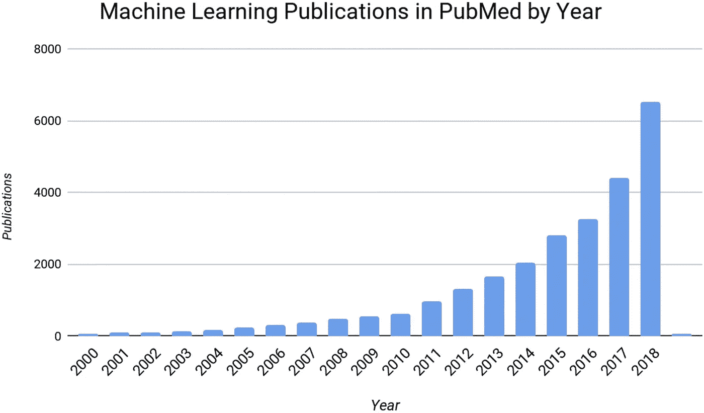
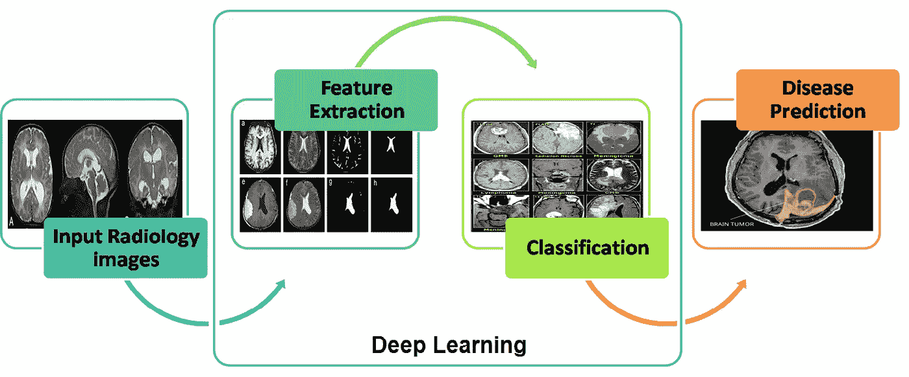
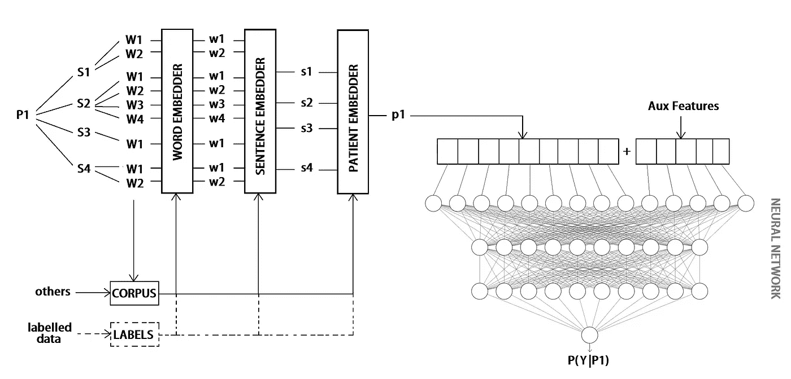
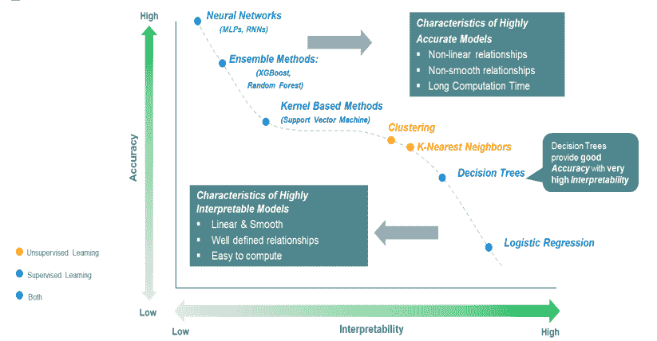
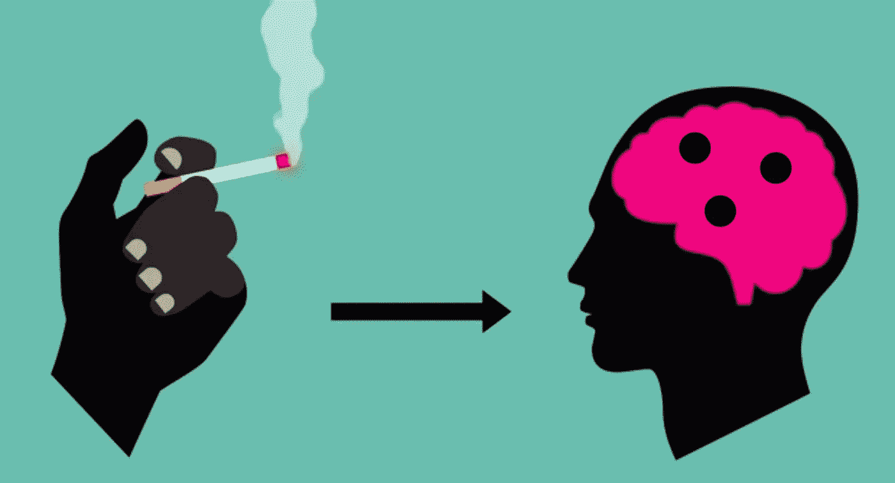

# 深度学习和医疗保健:闪光的不一定是金子

> 原文：<https://towardsdatascience.com/deep-learning-in-healthcare-all-the-glitters-aint-gold-4913eec32687?source=collection_archive---------28----------------------->

([莎伦·麦卡琴](https://unsplash.com/@sharonmccutcheon?utm_source=unsplash&utm_medium=referral&utm_content=creditCopyText) / [Unsplash](https://unsplash.com/?utm_source=unsplash&utm_medium=referral&utm_content=creditCopyText) )

## 深度学习和医疗保健之间复杂关系的概述。

# 全部登上人工智能列车

> 虽然这种流行趋势对我们这些在这个领域工作的人来说肯定是令人愉快和兴奋的，但它同时也带有危险的因素。信息论确实是一个有价值的工具，并将继续发展[……]，但它肯定不是通信工程师或其他任何人的灵丹妙药。[……]当人们意识到使用一些令人兴奋的词汇，如信息、熵、冗余，并不能解决我们所有的问题时，我们多少有些人为的繁荣很容易在一夜之间崩溃。
> 
> ——克劳德·e·香农《赶时髦》，1956 年

从最早的时候起，**人工智能** (AI) **就经常被过分看好，但却表现不佳**。五十多年后，香农的关注仍然非常及时:只要将'*信息论'*与'*机器学习'*和'*信息、熵、冗余*'与'*深度学习、神经网络、人工智能*'切换，你就会突然被投射到 1950 年到 2020 年。

**如今，** **大家都想*造艾*** *。大型科技公司每年都推出更复杂、资源需求更大的神经网络。资金流动，炒作上升，甚至像医疗保健这样相当保守的分支机构也开始随波逐流，而没有足够担心其影响。*

关于人工智能，**深度学习** (DL) **是这十年来真正的最有价值的技术**，最近在不同的科学领域成为一项真正的增值技术，并作为最接近人类推理的东西而受到关注。

只不过我们还没到那一步。

在此，我们将讨论为什么即使****炒作驱动的深度学习潮流不能也不应该被阻止**，医疗保健提供商也应该更多地关注**谁可能真正受益于这种新方法**。**

****

**跳上深度学习列车的数据科学家([naz mul Hasan Khan/Caters News](https://www.catersnews.com/stories/quirky/jumping-on-the-bandwagon-commuters-take-the-rush-hour-train/))**

# **人工智能和医疗保健:比《暮光之城》更好的爱情故事**

**医学和人工智能之间的关系和人工智能领域本身一样古老。从这个意义上来说，我们可以说艾发现了医疗保健中的第一个，【大】粉碎了它的青春。**

## **早期和第一次分手**

**最早的医学**专家系统**(即由硬编码 if-else 语句组成的计算机化问题解决程序)实际上可以追溯到 1960 年初。正如每个青少年的爱情故事一样，最初的时刻令人难忘，热情也达到了顶峰，但事情很快开始变得有点复杂:由于**硬件限制**，缺乏基础，以及来自学术界和新闻界的大量悲观情绪**，医疗保健——以及其他许多科学分支——对人工智能及其应用逐渐失去了兴趣。第一次分手是在空气中。****

## **恢复**

**所谓的*艾冬*一直持续到 1990 年。与此同时，研究人员专注于如何利用**专家知识**实现基于**演绎学习**的患者护理临床建议。也是在这几年，朱迪亚·珀尔和理查德·尤金·那不勒斯提出了贝叶斯网络的想法，这是最有魅力的统计模型之一，开创了临床推理，即使在它诞生 45 年后仍然有很多话要说。
贝叶斯分类器和贝叶斯理论很快成为一种成熟的实践，与古老的**回归模型相结合**，在至少二十年的时间里，在医学研究的许多领域带来了巨大的进步。然后**互联网**发生了。**

## **复合了**

**从 90 年代中期开始，随着计算机硬件和计算能力的显著提高，收集的数据量开始呈指数级增长。十年后，随着 EHRs(电子健康记录)的普及，医疗领域也开始有大量的数据可用。很快，医疗保健研究人员开始从知识驱动的方法转向数据驱动的方法:浪漫又开始了。**

****

**近二十年在 PubMed 发表的 ML 论文[ [Valliani et al. 2019](https://link.springer.com/article/10.1007/s40120-019-00153-8) ]**

## **直到数据把我们分开**

**快进到 2010 年代和**大数据**革命，一种“新的”奇特的人工智能技术以其令人印象深刻的成就震撼了科学界。**深度学习**算法开始一个接一个地打破记录，逐渐将各种口味的**人工神经网络** (ANNs)作为最先进的技术应用在**自然语言处理**、**计算机视觉**和**语音识别**等领域，导致**医学成像**也取得了重要进展。**

****

**医疗保健中数据和深度学习的指数级增长[ [方等 2016](https://www.semanticscholar.org/paper/Computational-Health-Informatics-in-the-Big-Data-A-Fang-Pouyanfar/92066c26f5c618b58a854b7bd3185b3addc00021) (R)、[比尔斯等 2018](https://www.researchgate.net/publication/327033158_DeepNeuro_an_open-source_deep_learning_toolbox_for_neuroimaging) (L)]**

# **深度学习的两个方面**

## **为什么大家都爱深度学习？**

**与传统的机器学习(ML)算法相反，**深度学习由海量数据推动，需要配备强大 GPU 的高端机器在合理的时间框架内运行**。这两个要求都很昂贵，那么为什么公司和研究实验室认为果汁值得压榨呢？**

****在传统的机器学习技术中，大多数应用的** **特征需要由领域专家**来识别，以降低数据的复杂性，并使模式对学习算法的工作更加可见。**深度学习**算法最大的优势是尝试自己从数据中学习高级特征。这在理论上**消除了对领域专业知识和核心特征提取的需求**。**

****

**放射学中*模式分类的一个例子。*与传统的 ML 算法相反，DL 框架将琐碎的特征提取步骤封装在学习过程本身中。([艾时代杂志](https://www.aitimejournal.com/@asha.s/dominance-of-ai-in-healthcare))**

**在需要**高度自动化**但**缺乏对特征工程**领域理解的复杂问题中(例如图像分类、自然语言处理、机器人技术)**深度学习**技术正在飞速发展，达到前所未有的精确度水平。**

## **深度学习在医疗保健中的应用**

**通过处理来自各种来源的大量数据，如放射图像、基因组数据和电子健康记录，**深度学习可以帮助医生分析信息和检测多种情况**，试图解决许多必要的医疗保健问题，如降低误诊率和预测手术结果。以下是深度学习目前正在展示的一些知名医疗领域:**

*   **【肿瘤检测】:卷积神经网络(CNN)的采用显著提高了癌症的早期检测，在筛查乳腺钼靶摄影中的乳腺癌检测等问题上达到了非常高的准确率[ [沈等 2019](https://www.nature.com/articles/s41598-019-48995-4) ]。在该领域，当在诊断成像研究中识别重要特征时，DL 算法正在接近甚至超过人类诊断医生的准确性[ [Haenssle et al. 2018](https://academic.oup.com/annonc/article/29/8/1836/5004443#116979586) ]。**
*   ****医院再入院、住院时间和住院死亡率预测** : DL-powered 算法可以访问每个患者的数万个预测值，包括自由文本注释，并自动识别哪些数据对特定预测很重要，而无需手动选择专家认为重要的变量 [Rajkomar 等人 2018](https://www.nature.com/articles/s41746-018-0029-1) 。**
*   ****药物发现和精准医疗**:一种新药的发现总是被学术界和普通大众的兴奋所包围，但药物开发周期非常缓慢且昂贵，只有不到 10%进入市场。DL 可用于自动产生指纹和更有效的特征或用于从头药物设计，降低过程成本[ [徐等 2018](https://www.tandfonline.com/doi/abs/10.1080/17460441.2018.1547278?journalCode=iedc20) ]。**
*   ****自然语言处理**:电子病历在世界各地医疗中心的引入为医疗服务提供者打开了一个新的信息来源:自由文本。**从非结构化数据中提取有用的可操作信息**有助于医疗保健的许多方面，如摘要、自动报告、问题回答，当然还有决策。然而，**的临床文本** **往往支离破碎，** **不合语法，电报式**并且大量使用**首字母缩写**和**缩写**，这甚至能难倒最聪明的 NLP 算法。**

**然而——如题——**即使是深度学习，也不是所有闪光的都是金子**。数据科学家一直在上述所有应用中投入大量精力，但其中一些应用暴露出在实际用例场景中难以克服的局限性，迫使基于 DL 的方法停留在仅供研究的隔离区。但是，为什么这些方法在某些领域表现出色，而在另一些领域却举步维艰呢？**为什么我们努力在真实用例场景中取得重大进展？****

**在这里，我们将重点关注医疗保健中深度学习的两个最重要的概念问题。**

****

## **深度学习和医疗保健问题:可解释性和因果关系**

**应对医疗保健意味着应对人们的生活。这意味着细心、自信、透明、谨慎、敏感和**解释为什么以及如何得出某种诊断的能力。同样，我们希望在内科医生和外科医生身上找到这些品质，我们也应该在我们的算法中寻找它们。这就是深度学习显示其局限性的地方。****

**让我们以自然语言处理为例。如今，医疗保健领域中由人类生成的书面/口头数据量非常庞大。据估计,**近 80%的医疗保健数据在创建后仍处于非结构化和未开发状态**。临床记录可能是医疗保健中最被忽视的输入，发生这种情况不是因为它们不提供信息，而是因为很难处理这种类型的数据。
我们已经提到了利用这种信息如何能够显著提高模型的准确性，但是**性能才是最重要的吗**？**

**在医疗保健中，一种非常流行的处理文本进行预测的方法是使用**单词嵌入**，这是一种由各种类型的神经网络驱动的多维、密集、数字表示的单词。
患者的临床记录可以以不同的方式组合，检索**文档嵌入**或**患者嵌入**。由于我们现在处理的是数字向量而不是文本，我们可以简单地将它们输入我们最喜欢的分类算法。**

****

**患者嵌入管道的示例:收集患者 P1 的临床笔记句子 S，并将其分解为单词 W。然后使用深度学习将这些单词 W 转换为数字向量 W，然后将这些向量组合两次以检索患者嵌入 p，这些嵌入 p 也是向量。这种嵌入现在可以成为我们想要的每个分类算法的输入的一部分。**

**让我们假设现在我们开发了一个癌症早期检测模型，当我们通过 300 维患者嵌入包括非结构化数据时，它看到了惊人的 30%的准确性提升。我们合理地猜测**我们的模型正在使用临床记录** **中的一些非常相关的信息来评估患者的状况**。**

**但是 ***这是什么*** 相关信息？**

**正如我们所说，嵌入只是密集的数字向量。**使用深度学习将单词转换为向量，并将它们合并在一起，完全打乱了桌子上的卡片，使得无法猜测负责患者分类的单词/句子的组合。**
注意机制和系数只能告诉我们哪些****成分**与预测结果最相关，但是由于**我们失去了单词和嵌入**成分**之间的联系，我们无法真正理解** ***为什么*这些成分如此重要**。****

****

**准确性与可解释性的权衡([数据科学忍者](http://datascienceninja.com/2019/07/01/the-balance-accuracy-vs-interpretability/))**

**即使模型达到了更好的精确度，我们也不能仅仅因为组件#217 这样说就诊断出一种疾病。使用降维是好的，但是如果我们需要理解决策的来源并在一个更大的(人类)知识框架内评估它，我们必须能够还原这个过程。
这就引出了**因果关系问题**。**

****

**因果([哈佛大学](https://online-learning.harvard.edu/course/causal-diagrams-draw-your-assumptions-your-conclusions))**

**人工智能先驱 Yoshua Bengio 因对深度学习的发展做出的贡献而获得图灵奖，他最近表示 **DL 必须学习更多关于因果关系的知识**才能实现其全部潜力。
换句话说，他说，**深度学习需要开始问*为什么*事情会发生**。**

****深度学习从根本上是盲目的因果**。**与真正的医生不同，深度学习算法无法解释为什么特定的图像或临床记录可能暗示疾病**。理解因果关系，特别是在医疗保健领域，将使现有的人工智能系统更加智能和高效:一个深入了解因果关系的机器人可以**制定假设，想象场景，并学习如何在它们实际发生之前解决它们**。**

****这种心态是人类天性所特有的**，认知科学实验表明，理解因果关系是人类发展和智力的基础，尽管我们仍然不清楚我们是如何形成这种知识的。**另一方面，深度学习算法**，**不太擅长概括**，无法将它们从一个上下文学到的东西应用到另一个上下文。这在医学上是非常有限的，因为每一项诊断和预后任务都是基于一个非常复杂的因果联系网络。**

****

**在机器人的肩膀上([Newsparent.com](https://newsparent.com/global-ai-in-healthcare-market/))**

# **结论**

## **目前为止我们得到了什么**

****深度学习** **在过去十年里已经成为游戏规则的改变者**，我们已经看到了它可以在医疗领域实现的许多方式。然而，我们必须指出，当我们处理涉及患者生命的非常复杂和微妙的情况时，它的阴暗和狭隘的性质是一个问题。如果我们不能解开它以理解它得到结论的方式，那么拥有一个极其精确的模式识别工具在临床决策中是无用的。**

**这就是为什么**简单的线性回归仍然在许多真实的医疗用例场景中战胜复杂的神经网络**。我们不能相信无法完全解释的伪**黑箱**，同样，如果因果关系是该学科的基石，我们也不能依赖能够掌握相关性但不能掌握因果关系的高度特定的模型。**

## **未来会怎样**

**加里·马库斯在他的新书《重塑人工智能》的后记中写道:**

> **“由深度理解驱动的人工智能将是第一个能够像孩子一样学习的人工智能，容易、强大、不断扩展其对世界的知识，通常只需要一两个新概念或新情况的例子，就可以创建一个有效的模型。”**

**这可以说是我们应该指出的下一个重大成就，但这并不容易。创造一种超越人类水平的智能远比我们被引导去相信的要复杂得多。这个世界是复杂和开放的，我们今天拥有的高度专业化的狭窄机器还不能完全被信任来完成这种复杂性得到充分展示的任务，如个性化医疗。**

# **参考资料和进一步讲座**

**在这里，你可以找到我的主要资料来源，以及一些非常有趣的阅读材料，如果你有兴趣深入挖掘深度学习和医疗保健之间的复杂关系，我建议你看一看。**

*   **[学习理清因果机制的元转移目标，Bengio 等人，2019](https://arxiv.org/abs/1901.10912)**
*   **[人工智能先驱希望他的算法能够理解“为什么”](https://www.wired.com/story/ai-pioneer-algorithms-understand-why/)**
*   **[人类兼容——斯图尔特·罗素](https://www.penguinrandomhouse.com/books/566677/human-compatible-by-stuart-russell/)**
*   **[重启人工智能——加里·马库斯和欧内斯特·戴维斯](https://www.penguinrandomhouse.com/books/603982/rebooting-ai-by-gary-marcus-and-ernest-davis/)**
*   **[因果关系——朱迪亚珍珠](https://www.cambridge.org/core/books/causality/B0046844FAE10CBF274D4ACBDAEB5F5B)**
*   **[平衡:准确性与可解释性](http://datascienceninja.com/2019/07/01/the-balance-accuracy-vs-interpretability/)**

**希望这篇博客文章能够给你一个关于在医学中使用深度学习的许多含义的概述。如果你觉得有帮助，请在评论区留下你的想法并分享！**

** [## Tommaso Buonocore -作者-走向数据科学| LinkedIn

### 查看世界上最大的职业社区 LinkedIn 上 Tommaso Buonocore 的个人资料。托马索列出了 5 项工作…

www.linkedin.com](https://www.linkedin.com/in/tbuonocore/)**