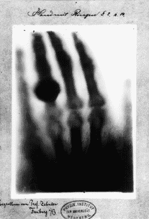
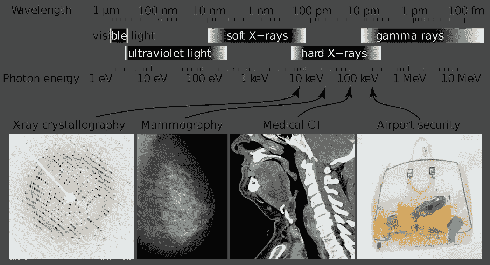
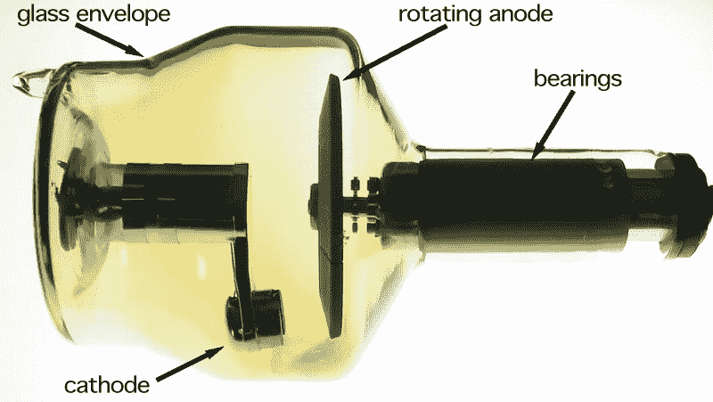
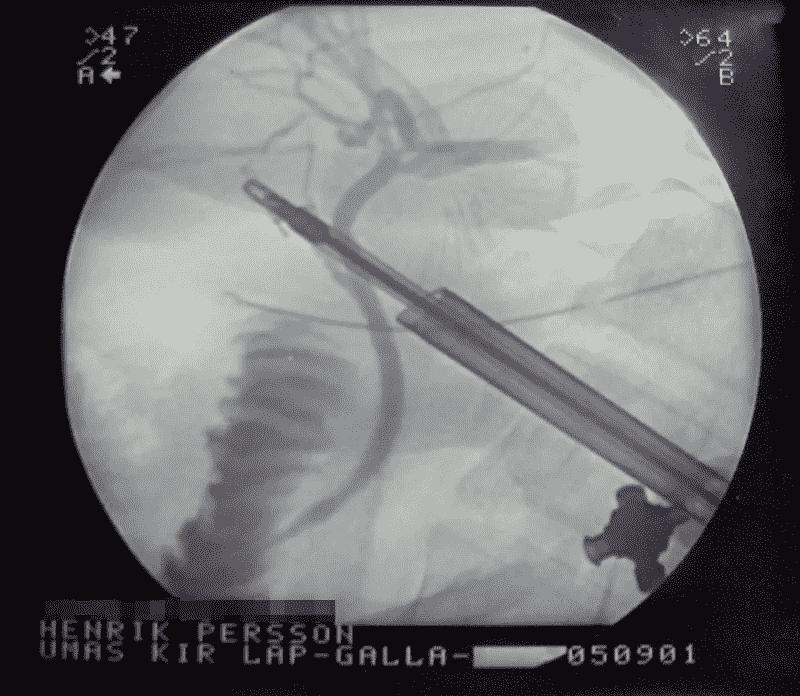
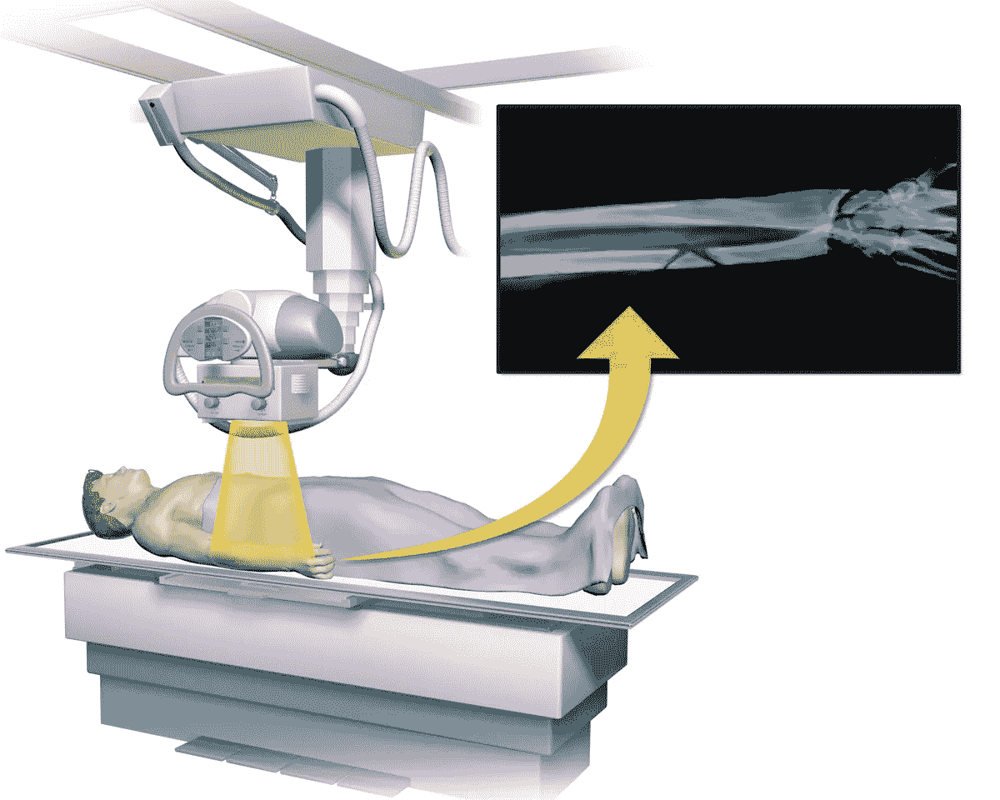
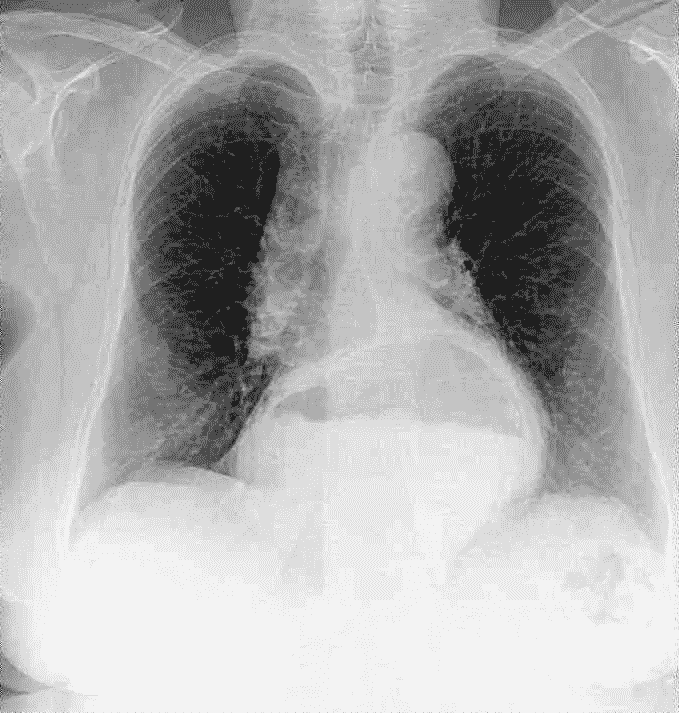

# 医疗保健中的深度学习— X 射线成像(第 1 部分—X 射线的基础知识)

> 原文：<https://towardsdatascience.com/deep-learning-in-healthcare-x-ray-imaging-part-1-basics-of-x-rays-f8e6bad1e421?source=collection_archive---------67----------------------->

## *这是关于深度学习使用的系列文章的第 1 部分，重点是 X 射线成像(胸部 X 射线)。在这里，我们将讨论 X 射线的基础知识，从它的历史，工作原理到成像。*

x 射线成像是最古老的医学成像方法之一，也是最流行的医学成像方法之一。x 光是拯救生命的技术，实际上是偶然发明的。德国物理学家威廉·伦琴在气体放电管中进行电子束实验时发现了这项技术。在做这个实验时，他注意到当电子束运行时，他实验室的荧光屏开始发绿光。现在，这并不是一个不寻常的现象，但是伦琴的屏幕被厚纸板挡住了，他认为厚纸板可以阻挡辐射。他的发现有趣的一面是，他发现这是某种穿透性的辐射，但不能确切地指出它实际上是什么。

当一只手放在光束前面时，神奇的事情发生了，它在屏幕上产生了骨头的图像。这一突破使得 X 射线在发现后立即得到了完美的应用。这一双重发现(X 射线及其应用)标志着人类历史上医学成像领域最大的发现之一。

它让专业人员有机会在不需要任何侵入性手术的情况下观察人体内部的疾病。它甚至允许他们看到轻微修改的软组织。

图一。第一张 x 光照片(威廉·伦琴。— [1]，公共领域，【https://commons.wikimedia.org/w/index.php?curid=5059748】

# 那么什么是 X 射线呢？

你可以把 X 射线想象成光线。两者都是光子以波的形式携带的电磁能量。这两种波的主要区别是射线的能级或波长。我们人类有能力感知可见光波长的光线。但是越来越长的波长不在我们的可见光谱范围内。x 射线是更短更高能量的波。

图二。光谱(作者 Ulflund——该图是维基共享资源不同图片的汇编。上面的图是我自己做的，最初是作为我自己的作品上传的。结晶学图像来自文件:Lysozym diffraction.png，用户:Del45。乳房 x 线照片来自 Nevit Dilmen 的 40F MLO DMMG.png 文件。CT 图像来自文件:Ct-workstation-neck.jpg，作者:ChumpusRex。行李扫描仪图像来自文件:用户在 VTBS.JPG 行李检查用户:Mattes。、CC BY-SA 3.0、【https://commons.wikimedia.org/w/index.php?curid=22545004】T4

# X 射线是如何工作的？

x 射线是由原子内电子的运动产生的。给定 X 射线的具体能级取决于原子中电子在轨道间下落的距离。

当任何给定的光子与另一个原子碰撞时，原子可以吸收光子的能量，并将电子提升到更高的水平。在这种情况下，光子的能量必须与两个电子之间的能量差相匹配。如果这没有发生，那么光子就不能引起轨道之间的移动。

这意味着当 X 射线的光子穿过身体时，每个组织的原子对光子的吸收或反应是不同的。软组织由更小的原子组成，因此由于光子的高能量，它们不能很好地吸收 X 射线。

另一方面，骨骼中的钙原子要大得多，因此它们会吸收 X 射线光子，从而导致 X 射线图像上的不同视图。

# 在 x 光机内:

图 3。在 x 光机里(作者丹尼尔·w·里奇——自己的作品，CC BY-SA 3.0，[https://commons.wikimedia.org/w/index.php?curid=16622562](https://commons.wikimedia.org/w/index.php?curid=16622562))

在 x 光机内部，有一对电极，一个阴极和一个阳极。该仪器被放置在通常由玻璃制成的真空管内。阴极通常是加热的灯丝，阳极是由钨制成的平圆盘。当阴极被加热时，在高电位差下，电子从阴极喷出并向阳极移动。由于电极对上的高电压，电子以极高的速度向阳极移动。电子最终撞击阳极的钨原子，并撞击原子较低轨道中的松散电子。随着电子从较高的轨道落到这些较低的能级，额外的能量以光子或 X 射线的形式释放出来。X 射线就是这样产生的。

但是在需要检查软组织的情况下，需要添加造影剂。造影剂通常是对 X 射线不透明并聚集在软组织中的液体。为了检查血管，医生将这种介质注入静脉。通常这些图像是用荧光显微镜实时观察的。

图 4。胆囊切除术中观察软组织(由 HenrikP 医用 x 射线(荧光镜)，公共领域，【https://commons.wikimedia.org/w/index.php?curid=318366)

# x 射线成像:

为了从 x 光机获得图像，医生在病人的另一侧使用胶片或传感器。当 X 射线穿过人体时，它们会与沿途的许多原子相互作用。最终记录在胶片或探测器上的是所有这些相互作用的总和。

图 5。x 射线成像(BruceBlaus —自己的作品，CC BY-SA 4.0，[https://commons.wikimedia.org/w/index.php?curid=44921292](https://commons.wikimedia.org/w/index.php?curid=44921292))

图 6。胸部 x 光片(作者 Diego Grez—radio grafía _ lupules _ Francis ca _ lor ca . jpg，抄送 BY-SA 3.0，【https://commons.wikimedia.org/w/index.php?curid=10302947】T2

参考资料:

1.  [《x 光片》](https://science.nasa.gov/ems/11_xrays)。科学任务理事会。 [NASA](https://en.wikipedia.org/wiki/NASA) 。
2.  罗伯特·诺韦林(1997)。*斯夸尔放射学基础*。哈佛大学出版社。第五版。[国际标准书号](https://en.wikipedia.org/wiki/ISBN_(identifier))0–674–83339–2。
3.  **[【x 光】](http://oed.com/search?searchType=dictionary&q=X-ray)。 [*牛津英语词典*](https://en.wikipedia.org/wiki/Oxford_English_Dictionary) (第 3 版。).牛津大学出版社。2005 年 9 月。**