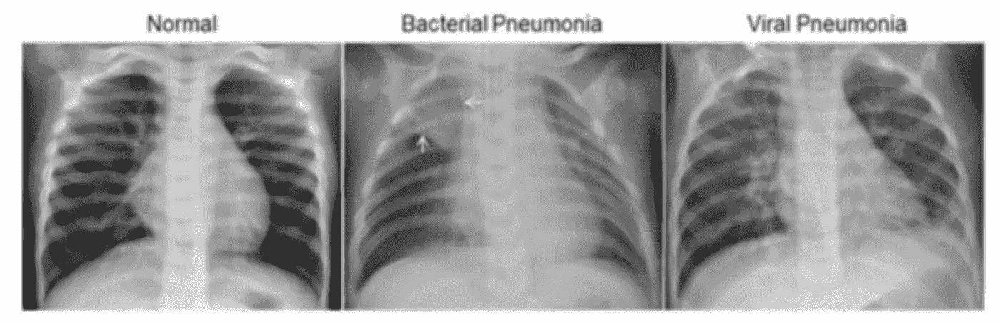
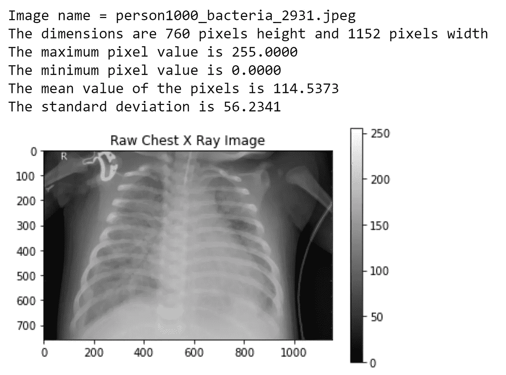
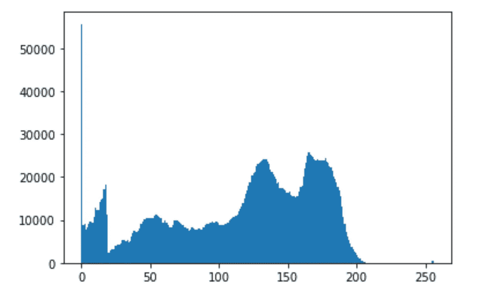
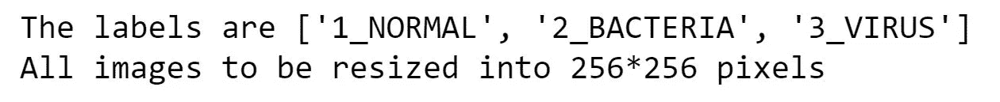
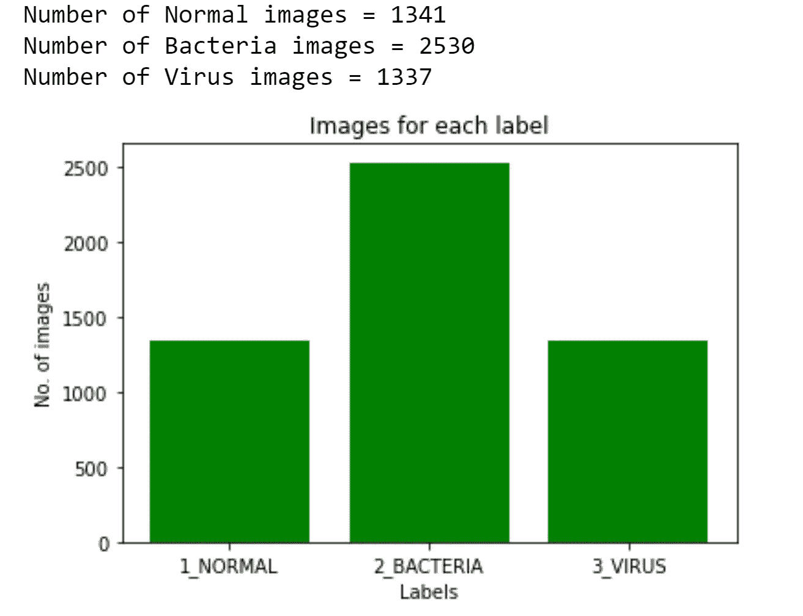
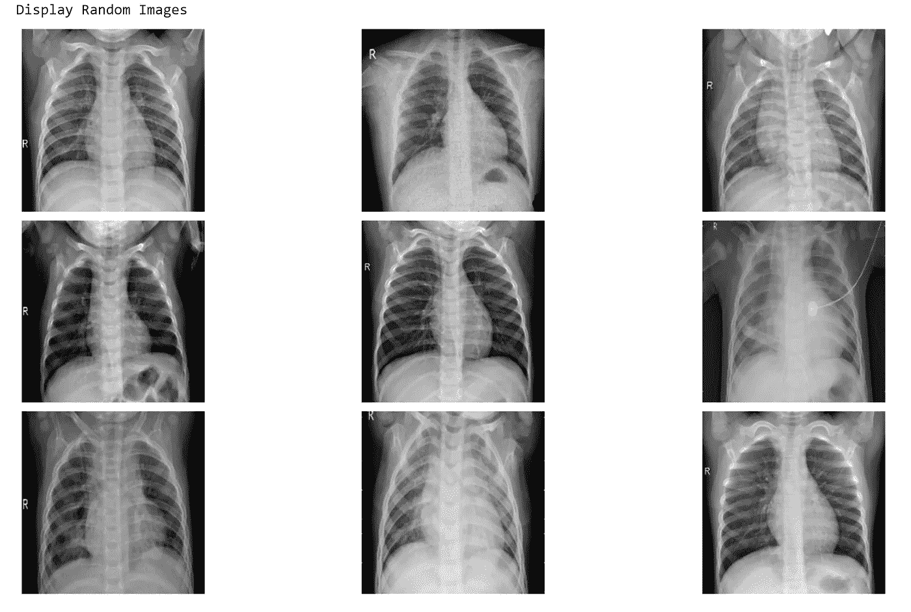

# 医疗保健中的深度学习— X 射线成像(第 3 部分—使用 Python 分析图像)

> 原文：<https://towardsdatascience.com/deep-learning-in-healthcare-x-ray-imaging-part-3-analyzing-images-using-python-915a98fbf14c?source=collection_archive---------26----------------------->

## 这是深度学习在 X 射线成像上的应用的第 3 部分。这里的重点是使用 Python 查看和分析 X 射线图像。

既然我们已经了解了未经培训的专业人员解读 X 射线图像有多么困难，那么让我们来看看一些查看和分析图像及其直方图的技术，以及一种使用 Python 编程将图像和标签相加的技术。

## 图像数据集:

图像数据集(胸部 x 光片)从 Kaggle 获得。数据集可通过以下链接获得—[https://www . ka ggle . com/paultimothymooney/chest-x ray-pneumonia/data](https://www.kaggle.com/paultimothymooney/chest-xray-pneumonia/data)



图一。不同肺炎情况下的胸部 x 光检查(资料来源- Kaggle 公共数据集，详情见参考文献 1)

> 关于数据集—直接引用自 Kaggle challenge —数据集分为 3 个文件夹(train、test、val ),并包含每个图像类别(肺炎/正常)的子文件夹。有 5，863 个 x 光图像(JPEG)和 2 个类别(肺炎/正常)。胸部 X 线图像(前-后)选自广州市妇女儿童医疗中心 1-5 岁的儿童患者的回顾性队列。所有的胸部 x 光成像都是作为患者常规临床护理的一部分进行的。对于胸部 x 射线图像的分析，最初通过去除所有低质量或不可读的扫描对所有胸部射线照片进行质量控制筛选。图像的诊断然后由两名专家医生进行评级，然后被批准用于训练人工智能系统。为了解决任何评分错误，评估集也由第三方专家检查。

正如内容中明确指出的那样，挑战中共有 5863 幅图像可用，这些图像被分为肺炎和正常两类，并进一步分为训练/测试和验证集。为了使挑战更加困难，我们将数据分为三类，正常、细菌性肺炎和病毒性肺炎。在这一部分中，我们将只关注图像——用 python 加载它们，从医学成像的角度分析图像的各个重要方面，并将图像和标签一起加载。让我们直入主题吧。

## 导入必要的库

```
*#importing all the necessary libraries*

**import** **numpy** **as** **np**                     
**import** **matplotlib.pyplot** **as** **plt**
**import** **os**
**import** **cv2** **as** **cv**
**import** **random**
```

Numpy — Numpy 是 Python 中最常用的库之一。它用于对多维数组和矩阵进行运算，并执行高级数学函数来对这些数组进行运算。

matplotlib——用于在 python 中创建静态和动态可视化的库。

OS——python 内置的一个模块。它提供了与操作系统交互的功能。

cv2 — OpenCV(开源计算机视觉库)—一个非常重要的库，主要用于计算机视觉。其他类似的库有 SimpleITK 和 Pillow (Python 图像库)。

random —生成伪随机数的模块。

## 研究数据集中的单个图像:

```
*#load a single image from the bacteria folder*

**def** load_image(path):
    **for** img **in** os.listdir(bacteria_path):
        print('Image name =',img)
        image = cv.imread(os.path.join(bacteria_path, img))
        **break**

    **return** image
```

如前所述，数据集中的图像被分成三类。1-正常，2-细菌(细菌性肺炎)，3-病毒(病毒性肺炎)。

上面的代码片段创建了一个函数 load_image，它将用于从训练集的细菌文件夹中加载一个图像。os.listdir 用于列出该目录中的所有文件。在这种情况下，它可以用来访问细菌文件夹中的所有图像。接下来，它将打印图像的名称。最后，使用 OpenCV 库读取图像。

Break-在这里是必要的，这样只访问第一个图像，否则函数将遍历细菌文件夹中的所有图像。

```
*# Investigate a single image*

bacteria_path = 'H:/All Files/Kaggle/chest_xray/train/2_BACTERIA/'

image = load_image(bacteria_path)
plt.imshow(image, cmap='gray')
plt.colorbar()
plt.title('Raw Chest X Ray Image')
print(f"The dimensions are **{image.shape[0]}** pixels height and **{image.shape[1]}** pixels width")
print(f"The maximum pixel value is {image.max():.4f}")
print(f"The minimum pixel value is {image.min():.4f}")
print(f"The mean value of the pixels is {image.mean():.4f}")
print(f"The standard deviation is {image.std():.4f}")
```

输出-



在这个代码片段中，首先定义了图像的路径。然后，通过调用函数 load_image，将文件夹中的第一幅图像加载到变量“image”中。然后使用 matplotlib.imshow 查看图像。之后，打印图像尺寸、灰度栏中的最大像素值和最小像素值。还计算图像像素的平均值和标准偏差。

接下来，我们绘制图像所有像素的直方图。**直方图**是用不同高度的条来显示数据的图形。

```
# plot a histogramplt.hist(image.ravel(),256,[0,256]) 
plt.show()
```

输出-



Matplotlib.hist 用于绘制直方图。由于图像大部分是暗的，我们在灰度条的零位置上看到一个巨大的像素簇。

这些是可以使用 OpenCV 和 matplotlib 在图像上执行的一些基本功能。我们将在后面的部分看到 OpenCV 的更多用途。

## 一起加载图像和标签并调整图像大小

```
*# loading the path of the train images*

path = 'H:/All Files/Kaggle/chest_xray/train/'
train = os.listdir(path)
```

定义了训练集的路径，路径下的目录保存在‘train’中。在这种情况下，有三个文件夹，1_Normal、2_Bacteria 和 3_Virus。

```
folders=[]
folders = [f **for** f **in** sorted(os.listdir(path))]
print(folders)
```

输出-

[' 1 _ 正常'，' 2 _ 细菌'，' 3 _ 病毒']

我们创建一个空列表——文件夹。然后，使用 os.listdir 遍历路径，将文件夹名排序并存储在列表中——“folders”。

```
labels = folders
print (f'The labels are **{labels}**')

*# setting the size of images that we want*

image_size = 256
print(f'All images to be resized into **{image_size}*****{image_size}** pixels')
```

输出-



文件夹名称被设置为图像的标签，并且图像尺寸被选择为 256*256。也就是说，所有图像的大小都将调整为 256*256。如果我们浏览数据集，我们会看到所有的图像都有不同的维度，为了将图像输入到卷积神经网络(CNN)中，有必要将图像调整到相同的维度。

```
*# defining a function to load images and labels together*
*# this function will also resize the images*

**def** load_train(path):

    images = []

    **for** label **in** labels:
        direc = os.path.join(path, label)
        class_num = labels.index(label)

        **for** image **in** os.listdir(direc):
            image_read = cv.imread(os.path.join(direc,image),cv.IMREAD_GRAYSCALE)
            image_resized = cv.resize(image_read,(image_size,image_size))
            images.append([image_resized,class_num])

    **return** np.array(images)
```

这里我们定义了一个函数，根据标签名称加载所有图像，将它们的大小调整为 256*256 像素，并返回图像数组。

创建一个空列表来保存所有图像。然后运行“for”循环，从所有三个文件夹中提取所有图像。os.path.join 用于合并目录中的路径。简历。im read _ gray 将所有图像转换为灰度格式。cv.resize 用于将图像大小调整为 256*256 像素。。“append”用于将所有图像追加到一个列表中，该列表最终被转换为一个数组并使用 return 语句返回。

```
*#load all the training images to train_images*

train_images = load_train(path)

print(f'Shape of the training images = **{train_images.shape}**')
```

训练图像的输出形状= (5208，2)

然后调用函数“load_train ”,所有训练图像都作为数组保存在 train_images 中。训练图像的形状为(5208，2)

```
*#loading the images and labels seperately in X and y, to be used later for training*X = []
y = []

**for** feature, label **in** train_images:
    X.append(feature)
    y.append(label)

print (f'Length of X = {len(X)}')
print (f'Length of y = {len(y)}')
```

输出-


为了训练神经网络，需要分离图像和标签，并且通过在 train_images 上循环，并且通过提取图像和它们相应的标签来完成。

```
*# checking the number of images of each class*

a = 0
b = 0
c = 0

**for** label **in** y:
    **if** label == 0:
        a += 1
    **if** label == 1:
        b += 1
    **if** label == 2:
        c += 1

print (f'Number of Normal images = **{a}**')
print (f'Number of Bacteria images = **{b}**')
print (f'Number of Virus images = **{c}**')

*# plotting the data*

x_pos = [i **for** i, _ **in** enumerate(labels)]
numbers = [a,b,c]
plt.bar(x_pos,numbers,color = 'green')
plt.xlabel("Labels")
plt.ylabel("No. of images")
plt.title("Images for each label")

plt.xticks(x_pos, labels)

plt.show()
```

输出-



为了检查每个类中的图像数量，运行了一个 for 循环。然后使用用于创建条形图的 matplotlib.bar 绘制结果。

从数据中可以清楚地看出，属于每个标签的图像数量有很大的差异。如果用这些数量的图像训练网络，它可能会偏向具有最多标签的类。这就是所谓的阶级不平衡问题。因此，每个类有相似数量的图像是必要的，我们将在下一部分讨论这一点。

```
*# Displays images* 
*# Extract 9 random images*
print('Display Random Images')

*# Adjust the size of your images*
plt.figure(figsize=(20,10))

**for** i **in** range(9):
    num = random.randint(0,len(X)-1)
    plt.subplot(3, 3, i + 1)

    plt.imshow(X[num],cmap='gray')
    plt.axis('off')

*# Adjust subplot parameters to give specified padding*
plt.tight_layout()
```



最后，我们使用随机模块从训练集中生成九幅随机图像，然后使用 matplotlib 绘制这些图像。

这是这部分的结尾。正如我们所见，对于医学成像分析来说，正确理解数据集是非常重要的，在本例中是 X 射线图像。在下一部分中，我们将使用 matplotlib 和 OpenCV 处理类不平衡问题和更多操作。

参考资料:

1.  从丹尼尔-克马尼获得的数据集；张、康；Goldbaum，Michael (2018)，“用于分类的标记光学相干断层扫描(OCT)和胸部 X 射线图像”，Mendeley Data，v2 http://dx . doi . org/10.17632/rscb jbr 9 SJ。
2.  通过基于图像的深度学习识别医学诊断和可治疗的疾病- (2018)，作者:Daniel S. Kermany，Michael Goldbaum，Cai，Carolina C.S. Valentim，Huiying Liang，Sally L. Baxter，Alex McKeown，Ge Yang，Xiaokang Wu，Yan，Justin Dong，Made K. Prasadha，Jacqueline Pei，Magdalene Y.L. Ting，，Christina Li，Sierra Hewett 等，出版物:Cell Publisher。