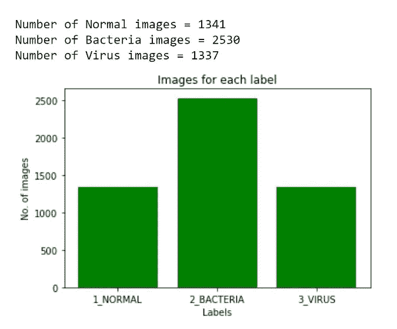
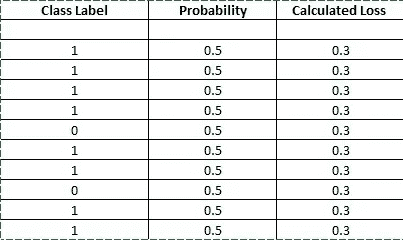
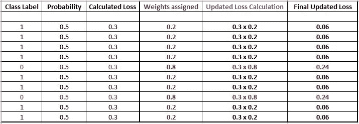
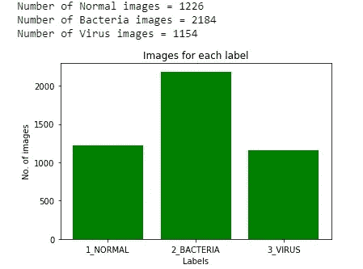
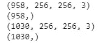
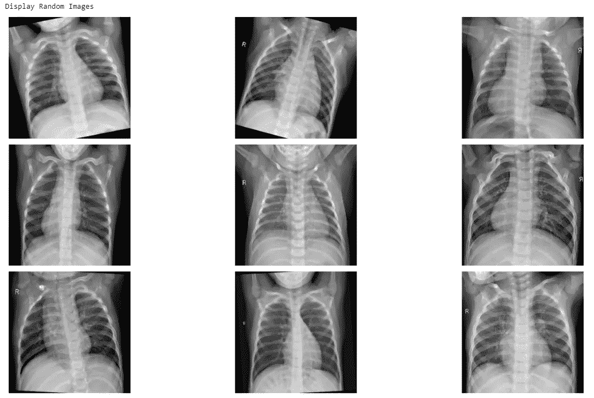
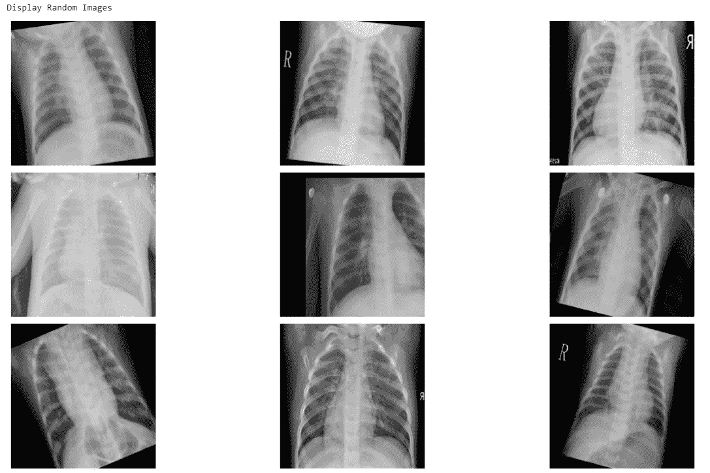
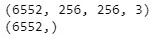
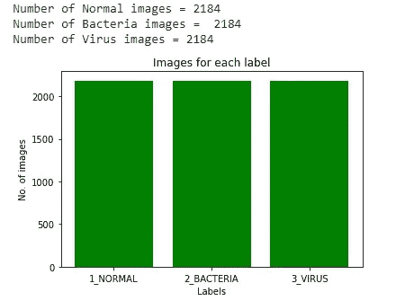

# 医疗保健中的深度学习——X 射线成像(第 4 部分——类别失衡问题)

> 原文：<https://towardsdatascience.com/deep-learning-in-healthcare-x-ray-imaging-part-4-the-class-imbalance-problem-364eff4d47bb?source=collection_archive---------22----------------------->

## 这是深度学习在 X 射线成像上的应用的第 4 部分。这里的重点是解决阶级不平衡问题的各种方法。

正如我们在上一部分—第三部分—([https://towards data science . com/deep-learning-in-health care-x-ray-imaging-Part-3-analyzing-images-using-python-915 a 98 fbf 14 c](/deep-learning-in-healthcare-x-ray-imaging-part-3-analyzing-images-using-python-915a98fbf14c))中看到的，胸部 x 光数据集存在图像的不平衡。这是我们在上一部分看到的每个类的图像的条形图。



图一。各个阶层形象的不平衡(作者图片)

在医学成像数据集中，这是一个非常常见的问题。由于大多数情况下，数据是从各种不同的来源收集的，并且不是所有的疾病都像其他疾病一样流行，所以数据集往往是不平衡的。

那么，如果我们在不平衡的数据集上训练神经网络，会出现什么问题呢？答案是，与图像较少的班级相比，网络倾向于从图像较多的班级学到更多东西。也就是说，在这种情况下，该模型可能预测更多的图像是“细菌性肺炎”，即使这些图像可能来自其他两个类别，这在处理医学图像时是不期望的结果。

此外，应该注意，在处理医学图像时，模型的最终精度(训练精度或验证精度)不是模型性能所基于的正确参数。因为，即使模型在特定类别上表现不佳，但是在具有最大图像的类别上表现良好，准确度仍然会很高。实际上，我们希望模型在所有的类中都表现良好。因此，还有其他参数，如灵敏度(召回率/真阳性率(TPR))、特异性(真阴性率(TNR))、精确度或阳性预测值(PPV)和 F 值，这些参数应该被考虑来分析训练模型的性能。我们将在后面讨论混淆矩阵的部分详细讨论这些。

还必须维护一组单独的图像，在这些图像上，模型既没有被训练也没有被验证，以便检查模型如何在它以前从未见过的图像上执行。这也是分析模型性能的必修步骤。

## 解决阶级不平衡的各种方法:

有各种各样的方法来解决阶级不平衡的问题。最好的方法是为少数民族阶层收集更多的图像。但是在某些情况下这是不可能的。在这种情况下，通常这三种方法是有益的:a. **加权损失** b. **欠采样** c. **过采样**

我们将详细介绍每种方法:

1.  **更新损失函数—加权损失**

假设我们用的是 ***二元交叉熵损失函数*** 。损失函数看起来像这样-

**L(X，y) = - log P(Y =1 |X)如果 Y =1 和-log P(Y=0 |X)如果 y=0**

这测量分类模型的输出，其输出在 0 和 1 之间。(这个损失函数只有在我们做二元分类问题的时候才起作用。对于多个类别，我们使用分类交叉熵损失或稀疏分类交叉熵损失。我们将在后面的部分讨论基本的损失函数)。

示例-如果图像的标签为 1，并且神经网络算法预测标签为 1 的概率为 0.2。

让我们应用损失函数来计算本例的损失。请注意，我们对标签 1 感兴趣。所以，我们要用损失函数 L 的第一部分，损失 L 是-

L =-log 0.2 = 0.70

这是算法在这个例子中得到的损失。

对于另一个标签为 0 的图像，如果算法预测该图像为标签 0 的概率为 0.7，那么我们使用损失函数的第二部分，但实际上不能直接使用。相反，我们使用不同的方法。我们知道最大概率可以是 1，所以我们计算标签的概率是 1。

在这种情况下，L =-log(1–0.7)=-log(0.3)= 0.52

现在我们来看多个例子，关于阶级不平衡。



图一。阶级不平衡，概率和计算损失(来源:图片由作者创建)

在图 1 中，我们看到总共有 10 个图像，但是其中 8 个属于类标签 1，只有两个属于类标签 0。因此，这是一个典型的阶级不平衡问题。假设所有预测的概率都是 0.5，

标签 1 的损耗 L =-log(0.5)= 0.3，

标签 0 的损耗 L =-log(1–0.5)=-log(0.5)= 0.3

因此，标签 1 的总损耗= 0.3 x 8 = 2.4

而标签 0 的总损耗= 0.3 x 2 = 0.6

因此，损失的大部分来源于标签为 1 的类。因此，与标签为 0 的图像的权重相比，更新权重时的算法更倾向于更新标签为 1 的图像的权重。这并不能产生一个非常好的分类器，这就是**类不平衡问题**。

类别不平衡问题的解决方案是修改损失函数，以**不同地加权 1 和 0 类别**。

w1 是我们分配给标签 1 示例的权重，w0 是分配给标签 0 示例的权重。新的损失函数，

如果 Y =1，L = w1 x -log(Y =1 |X ),并且，

如果 Y=0，L = w0 x -log P(Y=0 |X)

我们希望给予图像较少的类比图像较多的类更多的权重。因此，在这种情况下，我们给 8 个例子中的类 1 的权重为 2/10 = 0.2，给 2 个例子中的类 0 的权重为 8/10 = 0.8。

通常，使用下面的公式计算权重，

w1 =标签为 0 的图像数/图像总数= 2/10

w0 =标签为 1 的图像数量/图像总数= 8/10

下面是使用加权损失的更新损失表。



图二。更新的加权损失(来源:图片由作者创建)

因此，对于新的计算，我们只需将损失与各个类别的权重相乘。如果我们计算总损失，

标签 1 的总损耗= 0.06×8 = 0.48

标签 0 的总损耗= 0.24 x 2 = 0.48

现在这两类都有相同的总损失。因此，即使两个类别具有不同数量的图像，该算法现在也会平等地对待这两个类别，并且分类器会正确地对具有非常少图像的类别的图像进行分类。

**2。缩减采样**

缩减像素采样是从包含最多图像的类中移除图像，以使其与包含较少图像的类具有可比性的过程。

例如，在肺炎分类问题中，我们看到，与 1341 个正常肺炎图像和 1337 个病毒性肺炎图像相比，有 2530 个细菌性肺炎图像。因此，我们可以从细菌性肺炎类中删除大约 1200 幅图像，这样所有类都有相似数量的图像。

这对于具有属于每个类的大量图像的数据集是可能的，并且移除一些图像不会损害神经网络的性能。

**3。过采样**

过采样是将更多图像添加到少数类以使少数类中的图像数量与多数类中的图像数量相似的过程。

这可以通过简单地复制少数类中的图像来实现。直接复制同一个图像两次，会导致网络过载。因此，为了减少过度拟合，我们可以使用一些人工数据增强来为少数民族创建更多的图像。(这也确实会导致一些过度拟合，但这是一种比直接复制原始图像两到三次好得多的技术)

这是我们在肺炎分类任务中使用的技术，网络工作得相当好。

接下来，我们看一下生成人工数据集的 python 代码。

```
**import** **numpy** **as** **np**
**import** **pandas** **as** **pd**
**import** **cv2** **as** **cv**
**import** **matplotlib.pyplot** **as** **plt**
**import** **os**
**import** **random**

**from** **sklearn.model_selection** **import** train_test_split
```

我们之前看过所有的库，除了 sklearn。

sklearn — Scikit-learn(又名sklearn)是一个针对 python 的机器学习库。包含了分类、回归、支持向量机、随机森林等所有著名的机器学习算法。它也是一个非常重要的机器学习数据预处理库。

```
image_size = 256

labels = ['1_NORMAL', '2_BACTERIA','3_VIRUS']

**def** create_training_data(paths):

    images = []

    **for** label **in** labels:
        dir = os.path.join(paths,label)
        class_num = labels.index(label)

        **for** image **in** os.listdir(dir):
            image_read = cv.imread(os.path.join(dir,image))
            image_resized = cv.resize(image_read,(image_size,image_size),cv.IMREAD_GRAYSCALE)
            images.append([image_resized,class_num])

    **return** np.array(images)train = create_training_data('D:/Kaggle datasets/chest_xray_tf/train')X = []
y = []

**for** feature, label **in** train:
    X.append(feature)
    y.append(label)

X= np.array(X)
y = np.array(y)
y = np.expand_dims(y, axis=1)
```

上面的代码调用训练数据集并加载 X 中的图像和 y 中的标签。第 3 部分已经提到了详细信息—([https://towardsdatascience . com/deep-learning-in-health care-X-ray-imaging-Part-3-analyzing-images-using-python-915 a 98 fbf 14 c](/deep-learning-in-healthcare-x-ray-imaging-part-3-analyzing-images-using-python-915a98fbf14c))。

```
X_train, X_test, y_train, y_test = train_test_split(X, y, test_size=0.2,random_state = 32, stratify=y)
```

因为我们只有训练和验证数据，没有测试数据，所以我们使用 sklearn 的 train_test_split 创建测试数据。它用于将整个数据分割成训练和测试图像和标签。我们将整个数据的 20%分配给测试集，因此设置“test_size = 0.2”，random_state 在第一次混洗数据，但在下一次运行时保持它们不变，并用于在每次运行 train_test_split 时不混洗图像，分层在这里很重要，因为数据是不平衡的，因为分层确保在训练和测试集中每个类别的图像有相等的分割。

重要说明—过采样应在训练数据上进行，而不是在测试数据上进行。如果测试数据包含人工生成的图像，我们将看到的分类器结果将不会正确解释网络实际学习了多少。因此，更好的方法是首先拆分训练和测试数据，然后只对训练数据进行过采样。

```
*# checking the number of images of each class*

a = 0
b = 0
c = 0

**for** label **in** y_train:
    **if** label == 0:
        a += 1
    **if** label == 1:
        b += 1
    **if** label == 2:
        c += 1

print (f'Number of Normal images = **{a}**')
print (f'Number of Bacteria images = **{b}**')
print (f'Number of Virus images = **{c}**')

*# plotting the data*

xe = [i **for** i, _ **in** enumerate(labels)]

numbers = [a,b,c]
plt.bar(xe,numbers,color = 'green')
plt.xlabel("Labels")
plt.ylabel("No. of images")
plt.title("Images for each label")

plt.xticks(xe, labels)

plt.show()
```

输出-



所以现在我们看到了。训练集具有 1226 幅正常图像、2184 幅细菌性肺炎图像和 1154 幅病毒性肺炎图像。

```
#check the difference from the majority classdifference_normal = b-a
difference_virus = b-c

print(difference_normal)
print(difference_virus)
```

输出—

958

1030

解决不平衡—

```
**def** rotate_images(image, scale =1.0, h=256, w = 256):

    center = (h/2,w/2)

    angle = random.randint(-25,25)
    M = cv.getRotationMatrix2D(center, angle, scale)
    rotated = cv.warpAffine(image, M, (h,w))
    **return** rotated

**def** flip (image):

    flipped = np.fliplr(image)
    **return** flipped

**def** translation (image):

    x= random.randint(-50,50)
    y = random.randint(-50,50)
    rows,cols,z = image.shape
    M = np.float32([[1,0,x],[0,1,y]])
    translate = cv.warpAffine(image,M,(cols,rows))

    **return** translate

**def** blur (image):

    x = random.randrange(1,5,2)
    blur = cv.GaussianBlur(image,(x,x),cv.BORDER_DEFAULT)
    **return** blur
```

我们将使用 4 种类型的数据扩充方法，使用 OpenCV 库-1。旋转-从-25 度到+25 度任意旋转，2。水平翻转图像，3。平移，x 轴和 y 轴随机设置，4。高斯模糊随机。

有关如何使用 OpenCV 实现数据增强的详细信息，请访问以下链接—[https://opencv.org](https://opencv.org/)

```
**def** apply_aug (image):

    number = random.randint(1,4)

    **if** number == 1:
        image= rotate_images(image, scale =1.0, h=256, w = 256)

    **if** number == 2:
        image= flip(image)

    **if** number ==3:
        image= translation(image)

    **if** number ==4:
        image= blur(image)

    **return** image
```

接下来，我们定义另一个函数，这样所有的扩充都是完全随机应用的。

```
**def** oversample_images (difference_normal,difference_virus, X_train, y_train):

    normal_counter = 0
    virus_counter= 0
    new_normal = []
    new_virus = []
    label_normal = []
    label_virus = []

    **for** i,item **in** enumerate (X_train):

        **if** y_train[i] == 0 **and** normal_counter < difference_normal:

            image = apply_aug(item)

            normal_counter = normal_counter+1
            label = 0

            new_normal.append(image)
            label_normal.append(label)

        **if** y_train[i] == 2 **and** virus_counter < difference_virus:

            image = apply_aug(item)

            virus_counter = virus_counter+1
            label =2

            new_virus.append(image)
            label_virus.append(label)

    new_normal = np.array(new_normal)
    label_normal = np.array(label_normal)
    new_virus= np.array(new_virus)
    label_virus = np.array(label_virus)

    **return** new_normal, label_normal, new_virus, label_virus
```

该功能为正常和病毒性肺炎图像创建所有人工增强图像，直到它们达到与总细菌性肺炎图像的差值。然后，它返回新创建的正常和病毒性肺炎图像和标签。

```
n_images,n_labels,v_images,v_labels =oversample_images(difference_normal,difference_virus,X_train,y_train)print(n_images.shape)
print(n_labels.shape)
print(v_images.shape)
print(v_labels.shape)
```

输出—



我们看到，正如预期的那样，创建了 958 幅正常图像和 1030 幅病毒性肺炎图像。

让我们想象一些人造的正常图像，

```
*# Extract 9 random images*
print('Display Random Images')

*# Adjust the size of your images*
plt.figure(figsize=(20,10))

**for** i **in** range(9):
    num = random.randint(0,len(n_images)-1)
    plt.subplot(3, 3, i + 1)

    plt.imshow(n_images[num],cmap='gray')
    plt.axis('off')

*# Adjust subplot parameters to give specified padding*
plt.tight_layout()
```

输出-



接下来，让我们想象一些人造病毒性肺炎的图像，

```
*# Displays 9 generated viral images* 
*# Extract 9 random images*
print('Display Random Images')

*# Adjust the size of your images*
plt.figure(figsize=(20,10))

**for** i **in** range(9):
    num = random.randint(0,len(v_images)-1)
    plt.subplot(3, 3, i + 1)

    plt.imshow(v_images[num],cmap='gray')
    plt.axis('off')

*# Adjust subplot parameters to give specified padding*
plt.tight_layout()
```

输出-



上面生成的每张图像都有某种程度的增强——旋转、平移、翻转或模糊，所有这些都是随机应用的。

接下来，我们将这些人工图像及其标签与原始训练数据集合并。

```
new_labels = np.append(n_labels,v_labels)
y_new_labels = np.expand_dims(new_labels, axis=1)
x_new_images = np.append(n_images,v_images,axis=0)

X_train1 = np.append(X_train,x_new_images,axis=0)
y_train1 = np.append(y_train,y_new_labels)

print(X_train1.shape)
print(y_train1.shape)
```

输出—



现在，训练数据集有 6552 幅图像。

```
bacteria_new=0
virus_new=0
normal_new =0

**for** i **in** y_train1:

    **if** i==0:
        normal_new = normal_new+1
    **elif** i==1 :
        bacteria_new = bacteria_new+1
    **else**:
        virus_new=virus_new+1    

print ('Number of Normal images =',normal_new)
print ('Number of Bacteria images = ',bacteria_new)
print ('Number of Virus images =',virus_new)

*# plotting the data*

xe = [i **for** i, _ **in** enumerate(labels)]

numbers = [normal_new, bacteria_new, virus_new]
plt.bar(xe,numbers,color = 'green')
plt.xlabel("Labels")
plt.ylabel("No. of images")
plt.title("Images for each label")

plt.xticks(xe, labels)

plt.show()
```

输出—



最后，我们在训练数据集中取得了平衡。我们在所有三个类中有 2184 个图像。

这就是我们解决阶级不平衡问题的方法。请随意尝试其他方法，并与最终结果进行比较。

既然在下一部分中处理了类不平衡问题，我们将研究使用 Keras 和 TensorFlow 的图像规范化和数据增强。