# 医疗保健中的深度学习——X 射线成像(第 5 部分——数据扩充和图像标准化)

> 原文：<https://towardsdatascience.com/deep-learning-in-healthcare-x-ray-imaging-part-5-data-augmentation-and-image-normalization-1ead1c02cfe3?source=collection_archive---------25----------------------->

## 这是深度学习在 X 射线成像上的应用的第 5 部分。这里的重点是实现数据扩充的各种方法。

我们在上一部分—第四部分—[https://towards data science . com/deep-learning-in-health care-x-ray-imaging-Part-4-the-Class-distribution-Problem-364 eff 4d 47 bb](/deep-learning-in-healthcare-x-ray-imaging-part-4-the-class-imbalance-problem-364eff4d47bb)中看到了如何解决**阶层失衡问题**。在本节中，我们将重点关注图像规范化和数据扩充。

在解决了类不平衡问题之后，接下来我们来看看如何提高神经网络的性能并使其更快。在训练数据的三个类中，我们已经有了相似数量的图像— 1。正常(无感染)，2。细菌性肺炎，3。病毒性肺炎。

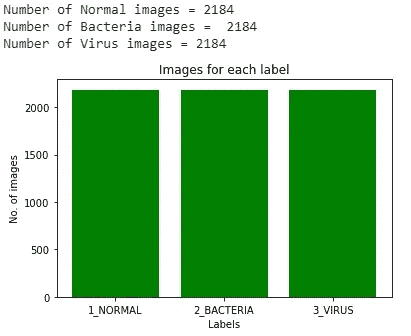

每一类中图片数量的条形图——图片来自第四部分(来源:图片由作者创建)

**图像缩放/归一化:**

当所有特征都在同一尺度上时，神经网络工作得最好。类似地，当特征**以平均值零为中心，标准偏差为 1**时，梯度下降等优化算法工作得非常好，即数据具有标准正态分布的属性。

这可以通过如下所示的几种方式来实现。

案例 1:不推荐

```
scaled_dataset = (dataset - dataset_mean) / dataset_std_deviation

train, test = split(scaled_dataset)
```

整个数据集被缩放，然后分成训练集和测试集。

案例 2:不推荐

```
train, test = split(dataset)

scaled_train =  (train - train_mean) / train_std_deviation

scaled_test = (test - test_mean) / test_std_deviation
```

数据集被分成训练集和测试集，然后分别对训练集和测试集进行缩放。

**案例三:推荐**

```
train, test = split(dataset)scaled_train =  (train - train_mean) / train_std_deviation

scaled_test = (test - train_mean) / train_std_deviation
```

数据集被分成训练集和测试集。然后对训练图像进行缩放。为了缩放测试图像，我们使用训练集的平均值和标准偏差，而不是测试图像的平均值和标准偏差。

使用训练集的均值和标准差来衡量测试集可能看起来很奇怪，但是**案例 3 是遵循**的最佳方法。原因是:

测试数据是模型的“看不见的数据”,我们使用测试数据来检查模型在看不见的数据下的表现，也就是说，它给出了一个很好的估计，即模型是否可以在现实世界中使用。

现在，在真实的场景中，我们可能没有一批测试图像来测试我们的模型，而是只有一个图像。在这种情况下，不可能在单个图像上计算平均值和标准偏差。此外，在多个图像的情况下，知道每批测试数据的平均值将有效地给我们的模型带来优势，并且我们不希望模型具有关于测试数据的任何信息。

因此，解决这个问题的最佳方式是使用案例 3，并使用从训练集计算的统计数据来规范化传入的测试数据。然后，我们将使用这些统计数据来转换我们的测试数据和以后的任何数据。

# **数据扩充:**

> 数据扩充是一种策略，使从业者能够显著增加可用于训练模型的数据的多样性，而无需实际收集新数据。[1]

在第 4 部分([https://towards data science . com/deep-learning-in-health care-x-ray-imaging-part-4-the-class-unbalancy-problem-364 eff 4d 47 bb](/deep-learning-in-healthcare-x-ray-imaging-part-4-the-class-imbalance-problem-364eff4d47bb))中，我们已经看到了如何通过使用数据增强来创建人工图像。我们使用 OpenCV 来旋转、平移、翻转和模糊图像。在这里，我们研究如何在 Keras 中进行数据扩充。

**数据增强的优势:**

1.  改进模型结果
2.  防止过度拟合

为了实现这一点，我们将使用 Keras 框架中的 **ImageDataGenerator** 类。ImageDataGenerator 通过实时数据扩充帮助生成批量张量图像数据。也就是说，它可以执行所有这些操作:

1.  生成数据框中指定的批量图像。
2.  允许基本的数据扩充技术，如翻转、缩放、缩放、旋转等。
3.  转换每批中的值，使它们的平均值为 1，标准偏差为 1。这通过标准化输入分布来帮助模型训练。
4.  它还通过在所有通道上重复图像中的值，将单通道 X 射线图像(灰度)转换为三通道格式。我们需要这样做，因为我们稍后将用来训练模型的预训练模型需要三通道输入。

实现 ImageDataGenerator:

下面的代码是第 3 部分和第 4 部分代码的延续:

第三部分链接—[https://towards data science . com/deep-learning-in-health care-x-ray-imaging-part-3-analyzing-images-using-python-915 a 98 fbf 14 c](/deep-learning-in-healthcare-x-ray-imaging-part-3-analyzing-images-using-python-915a98fbf14c)

第四部分链接—[https://towards data science . com/deep-learning-in-health care-x-ray-imaging-part-4-the-class-unbalancy-problem-364 eff 4d 47 bb](/deep-learning-in-healthcare-x-ray-imaging-part-4-the-class-imbalance-problem-364eff4d47bb)

```
**def** get_train_generator(X_train,y_train, batch_size = 32, shuffle = **True**, seed = 1):

    print("getting train generator...") 
    *# normalize and augment images*
    image_generator = ImageDataGenerator(
        samplewise_center=**True**,
        samplewise_std_normalization= **True**,
        rotation_range = 15,
        width_shift_range=0.2,
        height_shift_range=0.2,
        shear_range=0.2,
        zoom_range=0.2,
        fill_mode="nearest",
        cval=0.0,
        rescale = 0.2)

    generator = image_generator.flow(
            X_train,
            y=y_train,
            shuffle=shuffle,
            batch_size=batch_size,
            seed=seed
            )

    **return** generator
```

上面的代码片段为训练集实现了 ImageDataGenerator。ImageDataGenerator 成批接受图像。这里，批量大小设置为 32，因此它将一次生成 32 个图像。

```
samplewise_center=**True**,
samplewise_std_normalization= **True**
```

这实现了图像标准化。它**将图像像素居中到平均值 0，标准偏差为 1。**

这就是 Keras 在不需要使用任何公式的情况下进行图像规范化/标准化/缩放的方式。

**可视化 ImageDataGenerator 如何工作:**

通过一张猫的图片，我们可以看到 ImageDataGenerator 中的各种增强功能是如何工作的

```
#importing the necessary libraries**import** **cv2** **as** **cv**
**import** **numpy** **as** **np**
**import** **matplotlib.pyplot** **as** **plt**

**from** **tensorflow.keras.preprocessing.image** **import** load_img
**from** **tensorflow.keras.preprocessing.image** **import** img_to_array
**from** **tensorflow.keras.preprocessing.image** **import** ImageDataGenerator#define a function to display 9 augmented images**def** show_image(iterator):

    *# generate samples and plot*
    **for** i **in** range(9):
        plt.subplot(330 + 1 + i)
        batch = iterator.next()
        image = batch[0].astype('uint8')
        plt.imshow(image)
    plt.show()#load and display the original imageimg = load_img('cat.jpg') 
plt.imshow (img) 
data = img_to_array(img) 
samples = np.expand_dims(data, 0)
```

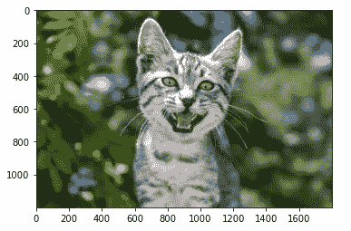

```
***# height_shift_range***datagen = ImageDataGenerator(height_shift_range=0.5)
iterator = datagen.flow(samples, batch_size=1)

show_image(iterator)
```

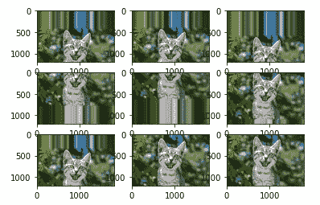

```
***# width_shift_range***datagen = ImageDataGenerator(width_shift_range=0.5)
iterator = datagen.flow(samples, batch_size=1)

show_image(iterator)
```

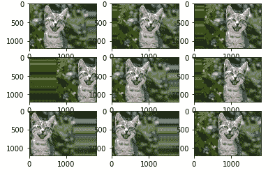

```
***# rotation_range*** datagen = ImageDataGenerator(rotation_range = 50)
iterator = datagen.flow(samples, batch_size=1)

show_image(iterator)
```

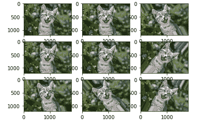

```
***# shear_range*** datagen = ImageDataGenerator(shear_range = 50)
iterator = datagen.flow(samples, batch_size=1)

show_image(iterator)
```

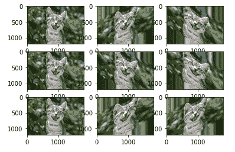

```
***# brightness_range*** datagen = ImageDataGenerator(brightness_range = [0.3,1.9])
iterator = datagen.flow(samples, batch_size=1)

show_image(iterator)
```

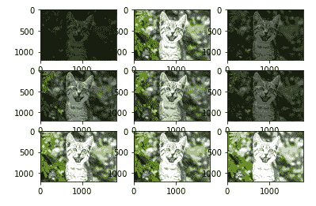

```
***# zoom_range***datagen = ImageDataGenerator(zoom_range = [0.5,1.5])
iterator = datagen.flow(samples, batch_size=1)

show_image(iterator)
```

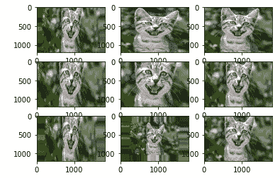

```
***# flip***datagen =ImageDataGenerator(horizontal_flip=**True**,vertical_flip=**True**)
iterator = datagen.flow(samples, batch_size=1)

show_image(iterator)
```

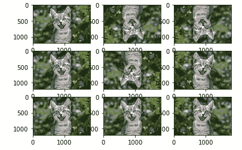

从图片来看，我相信 ImgaeDataGenerator 中每个函数的作用是可以理解的。更多详情请访问以下链接—【https://keras.io/api/preprocessing/image/ 。

回到 X 射线图像，我们已经看到了如何在训练集上实现 ImageDataGenerator。但是我们不应该直接在测试集上实现，就像在**案例 3 的图像缩放/归一化**中看到的那样(如上所述)。因此，我们为测试和验证集构建了一个单独的生成器。

```
**def** get_test_val_generator(X_train,y_train,X_test,y_test,X_val,y_val,
                      batch_size=32, seed=1, sample_size=100):

    raw_train_generator = ImageDataGenerator().flow(
        X_train,y_train, 
        batch_size=sample_size, 
        shuffle=**False**)

    *# get data sample*
    batch = raw_train_generator.next()
    data_sample = batch[0]

    *# use sample to fit mean and std for test set generator*
    image_generator = ImageDataGenerator(
        featurewise_center=**True**,
        featurewise_std_normalization= **True**)

    *# fit generator to sample from training data*
    image_generator.fit(data_sample)

    *# get test generator*
    test_generator = image_generator.flow(
            X_test,
            y=y_test,
            batch_size=batch_size,
            shuffle=**False**,
            seed=seed)

    *#get validation generator*
    val_generator = image_generator.flow(
            X_val,
            y=y_val,
            batch_size=batch_size,
            shuffle=**False**,
            seed=seed)

    **return** test_generator,val_generator
```

在这个实现中，我们使用训练集的统计数据，并将其应用于测试和验证集。理想情况下，我们希望使用整个训练集来计算样本均值和标准差。
然而，由于这非常大，这将非常耗时。
因此，我们随机抽取数据集样本(在本例中为 100 张图像),并计算样本均值和样本标准差。

接下来，我们创建训练、测试和验证生成器。

```
***#create the train, test and validation generator* ** train_generator = get_train_generator(X_train,y_train) test_generator,valid_generator = get_test_val_generator(X_train,y_train,X_test,y_test,X_val,y_val)
```

在生成器被创建之后，我们可视化一些来自训练和测试生成器的图像，看看它们看起来如何。

```
***# Displays 9 generated train_generator images*** 

print('Display Random Images')

*# Adjust the size of your images*
plt.figure(figsize=(20,10))

**for** i **in** range(12):
    num = random.randint(1,30)
    plt.subplot(3,4, i + 1)

    x,y = train_generator.__getitem__(num)

    plt.imshow(x[num],cmap='gray')
    plt.axis('off')

*# Adjust subplot parameters to give specified padding*
plt.tight_layout()
```

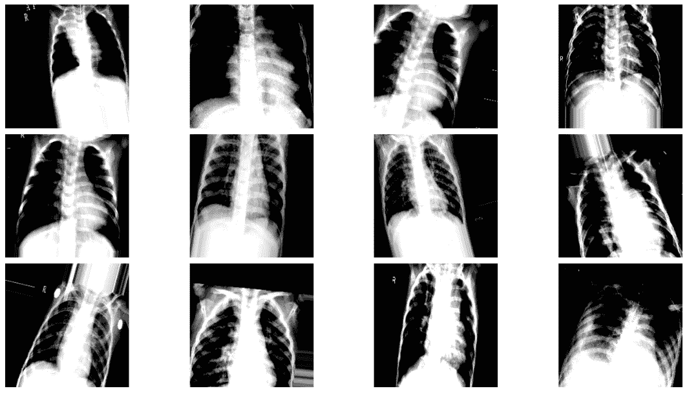

```
***# Displays 9 generated test_generator images * ** print('Display Random Images') *# Adjust the size of your images* plt.figure(figsize=(20,10))  
   **for** i **in** range(12):     
   num = random.randint(1,17)     
   plt.subplot(3,4, i + 1)          
   x,y = test_generator.__getitem__(num)
   plt.imshow(x[num],cmap='gray')     
   plt.axis('off')    

*# Adjust subplot parameters to give specified padding* plt.tight_layout()
```

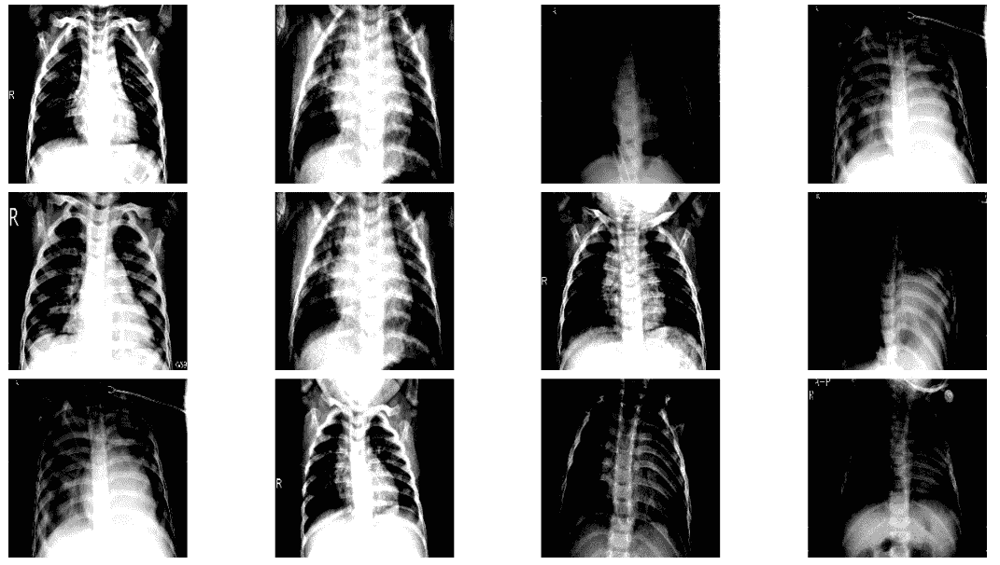

我们看到图像现在在训练和测试生成器中都被归一化了，但是我们仅在训练生成器上应用了增强，因为神经网络仅在训练图像上训练，并且我们不想干扰测试或验证图像。

图像被标准化和增强，现在可以输入神经网络。在下一部分中，我们将设计一个神经网络，看看它在将 X 射线图像适当分类到所有三个类别中的效果如何。在后面的部分，我们还将看到如何使用迁移学习进一步改善这些结果。

参考资料:

1.  [https://bair.berkeley.edu/blog/2019/06/07/data_aug](https://bair.berkeley.edu/blog/2019/06/07/data_aug/#:~:text=Data%20augmentation%20is%20a%20strategy,to%20train%20large%20neural%20networks.)