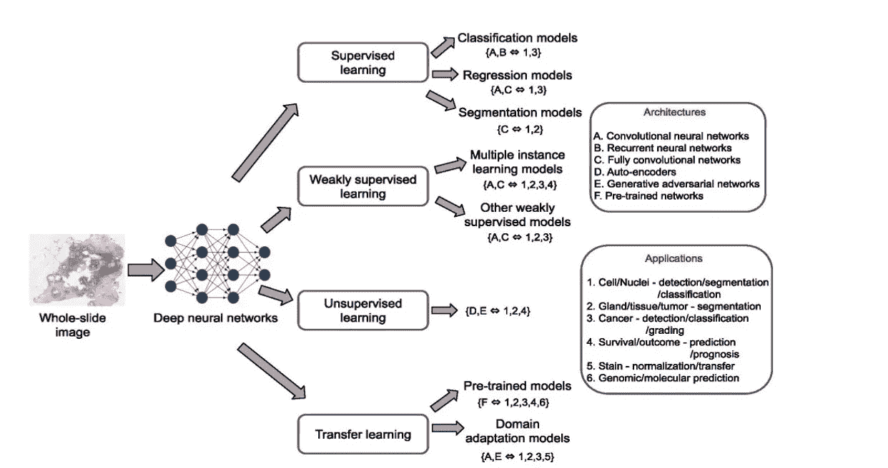
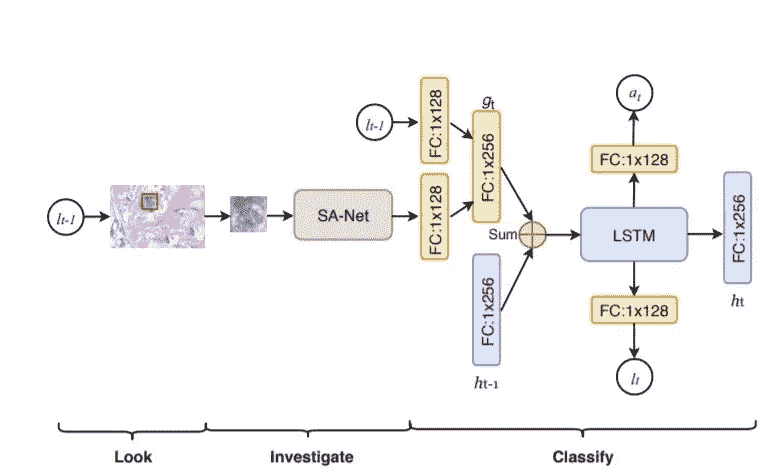
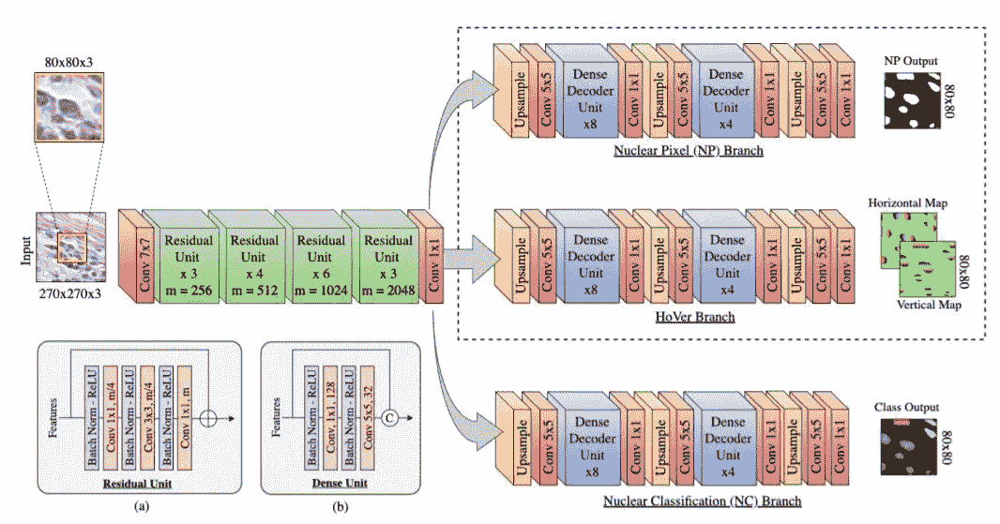

# 组织病理学中的深度学习(下)

> 原文：<https://towardsdatascience.com/deep-learning-in-histopathology-35c0294d38eb?source=collection_archive---------40----------------------->

## 计算机视觉/深度学习/医学成像

## 文献综述

在最后一部分的[中，我们开始了关于深度学习在组织病理学中的现状的介绍性讨论，我们讨论了组织病理学、数字组织病理学、机器学习在该领域的可能性以及各种应用，随后详细讨论了处理数字显微切片图像以及将深度学习算法应用于这些图像所涉及的挑战。](https://link.medium.com/EMIJptwAR7)

在这篇博客中，我们将从方法论的角度更详细地讨论深度学习对组织病理学的适用性，以及它使用相关工作进行说明来帮助完成的任务。

深度学习的适用性可以根据它执行的任务或学习范式来研究，这是我们将在这篇文章中使用的分类。不同的学习算法，即用于组织病理学的深度学习，以及任务在以下概述中进行了可视化。

图:这里看到的是计算组织病理学中的深度神经网络模型、各种应用和任务的概述。来源: [***斯里尼迪等人***](https://arxiv.org/abs/1912.12378)

基于这些，在文献中已经提出了许多 DL 模型，这些模型传统上基于卷积神经网络(CNN)、递归神经网络(RNNs)、生成对抗网络(GANs)、自动编码器(AEs)和其他变体。

# 监督学习

在监督学习技术中，我们根据数字组织病理学中解决的任务的性质确定了三种主要的规范深度学习模型:分类、回归和分割。

## 监督分类法

它可以进一步细分为局部和全球一级的分类。 ***局部级别分类*** 需要识别整个载玻片图像的小块中的细胞或细胞核。深度学习已被证明在通过滑动窗口方法对图像补片进行逐像素预测方面非常成功，病理学家将这些图像补片标注为包含感兴趣对象(细胞/细胞核)或背景的区域。
局部分类中最突出的工作之一出现在 2019 年，当时 [***Qaiser 等人***](https://arxiv.org/abs/1805.03699)*在其论文中使用%20is%20a,qualitative%20features%20of%20the%20input.)*轮廓作为区分特征，以便通过将斑块分类为肿瘤区域或正常区域来分割结肠肿瘤区域。*持续同源性分布图*是一个区域的紧凑的数学特征表示，对于输入数据、维度和坐标中的规模、扰动具有独特性和鲁棒性。
他们将训练数据集的 PHP 与使用 CNN 提取的特征结合起来使用，然后对它们分别使用*随机森林回归，随后使用多阶段集成策略进行最终分类。这种混合方法被证明是既准确又高效的 wrt 推理速度。
在 ***全局水平分类*** 中，大部分已发表的工作都集中在一种基于面片的分类方法上，用于全切片水平的疾病预测任务。它可以包括小块水平的定位以及整个载玻片水平的疾病分类或分级。这些方法的主要缺点是在整个 WSI 上进行密集的逐块预测需要相对较长的计算时间。不同的作品以不同的方式处理这个问题，一些使用*启发式采样策略*到最近的使用基于任务驱动 [*视觉注意*](https://medium.com/@sunnerli/visual-attention-in-deep-learning-77653f611855) 的粗处理。***

****

**图:基于视觉注意力的观察、调查和分类模型的流程。来源: [**徐等(2019)**](https://arxiv.org/abs/1902.10946)**

**[**【徐】**](https://arxiv.org/abs/1902.10946)*在他们的工作中，通过*硬视觉注意算法*自适应地从原始图像中选择一系列粗糙区域，然后对于每个这样的区域，能够基于*软注意*机制*来调查异常部分。*然后，在顶部构建一个*递归网络*以对图像区域进行分类，并且还预测在下一时间步要研究的图像区域的位置。这样，分类只需要调查一小部分像素***

**将基于视觉注意力的模型用于整个幻灯片图像全局分类任务的优点是:**

*   **该模型试图只学习对疾病预测最相关的诊断有用的区域，因为它实施了区域选择机制。**
*   **模型的复杂度与 WSI 的大小无关。**

**由 [***哈利切克、马丁等人***](https://www.nature.com/articles/s41598-019-50313-x) 进行的另一项全球分类的近期工作使用 CNN 使用完全不同的方法对*鳞状细胞癌【SCC】*和*甲状腺细胞癌*进行基于补丁的定位和全切片分类。
从每个概述的组织学载玻片产生癌症区域的地面实况二元掩模。使用 [*最近邻插值*](https://www.giassa.net/?page_id=207#:~:text=Nearest%20neighbour%20interpolation%20is%20the,the%20intensity%20value%20of%20it.) 将 WSIs 和相应的地面实况向下采样四倍。然后将降采样后的载玻片分成大小为 **101 x 101** 的小块。为了确保通用性，通过应用 90 度旋转和反射，图像补片的数量增加了 **8x** ，以开发一种更强大的诊断方法。此外，为了建立颜色特征不变性和对载玻片之间的 [*H & E 染色*](https://en.wikipedia.org/wiki/H%26E_stain#:~:text=The%20H%26E%20staining%20method%20involves,bluing%20in%20mildly%20alkaline%20water.) 的差异的容忍度的水平，在馈送到用于检测头颈癌的 [*Inception-v4*](/review-inception-v4-evolved-from-googlenet-merged-with-resnet-idea-image-classification-5e8c339d18bc) 模型之前，随机操纵每个块的色调、饱和度、亮度和对比度，以形成更严格的训练范例。**

## **监督回归**

**在这种方法中，我们集中于直接回归像素作为对象中心的可能性，以检测或定位对象。与分类不同，回归给我们一个连续的值，通常是概率分数，而不是简单的作为输出的类别标签。回归有助于通过加强拓扑约束进行更好的检测，例如为靠近对象中心的像素分配更高的概率值。
回归也有助于应对细胞/细胞核检测中面临的挑战，这些挑战是由于高度不规则的外观以及它们作为重叠的团块出现而导致分离它们的问题而引起的。文献中提出的深度回归模型主要基于 CNN 或 [*全卷积网络(FCN)*](https://arxiv.org/abs/1411.4038) 架构。**

**由 [***格雷厄姆等人***](https://arxiv.org/abs/1812.06499) 在 *HoVer-Net* 上发表的论文是整个研究领域中最具开创性的作品之一。它提出了一个统一的 FCN 模型，同时核实例分割和分类。它利用核像素到其质心的垂直和水平距离内编码的丰富实例信息。然后利用这些距离来分离成簇的细胞核，从而产生精确的分割，特别是在具有重叠实例的区域中。
然后，对于每个分割的实例，网络通过专用的上采样分支预测细胞核的类型。该网络由用于三种不同任务的三个平行分支组成。对于三个分支中的每一个，我们都有相应的数据基础事实注释。**

*   ***细胞核像素(NP)* 分支预测像素是否属于细胞核或背景，**
*   **而*水平-垂直(悬停)*分支预测核像素到其质心的水平和垂直距离。这里，颜色表示每个核像素到质心的距离的等级。**
*   **蓝色代表最大+1 的正距离，表示像素在水平贴图的情况下位于 COM 的左侧，在垂直贴图的情况下位于 COM 的上方。类似地，红色表示负距离，最大为-1，意味着像素相应地位于 COM 的右侧/底部。**
*   **然后，*细胞核分类(NC)* 分支(可选)预测每个像素的细胞核类型。**

****

**图:由一个编码器和三个并行解码器组成的 HoVernet 架构 FCN 网络。来源: [***格雷厄姆等人***](https://arxiv.org/abs/1812.06499)**

**具体来说， *NP* 和 *HoVer* 分支通过先从背景中分离出细胞核像素(NP 分支)，再分离出接触细胞核( *HoVer 分支*)共同实现细胞核实例分割。这是用于组织的定位和聚类步骤的相同模型，用于将整个载玻片图像建模为图形，以便使用 [*图形神经网络*](https://openaccess.thecvf.com/content_CVPRW_2020/papers/w16/Lu_Capturing_Cellular_Topology_in_Multi-Gigapixel_Pathology_Images_CVPRW_2020_paper.pdf) 进行后续学习，如前一篇文章中所述。**

**在我们关于组织病理学深度学习讨论的下一个也是最后一个部分，我们将讨论数字组织病理学背景下的监督分割、弱监督和非监督学习方法，以及适当的应用和相关文献。**

**PS:我已经将技术上重要的术语链接到解释它们的相应资源。**

# **参考**

1.  **Qaiser，Tsang，Y.W .，Taniyama，d .，Sakamoto，n .，Nakane，k .，Epstein，d .，Rajpoot，n .，2019b .利用持续同源性和深度卷积特征快速准确地分割组织学图像中的肿瘤。医学图像分析 55，1–14。**
2.  **徐，b，刘，j，侯，x，刘，b，加里波第，j，埃利斯，国际组织，格林，a，沈，l，邱，g，2019。看，调查，分类:乳腺癌分类的深度混合注意方法，载于:2019 IEEE 第 16 届国际生物医学成像研讨会(ISBI 2019)，第 914–918 页。**
3.  **使用卷积神经网络进行数字化全切片组织学中的头颈癌检测。*科学报告*9.1(2019):1–11。**
4.  **Graham，s .，Vu，Q.D .，Raza，S.E.A .，Azam，a .，Tsang，Y.W .，Kwak，J.T .，Rajpoot，n . 2019 b .Hover-net:多组织组织学图像中细胞核的同时分割和分类。医学图像分析 58，101563。**
5.  **斯里尼迪，切坦 l，奥赞西加和安妮 l 马特尔。"用于计算组织病理学的深度神经网络模型:综述." *arXiv 预印本 arXiv:1912.12378* (2019)。**