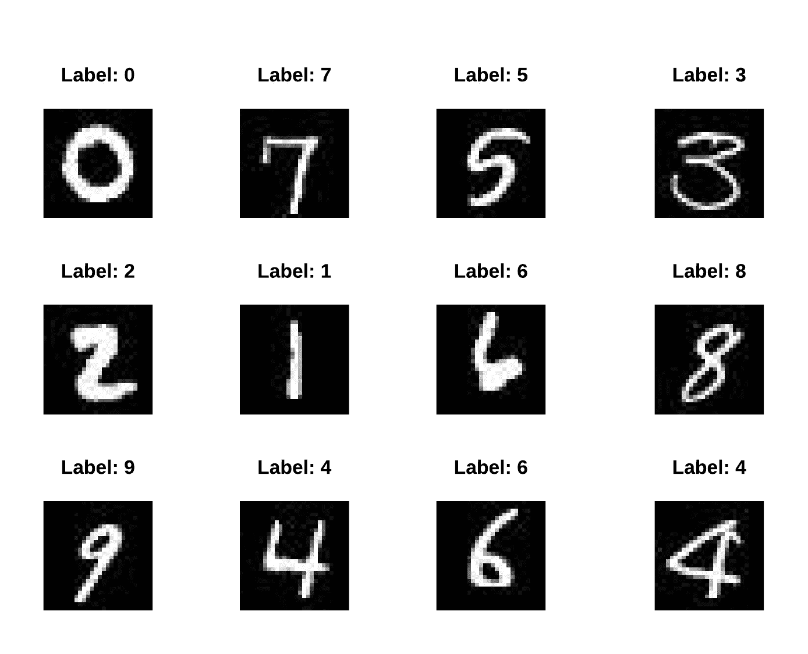
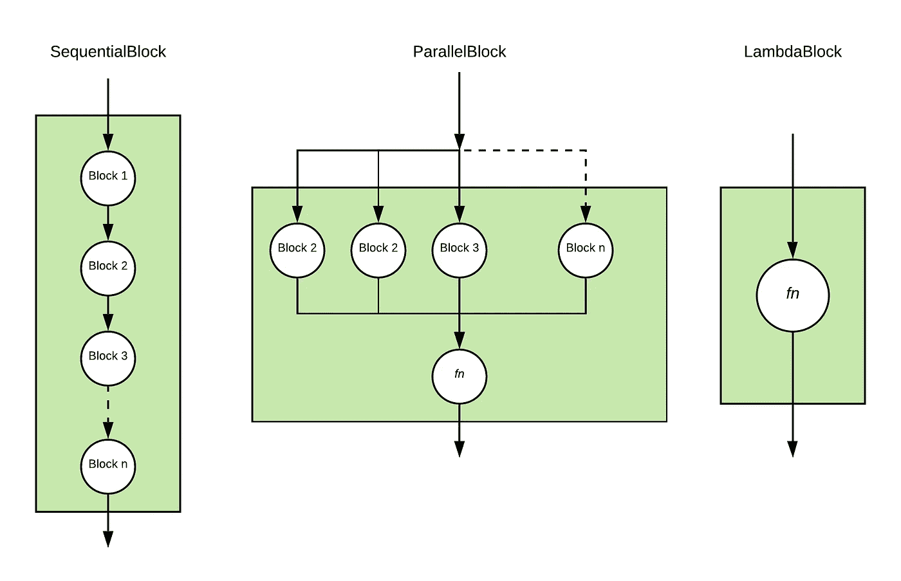

# Java 中的深度学习

> 原文：<https://towardsdatascience.com/deep-learning-in-java-d9b54ae1423a?source=collection_archive---------10----------------------->


由[乌列尔 SC](https://unsplash.com/@urielsc26?utm_source=medium&utm_medium=referral) 在 [Unsplash](https://unsplash.com?utm_source=medium&utm_medium=referral) 上拍摄的照片

## DeepJavaLibrary 简介:一个开源的、与引擎无关的、用于训练和推理的深度学习 Java 库

长久以来，Java 一直是企业中[最受欢迎的编程语言之一，拥有一个庞大的库、框架和开发人员社区的生态系统。然而，Java 为深度学习应用程序提供的选项非常有限。目前，大多数深度学习模型都是用 Python 编写和训练的。这为想要进入这一领域的 Java 开发人员带来了额外的进入壁垒，因为他们必须学习一种新的编程语言和复杂的深度学习领域。

为了降低 Java 开发者进入深度学习的门槛，AWS 构建了](https://www.cloudfoundry.org/wp-content/uploads/Developer-Language-Report_FINAL.pdf) [Deep Java Library (DJL)](https://djl.ai) ，这是一个开源的 Java 深度学习框架，通过支持任何深度学习引擎，如 Apache MXNet、PyTorch 或 TensorFlow，在 Java 中原生运行训练和推理，为 Java 开发者搭建桥梁。它还包含一个强大的 ModelZoo 设计，允许您管理经过训练的模型，并在一行代码中加载它们。内置的 ModelZoo 目前支持来自 GluonCV、HuggingFace、TorchHub 和 Keras 的 70 多个预训练和随时可用的模型。如果你是一名 Java 开发人员，并且对探索深度学习感兴趣， [Deep Java Library (DJL)](https://djl.ai/) 是一个很好的起点。

在本教程中，我们将通过在流行的 MNIST 数据集上训练一个简单模型来演示 DJL 的训练能力。

# 什么是深度学习？

机器学习是通过使用各种统计技术，让计算机从数据中学习给定任务的规范的过程。这种学习任务特征的能力允许计算机执行复杂的任务，例如检测图像中的对象，这些任务通常被认为超出了计算机的范围，因为很难为每种可能的情况提供准确的规范。

深度学习是基于人工神经网络的机器学习分支。人工神经网络是一种受人脑启发的编程范式，它帮助计算机基于观察数据学习和执行任务。深度学习是一组强大的技术，可以用来帮助训练大型人工神经网络来执行复杂的任务。深度学习技术已被证明在解决复杂任务方面非常有效，如对象检测、动作识别、机器翻译、自然语言理解等。

# 和 DJL 一起训练 MNIST

# 设置项目

您可以在 gradle 项目中使用以下配置来导入所需的依赖项。在这个例子中，我们使用了包含 DJL 项目核心 API 的`api`包，以及包含 DJL 一些基本数据集的`basicdataset`包。因为我们用 MXNet 引擎训练，我们也将导入`mxnet-engine`包和`mxnet-native-auto`包。

```
plugins {
    id 'java'
}
repositories {                           
    jcenter()
}
dependencies {
    implementation "ai.djl:api:0.8.0"
    implementation "ai.djl:basicdataset:0.8.0"
    // MXNet
    runtimeOnly "ai.djl.mxnet:mxnet-engine:0.8.0"
    runtimeOnly "ai.djl.mxnet:mxnet-native-auto:1.7.0-backport"
}
```

# NDArray 和 NDManager

NDArray 是 DJL 所有数学计算的核心数据结构。NDArray 表示一个多维、固定大小的同构数组。NDArray 的行为类似于 python 程序 numpy。

[NDManager](https://javadoc.djl.ai/api/0.4.0/ai/djl/ndarray/NDManager.html) 是 [NDArray](https://javadoc.djl.ai/api/0.4.0/ai/djl/ndarray/NDArray.html) 的管理者。NDManager 管理 NDArray 的生命周期，是 DJL 内存管理的重要组成部分。一旦 NDManager 关闭，由 NDManager 实例创建的每个 NDArray 都将关闭。NDManager 和 NDArray 都扩展了`AutoCloseable`。为了更好的了解和理解 NDArray 和 NDManager 的用法，请看[这篇博文](/ndarray-a-java-based-n-dim-array-toolkit-60b4035b10b8)。

# 模型

在 DJL，训练和推理以`Model`开始。在本文中，我们将集中讨论培训过程。为了开始训练过程，我们创建了一个`Model`类的新实例。`Model`类也扩展了`AutoCloseable`。所以，它是用 try-with-resources 创建的。

```
try (Model model = Model.newInstance()) {
    ...
    // training process takes place here
    ...
}
```

# 准备数据

MNIST 数据库(改进的国家标准和技术研究所数据库)是一个手写数字的大型数据库，通常用于训练各种图像处理系统。`MNIST`数据集在 DJL 随处可见。来自 DJL MNIST 数据集的单个图像的形状为(28，28)。如果您希望在自己的数据集上训练模型，您可以按照这里的说明[添加自己的数据集。](https://github.com/awslabs/djl/blob/4e2cd53cda13d01749fe739a384f8e8e1dbc9ef6/docs/development/how_to_use_dataset.md#how-to-create-your-own-dataset)



来自 [MNIST 数据集](http://yann.lecun.com/exdb/mnist/)、*的随机图像集合，由克尔森·瓦斯特*拍摄

为了训练您的模型，您首先需要加载数据集。

```
int batchSize = 32;
Mnist trainingDataset = Mnist.builder()
        .optUsage(Usage.TRAIN)
        .setSampling(batchSize, true)
        .build();
Mnist validationDataset = Mnist.builder()
        .optUsage(Usage.TEST)
        .setSampling(batchSize, true)
        .build();
```

这段代码创建了训练和验证数据集。数据集还被配置为对数据集进行随机采样。对数据集进行了进一步的配置，如对图像应用变换，或限制数据集的大小。

# 构建模型(构建模块)

一旦数据准备好了，你需要构建你想要训练的神经网络。在 DJL，神经网络用一个`Block`来表示。块是形成神经网络的可组合函数。它们可以代表单个操作、神经网络的一部分，甚至整个神经网络。一个`Block`可以有参数和子块。在训练过程中，参数被更新，并且子块也被训练。这也递归地更新了它所有子节点的参数。

在构建这些块函数时，最简单的方法就是使用 composition。积木可以由其他积木组合而成。我们将包含块称为父块，将子块称为子块。

我们提供了几个助手，让构建通用的块组合结构变得容易。`SequentialBlock`是一个容器块，它的子块形成了一个块链，每个子块将其输出提供给序列中的下一个子块。ParallelBlock 是一个容器块，其子块并行执行，块的输出根据指定的组合函数进行组合。block 是一个具有操作功能的模块，必须由用户指定。



可用于构建神经网络的模块类型(非穷举)，*keer than Vasist 的图像*

我们将建立一个简单的 MLP(多层感知器)。多层感知器(MLP)是一种前馈人工神经网络，它从一组输入生成一组输出。MLP 的特征在于若干层输入结点在输入层和输出层之间连接成一个有向图。它可以通过在一个`SequentialBlock`内使用多个`LinearBlock`来构建。

```
int input = 768;
int output = 10;
int[] hidden = new int[] {128, 64};
SequentialBlock sequentialBlock = new SequentialBlock();
sequentialBlock.add(Blocks.batchFlattenBlock(input));
for (int hiddenSize : hidden) {
    sequentialBlock.add(Linear.builder().setUnits(hiddenSize).build());
    sequentialBlock.add(activation);
}
sequentialBlock.add(Linear.builder().setUnits(output).build());
```

DJL 还提供了一个预制的`Mlp`模块，我们可以直接使用。

```
Block block = new Mlp(
        Mnist.IMAGE_HEIGHT * Mnist.IMAGE_WIDTH,
        Mnist.NUM_CLASSES,
        new int[] {128, 64});
```

# 培养

现在，您已经创建了模型的一个新实例，准备了数据集，并构造了一个块，您可以开始训练了。在深度学习中，训练包括以下步骤:

*   初始化:该步骤初始化模块，并根据指定的`Initializer`方案创建相应的参数。
*   Forward:该步骤执行由`Block`表示的计算，并生成输出。
*   损失计算:在这一步中，通过将指定的`Loss`函数应用于输出和提供的标签来计算损失。
*   向后:在此步骤中，使用损失，并沿神经网络反向传播梯度。
*   步骤:在该步骤中，根据指定的`Optimizer`更新程序块的参数值。

然而，DJL 通过`Trainer`抽象了所有这些步骤。可以通过指定`Initializer`、`Loss`、`Optimizer`等训练配置来创建`Trainer`。使用`TrainingConfig`可以设置这些配置和更多配置。可以设置的其他一些配置有:

*   `Device` -必须进行培训的设备
*   `TrainingListeners` -监听器监听训练过程中的各个阶段，并执行特定的功能，如记录和评估。用户可以根据需要实现自定义`TrainingListener`。

```
DefaultTrainingConfig config = new DefaultTrainingConfig(Loss.softmaxCrossEntropyLoss())
                .addEvaluator(new Accuracy())
                .optDevices(Device.getDevices(arguments.getMaxGpus()))
                .addTrainingListeners(TrainingListener.Defaults.logging(arguments.getOutputDir()));
try (Trainer trainer = model.newTrainer(config)){
    // training happens here
}
```

一旦创建了训练器，必须用输入的`Shape`对其进行初始化。然后，你调用`fit()`方法开始训练。`fit()`方法对数据集上的模型进行指定数量的历元训练，运行验证，并将模型保存在文件系统的指定目录中。

```
/*
* MNIST is 28x28 grayscale image and pre processed into 28 * 28 NDArray.
* 1st axis is batch axis, we can use 1 for initialization.
*/
Shape inputShape = new Shape(1, Mnist.IMAGE_HEIGHT * Mnist.IMAGE_WIDTH);
int numEpoch = 5;
String outputDir = "/build/model";// initialize trainer with proper input shape
trainer.initialize(inputShape);TrainingUtils.fit(trainer, numEpoch, trainingSet, validateSet, outputDir, "mlp");
```

就是这样。恭喜你！你已经使用 DJL 训练了你的第一个深度学习模型！您可以在控制台上监视训练过程，也可以监视监听器的实现。如果您使用默认侦听器，您的输出应该类似于以下内容。

```
[INFO ] - Downloading libmxnet.dylib ...
[INFO ] - Training on: cpu().
[INFO ] - Load MXNet Engine Version 1.7.0 in 0.131 ms.
Training:    100% |████████████████████████████████████████| Accuracy: 0.93, SoftmaxCrossEntropyLoss: 0.24, speed: 1235.20 items/sec
Validating:  100% |████████████████████████████████████████|
[INFO ] - Epoch 1 finished.
[INFO ] - Train: Accuracy: 0.93, SoftmaxCrossEntropyLoss: 0.24
[INFO ] - Validate: Accuracy: 0.95, SoftmaxCrossEntropyLoss: 0.14
Training:    100% |████████████████████████████████████████| Accuracy: 0.97, SoftmaxCrossEntropyLoss: 0.10, speed: 2851.06 items/sec
Validating:  100% |████████████████████████████████████████|
[INFO ] - Epoch 2 finished.NG [1m 41s]
[INFO ] - Train: Accuracy: 0.97, SoftmaxCrossEntropyLoss: 0.10
[INFO ] - Validate: Accuracy: 0.97, SoftmaxCrossEntropyLoss: 0.09
[INFO ] - train P50: 12.756 ms, P90: 21.044 ms
[INFO ] - forward P50: 0.375 ms, P90: 0.607 ms
[INFO ] - training-metrics P50: 0.021 ms, P90: 0.034 ms
[INFO ] - backward P50: 0.608 ms, P90: 0.973 ms
[INFO ] - step P50: 0.543 ms, P90: 0.869 ms
[INFO ] - epoch P50: 35.989 s, P90: 35.989 s
```

一旦训练完成，我们就可以使用训练好的模型进行推理来获得预测。您可以使用您的 model jupyter 笔记本按照[推理，在保存的模型上运行推理。您也可以按照](http://docs.djl.ai/jupyter/tutorial/03_image_classification_with_your_model.html)[使用多层感知器(MLP)模型](https://github.com/awslabs/djl/blob/master/examples/docs/train_mnist_mlp.md)训练手写数字识别中的说明直接运行完整的代码。

# 摘要

在本文中，我们向您介绍了深度学习，并使用 DJL 完成了一个简单的训练示例。虽然这个例子是一个简单的例子，但 DJL 为更复杂的深度学习模型提供了相同的抽象。

关注我们的 [GitHub](https://github.com/awslabs/djl/tree/master/docs) 、[演示库](https://github.com/aws-samples/djl-demo)、 [Slack channel](https://join.slack.com/t/deepjavalibrary/shared_invite/zt-ar91gjkz-qbXhr1l~LFGEIEeGBibT7w) 和 [Twitter](https://twitter.com/deepjavalibrary) 获取更多关于 DJL 的文档和示例！