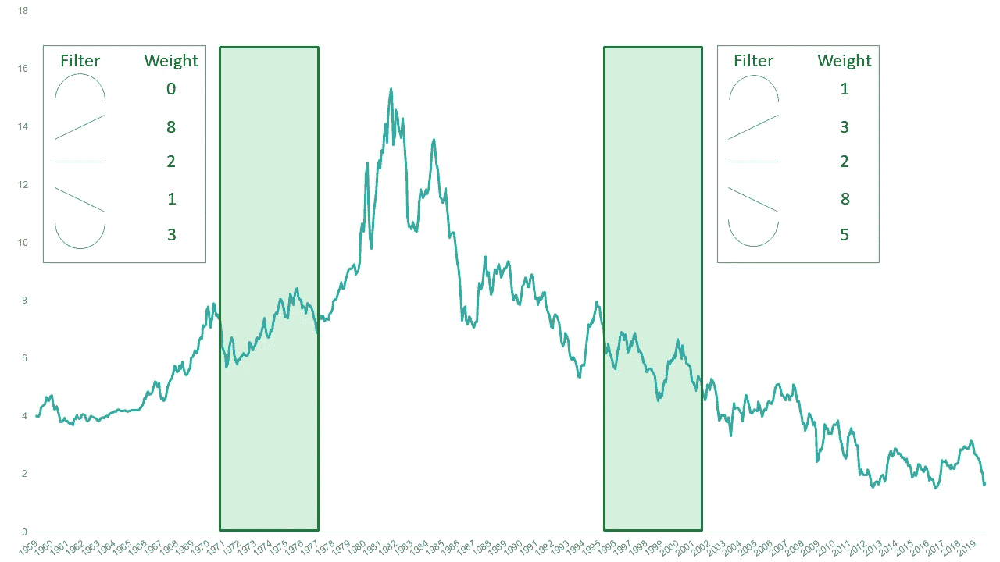
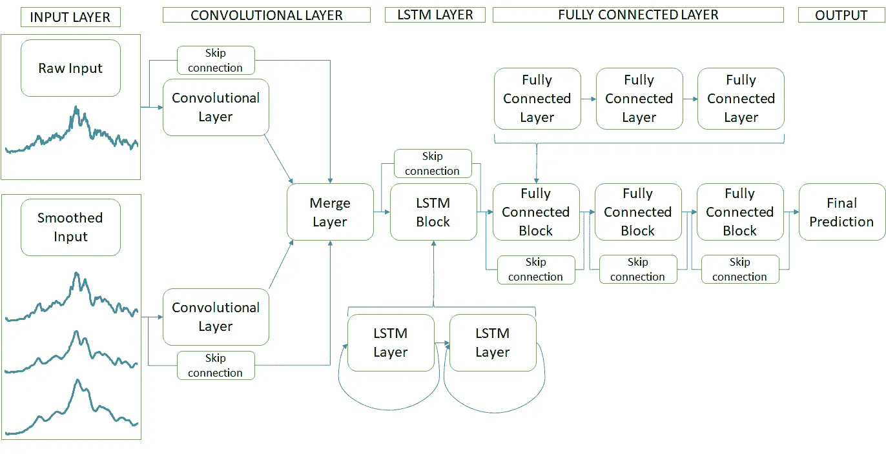

# 宏观经济学中的深度学习——国债

> 原文：<https://towardsdatascience.com/deep-learning-in-macroeconomics-treasury-bonds-fbc1b37fe4c8?source=collection_archive---------15----------------------->

## 预测 10 年期美国国债利率

照片由[像素](https://www.pexels.com/)上的[能量史诗](https://www.pexels.com/@energepic-com-27411)拍摄

未来一年，美国国债利率将如何变动？下个财政季度？下个月怎么样？这些问题在金融市场投资者和政策制定者的决策中都起着至关重要的作用。投资者的目标是寻求更高的投资回报，估计长期回报，并模拟风险溢价。政策制定者试图预测未来的利率，以帮助推动适当的货币和财政措施，从而维持健康的市场和宏观经济。

在本文中，我将卷积 LSTM 神经网络的预测性能与费城美联储专业预测者调查的总体预测性能进行了比较。这个模型和方法类似于我在《T4》上一篇关于预测美国通胀率的文章中使用的方法。历史上，这种调查汇总的预测方法已经被用于通过汇总许多经济学家模型的结果和对未来表现的预测来提高表现。这与蓝筹股经济指标预测以及道琼斯/华尔街日报经济预测调查等所使用的方法类似。我发现，通过使用神经网络预测算法，预测性能可以在所有测试时间范围内得到改善。

# 国债的重要性

美国国债收益率不仅在显示股市和整体经济状况方面非常重要，也是许多其他利率和证券定价的驱动因素。

10 年期美国国债实际上是美国债务的一部分。通过购买债券，你可以向美国联邦政府提供小额贷款。10 年期债券是美国财政部发行的 10 年后到期的债券。这些债券由美国财政部拍卖，其价格在一定程度上由需求决定。

这些债券通常被视为无风险债务工具。也就是说，它们决定了无违约风险的债务回报率。这是因为所有的美国国债都是由美国经济担保的。相对于许多国家而言，人们认为美国债务违约的风险很小。

这种将美国国债视为无风险投资的观点，是推动美国国债在理解经济观点方面的重要性以及推动美国国债对其他债务工具的影响力的部分原因。

当经济表现良好且对未来表现的预期较高时，投资者将寻求投资的最高回报率，对美国国债的需求将会减少。在商业周期的这种扩张时期，有许多其他投资工具可以产生比国债更高的回报。结果，需求下降，购买者只愿意以低于面值的价格购买债券。随着市场平衡，与其他投资工具竞争，这将推高收益率。

在经济收缩时期或有衰退风险时，情况正好相反。投资者将资产从被认为风险较高的工具中转移出来，寻找安全稳定的投资，比如国债。这种高需求推高了债券价格，降低了收益率。投资者愿意接受这种较低的回报，以换取他们投资安全的知识。这就是为什么在经济扩张时期，我们会看到国债利率下降，而在经济收缩时期，我们会看到利率上升。

在紧缩时期，这种无风险利率的下降导致银行贷款利率和其他利率也下降，以便在市场上竞争。抵押贷款等安全性较低的投资必须降低利率，以吸引投资者。这为市场提供了额外的流动性。较低的抵押贷款和贷款利率通过降低购房和举债成本而推高了借贷。

通过更好地了解债券利率的未来走势，个人、政策制定者和市场参与者可以改善他们的决策。投资者可以获得更高的回报，并在市场波动之前采取行动，而不是对其做出反应。同样，政策制定者可以在经济陷入危机之前就货币政策和流动性做出决定。或许最重要的是，通过预测债券利率的变动，我们可以更好地理解更广泛的经济情绪。一段时间内利率的大幅变动可以表明风险认知的变化，并作为衰退的指标。

# 数据

对于数据，我使用来自 [FRED-MD](https://research.stlouisfed.org/econ/mccracken/static.html) 数据库的 GS10 系列。FRED-MD 是一个由圣路易斯美联储委员会维护的数据库，旨在对大数据进行“实证分析”。“数据通过 FRED 数据库实时更新。

GS10 变量代表 10 年期美国国债月底的固定到期收益率。该利率是根据美国财政部提供的信息计算的。数据也可以从弗雷德[这里](https://fred.stlouisfed.org/series/GS10)获得。

为了这个分析，我预测了每个月的债券利率。由于债券是每天交易的，这相当于每个月末计算的利率。首先对该序列进行差分以产生平稳性，然后用具有单一特征的滚动 24 个月周期的张量来构造。虽然数据在用于非线性预测模型之前是否必须是稳定的还存在争议，但在这种情况下，我发现差分后的结果得到了改善。滚动平均输入的结构类似。在对序列进行差分后，计算移动平均值，然后将其构建为滚动 24 个月周期的张量，其中三个移动平均值中的每一个都作为一个特征。

# 时间序列数据的卷积 LSTM 建模

我开发了一个卷积 LSTM 神经网络(CNN-LSTM)来预测未来 12 个月每个月的债券利率。

卷积神经网络是一系列深度学习算法，最初是为图像分类而设计的。该网络获取一幅图像，将该图像通过一组对该图像的不同方面应用权重的过滤器，并最终提供预测。这就像一个特征工程系统，随着时间的推移，网络“学习”什么样的特征过滤器在图像分类中最重要。

类似的方法可以应用于时间序列。虽然时间序列不像图像那样具有“物理”特征，但时间序列数据确实包含时间维度特征。如果我们将时间序列数据想象成一幅图像，我们可以将卷积网络想象成一盏聚光灯或一扇窗户，它扫描整个时间段，照亮该时间段内序列的形状，然后对其进行过滤，以找到它最能代表的特征形状。这种模式的简单说明如下:

时间序列卷积网络的说明性示例(权重是固定的)-十年期国债利率

这个卷积模型可以扩展为一个长短长短期记忆(LSTM)层集，以便更好地了解这些历史时间维度特征中的哪一个在何时影响比率。LSTM 是一种用于深度学习的人工递归神经网络(RNN)架构。与其他前馈神经网络不同，LSTM 网络具有反馈连接。这些反馈连接允许网络学习哪些过去的信息是重要的，而忘记哪些是不重要的。

该单元由几个门函数组成，这些门函数决定新信息对预测问题是否重要，以及旧信息是否仍然相关。该存储器被称为单元状态，并且可以保存所有先前学习的相关信息，用于时序序列的完整处理。这允许在整个处理过程中保持序列中更早学习到的信息。

当信息通过 LSTM 处理时，它通过一系列的门，这些门决定了信息是被保留、更新还是被完全遗忘。这就是 LSTM 建筑优于其他 RNN 建筑的好处。LSTM 能够将信息从处理的早期一直传送到末端，而其他 RNN 网络只是用序列中的每个附加输入来更新它们的理解。这使得 LSTM 网络对于像时间序列这样的序列数据的分析非常强大。

# 模型架构

我用来分析的 CNN-LSTM 网络如下图所示。首先，我们从两个输入开始，原始时间序列和三个移动平均平滑序列。每个平滑系列代表任何给定观测值的前三个月、六个月和一年的移动平均值。

这些输入然后被馈送到单独的卷积层，以提取每个输入序列的相对重要的特征权重。这些结果然后被合并在一起，并传递到一系列 LSTM 网络，然后最终传递到一组完全连接的块。全连接块堆栈中的每个后续块包含的节点比前一堆栈中的少。在每个块之间，使用剩余或跳过连接，允许模型使用在早期层中学习的信息来继续训练后面的层。这防止了从卷积层输出的信息太快丢失或被模型的后续层模糊。这也有助于防止渐变消失的问题，并允许在模型结构中进一步保留原始序列中的一些较小的细节。最后，在输出最终预测之前，将对最终图层应用一个丢弃。

模型架构图

# 结果

在对数据进行差分后，我将数据集分成训练集和测试集(70/30 分割)。数据在截至 2001 年 6 月的所有月份中进行训练，然后对 2001 年 7 月到 2019 年 9 月进行预测。我使用一步滚动预测。对于测试集中的每个月，预测对应于接下来 12 个月的每个月末的债券利率，然后使用观察到的债券利率来预测接下来 12 个月的集合。预测以多元方式进行，同时预测随后 12 个月中的每个月，并在系列中每 10 次观察时进行验证。

这是一个相当现实的方法，因为在预测下一期的债券利率时，分析师可以使用所有以前观察到的利率。通过使用一步预测，我们保持这种不断增长的建模信息。通过使用有状态 LSTM 模型，模型权重随着每次新的预测迭代而调整。这使得模型能够拾取序列中可能随时间发生的任何结构变化。该模型的误差率以年度百分比表示。

作为模型的基准，我给出了专业预测者调查(SPF)和费城美联储 DARM 模型(SPF 的最高表现基准)测试期间的误差率。SPF 是美国持续时间最长的宏观经济指标预测调查。这些基准的错误率是根据 SPF 官方错误率文档计算的。

下面是模型结果的总结:

模型和基准误差结果

我们可以看到，多元卷积 LSTM 模型远远优于直接自回归模型和调查汇总预测。虽然在这些预测如何运行以及误差如何表现方面存在一些差异，但我们可以看到卷积模型在每个时间段都优于这些更传统的方法。SPF 预测按季度在每个季度的中期进行，然后在当前季度末和随后的季度进行预测，而不是按月进行。仍然可以通过将每个季度预测视为三个月的预测，将当前季度预测视为大约一个月的预测来进行比较。

下面，我们可以看到模型在整个时间序列中的表现。总的来说，我们可以看到模型与数据拟合得很好，只是在方差较大的时期或趋势变化很快的时候，误差会稍微大一些。在 1980 年代的最高历史汇率值时，情况尤其如此。

如果我们更仔细地观察测试期间，我们可以看到模型几乎完全符合实际债券利率。这部分是由于模型在每次后续预测中获得了额外的信息。自 1984 年的峰值以来，国债利率一直在稳步下降。最近的经济理论表明，债券利率可能已经发生结构性变化，进入一个较低的稳定状态。考虑到美国国债收益率曲线，这一点尤其有趣。然而，该模型似乎很容易适应这种结构上的变化。

虽然在误差方面比基准测试有明显的改进，但可以看到的另一个主要好处是模型的预测能力没有滞后。典型的计量经济学模型预测通常显示出其预测的滞后性，并且难以快速适应趋势的变化。在查看下面的附加基准预测时，我们可以看到，特别是对于中长期预测，预测率存在明显的滞后。我们还可以在基准预测中看到我所说的模型粘性。在这种情况下，长期预测往往会高估系列趋势变化的幅度，并且对方向逆转的适应速度较慢。这在 20 世纪 80 年代 DARM T+12 预测中最为明显。我们可以看到，模型在峰值后反转方向很慢。

10 年期国债利率预测

# 结论

这为使用神经网络预测债券利率提供了有力的证据。这种神经网络结构可以极大地改善预测，并能更快地对趋势变化做出反应。这种预测方法也可能具有更好的性能，因为它同时预测所有 12 个未来期间。与其他典型的递归生成预测的基准模型(即预测 T+2 基于预测 T+1)不同，神经网络仅使用时间 T 的信息来预测所有 12 个时段。这基本上允许模型优化其权重，就好像使用了 12 个独立的模型一样。

这项分析只使用了一个单一的预测变量，通货膨胀的历史，以预测未来的通货膨胀率。有可能通过增加额外的预测因子来提高模型的性能。也可以使用不同的平滑方法，例如指数平滑，这可以允许改进预测。债券利率数据也可以在每日序列中获得，这可能是预测挑战的有趣补充，并提供额外的数据。

我的分析代码可以在我的 [GitHub](https://github.com/acertainKnight/FRED_Forecasting_Final) 上找到。我将继续更新代码和完善模型，因此结果可能会略有变化。

 [## acertainKnight/FRED _ 预测 _ 最终

### 此时您不能执行该操作。您已使用另一个标签页或窗口登录。您已在另一个选项卡中注销，或者…

github.com](https://github.com/acertainKnight/FRED_Forecasting_Final)  [## 10 年期国债固定到期利率

### 资料来源:美联储系统(美国)理事会发布:H.15 选定利率单位:频率…

fred.stlouisfed.org](https://fred.stlouisfed.org/series/GS10) 

***来自《走向数据科学》编辑的提示:*** *虽然我们允许独立作者根据我们的* [*规则和指导方针*](/questions-96667b06af5) *发表文章，但我们不认可每个作者的贡献。你不应该在没有寻求专业建议的情况下依赖一个作者的作品。详见我们的* [*读者术语*](/readers-terms-b5d780a700a4) *。*