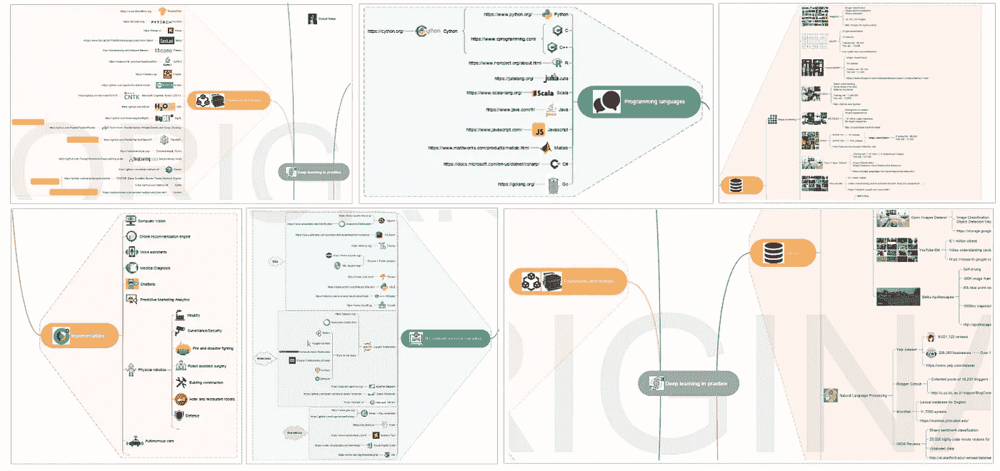
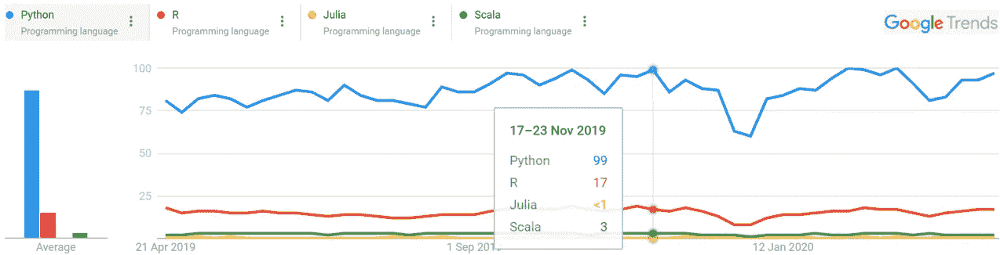
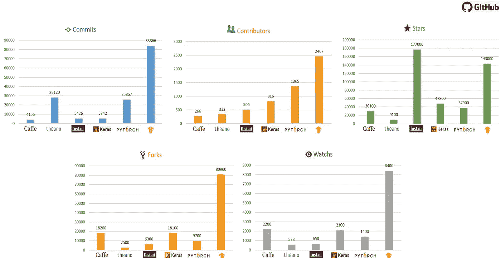
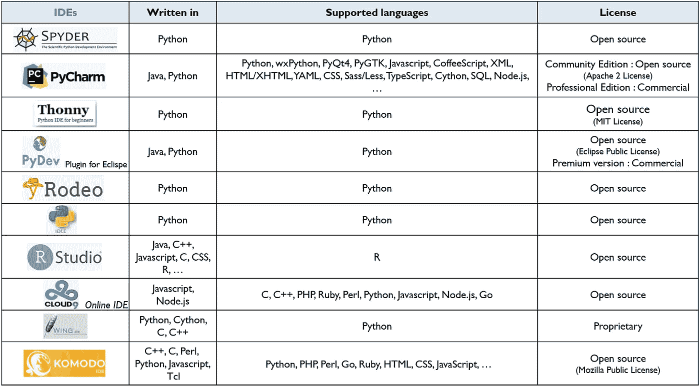
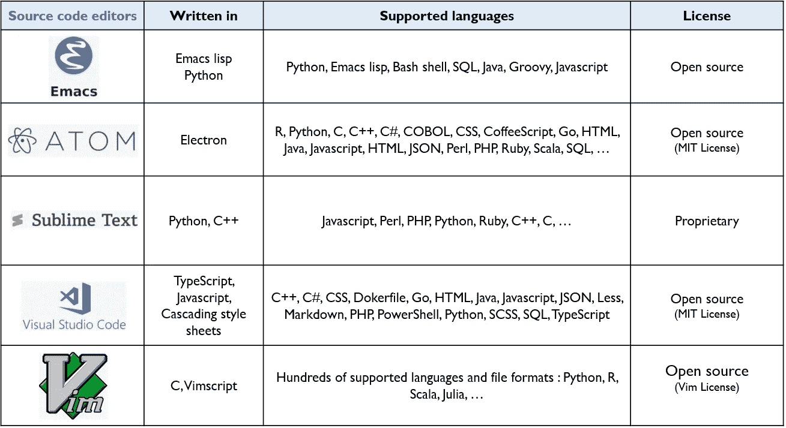
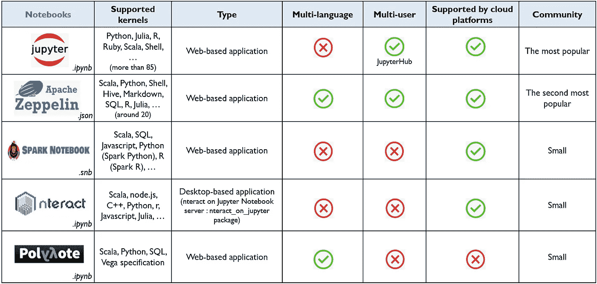
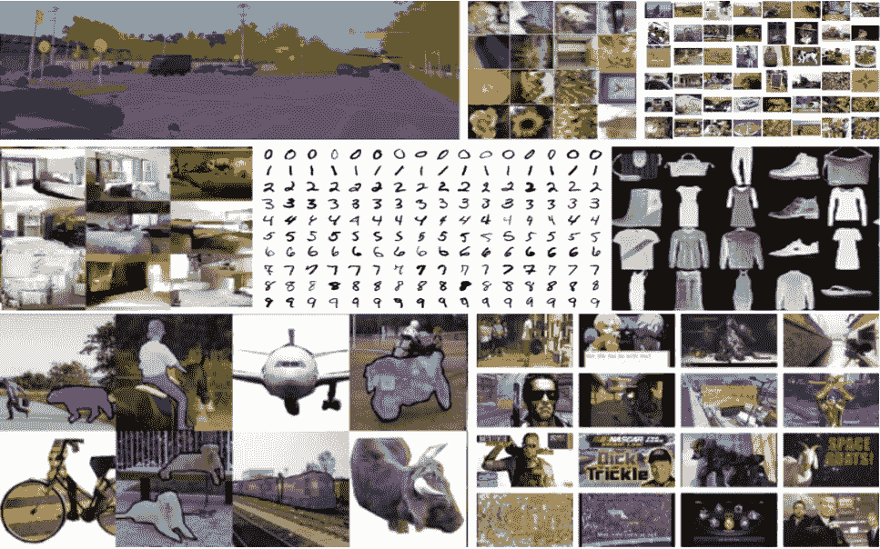
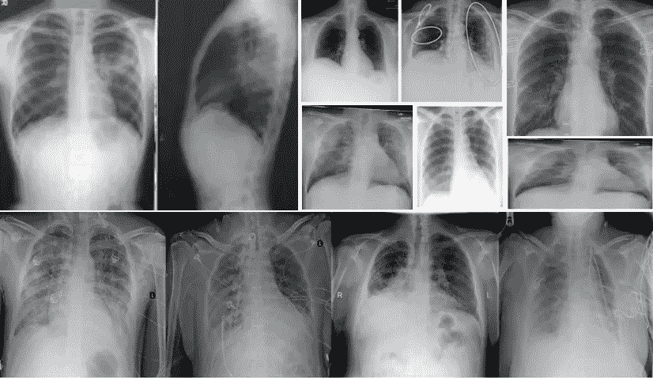

# 实践中的深度学习:思维导图备忘单

> 原文：<https://towardsdatascience.com/deep-learning-in-practice-mental-map-cheat-sheet-6647b1767e5c?source=collection_archive---------43----------------------->

## 做深度学习需要什么？

一旦你理解了深度学习背后的理论，琐碎的下一步就是实践你所学到的东西。在这篇文章中，我试图在一个心理地图备忘单中收集所有与实践中的深度学习相关的内容。这对于深度学习初学者来说非常有用，这些初学者通常要么不知道要使用的工具或数据集，要么对一两个市场领导者的知识很肤浅，因为他们在几乎所有与深度学习相关的文档中都遇到过他们。如果你打算从事这个领域，你应该有一个更全面的看法。

在 [Unsplash](https://unsplash.com?utm_source=medium&utm_medium=referral) 上由 [Tevarak Phanduang](https://unsplash.com/@namakuki?utm_source=medium&utm_medium=referral) 拍摄的照片

思维导图的中心主题是“实践中的深度学习”，从中衍生出 5 个主要分支，即(1)编程语言，(2)框架和库，(3)ide、笔记本和源代码编辑器，(4)数据集和(5)实现。它们中的每一个都将在下面介绍。以下是所提议的思维导图备忘单的不同分支的摘录。每个工具和数据集前面都有一个指向下载页面的链接。最常用的工具用红色标出。

思维导图备忘单不同分支的摘录

你可以点击下面的按钮下载备忘单。由于思维导图非常大，请考虑将其下载到您的设备上，然后在 [PDF 文档](https://drive.google.com/open?id=15mnyOVZHrxWC-RH3UTwMUU6c3e3gGK3i)中缩放感兴趣的项目。

**分支 1:编程语言**

Python 是最著名的语言之一，甚至可能是最流行的。下面的利率随时间变化图就是很好的证明。根据过去 12 个月的谷歌全球趋势，它显示了 Python 与其潜在候选人 R、Julia 和 Scala 相比的趋势。你可以在思维导图中找到其他用于深度学习的语言，比如 java、javascript、Go……

**分支 2:框架和库**

我在思维导图中提到的一些框架和库只致力于深度学习，例如 M *xNet* 和 *DeepLearning。Scala* 。其他的不仅仅是深度学习。它们是更大的机器学习，具有很大的深度学习焦点，例如 *TensorFlow* 和 *PyTorch* 。此外，我收集到的框架和库类型多样: *BigDL* 和 *PaddlePaddle* 用于分布式深度学习， *PaddleFL* 用于联邦学习， *PyTorch Mobile* 和 *TensorFlow Lite* 用于移动和物联网设备上的深度学习，…

在下面的图表中，我展示了 GitHub 上最受欢迎的框架在提交、贡献者、明星、分叉和观察方面的近期活动。除了明星类别，TensorFlow 在其他类别中拥有最多的 GitHub 活动。Fastai 显示了更多的恒星。事实上，当我写这篇文章时，它是 GitHub 上第二大热门知识库。你可以在这里找到理解 GitHub 类别[所需的一切。](https://help.github.com/en)

**分支 3:ide、笔记本和源代码编辑器**

我将这个分支细分为 3 个主要部分:

(1)IDE:IDE，集成开发环境的首字母缩略词，使程序员能够整合编写计算机程序的不同方面。它通过将编写软件的常见活动(如编辑源代码、编译、构建可执行文件和调试)合并到一个应用程序中，提高了程序员的工作效率。在下表中，我展示了一些在思维导图中唤起的 ide。

(2)源代码编辑器:是 ide 的简化版本，因为它们提供的工具更少。它们是对编程语言敏感的，因此它们突出了程序的语法元素；并提供许多有助于程序开发的特性，如自动完成、编译、构建和运行。

(3)笔记本电脑:适合初学者，因为它们结合了 IDE 功能和人体工程学、交互式和易于使用的教育工具。他们还结合了实时代码、叙述性文本、等式、结果可视化、图像和其他几种媒体。在下表中，我根据自己选择的 6 个特性展示了 5 款开源笔记本电脑:

*支持的内核:*内核是执行笔记本中包含的代码的计算引擎/后端。我所说的支持的内核是指笔记本环境所支持的语言范围。

*类型:*此功能表示笔记本是基于网络的应用程序还是基于桌面的应用程序。web 应用程序的一个非常简单的定义是，它存储在一个远程服务器上，该服务器需要一个 web 浏览器作为客户端来运行，并且需要互联网来传输数据和资源。桌面应用程序旨在为不需要互联网的独立机器提供服务。如果安装了适当的软件包(例如，nteract)，基于桌面应用程序的笔记本电脑可以用作基于网络的笔记本电脑。

*多语言:*是在一个笔记本中创建多语言支持的能力，以便允许不同语言执行的代码之间的互操作性。相反，单一语言笔记本允许您同时以其支持的语言之一创建笔记本。

*多用户:*表示允许多个用户同时编辑笔记本，而不会互相冲突、碰撞和覆盖。一些笔记本电脑可以与多个用户共享，但它们不具备多用户功能。Jupyter 本质上是一个单用户应用程序。但是，您可以使用 [JupyterHub](https://github.com/jupyterhub/jupyterhub) 来创建多用户 Hub，它管理和代理单用户 Jupyter 笔记本服务器的多个实例。

*云平台支持:*可以在个人电脑上工作。然而，管理需要大量数据的实际问题变得很困难。为了从 GPU 等更高的物质资源中受益，有必要向更高的计算规模转移。我之所以选择这个功能，是因为了解大型云平台是否支持笔记本电脑环境非常重要，也就是说，您创建笔记本电脑所需的一切都已预装在云上。

*社区:*如果您开始使用某个特定的笔记本电脑，您会希望与其他开发人员和专家建立联系。他们可以加快你的进度，帮助你解决一些遇到的问题。此外，文档应该基本可用。

**分支 4:数据集**

深度学习获得更好模型的关键是数据。这就是为什么我在建议的思维导图中专门为数据集设计了一个分支。所有诱发的数据集都是开放的，并且大量用于众多深度学习项目。其中一些甚至在市场领导者框架内实现了特定的类和功能；并且在全球比赛中非常常用，如 [Kaggle](https://www.kaggle.com/) 、 [Codalab](https://codalab.org/) 和 [DataDriven](https://www.drivendata.org/) 。我选择添加到我的思维导图中的数据集属于不同的上下文，即图像处理(例如 MNIST 和 ImageNet)、自然语言处理(NLP)(例如 Yelp 和 WordNet)和语音识别(例如 LibriSpeech 和 AudioSet)

用于图像处理的开放深度学习数据集的样本

面对新型冠状病毒引起的新冠肺炎疫情，世界各地的研究人员正试图找到耗时的 RT-PCR 的其他诊断替代方法。深度学习应用于阳性新冠肺炎病例的胸部射线照相图像，例如胸部 X 射线(CXR)和计算机断层扫描(CT)，已经显示出对冠状病毒诊断的很大希望。在这种情况下，我注意到很多人，特别是那些深度学习从业者，但不是医学成像专家，询问可用的新冠肺炎 CXR 和 CT 图像。因此，我列举了目前在这种情况下使用的开放数据集以及它们的 GitHub 链接。我还提到了现有的 CXR 和 CT 图像数据集，例如 RSNA 和 ChestX-ray14，它们已经被用于肺部疾病的检测和分类。这将帮助您将它们与新的新冠肺炎数据集合并，以便(1)将其与其他类型的肺炎区分开来，(2)决定谁应该优先接受新冠肺炎病例的 PCR 检测，以及(3)选择治疗方法，因为新冠肺炎和非新冠肺炎感染需要不同的治疗方案。

来自开放深度学习新冠肺炎和非新冠肺炎数据集的胸部 x 光图像

在此，我必须指出，我没有指出新冠肺炎数据库中的图像数量，因为它们变化很大。他们正在被科学界和医学协会扩大。随着新数据的出现，后者正在不断努力扩大这些基础。此外，新冠肺炎数据集仍处于初期阶段，有限且不成熟。你可以求助于一些技术，比如迁移学习和数据扩充，来改进训练过程。你可以在 [AI 对抗新冠肺炎](https://ai-against-covid.ca/datasets/)特别工作组和[世界卫生组织(世卫组织)](https://www.who.int/emergencies/diseases/novel-coronavirus-2019/global-research-on-novel-coronavirus-2019-ncov)的网站上寻找其他数据集、挑战、项目和论文，其中大部分是预印本。希望这一切都会过去！

**第五分部:实施**

深度学习正在多个领域兴起，包括但不限于计算机视觉、在线推荐引擎、语音助手、医疗诊断、聊天机器人、预测营销分析、物理机器人和自动驾驶汽车。我在思维导图中提到的实现是说明性的，而不是详尽的。这些仅仅是举几个例子。我为您挑选了下面的链接，这些链接展示了与医学成像处理、NLP 和语音识别相关的深度学习的 3 个现实世界实现:

[派&人工智能:现实世界中人工智能在医学上的应用](https://www.youtube.com/watch?v=Rp7qqjlBeRY&list=LLVfQ-2TcVc3jJt4VkBVDUoQ)

[自然语言处理和机器学习的用例](https://www.youtube.com/watch?v=Rk6xQjhga2c)

[现实世界应用的自动语音识别](https://www.youtube.com/watch?v=9Fl2Z8-Cf3Q)

嗯！就是这个！

请注意，我并不要求列举与深度学习相关的所有工具、数据集和用例。我试图在一个单一的思维地图中收集这些后者的大部分。这仍有待讨论。我欢迎并重视您在这方面可能提出的任何问题和意见。此外，本文的目的不是判断哪种工具比其他工具更好。我不知道你是否注意到没有个人意见形成。它只是对主要深度学习工具及其特征的客观列举。

如果你错过了我以前的文章:

 [## 学习率常见问题

### 学习率问题和答案

towardsdatascience.com](/frequently-asked-questions-on-learning-rate-6defb4e45d2e)  [## 全面综合了主要激活函数的优缺点

### 激活函数:神经网络最重要的超参数之一，必须仔细选择…

medium.com](https://medium.com/analytics-vidhya/comprehensive-synthesis-of-the-main-activation-functions-pros-and-cons-dab105fe4b3b)