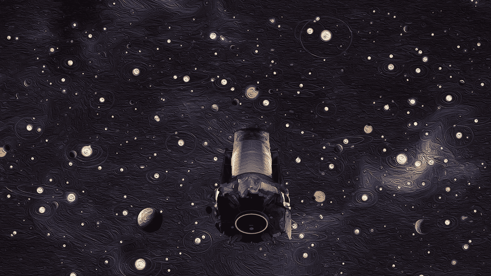
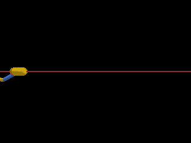
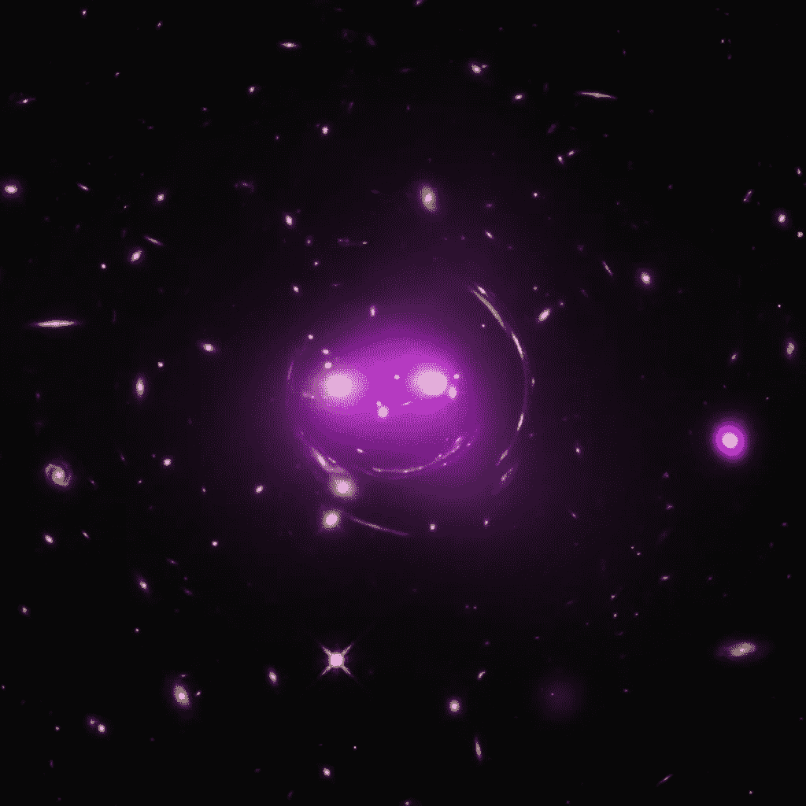

# 宇宙中的深度学习:排名 3 机器学习(ML)应用

> 原文：<https://towardsdatascience.com/deep-learning-in-the-cosmos-ranking-3-machine-learning-ml-applications-f45c2ae74432?source=collection_archive---------26----------------------->

在过去十年中，深度学习帮助推动了多个领域的最新发展，科学研究也不例外。我们之前已经讨论过 [Deepmind 在蛋白质折叠预测方面令人印象深刻的首次亮相](https://blog.exxactcorp.com/deepminds-protein-folding-upset/)，以及[斯坦福学生研究蛋白质复合物结合操作的项目](https://blog.exxactcorp.com/deep-learning-meets-molecular-dynamics-predicting-correctness-of-protein-complex-binding-operations-an-interview-with-stanford-students/)，这两个都是利用深度学习研究非常小的事情的例子。

[来源](https://www.jpl.nasa.gov/news/news.php?feature=7272)

深度学习同样也在科学研究中得到了应用，而这与规模光谱正好相反。在这篇文章中，我们将讨论深度学习用于研究宇宙学的一些最新应用，也就是对宇宙的研究。正如您所想象的，这个主题包含了各种各样的子类别。我们将从机器学习和基础科学的角度对这些项目的炒作和影响进行评级，尽管我们将根据趣味性而不是依赖引用指标来判断这一点。如果可能的话，我们还会提供每个项目公共资源库的链接，这样你就可以自己查看了。

# 大肆宣传是为了什么？人工智能解决了宇宙学中的三体问题

# [(格林等 2019)](https://arxiv.org/abs/1910.07291) 一览:

**TL；一个多层感知器被训练来预测一个简化的三体问题模拟中的未来位置。**

**炒作:** 4/3 三倍浓咖啡。该项目的报道范围从人工智能可以解决难住牛顿的三体到神经网络解决三体的速度快一亿倍。媒体的大肆宣传遵循了研究论文中的描述性方法，这似乎是为了让专业领域之外的读者惊叹而精确设计的。由于深度学习和*n*-身体轨道力学方面的共同专业知识将是稀有的平方，很容易陷入不熟悉的细节而错过重点。

**冲击(ML):** 3/10 致密层。有趣的是，在这个大 conv 网络无处不在的时代，看到一个深度多层感知器被使用。

**撞击(物理学):** 3/ *n* 巨大的天体。

**模型:**具有 ReLU 激活的 10 层全连接神经网络。

**输入数据:**三体之一的起始位置和目标时间 *t* 。

**输出:**时间 *t* 三个粒子中的两个粒子的位置。坐标参考系统暗示了第三个粒子的位置。

**代码:**[https://github.com/pgbreen/NVM](https://github.com/pgbreen/NVM)(仅使用预先训练的模型权重进行推断)

# 解开人工智能如何解决宇宙学中的三体问题的细节

在经典轨道力学中，预测一个孤立的两个引力体系统的未来位置是相对容易的。再增加一个物体，我们就有了臭名昭著的三体问题，这是一个经典的例子，说明在一个看似简单的系统的动态相互作用中，混沌是如何出现的。混沌系统的一个标志是它们对初始条件极其敏感，它们的行为看起来是随机的。这些状态很难预测，混沌系统演化的时间越长，预测就变得越困难，因为过去的错误会不断增加。这就是为什么对于一个特工来说，学会摆动一根实心的杆子要比一根多节的杆子容易得多的原因之一:

像这种双摆的混沌系统很难预测和控制

就像强化学习代理努力控制双摆一样，科学家也发现很难预测像三体问题这样的混沌系统的未来状态。没有解析解，所以计算物理学家依靠他们的老朋友蛮力计算。这是可行的，但是并不总是清楚需要多少数值精度，并且会消耗大量资源。

这篇文章的作者使用了一个 10 层的多层感知器来预测三体轨道问题的未来状态。训练数据由名为 Brutus 的强力数值模拟器计算。我很喜欢看到一个“老式”的多层感知器，如果看看代码，用不同的训练超参数和不同的体系结构进行试验，会很有趣。不幸的是，可用的公共代码不包括任何培训实用程序。

我同意最近的怀疑态度，因为这篇论文的主张是由一个非常狭窄和简化的用例支持的，不太可能轻易地推广到更复杂的情况。我要补充的是，结果并不像宣传的那样令人印象深刻。当被训练来预测更远的未来时，性能显著下降，范围从大约 0.01 到 0.2 的平均绝对误差。当所讨论的无单位数几乎总是在-1 和+1 之间时，这些误差就很大。训练网络来预测未来还会导致训练集更大的过度拟合，这个问题在讨论中没有涉及。

# 在宇宙学中使用机器学习(ML)最有价值的领域是什么？用深度学习发现更多系外行星

艺术家对由[马丁·科恩梅瑟](https://www.spacetelescope.org/projects/anniversary/production_team/)创作的 K2–18b 的印象。图片来源[美国宇航局](https://apod.nasa.gov/apod/image/1909/K218b_ESAKornmesser_1080.jpg)

# [(Dattilo et al. 2019)](https://arxiv.org/abs/1903.10507)
机器学习如何帮助发现新行星一览

**TL；博士:**开普勒太空望远镜在 2013 年发生故障，导致了大量的噪音数据。研究人员将 AstroNet-K2 训练为先前模型 AstroNet 的修改版本，以处理新的噪声数据，并发现了两颗新的系外行星。这些行星通过后续观测得到了验证。

**炒作:** 1/3 三倍浓咖啡。麻省理工学院技术评论的报道经过了合理的衡量，没有对该项目做出夸大或不切实际的声明，但有时忽略了提及 AstroNet-K2 是基于一年前发布的前一个项目 AstroNet。

**影响(ML):** 4/8 卷积滤波器。AstroNet 和 AstroNet-K2 的区别似乎在于超参数搜索和不同的数据集。

**Impact(系外行星天文学):**2/1076 个已知的【超级地球】(https://en . Wikipedia . org/wiki/File:Size _ of _ Kepler _ Planet _ candidates . jpg)由 AstroNet-K2 发现，并用额外的观测数据验证。我认为这是作为一个本科生研究项目开始的一个非常有益的成果。

**模型:**两个独立的卷积臂从输入数据中提取特征。这些卷积层的输出被结合并馈入输出最终预测的 4 个完全连接的层。

**输入数据:**开普勒望远镜 K2 运行的 1D 光变曲线。

**输出:**给定信号由凌日系外行星引起的概率。

**代号:**[https://github.com/aedattilo/models_K2](https://github.com/aedattilo/models_K2)

# 解开机器学习如何发现新行星的细节

开普勒仪器是一个基于太空的望远镜，旨在研究太阳系以外的行星，也就是外行星。1995 年，迪迪埃·奎洛兹和米歇尔·马约尔描述了第一颗围绕像我们这样的恒星运行的系外行星，这两人获得了 2019 年诺贝尔物理学奖。十多年后，当开普勒于 2009 年发射时，已知的系外行星总数不到 400 颗。现在处于休眠状态的[望远镜](https://www.jpl.nasa.gov/news/news.php?feature=7272)于 2009 年开始运行，在 2013 年用于精确指向的部件反应轮出现故障之前，发现了 1000 多颗新的系外行星。这结束了任务的第一阶段。

一些巧妙的工程改变让望远镜开始了第二阶段的数据采集，称为 K2。来自 K2 的数据更嘈杂，而且仅限于 80 天或更少的连续观测。这些限制给在成千上万个假定的行星信号中识别有前途的行星候选者带来了挑战，这项任务以前由卷积神经网络(AstroNet)处理开普勒初级数据收集阶段的数据处理得很好。德克萨斯大学奥斯汀分校的研究人员决定尝试相同的方法，并从 AstroNet 的架构中派生出 AstroNet-K2 来对 K2 行星信号进行排序。

经过训练，AstroNet-K2 在测试集中识别确认的系外行星的准确率达到 98%，假阳性率很低。作者认为这种性能足以用作分析工具，而不是完全自动化，需要人工跟踪。来自报纸:

> **虽然我们网络的性能还没有达到生成全自动且统一的
> 行星候选星表所需的
> 水平，但它可以作为
> 概念的证明。——**[**(达蒂洛等 2019)**](https://arxiv.org/abs/1903.10507)

AstroNet-K2 获得了这篇博文梦寐以求的“最佳价值”奖，因为它实现了一项物有所值的重大科学发现。与列表中的其他两个项目不同，这两个项目更多的是概念性的演示，这个项目导致了实际的科学进步，为已知系外行星的目录增加了两个新的确认条目:EPIC 246151543 b 和 EPIC 246078672 b。

除了 K2 数据的内在挑战之外，行星的信号还因火星穿过观测窗口和与安全模式事件相关的 5 天数据缺失而进一步混淆。这是一个很好的有效的机器学习的例子:作者采用了一个现有的有良好记录的 conv 网络，并对其进行了修改，以在给定的数据上表现良好，添加了一些从困难的观察运行中获得的新发现，而没有重新发明轮子。

值得注意的是，这项研究的主要作者安妮·达蒂洛在研究完成时还是一名大学生。对于一个本科生研究项目来说，这是一个非常好的结果。开源软件的使用和基于以前开发的架构的构建强调了一个事实，即深度学习正处于[高级准备](https://www.goodreads.com/quotes/557199-when-railroading-time-comes-you-can-railroad-but-not-before)阶段。这项技术还没有完全成熟到无处不在的地步，但工具都在货架上，随时可以应用。

# CosmoGAN:引力透镜的生成对抗网络方法

# ([穆斯塔法等人 2019](https://arxiv.org/abs/1706.02390) )一览

柴郡猫星系团的引力透镜效应。图片来源 [NASA](https://apod.nasa.gov/apod/ap191026.html)

**TL；博士:**宇宙中有一堆缺失的物质，我们称之为暗物质。这种丢失质量的重力会弯曲光，宇宙学家可以根据光的扭曲来猜测暗物质的位置。深度卷积生成对抗网络擅长制作逼真的图像，这些研究人员训练了一个网络来制作看起来像与暗物质分布相关联的数据的图像。

**炒作:** 1/3 三倍浓咖啡。基本上我能找到的这篇论文的所有新闻报道都是从劳伦斯柏克莱国家实验室的[新闻稿中抄袭来的。这样的报道并不过分夸张或古怪，尽管我会说对 CosmoGAN 实际上做了什么的描述是模糊的(但这篇论文在这方面也不是很清楚)。我最喜欢的标题是](https://cs.lbl.gov/news-media/news/2019/cosmogan-training-a-neural-network-to-study-dark-matter/)[宇宙科学家利用神经网络以简单的方式构建暗物质地图](https://www.theregister.co.uk/2019/05/20/neural_networks_dark_matter/)。

**影响(ML):** 6/64 潜在空间随机变量。这是一个普通的 DCGAN，被训练来模拟引力弱透镜数据。

**撞击(宇宙学):**10 个中有 1 个不可观测的质量。

**型号:** CosmoGAN 是一款 [DCGAN](https://arxiv.org/abs/1511.06434) 。每个网络有 4 层，但由于具有较少的卷积滤波器，发生器的参数(1230 万)比鉴别器(440 万)多 3 倍。参数不一致是为了稳定训练，防止鉴别器脱离生成器。

**输入数据:** 64 单位潜向量(生成器)，生成(由 CosmoGAN)和模拟(数值物理模拟器)弱透镜会聚图的 2D 图像，可以对应暗物质分布(鉴别器)。

**输出:**似是而非的会聚图(生成器)，或给定图像是真实(模拟)会聚图的概率(鉴别器)

**代号:**[https://github.com/MustafaMustafa/cosmoGAN](https://github.com/MustafaMustafa/cosmoGAN)

# 解开关于生成对抗网络如何导致引力透镜化的更好方法的细节

暗物质是一种相对神秘的物质形式，占(我们认为)宇宙质量的很大一部分(大约 85%)。“黑暗”的绰号指的是这样一个事实，即这种形式的物质在正常观测中是不可见的，而是只能从引力效应中推断出来，比如 20 世纪 60 年代由薇拉·鲁宾观测到的星系旋转速度的差异。研究暗物质的一个基本可观测现象是[引力透镜](https://en.wikipedia.org/wiki/Gravitational_lens)，其中大质量物体扭曲了来自更远物体的光线。当透镜效应是由不可见的暗物质引起时，这就变成了一个困难的逆问题，需要密集的模拟来克服。

“如果你希望从零开始做一个苹果派，你必须首先发明宇宙”([卡尔·萨根，宇宙](https://www.youtube.com/watch?v=7s664NsLeFM))。这同样适用于研究暗物质的存在:基于引力透镜的观察建立暗物质地图的黄金标准方法是创建一个(虚拟)宇宙。众所周知，宇宙的创造在计算上是昂贵的，旋转一个高保真度的宇宙来检查它是否与观察结果一致，这给可以完成的科学数量带来了实质性的限制。

当数据丰富而分析数据的计算不足时，科学家会寻找方法来开发替代模型，这些模型可以解释数据，而不必每次都构建一个全新的宇宙。CosmoGAN 就是这样一种方法，利用现代深度学习生成网络来估计引力透镜数据的收敛图。

自 Goodfellow *等人*在 2014 年描述了生成性对抗网络[以来，它们已经走过了漫长的道路。GAN 框架是一个(现在相当多样化的)生成模型的利基，它将生成网络与鉴别网络或伪造检测网络对立起来。这两个网络相互作用，产生越来越真实的合成数据，而鉴别器在检测假货方面越来越好。这种相互作用提供了纯 GAN 训练环路中唯一必需的训练信号(尽管像条件 GAN 这样的变体可以利用额外的数据)，因此在 GAN 训练中平衡两个网络是一种艺术，众所周知，当这种平衡不均衡时，GAN 容易不稳定。](https://arxiv.org/abs/1406.2661)

考虑到他们难以训练和解释的名声，甘斯在计算宇宙学家中找到了 [从业者](https://arxiv.org/abs/1812.01114)中的[号](https://arxiv.org/abs/1706.02390) [可能会有点令人惊讶。然而，CosmoGAN 的范围相当有限。生成器学习模仿收敛图的统计现实图像，但这些图像与潜在空间中的随机输入无关。在这种情况下，像古老的](https://arxiv.org/abs/1702.00403) [edges2cats](https://affinelayer.com/pixsrv/) 演示中的 [pix2pix](https://arxiv.org/abs/1611.07004) 方案这样的条件 GAN 会更有意义。也就是说，生成一个似乎可以解释给定天文图像中透镜现象的会聚图将是有用的，这可以通过额外的观测来验证。

此外，由发生器产生的会聚图是 2D，但暗物质实际上将分布在三维空间。作者暗示，其中一些限制将在未来的工作中得到解决。例如，提到“可控的 gan”听起来类似于上面提到的条件 gan，他们确实打算制作一个 3D 版本的体积暗物质分布。如果是这样的话，这个项目中 85%的工作现在仍然是不可观察的。

# 这 3 个机器学习(ML)应用程序正在允许宇宙学中不可思议的发现和突破

我们刚刚开始看到它在宇宙学中的潜力。这篇文章强调了一个事实，即在太空研究中取得新的发现并不需要大胆地去科学家没有去过的地方。更确切地说，正如我们在系外行星项目中看到的那样，一种经过验证的技术的巧妙实现，可以适应并应用于一个新的数据集，从而产生新的发现。另一方面，这个列表中的另外两个项目，虽然拥有更高的期望和更闪亮的描述，但只是使用模拟数据的概念性探索。

我们还可以注意到，这些例子中非专业媒体报道的炒作因素与研究论文描述中使用的夸张程度相关。这表明研究人员不能将夸大的新闻报道完全归咎于科学记者，这个问题困扰着大多数研究领域，而不仅仅是 AI/ML。过度炒作会导致无效的反馈循环，导致经济/技术泡沫和研究资源的低效配置。这就是为什么我们更喜欢仔细看看新的深度学习应用的明星声明，无论它们是研究宇宙还是更世俗的东西。